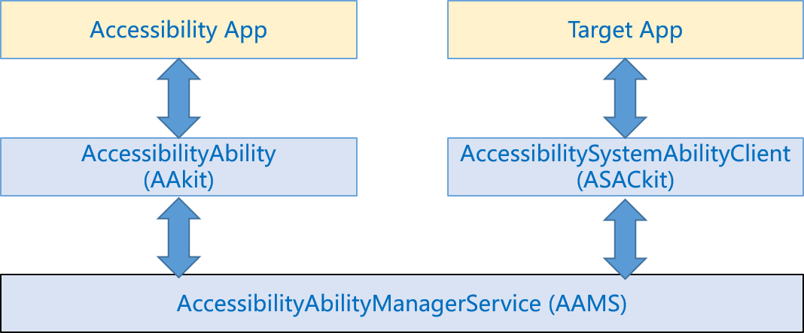

# Introduction to Accessibility Kit

Accessibility is about giving equal access to everyone so that they can access and use information equally and conveniently under any circumstances. It helps narrow the digital divide between people of different classes, regions, ages, and health status in terms of information understanding, information exchange, and information utilization, so that they can participate in social life more conveniently and enjoy the benefits of technological advances.

The Accessibility Kit provides open capabilities for extended services. Third parties can develop extended services similar to screen readers based on the open capabilities. In addition, the Accessibility Kit provides open capabilities for third-party applications so that third-party applications can better adapt to extended services, to better serve people with impairments and scenarios with obstacles. For example, by using screen readers, a user may "hear" the screen content.

## Available Capabilities

1. Provides third-party applications with capabilities such as obtaining the extended service list, enabling status of extended services, and sending accessibility events.

2. Provides an extended service framework for extended services and allows third parties to develop extended services similar to screen reading software.

## Working Principles

The AccessibilityExtensionAbility framework provides a standard mechanism for exchanging information between third-party applications and extended services. The extended service sends a query or operation request to the AAMS through the AAkit. The AAMS executes the query or operation request to the third-party application through the ASACkit and returns the execution result to the extended service.

1. Accessibility app: extension service application developed based on the AccessibilityExtensionAbility framework, for example, a screen reader application.
2. Target app: third-party application assisted by the accessibility app.
3. AccessibilityAbilityManagerService (AAMS): main service of the AccessibilityExtensionAbility framework, which is used to manage the lifecycle of accessibility apps and provide a bridge for information exchange between accessibility apps and target apps.
4. AccessibilityAbility (AAkit): ability that is used by the accessibility application to build an operating environment for the extension service ability and that provides interfaces for the accessibility application to query and operate the target application, including performing click/long press operations.
5. AccessibilitySystemAbilityClient (ASACkit): used by the target app to send accessibility events, such as content change events, to AAMS, and to respond to the instructions (such as performing click/long press operations) sent by the accessibility app through AAMS.
