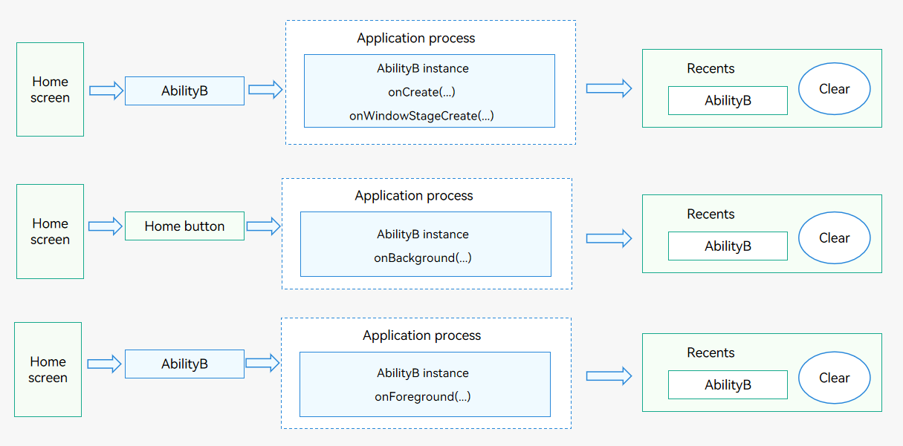
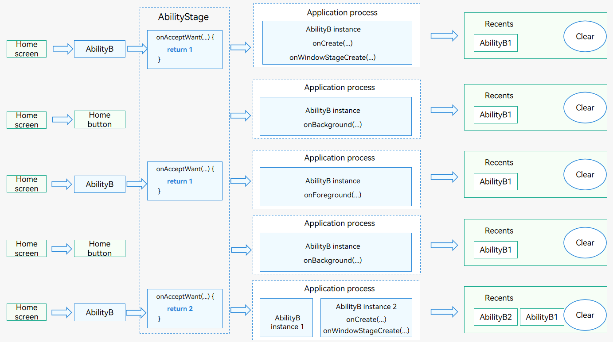

# Mission Management and Launch Type

One UIAbility instance corresponds to one mission. The number of UIAbility instances is related to the UIAbility launch type, specified by **launchType**, which is configured in the **config.json** file in the FA model and the [module.json5](../quick-start/module-configuration-file.md) file in the stage model.

The following describes how the mission list manager manages the UIAbility instanced started in different modes.
- **singleton**: Only one UIAbility instance exists for an application.
  
  **Figure 1** Missions and singleton mode
  
  
  
- **multiton**: Each time [startAbility()](../reference/apis/js-apis-inner-application-uiAbilityContext.md#uiabilitycontextstartability) is called, a UIAbility instance is created in the application process.
  
  **Figure 2** Missions and multiton mode
  
  
  
- **specified**: The ([onAcceptWant()](../reference/apis/js-apis-app-ability-abilityStage.md#abilitystageonacceptwant)) method of [AbilityStage](abilitystage.md) determines whether to create a UIAbility instance.
  
  **Figure 3** Missions and specified mode
  
  

Each UIAbility instance corresponds to a mission displayed in **Recents**.

Every mission retains a snapshot of the UIAbility instance. After the UIAbility instance is destroyed, the mission information (including the ability information and mission snapshot) is retained until the mission is deleted.

> **NOTE**
>
> The **specified** mode is supported in the stage model only.
