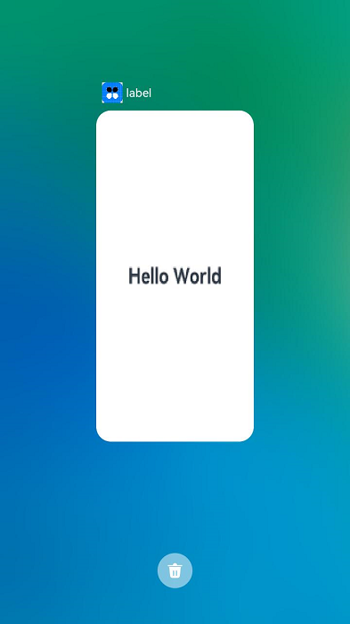
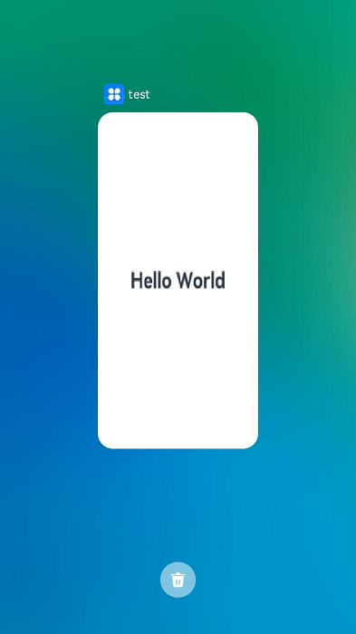

# Setting the Icon and Name of a Mission Snapshot

Setting a unique icon and name for each mission snapshot of an application helps you better manage the missions and functions of the application.

By default, the **icon** and **label** fields in the [abilities tag](../quick-start/module-configuration-file.md#abilities) of the [module.json5 file](../quick-start/module-configuration-file.md) are used to set the icon and label.

Figure 1 Mission snapshot of a UIAbility


You can also use [UIAbilityContext.setMissionIcon()](../reference/apis-ability-kit/js-apis-inner-application-uiAbilityContext-sys.md#uiabilitycontextsetmissionicon) and [UIAbilityContext.setMissionLabel()](../reference/apis-ability-kit/js-apis-inner-application-uiAbilityContext.md#uiabilitycontextsetmissionlabel) to customize the icon and name for a mission snapshot. For example, for a UIAbility instance in multiton mode, you can configure the icon and name for each mission snapshot based on different functions.

This document describes the following operations:

- [Setting a Mission Snapshot Icon (for System Applications Only)](#setting-a-mission-snapshot-icon-for-system-applications-only)
- [Setting a Mission Snapshot Name](#setting-a-mission-snapshot-name)

## Setting a Mission Snapshot Icon (for System Applications Only)

Call [UIAbilityContext.setMissionIcon()](../reference/apis-ability-kit/js-apis-inner-application-uiAbilityContext-sys.md#uiabilitycontextsetmissionicon) to set the icon of a mission snapshot.

For details about how to obtain the context, see [Obtaining the Context of UIAbility](uiability-usage.md#obtaining-the-context-of-uiability). For details about how to obtain the PixelMap information in the example, see [Image Decoding](../media/image/image-decoding.md).

```ts
import { common } from '@kit.AbilityKit';
import { BusinessError } from '@kit.BasicServicesKit';
import { hilog } from '@kit.PerformanceAnalysisKit';

const TAG: string = 'EntryAbility';
const DOMAIN_NUMBER: number = 0xFF00;

// ...
let context: common.UIAbilityContext = this.context; // UIAbilityContext

// ... // Obtain a pixelMap object.

// Set an icon for the mission snapshot.
context.setMissionIcon(pixelMap, (err: BusinessError) => {
  if (err.code) {
    hilog.error(DOMAIN_NUMBER, TAG, `Failed to set mission icon. Code is ${err.code}, message is ${err.message}`);
  } else {
    hilog.info(DOMAIN_NUMBER, TAG, `Success to set mission icon.`);
  }
})
```

The display effect is shown below.

Figure 2 Mission snapshot icon



## Setting a Mission Snapshot Name

Call [UIAbilityContext.setMissionLabel()](../reference/apis-ability-kit/js-apis-inner-application-uiAbilityContext.md#uiabilitycontextsetmissionlabel) to set the name of a mission snapshot.

```ts
import { common } from '@kit.AbilityKit';
import { BusinessError } from '@kit.BasicServicesKit';
import { hilog } from '@kit.PerformanceAnalysisKit';

const TAG: string = 'EntryAbility';
const DOMAIN_NUMBER: number = 0xFF00;

// ...
let context: common.UIAbilityContext = this.context; // UIAbilityContext
// Set a name for the mission snapshot.
context.setMissionLabel('test').then(() => {
  hilog.info(DOMAIN_NUMBER, TAG, 'Succeeded in seting mission label.');
}).catch((err: BusinessError) => {
  hilog.error(DOMAIN_NUMBER, TAG, `Failed to set mission label. Code is ${err.code}, message is ${err.message}`);
});
```

The display effect is shown below.

Figure 3 Mission snapshot name


