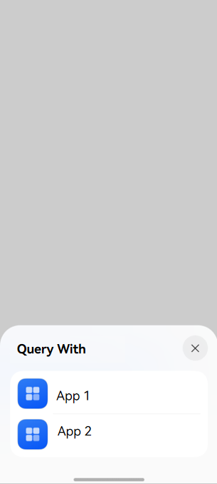

# Using startAbilityByType to Start an Express Delivery Application

This topic describes how to open the vertical domain panel of express delivery applications.

For example, in a messaging application, when a user receives a delivery tracking number, the application can identify this number and provide a link for querying the package. After the user touches the link, the application calls [UIAbilityContext.startAbilityByType](../reference/apis-ability-kit/js-apis-inner-application-uiAbilityContext.md#uiabilitycontextstartabilitybytype11) or [UIExtensionContentSession.startAbilityByType](../reference/apis-ability-kit/js-apis-app-ability-uiExtensionContentSession.md#uiextensioncontentsessionstartabilitybytype11) to open a panel. This panel displays all available applications on the device that support express delivery query, enabling the user to select and switch to the application that meets their needs.

## Parameters on the Express Delivery Application Panel

If the **type** field in **startAbilityByType** is set to **express**, the intent scenario of express delivery query is supported. The corresponding **wantParam** parameter contains the following properties.


| Name   | Type  | Mandatory| Description                                  |
| --------- | ------ | ---- | -------------------------------------- |
| sceneType | number | No  | Intent scene, which indicates the purpose of the current request. The default value is **1**. In express delivery query scenarios, set it to **1** or leave it empty.|
| expressNo | string | Yes  | Express delivery tracking number.                              |


## Developing a Caller Application

1. Import the module.
    ```ts
    import { common } from '@kit.AbilityKit';
    ```
2. Construct parameters and call the **startAbilityByType** API.
   
    ```ts
    let context = getContext(this) as common.UIAbilityContext;
        let wantParam: Record<string, Object> = {
        'sceneType': 1,
        'expressNo': 'SF123456'
        };
        let abilityStartCallback: common.AbilityStartCallback = {
        onError: (code: number, name: string, message: string) => {
            console.log(`onError code ${code} name: ${name} message: ${message}`);
        },
        onResult: (result)=>{
            console.log(`onResult result: ${JSON.stringify(result)}`);
        }
        }
        
        context.startAbilityByType("express", wantParam, abilityStartCallback, 
            (err) => {
                if (err) {
                    console.error(`startAbilityByType fail, err: ${JSON.stringify(err)}`);
                } else {
                    console.log(`success`);
                }
        });

    ```
    
    Effect
    
    

## Developing a Target Application

1. Configure [uris](../quick-start/module-configuration-file.md#skills) in the **module.json5** file.
    1. Set the **linkFeature** field to declare the features supported by the application so that the system can match the application against all the installed applications on the device. The options are as follows:
        | Value        | Description                |
        | ------------ | -------------------- |
        | QueryExpress | Declares that the application supports express delivery query.|
    2. Set **scheme**, **host**, **port**, and **path** or **pathStartWith** to match the URIs in Want to distinguish different features.
        ```json
        {
            "abilities": [
                {
                    "skills": [
                        {
                            "uris": [
                                {
                                    "scheme": "express",
                                    "host": "queryExpress",
                                    "path": "",
                                    "linkFeature": "QueryExpress"
                                }
                            ]
                        }
                    ]
                }
            ]
        }
        ```

2. Parse parameters and perform corresponding processing.

    ```ts
    UIAbility.onCreate(want: Want, launchParam: AbilityConstant.LaunchParam): void
    ```

    The **want.uri** parameter carries the URI corresponding to **linkFeature** configured by the target application.

    The **want.parameters** parameter carries the parameters transferred by the caller application, as described in the table below.
    
    | Name   | Type  | Mandatory| Description    |
    | --------- | ------ | ---- | -------- |
    | expressNo | string | Yes  | Express delivery tracking number.|

    

**Sample Code**

```ts
import { AbilityConstant, UIAbility, Want } from '@kit.AbilityKit';
import { hilog } from '@kit.PerformanceAnalysisKit';
import { window } from '@kit.ArkUI';

const TAG = 'EntryAbility'

export default class EntryAbility extends UIAbility {
    windowStage: window.WindowStage | null = null;

    uri?: string;
    expressNo?: string;

    onCreate(want: Want, launchParam: AbilityConstant.LaunchParam): void {
        hilog.info(0x0000, TAG, `onCreate, want=${JSON.stringify(want)}`);
        super.onCreate(want, launchParam);
        this.parseWant(want);
    }

    onNewWant(want: Want, launchParam: AbilityConstant.LaunchParam): void {
        hilog.info(0x0000, TAG, `onNewWant, want=${JSON.stringify(want)}`);
        super.onNewWant(want, launchParam);
        this.parseWant(want);
        if (!this.windowStage) {
            hilog.error(0x0000, TAG, 'windowStage is null');
            this.context.terminateSelf();
            return;
        }
        this.loadPage(this.windowStage);
    }

    private parseWant(want: Want): void {
        this.uri = want.uri as string | undefined;
        this.expressNo = want.parameters?.expressNo as string | undefined;
    }

    private loadPage(windowStage: window.WindowStage): void {
        hilog.info(0x0000, TAG, `loadPage, uri=${this.uri}`);
        if (this.uri === 'express://queryExpress') {
            // Build express delivery query parameters.
            const storage: LocalStorage = new LocalStorage({
                "expressNo": this.expressNo
            } as Record<string, Object>);
            // Display the express delivery query page.
            windowStage.loadContent('pages/QueryExpressPage', storage)
        } else {
            // Display the home page by default.
            windowStage.loadContent('pages/Index', (err) => {
                if (err.code) {
                    hilog.error(0x0000, TAG, 'Failed to load the content. Cause: %{public}s',
                        JSON.stringify(err) ?? '');
                    return;
                }
                hilog.info(0x0000, TAG, 'Succeeded in loading the content.');
            });
        }
    }

    onDestroy(): void {
        hilog.info(0x0000, TAG, `onDestroy`);
    }

    onWindowStageCreate(windowStage: window.WindowStage): void {
        hilog.info(0x0000, TAG, `onWindowStageCreate`);
        this.windowStage = windowStage;
        this.loadPage(this.windowStage);
    }

    onWindowStageDestroy(): void {
        hilog.info(0x0000, TAG, '%{public}s', 'Ability onWindowStageDestroy');
    }

    onForeground(): void {
        hilog.info(0x0000, TAG, '%{public}s', 'Ability onForeground');
    }

    onBackground(): void {
        hilog.info(0x0000, TAG, '%{public}s', 'Ability onBackground');
    }
}
```
