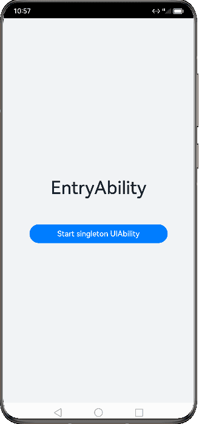
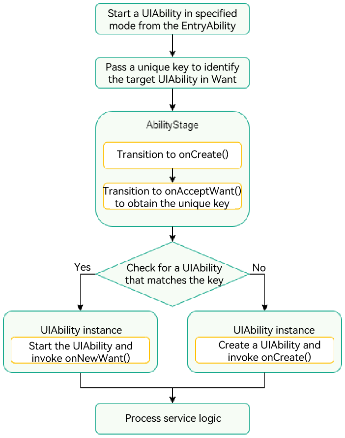

# UIAbility Launch Type


The launch type of the [UIAbility](../reference/apis-ability-kit/js-apis-app-ability-uiAbility.md) component refers to the state of the UIAbility instance at startup. Three launch types are available:


- [Singleton](#singleton)

- [Multiton](#multiton)

- [Specified](#specified)

> **NOTE**
>
> standard is the former name of multiton and provides the same effect as the multiton mode.

## Singleton

singleton is the default launch type.

Each time [startAbility()](../reference/apis-ability-kit/js-apis-inner-application-uiAbilityContext.md#uiabilitycontextstartability) is called, if a [UIAbility](../reference/apis-ability-kit/js-apis-app-ability-uiAbility.md) instance of this type already exists in the application process, the instance is reused. In other words, UIAbility of this type can have only one instance in the system, meaning that only one mission is displayed in the system application Recents.

**Figure 1** Demonstration effect in singleton mode

  

> **NOTE**
>
> If [startAbility()](../reference/apis-ability-kit/js-apis-inner-application-uiAbilityContext.md#uiabilitycontextstartability) is called to start an existing UIAbility instance in singleton mode, that instance is started, and no new UIAbility instance is created. In this case, the [onNewWant()](../reference/apis-ability-kit/js-apis-app-ability-uiAbility.md#uiabilityonnewwant) callback is invoked, but the [onCreate()](../reference/apis-ability-kit/js-apis-app-ability-uiAbility.md#uiabilityoncreate) and [onWindowStageCreate()](../reference/apis-ability-kit/js-apis-app-ability-uiAbility.md#uiabilityonwindowstagecreate) callbacks are not. If **startAbility()** is called to start an instance that is being started, error code 16000082 will be returned.

To use the singleton mode, set **launchType** in the [module.json5 file](../quick-start/module-configuration-file.md) to **singleton**.


```json
{
  "module": {
    // ...
    "abilities": [
      {
        "launchType": "singleton",
        // ...
      }
    ]
  }
}
```


## Multiton

In multiton mode, each time [startAbility()](../reference/apis-ability-kit/js-apis-inner-application-uiAbilityContext.md#uiabilitycontextstartability) is called, a new [UIAbility](../reference/apis-ability-kit/js-apis-app-ability-uiAbility.md) instance is created in the application process. Multiple missions are displayed for UIAbility of this type in Recents.

**Figure 2** Demonstration effect in multiton mode

  

To use the multiton mode, set **launchType** in the [module.json5 file](../quick-start/module-configuration-file.md) to **multiton**.


```json
{
  "module": {
    // ...
    "abilities": [
      {
        "launchType": "multiton",
        // ...
      }
    ]
  }
}
```


## Specified

The specified mode is used in some special scenarios. For example, in a document application, you may want a document instance to be created each time you create a document, and you may also want to use the same document instance when you open an existing document.

**Figure 3** Principle in specified mode

  

This section assumes that an application has two [UIAbility](../reference/apis-ability-kit/js-apis-app-ability-uiAbility.md) instances: EntryAbility and SpecifiedAbility, and EntryAbility will start SpecifiedAbility in specified mode. The basic principle is as follows:

  1. EntryAbility calls [startAbility()](../reference/apis-ability-kit/js-apis-inner-application-uiAbilityContext.md#uiabilitycontextstartability) and sets a unique key in the **parameters** field of [Want](../reference/apis-ability-kit/js-apis-app-ability-want.md) to identify SpecifiedAbility.
  2. Before starting SpecifiedAbility, the system invokes the [onAcceptWant()](../reference/apis-ability-kit/js-apis-app-ability-abilityStage.md#abilitystageonacceptwant) lifecycle callback of the corresponding [AbilityStage](../reference/apis-ability-kit/js-apis-app-ability-abilityStage.md) to obtain the key that identifies the target UIAbility.
  3. The system matches the UIAbility based on the key obtained.
      * If a UIAbility instance is matched, that UIAbility instance is started, and its [onNewWant()](../reference/apis-ability-kit/js-apis-app-ability-uiAbility.md#uiabilityonnewwant) lifecycle callback is invoked.
      * If no UIAbility instance is matched, a new UIAbility instance is created, and its [onCreate()](../reference/apis-ability-kit/js-apis-app-ability-uiAbility.md#uiabilityoncreate) and [onWindowStageCreate()](../reference/apis-ability-kit/js-apis-app-ability-uiAbility.md#uiabilityonwindowstagecreate) lifecycle callbacks are invoked.

**Figure 4** Demonstration effect in specified mode

  

1. In SpecifiedAbility, set **launchType** in the [module.json5 file](../quick-start/module-configuration-file.md) to **specified**.

   ```json
   {
     "module": {
       // ...
       "abilities": [
         {
           "launchType": "specified",
           // ...
         }
       ]
     }
   }
   ```

2. In EntryAbility, pass the custom parameter **instanceKey** as the unique identifier into the [want](../reference/apis-ability-kit/js-apis-app-ability-want.md) parameter in [startAbility()](../reference/apis-ability-kit/js-apis-inner-application-uiAbilityContext.md#uiabilitycontextstartability) to specify the target UIAbility instance. In the example, **instanceKey** is set to **'KEY'**.

   ```ts
    // Configure a unique key for each UIAbility instance.
    // For example, in the document usage scenario, use the document path as the key.
    import { common, Want } from '@kit.AbilityKit';
    import { hilog } from '@kit.PerformanceAnalysisKit';
    import { BusinessError } from '@kit.BasicServicesKit';

    const TAG: string = '[Page_StartModel]';
    const DOMAIN_NUMBER: number = 0xFF00;

    function getInstance(): string {
      return 'KEY';
    }

    @Entry
    @Component
    struct Page_StartModel {
      private KEY_NEW = 'KEY';

      build() {
        Row() {
          Column() {
            // ...
            Button()
              .onClick(() => {
                let context: common.UIAbilityContext = getContext(this) as common.UIAbilityContext;
                // context is the UIAbilityContext of the initiator UIAbility.
                let want: Want = {
                  deviceId: '', // An empty deviceId indicates the local device.
                  bundleName: 'com.samples.stagemodelabilitydevelop',
                  abilityName: 'SpecifiedFirstAbility',
                  moduleName: 'entry', // moduleName is optional.
                  parameters: {
                    // Custom information.
                    instanceKey: this.KEY_NEW
                  }
                };
                context.startAbility(want).then(() => {
                  hilog.info(DOMAIN_NUMBER, TAG, 'Succeeded in starting SpecifiedAbility.');
                }).catch((err: BusinessError) => {
                  hilog.error(DOMAIN_NUMBER, TAG, `Failed to start SpecifiedAbility. Code is ${err.code}, message is ${err.message}`);
                })
                this.KEY_NEW = this.KEY_NEW + 'a';
              })
            // ...
            Button()
              .onClick(() => {
                let context: common.UIAbilityContext = getContext(this) as common.UIAbilityContext;
                // context is the UIAbilityContext of the initiator UIAbility.
                let want: Want = {
                  deviceId: '', // An empty deviceId indicates the local device.
                  bundleName: 'com.samples.stagemodelabilitydevelop',
                  abilityName: 'SpecifiedSecondAbility',
                  moduleName: 'entry', // moduleName is optional.
                  parameters: {
                    // Custom information.
                    instanceKey: getInstance()
                  }
                };
                context.startAbility(want).then(() => {
                  hilog.info(DOMAIN_NUMBER, TAG, 'Succeeded in starting SpecifiedAbility.');
                }).catch((err: BusinessError) => {
                  hilog.error(DOMAIN_NUMBER, TAG, `Failed to start SpecifiedAbility. Code is ${err.code}, message is ${err.message}`);
                })
                this.KEY_NEW = this.KEY_NEW + 'a';
              })
            // ...
          }
          .width('100%')
        }
        .height('100%')
      }
    }
   ```
   
3. Set the UIAbility identifier based on the [onAcceptWant()](../reference/apis-ability-kit/js-apis-app-ability-abilityStage.md#abilitystageonacceptwant) lifecycle callback of SpecifiedAbility. In the example, the identifier is set to **SpecifiedAbilityInstance_KEY**.

   ```ts
    import { AbilityStage, Want } from '@kit.AbilityKit';

    export default class MyAbilityStage extends AbilityStage {
      onAcceptWant(want: Want): string {
        // In the AbilityStage instance of the callee, a key string corresponding to a UIAbility instance is returned for UIAbility whose launch type is specified.
        // In this example, SpecifiedAbility of module1 is returned.
        if (want.abilityName === 'SpecifiedFirstAbility' || want.abilityName === 'SpecifiedSecondAbility') {
          // The returned KEY string is a custom string.
          if (want.parameters) {
            return `SpecifiedAbilityInstance_${want.parameters.instanceKey}`;
          }
        }
        // ...
        return 'MyAbilityStage';
      }
    }
   ```

   > **NOTE**
   >
   > - If [startAbility()](../reference/apis-ability-kit/js-apis-inner-application-uiAbilityContext.md#uiabilitycontextstartability) is called to start an existing UIAbility instance in specified mode, and the [onAcceptWant()](../reference/apis-ability-kit/js-apis-app-ability-abilityStage.md#abilitystageonacceptwant) callback of [AbilityStage](../reference/apis-ability-kit/js-apis-app-ability-abilityStage.md) matches that UIAbility instance, that instance is started, and no new UIAbility instance is created. In this case, the **onNewWant()** callback is invoked, but the **onCreate()** and **onWindowStageCreate()** callbacks are not.
   > - AbilityStage is not automatically generated by default in the project of DevEco Studio. For details about how to create an AbilityStage file, see [AbilityStage Component Container](abilitystage.md).

For example, in the document application, different keys are bound to different document instances. Each time a document is created, a new key (for example, file path) is passed in, and a new [UIAbility](../reference/apis-ability-kit/js-apis-app-ability-uiAbility.md) instance is created when the UIAbility is started in [AbilityStage](../reference/apis-ability-kit/js-apis-app-ability-abilityStage.md). However, when an existing document is opened, the same UIAbility instance is started again in AbilityStage.

The following steps are used as an example.

   1. Open file A. A UIAbility instance, UIAbility instance 1, is started.
   2. Close the process of file A in Recents. UIAbility instance 1 is destroyed. Return to the home screen and open file A again. A new UIAbility instance, UIAbility instance 2, is started.
   3. Return to the home screen and open file B. A new UIAbility instance, UIAbility instance 3, is started.
   4. Return to the home screen and open file A again. UIAbility instance 2 is started. This is because the system automatically matches the key with the UIAbility instance and starts the UIAbility instance that has a matching key. In this example, UIAbility instance 2 has the same key as file A. Therefore, the system pulls back UIAbility instance 2 and focuses it without creating a new instance.
