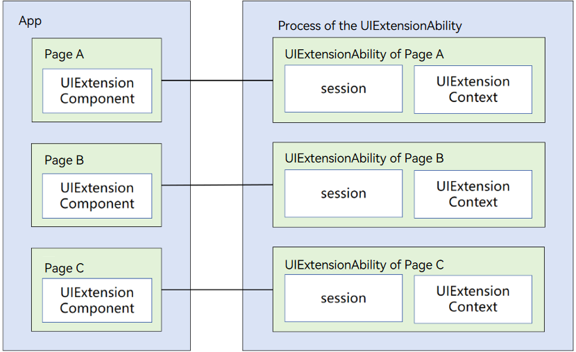
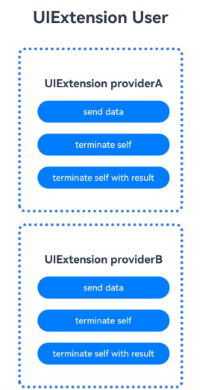
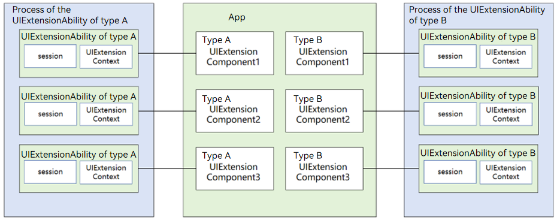
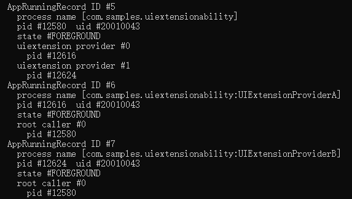
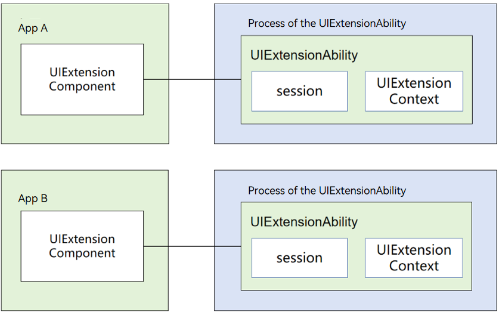

# UIExtensionAbility

## Overview

[UIExtensionAbility](../reference/apis-ability-kit/js-apis-app-ability-uiExtensionAbility.md) is an ExtensionAbility component of the UI type. It is usually used in modular development scenarios where process isolation is required, for example, system dialog boxes, status bars, and capsules. There are two forms: embedded and system pop-ups.
- The UIExtensionAbility in embedded mode must be used together with the [UIExtensionComponent](../reference/apis-arkui/arkui-ts/ts-container-ui-extension-component-sys.md). Specifically, with the UIExtensionComponent, you can embed the UI provided by the UIExtensionAbility of another application into a UIAbility of your application. The UIExtensionAbility runs in a process independent of the UIAbility for UI layout and rendering.
- To start the UIExtensionAbility in system pop-up mode, call [requestModalUIExtensionAbility](../reference/apis-ability-kit/js-apis-inner-application-serviceExtensionContext-sys.md#serviceextensioncontextrequestmodaluiextension11) or the specified interface encapsulated in the application.

## Constraints
- Currently, the UIExtensionAbility of the **sys/commonUI**, **sysDialog**, and **sysPicker** types can be used only by system applications. For details about the UIExtensionAbility types and corresponding permission control, see the [module.json5 file](../quick-start/module-configuration-file.md).
- The UIExtensionAbility can be started only by applications that are running in the foreground.

## Lifecycle
The [UIExtensionAbility](../reference/apis-ability-kit/js-apis-app-ability-uiExtensionAbility.md) class provides the lifecycle callbacks [onCreate](../reference/apis-ability-kit/js-apis-app-ability-uiExtensionAbility.md#uiextensionabilityoncreate), [onSessionCreate](../reference/apis-ability-kit/js-apis-app-ability-uiExtensionAbility.md#uiextensionabilityonsessioncreate), [onSessionDestroy](../reference/apis-ability-kit/js-apis-app-ability-uiExtensionAbility.md#uiextensionabilityonsessiondestroy), [onForeground](../reference/apis-ability-kit/js-apis-app-ability-uiExtensionAbility.md#uiextensionabilityonforeground), [onBackground](../reference/apis-ability-kit/js-apis-app-ability-uiExtensionAbility.md#uiextensionabilityonbackground), and [onDestroy](../reference/apis-ability-kit/js-apis-app-ability-uiExtensionAbility.md#uiextensionabilityondestroy). You must override them as required.

- **onCreate**: called to initialize the service logic when a UIExtensionAbility is created.
- **onSessionCreate**: called when a **UIExtensionContentSession** instance is created for the UIExtensionAbility.
- **onSessionDestroy**: called when a **UIExtensionContentSession** instance is destroyed for the UIExtensionAbility.
- **onForeground**: called when the UIExtensionAbility is switched from the background to the foreground.
- **onBackground**: called when the UIExtensionAbility is switched from the foreground to the background.
- **onDestroy**: called to clear resources when the UIExtensionAbility is destroyed.

## Selecting a Proper Process Model for the UIExtensionAbility
The [UIExtensionAbility](../reference/apis-ability-kit/js-apis-app-ability-uiExtensionAbility.md) supports the multiton pattern. Each embedded UI corresponds to a UIExtensionAbility instance. In the multiton scenario, the multi-process model is used by default.

When multiple UIExtensionAbility instances exist in an application, these instances can run in independent processes or share one process. They can also be grouped, and each group share one process. You can select a process model based on the **extensionProcessMode** field in the [module.json5](../quick-start/module-configuration-file.md) file. The table below describes the comparison between the process models.
| Process Model| extensionProcessMode Field Value| Description|
| --------| --------| --------|
| One process for all UIExtensionAbility instances in the same bundle|bundle|	The UIExtensionAbility instances do not need to communicate with each other across IPCs. Their statuses are dependent and affect each other.|
| One process for all UIExtensionAbility instances with the same name| type |The UIExtensionAbility instances of the same type are configured in the same process so that your application can manage them by type.|
| One process for each UIExtensionAbility instance| instance | The UIExtensionAbility instances communicate with each other only across IPCs. Their statuses do not affect each other, which is more secure.|
### One Process for All UIExtensionAbility Instances in the Bundle
The [UIExtensionAbility](../reference/apis-ability-kit/js-apis-app-ability-uiExtensionAbility.md) instances of the same bundle are configured in a process. This makes communication between multiple instances easier. However, the status of these instances affects each other. When an instance in the process exits abnormally, all instances in the process exit.

**Figure 1** Bundle-based process model configuration



The sample code of **Index.ets** is as follows:
```ts
@Entry
@Component
struct Index {
  @State message: string = 'UIExtension UserA';
  private myProxy: UIExtensionProxy | undefined = undefined;

  build() {
    Row() {
      Column() {
        Text(this.message)
          .fontSize(30)
          .size({ width: '100%', height: '50' })
          .fontWeight(FontWeight.Bold)
          .textAlign(TextAlign.Center)

        UIExtensionComponent(
          {
            bundleName: 'com.samples.uiextensionability',
            abilityName: 'UIExtensionProvider',
            moduleName: 'entry',
            parameters: {
              'ability.want.params.uiExtensionType': 'sys/commonUI',
            }
          })
          .onRemoteReady((proxy) => {
            this.myProxy = proxy;
          })
          .onReceive((data) => {
            this.message = JSON.stringify(data);
          })
          .onResult((data) => {
            this.message = JSON.stringify(data);
          })
          .onRelease((code) => {
            this.message = "release code:" + code;
          })
          .offset({ x: 0, y: 10 })
          .size({ width: 300, height: 300 })
          .border({ width: 5, color: 0x317AF7, radius: 10, style: BorderStyle.Dotted })

        UIExtensionComponent(
          {
            bundleName: 'com.samples.uiextension2',
            abilityName: 'UIExtensionProviderB',
            moduleName: 'entry',
            parameters: {
              'ability.want.params.uiExtensionType': 'sys/commonUI',
            }
          })
          .onRemoteReady((proxy) => {
            this.myProxy = proxy;
          })
          .onReceive((data) => {
            this.message = JSON.stringify(data);
          })
          .onResult((data) => {
            this.message = JSON.stringify(data);
          })
          .onRelease((code) => {
            this.message = "release code:" + code;
          })
          .offset({ x: 0, y: 50 })
          .size({ width: 300, height: 300 })
          .border({ width: 5, color: 0x317AF7, radius: 10, style: BorderStyle.Dotted })
      }
      .width('100%')
    }
    .height('100%')
  }
}
```
**Figure 2** Index page generated based on the preceding code



If this process model is used, the process name format is as follows:

process name [{bundleName}:{UIExtensionAbility type}]

Example: process name [com.ohos.intentexecutedemo:xxx]

**Figure 3** Bundle-based process model


### One Process for All UIExtensionAbility Instances of the Same Type
Processes are allocated based on the [UIExtensionAbility](../reference/apis-ability-kit/js-apis-app-ability-uiExtensionAbility.md) type. Multiple UIExtensionAbility instances of the same type are configured in the same process so that your application can manage the instances by type.

**Figure 4** Type-based process model configuration



The sample code of **Index.ets** is as follows:
```ts
@Entry
@Component
struct Index {
  @State message: string = 'UIExtension User';
  private myProxy: UIExtensionProxy | undefined = undefined;

  build() {
    Row() {
      Column() {
        Text(this.message)
          .fontSize(30)
          .size({ width: '100%', height: '50' })
          .fontWeight(FontWeight.Bold)
          .textAlign(TextAlign.Center)

        UIExtensionComponent(
          {
            bundleName: 'com.samples.uiextensionability',
            abilityName: 'UIExtensionProviderA',
            moduleName: 'entry',
            parameters: {
              'ability.want.params.uiExtensionType': 'sys/commonUI',
            }
          })
          .onRemoteReady((proxy) => {
            this.myProxy = proxy;
          })
          .onReceive((data) => {
            this.message = JSON.stringify(data);
          })
          .onResult((data) => {
            this.message = JSON.stringify(data);
          })
          .onRelease((code) => {
            this.message = "release code:" + code;
          })
          .offset({ x: 0, y: 10 })
          .size({ width: 300, height: 300 })
          .border({ width: 5, color: 0x317AF7, radius: 10, style: BorderStyle.Dotted })

        UIExtensionComponent(
          {
            bundleName: 'com.samples.uiextensionability',
            abilityName: 'UIExtensionProviderB',
            moduleName: 'entry',
            parameters: {
              'ability.want.params.uiExtensionType': 'sys/commonUI',
            }
          })
          .onRemoteReady((proxy) => {
            this.myProxy = proxy;
          })
          .onReceive((data) => {
            this.message = JSON.stringify(data);
          })
          .onResult((data) => {
            this.message = JSON.stringify(data);
          })
          .onRelease((code) => {
            this.message = "release code:" + code;
          })
          .offset({ x: 0, y: 50 })
          .size({ width: 300, height: 300 })
          .border({ width: 5, color: 0x317AF7, radius: 10, style: BorderStyle.Dotted })
      }
      .width('100%')
    }
    .height('100%')
  }
}
```
**Figure 5** Index page generated based on the preceding code


If this process model is used, the process name format is as follows:

process name [{bundleName}:{UIExtensionAbility name}]

Example: process name [com.ohos.intentexecutedemo:xxx]

**Figure 6** Type-based process model



### One Process for Each UIExtensionAbility Instance
Processes are allocated based on the [UIExtensionAbility](../reference/apis-ability-kit/js-apis-app-ability-uiExtensionAbility.md) instance. That is, each UIExtensionAbility instance has an independent process. In this mode, UIExtensionAbility instances can communicate with each other only through IPCs. However, their statuses do not affect each other, improving security.

**Figure 7** Instance-specific process model configuration




The sample code of **Index.ets** is as follows:
```ts
@Entry
@Component
struct Index {
  @State message: string = 'UIExtension User'
  private myProxy: UIExtensionProxy | undefined = undefined;

  build() {
    Row() {
      Column() {
        Text(this.message)
          .fontSize(30)
          .size({ width: '100%', height: '50' })
          .fontWeight(FontWeight.Bold)
          .textAlign(TextAlign.Center)

        UIExtensionComponent(
          {
            bundleName: 'com.samples.uiextensionability',
            abilityName: 'UIExtensionProvider',
            moduleName: 'entry',
            parameters: {
              'ability.want.params.uiExtensionType': 'sys/commonUI',
            }
          })
          .onRemoteReady((proxy) => {
            this.myProxy = proxy;
          })
          .onReceive((data) => {
            this.message = JSON.stringify(data);
          })
          .onResult((data) => {
            this.message = JSON.stringify(data);
          })
          .onRelease((code) => {
            this.message = "release code:" + code;
          })
          .offset({ x: 0, y: 10 })
          .size({ width: 300, height: 300 })
          .border({ width: 5, color: 0x317AF7, radius: 10, style: BorderStyle.Dotted })

        UIExtensionComponent(
          {
            bundleName: 'com.samples.uiextensionability',
            abilityName: 'UIExtensionProvider',
            moduleName: 'entry',
            parameters: {
              'ability.want.params.uiExtensionType': 'sys/commonUI',
            }
          })
          .onRemoteReady((proxy) => {
            this.myProxy = proxy;
          })
          .onReceive((data) => {
            this.message = JSON.stringify(data);
          })
          .onResult((data) => {
            this.message = JSON.stringify(data);
          })
          .onRelease((code) => {
            this.message = "release code:" + code;
          })
          .offset({ x: 0, y: 50 })
          .size({ width: 300, height: 300 })
          .border({ width: 5, color: 0x317AF7, radius: 10, style: BorderStyle.Dotted })
      }
      .width('100%')
    }
    .height('100%')
  }
}
```
**Figure 8** Index page generated based on the preceding code


If this process model is used, the process name format is as follows:

process name [{bundleName}: {UIExtensionAbility type}: {instance suffix}]

Example: process name [com.ohos.intentexecutedemo:xxx:n]

**Figure 9** Instance-specific process model


The UIExtensionAbility provides related capabilities through the [UIExtensionContext](../reference/apis-ability-kit/js-apis-inner-application-uiExtensionContext.md) and [UIExtensionContentSession](../reference/apis-ability-kit/js-apis-app-ability-uiExtensionContentSession.md). In this document, the started UIExtensionAbility is called the provider, and the [UIExtensionComponent](../reference/apis-arkui/arkui-ts/ts-container-ui-extension-component-sys.md) that starts the UIExtensionAbility is called the client.

## How to Develop

 For details about how to develop a system dialog box, see [requestModalUIExtension](../reference/apis-ability-kit/js-apis-inner-application-serviceExtensionContext-sys.md#serviceextensioncontextrequestmodaluiextension11).

### Developing the UIExtensionAbility Provider

To implement a provider, create a [UIExtensionAbility](../reference/apis-ability-kit/js-apis-app-ability-uiExtensionAbility.md) in DevEco Studio as follows:

1. In the **ets** directory of the **Module** project, right-click and choose **New > Directory** to create a directory named **uiextensionability**.

2. Right-click the **uiextensionability** directory, and choose **New > File** to create a file named **UIExtensionAbility.ets**.

3. Open the **UIExtensionAbility.ets** file and import its dependencies. Customize a class that inherits from **UIExtensionAbility** and implement the lifecycle callbacks [onCreate](../reference/apis-ability-kit/js-apis-app-ability-uiExtensionAbility.md#uiextensionabilityoncreate), [onSessionCreate](../reference/apis-ability-kit/js-apis-app-ability-uiExtensionAbility.md#uiextensionabilityonsessioncreate), [onSessionDestroy](../reference/apis-ability-kit/js-apis-app-ability-uiExtensionAbility.md#uiextensionabilityonsessiondestroy), [onForeground](../reference/apis-ability-kit/js-apis-app-ability-uiExtensionAbility.md#uiextensionabilityonforeground), [onBackground](../reference/apis-ability-kit/js-apis-app-ability-uiExtensionAbility.md#uiextensionabilityonbackground), and [onDestroy](../reference/apis-ability-kit/js-apis-app-ability-uiExtensionAbility.md#uiextensionabilityondestroy).

    ```ts
    import { Want, UIExtensionAbility, UIExtensionContentSession } from '@kit.AbilityKit';

    const TAG: string = '[testTag] UIExtAbility';

    export default class UIExtAbility extends UIExtensionAbility {
      onCreate() {
        console.log(TAG, `onCreate`);
      }

      onForeground() {
        console.log(TAG, `onForeground`);
      }

      onBackground() {
        console.log(TAG, `onBackground`);
      }

      onDestroy() {
        console.log(TAG, `onDestroy`);
      }

      onSessionCreate(want: Want, session: UIExtensionContentSession) {
        console.log(TAG, `onSessionCreate, want: ${JSON.stringify(want)}}`);
        let storage: LocalStorage = new LocalStorage();
        storage.setOrCreate('session', session);
        session.loadContent('pages/Extension', storage);
      }

      onSessionDestroy(session: UIExtensionContentSession) {
        console.log(TAG, `onSessionDestroy`);
      }
    }
    ```

4. Write the entry page file **pages/extension.ets**, which will be loaded in [onSessionCreate](../reference/apis-ability-kit/js-apis-app-ability-uiExtensionAbility.md#uiextensionabilityonsessioncreate) of the [UIExtensionAbility](../reference/apis-ability-kit/js-apis-app-ability-uiExtensionAbility.md), and declare "pages/Extension" in the **entry\src\main\resources\base\profile\main_pages.json** file. The content of **extension.ets** is as follows:

    ```ts
    import { UIExtensionContentSession } from '@kit.AbilityKit';

    let storage = LocalStorage.GetShared();
    const TAG: string = `[testTag] ExtensionPage`;

    @Entry(storage)
    @Component
    struct Extension {
      @State message: string = `UIExtension provider`;
      private session: UIExtensionContentSession | undefined = storage.get<UIExtensionContentSession>('session');

      onPageShow() {
        console.info(TAG, 'show');
      }

      build() {
        Row() {
          Column() {
            Text(this.message)
              .fontSize(30)
              .fontWeight(FontWeight.Bold)
              .textAlign(TextAlign.Center)

            Button("send data")
              .width('80%')
              .type(ButtonType.Capsule)
              .margin({ top: 20 })
              .onClick(() => {
                this.session?.sendData({ "data": 543321 });
              })

            Button("terminate self")
              .width('80%')
              .type(ButtonType.Capsule)
              .margin({ top: 20 })
              .onClick(() => {
                this.session?.terminateSelf();
                storage.clear();
              })

            Button("terminate self with result")
              .width('80%')
              .type(ButtonType.Capsule)
              .margin({ top: 20 })
              .onClick(() => {
                this.session?.terminateSelfWithResult({
                  resultCode: 0,
                  want: {
                    bundleName: "com.example.uiextensiondemo",
                    parameters: { "result": 123456 }
                  }
                })
              })
          }
        }
        .height('100%')
      }
    }
    ```

5. Register the [UIExtensionAbility](../reference/apis-ability-kit/js-apis-app-ability-uiExtensionAbility.md) in the [module.json5 file](../quick-start/module-configuration-file.md) of the module. Set **type** to that configured for the UIExtensionAbility and **srcEntry** to the code path of the UIExtensionAbility. The **extensionProcessMode** field identifies the multiton process model. Here, **bundle** is used as an example.

    ```json
    {
      "module": {
        "extensionAbilities": [
          {
            "name": "UIExtensionProvider",
            "srcEntry": "./ets/uiextensionability/UIExtensionAbility.ets",
            "description": "UIExtensionAbility",
            "type": "sys/commonUI",
            "exported": true,
            "extensionProcessMode": "bundle"
          },
        ]
      }
    }
    ```
## Developing the UIExtensionAbility Client

You can load the [UIExtensionAbility](../reference/apis-ability-kit/js-apis-app-ability-uiExtensionAbility.md) in the application through the [UIExtensionComponent](../reference/apis-arkui/arkui-ts/ts-container-ui-extension-component-sys.md) on the [UIAbility](../reference/apis-ability-kit/js-apis-app-ability-uiAbility.md) page. For example, add the following content to the home page file **pages/Index.ets**:

```ts
@Entry
@Component
struct Index {
  @State message: string = 'UIExtension User';
  private myProxy: UIExtensionProxy | undefined = undefined;

  build() {
    Row() {
      Column() {
        Text(this.message)
          .fontSize(30)
          .size({ width: '100%', height: '50' })
          .fontWeight(FontWeight.Bold)
          .textAlign(TextAlign.Center)

        UIExtensionComponent(
          {
            bundleName: 'com.example.uiextensiondemo',
            abilityName: 'UIExtensionProvider',
            moduleName: 'entry',
            parameters: {
              'ability.want.params.uiExtensionType': 'sys/commonUI',
            }
          })
          .onRemoteReady((proxy) => {
            this.myProxy = proxy;
          })
          .onReceive((data) => {
            this.message = JSON.stringify(data);
          })
          .onResult((data) => {
            this.message = JSON.stringify(data);
          })
          .onRelease((code) => {
            this.message = "release code:" + code;
          })
          .offset({ x: 0, y: 30 })
          .size({ width: 300, height: 300 })
          .border({ width: 5, color: 0x317AF7, radius: 10, style: BorderStyle.Dotted })

        Button("sendData")
          .type(ButtonType.Capsule)
          .offset({ x: 0, y: 60 })
          .width('80%')
          .type(ButtonType.Capsule)
          .margin({
            top: 20
          })
          .onClick(() => {
            this.myProxy?.send({
              "data": 123456,
              "message": "data from component"
            })
          })
      }
      .width('100%')
    }
    .height('100%')
  }
}
```
