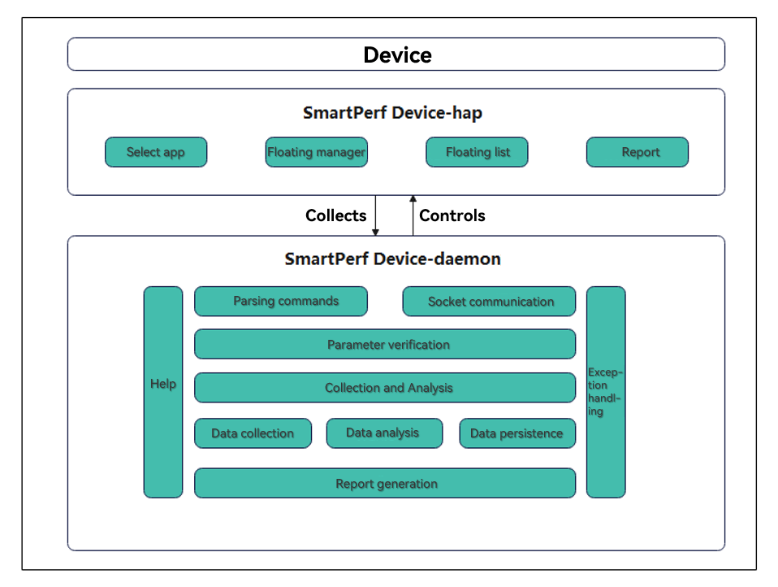
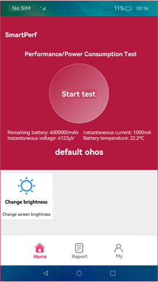
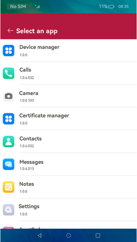
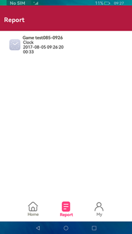
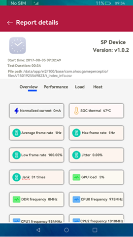

# SmartPerf User Guide

## Introduction

SmartPerf Device is a reliable, easy-to-use performance and power consumption test tool. In this tool, you can monitor the performance and power consumption of your application and device with quantitative indicators, such as FPS, CPU, GPU, RAM, and Temp.

<!--Del-->Targeted at devices with or without screens, SmartPerf Device provides two modes: Device-hap and Device-daemon. Device-hap is applicable to devices with screens and provides a visualized, intuitive UI that simplifies your operations. <!--DelEnd-->You can start and pause a test with a floating window, view performance data in real time, and save the test results for further analysis. Device-daemon is applicable to devices with and without screens and works with shell commands.

### Indicators

- CPU: The tool reads the frequencies and usage of CPU cores on the test device on a per second basis to measure the CPU usage of the target application. Sustained high CPU may lead to overheating.
- GPU: The tool reads the GPU frequency and load information of the test device on a per second basis to measure the GPU usage of the target application. High GPU usage can lead to performance drops and application slowdowns.
- FPS: The tool reads the frame rate, in frames per second (FPS), of the target application to measure the smoothness of the application image. A higher FPS generally means smoother visuals.
- TEMP: The tool reads the temperature information of the test device on a per second basis, including the GPU temperature and system chip temperature.
- RAM: The tool reads the RAM usage of the target application on a per second basis.
- snapshot: The tool takes a screenshot of the application UI every 2 seconds.

## Principles

The figure below demonstrates the main functions of SmartPerf Device. Set data collection items and parameters on Device-hap, start the application, and then send data requests for KPIs (such as FPS, RAM, and Trace) from Device-hap to Device-daemon through messages. Device-daemon collects, persists, and analyzes data as requested<!--Del-->, and then sends the data to Device-hap for display<!--DelEnd-->.



## Constraints

1. Device-daemon and <!--Del-->Device-hap <!--DelEnd-->are pre-installed since API version 9.

2. Device-daemon must be connected to a hardware device<!--Del-->, and Device-hap can only be used on devices with a screen<!--DelEnd-->.

3. Before using Device-Daemon, configure the [hdc environment](https://gitee.com/openharmony/developtools_hdc).

<!--Del-->
## SmartPerf Device-hap

The RK3568 development board is used as an example below.

### Obtaining the Application List

Start SmartPerf Device-hap. On the home screen, click **Select an app**.





### Setting Collection Parameters

After the target application is selected, return to the start page and set the test indicators. You can also change the test name (which includes the name of the target application and the test time and will be displayed in the report), and specify whether to capture traces and whether to enable the screenshot feature. When you are done, click the **Start** button at the bottom.

### Using the Floating Window to Manage Data Collection

To start collection, touch **Start** in the floating window. To pause, touch the timer in the floating window. To resume, touch the timer again. To view the collected data in real time, double-touch the timer. To stop, touch and hold the timer.<br>You can drag the floating window to anywhere you like.


### Viewing the Report

Click **Report** to access the report list. Touch a report to view its details.



<!--DelEnd-->

<!--RP1-->
## SmartPerf Device-daemon
<!--RP1End-->

### Collection Prerequisites

#### Switching to Shell

  ```
  C:\Users\issusser>hdc shell
  #
  ```

#### Starting and Viewing the daemon Process

  ```
  C:\Users\issusser>hdc shell
  // Start the daemon process.
  # SP_daemon 
  // Check whether the daemon process is running.
  # ps -ef | grep SP_daemon
  root          1584     1 0 21:50:05 ?     00:00:00 SP_daemon
  root          1595  1574 3 21:51:02 pts/0 00:00:00 grep SP_daemon
  #
  ```

#### Viewing the Help Information

<!--RP3-->

  ```
  # SP_daemon --help
  OpenHarmony performance testing tool SmartPerf command-line version
   Usage: SP_daemon [options] [arguments]
    
   options:
    -N              set the collection times(default value is 0) range[1,2147483647], for example: -N 10
    -PKG            set package name, must add, for example: -PKG ohos.samples.ecg
    -c              get device CPU frequency and CPU usage, process CPU usage and CPU load ..
    -g              get device GPU frequency and GPU load
    -f              get app refresh fps(frames per second) and fps jitters and refreshrate
    -profilerfps    get refresh fps and timestamp
    -sections       set collection time period(using with profilerfps)
    -t              get remaining battery power and temperature..
    -p              get battery power consumption and voltage(Not supported by some devices)
    -r              get process memory and total memory
    -snapshot       get screen capture
    -net            get uplink and downlink traffic
    -start          collection start command
    -stop           collection stop command
    -VIEW           set layler, for example: -VIEW DisplayNode
    -OUT            set csv output path.
    -d              get device DDR information
    -screen         get screen resolution
    -deviceinfo     get device information
    -server         start a process to listen to the socket message of the start and stop commands
    -clear          clear the process ID
    -ohtestfps      used by the validator to obtain the fps, the collection times can be set
    -editorServer   start a process to listen to the socket message of the editor
    -recordcapacity get the battery level difference
    --version       get version
    --help          get help
    -editor         scenario-based collection identifier, parameter configuration items can be added later
    responseTime   get the page response delay after an application is operated
    completeTime   get the page completion delay after an application is operated
    fpsohtest      used by the validator to obtain the fps
    example1:
    SP_daemon -N 20 -c -g -t -p -r -net -snapshot -d
    SP_daemon -N 20 -PKG ohos.samples.ecg -c -g -t -p -f -r -net -snapshot -d
    SP_daemon -start -c
    SP_daemon -stop
    example2: These parameters need to be used separately
    SP_daemon -screen
    SP_daemon -deviceinfo
    SP_daemon -server
    SP_daemon -clear
    SP_daemon -ohtestfps 10
    SP_daemon -editorServer
    SP_daemon -recordcapacity
    example3: These parameters need to be used separately
    SP_daemon -editor responseTime ohos.samples.ecg app name
    SP_daemon -editor completeTime ohos.samples.ecg app name
    SP_daemon -editor fpsohtest
    
    
    
    command exec finished!
   #
  ```
<!--RP3End-->

### Basic Collection

#### Run the **-N** command to enable the collection

| Command  |Mandatory| Description                  |
| :-----| :-----| :--------------------- |
| -N    |Yes| Sets the number of collection times (once per second).   |
| -PKG  |No| Sets the bundle name.               |
| -c    |No| Collects the CPU frequency and usage.<br>When the application bundle name is set, the system and application CPU information is collected.<br>Otherwise, only the system CPU information is collected.    |
| -g    |No| Collects the GPU frequency and load information.  |
| -f    |No| Collects the screen refresh rate and frame rate of the target application. The application bundle name must be specified.       |
| -t    |No| Collects the temperature of GPU and system chip.          |
| -r    |No| Collects the memory.<br>When the application bundle name is set, the system and application memory information is obtained.<br>Otherwise, only the system memory information is obtained.            |
| -snapshot |No| Takes a screenshot.            |
| -net |No| Collects the network speed.             |
| -VIEW |No| Sets the view layer. You must obtain the layer name first.               |
| -d    |No| Collects the DDR data.                |
| -sections|No| Sets segment-based collection.         |
<!--RP2--><!--RP2End-->

##### Samples

- Collect twice the frequency and usage of CPU cores.

  ```
    # SP_daemon -N 2 -c

    order:0 timestamp=1501839064260
    order:1 TotalcpuUsage=0.502513
    order:2 TotalcpuidleUsage=99.497487
    order:3 TotalcpuioWaitUsage=0.000000
    order:4 TotalcpuirqUsage=0.000000
    order:5 TotalcpuniceUsage=0.000000
    order:6 TotalcpusoftIrqUsage=0.000000
    order:7 TotalcpusystemUsage=0.251256
    order:8 TotalcpuuserUsage=0.251256
    order:9 cpu0Frequency=1992000
    order:10 cpu0Usage=1.000000
    order:11 cpu0idleUsage=99.000000
    order:12 cpu0ioWaitUsage=0.000000
    order:13 cpu0irqUsage=0.000000
    order:14 cpu0niceUsage=0.000000
    order:15 cpu0softIrqUsage=0.000000
    order:16 cpu0systemUsage=0.000000
    order:17 cpu0userUsage=1.000000
    order:18 cpu1Frequency=1992000
    order:19 cpu1Usage=0.000000
    order:20 cpu1idleUsage=100.000000
    order:21 cpu1ioWaitUsage=0.000000
    order:22 cpu1irqUsage=0.000000
    order:23 cpu1niceUsage=0.000000
    order:24 cpu1softIrqUsage=0.000000
    order:25 cpu1systemUsage=0.000000
    order:26 cpu1userUsage=0.000000
    order:27 cpu2Frequency=1992000
    order:28 cpu2Usage=1.000000
    order:29 cpu2idleUsage=99.000000
    order:30 cpu2ioWaitUsage=0.000000
    order:31 cpu2irqUsage=0.000000
    order:32 cpu2niceUsage=0.000000
    order:33 cpu2softIrqUsage=0.000000
    order:34 cpu2systemUsage=1.000000
    order:35 cpu2userUsage=0.000000
    order:36 cpu3Frequency=1992000
    order:37 cpu3Usage=0.000000
    order:38 cpu3idleUsage=100.000000
    order:39 cpu3ioWaitUsage=0.000000
    order:40 cpu3irqUsage=0.000000
    order:41 cpu3niceUsage=0.000000
    order:42 cpu3softIrqUsage=0.000000
    order:43 cpu3systemUsage=0.000000
    order:44 cpu3userUsage=0.000000

    ...

    command exec finished!
    #
  ```

- Collect twice the frequency and usage of CPU cores and CPU usage and load of processes.

  ```
    # SP_daemon -N 2 -PKG ohos.samples.ecg -c

    order:0 timestamp=1501839151499
    order:1 ProcAppName=ohos.samples.ecg
    order:2 ProcCpuLoad=0.000000
    order:3 ProcCpuUsage=36.177645
    order:4 ProcId=2111
    order:5 ProcSCpuUsage=8.982036
    order:6 ProcUCpuUsage=27.195609
    order:7 TotalcpuUsage=62.500000
    order:8 TotalcpuidleUsage=37.500000
    order:9 TotalcpuioWaitUsage=0.000000
    order:10 TotalcpuirqUsage=0.000000
    order:11 TotalcpuniceUsage=0.000000
    order:12 TotalcpusoftIrqUsage=0.000000
    order:13 TotalcpusystemUsage=21.614583
    order:14 TotalcpuuserUsage=40.885417
    order:15 cpu0Frequency=1992000
    order:16 cpu0Usage=77.083333
    order:17 cpu0idleUsage=22.916667
    order:18 cpu0ioWaitUsage=0.000000
    order:19 cpu0irqUsage=0.000000
    order:20 cpu0niceUsage=0.000000
    order:21 cpu0softIrqUsage=0.000000
    order:22 cpu0systemUsage=21.875000
    order:23 cpu0userUsage=55.208333
    order:24 cpu1Frequency=1992000
    order:25 cpu1Usage=57.731959
    order:26 cpu1idleUsage=42.268041
    order:27 cpu1ioWaitUsage=0.000000
    order:28 cpu1irqUsage=0.000000
    order:29 cpu1niceUsage=0.000000
    order:30 cpu1softIrqUsage=0.000000
    order:31 cpu1systemUsage=21.649485
    order:32 cpu1userUsage=36.082474
    order:33 cpu2Frequency=1992000
    order:34 cpu2Usage=59.793814
    order:35 cpu2idleUsage=40.206186
    order:36 cpu2ioWaitUsage=0.000000
    order:37 cpu2irqUsage=0.000000
    order:38 cpu2niceUsage=0.000000
    order:39 cpu2softIrqUsage=0.000000
    order:40 cpu2systemUsage=19.587629
    order:41 cpu2userUsage=40.206186
    order:42 cpu3Frequency=1992000
    order:43 cpu3Usage=55.789474
    order:44 cpu3idleUsage=44.210526
    order:45 cpu3ioWaitUsage=0.000000
    order:46 cpu3irqUsage=0.000000
    order:47 cpu3niceUsage=0.000000
    order:48 cpu3softIrqUsage=0.000000
    order:49 cpu3systemUsage=23.157895
    order:50 cpu3userUsage=32.631579
    
    ...
    
    command exec finished!
    #
  ```

  >**NOTE**
  >
  >- Make sure you are on the application screen when running this command.

- Collect once the GPU frequency and load of the system.

  ```
    # SP_daemon -N 1 -g

    order:0 timestamp=1503078740268
    order:1 gpuFrequency=200000000
    order:2 gpuLoad=38.000000
    
    command exec finished!
    #
  ```

- Collect twice the system temperature.

  ```
    # SP_daemon -N 2 -t
    
    order:0 timestamp=1502720711191
    order:1 gpu-thermal=42500.000000
    order:2 soc-thermal=43.125000

    order:0 timestamp=1502720712191
    order:1 gpu-thermal=41875.000000
    order:2 soc-thermal=42.500000
    
    command exec finished!
    #
  ```

- Collect twice the memory information of the system.

  ```
    # SP_daemon -N 2 -r
    order:0 timestamp=1705041562521
    order:1 memAvailable=7339224
    order:2 memFree=7164708
    order:3 memTotal=11641840
    
    order:0 timestamp=1705041563527
    order:1 memAvailable=7339136
    order:2 memFree=7164684
    order:3 memTotal=11641840
    
    command exec finished!
    #
  ```

- Collect the memory information of the system and a specified application once.

  ```
    # SP_daemon -N 1 -PKG ohos.samples.ecg -r
    
    order:0 timestamp=1720427095197
    order:1 arktsHeapPss=17555
    order:2 gpuPss=7021
    order:3 graphicPss=163320
    order:4 heapAlloc=120344
    order:5 heapFree=14362
    order:6 heapSize=133436
    order:7 memAvailable=2757504
    order:8 memFree=190852
    order:9 memTotal=11742716
    order:10 nativeHeapPss=49102
    order:11 privateClean=1100020
    order:12 privateDirty=175169
    order:13 pss=422172
    order:14 sharedClean=89348
    order:15 sharedDirty=19084
    order:16 stackPss=1588
    order:17 swap=122076
    order:18 swapPss=122076

    command exec finished!
    #
  ```
  >**NOTE**
  >
  >- Make sure you are on the application screen when running this command.
  >- This command integrates the **-m** command of earlier version, which obtains data such as **arktsHeapPss**, **gpuPss**, **graphicPss**.

- Take two screenshots.

  ```
    # SP_daemon -N 2 -snapshot
    
    order:0 timestamp=1501837609657
    order:1 capture=data/local/tmp/capture/screenCap_1501837609657.png

    order:0 timestamp=1501837610657
    order:1 capture=NA
    
    command exec finished!
    #
  ```
  >**NOTE**
  >
  >- Screenshots are collected every 2 seconds. 
  >
  >- When the collection is complete, you can view the screenshots in **data/local/tmp/capture**.
  >
  >- To export the screenshots to drive D, open a new CLI and run the **hdc file recv data/local/tmp/capture/screenCap_1700725192774.png D:\\** command.

- Collect the network speeds twice.

  ```
    # SP_daemon -N 2 -net
    
    order:0 timestamp=1705041904832
    order:1 networkDown=0
    order:2 networkUp=0
    
    order:0 timestamp=1705041905870
    order:1 networkDown=22931
    order:2 networkUp=2004
    
    command exec finished!
    #
  ```

- Collect the frame rate of the target application five times.

  ```
    # SP_daemon -N 5 -PKG ohos.samples.ecg -f
    
    order:0 timestamp=1705306472232
    order:1 fps=43
    order:2 fpsJitters=602261688;;8352083;;8267708;;8305209;;8298437;;8308854;;8313542;;8569271;;8061458;;8300521;;8308333;;8309896;;8429167;;8241667;;8258333;;8318229;;8312500;;8304167;;41760937;;16418750;;8298959;;8319270;;8308334;;8313541;;8302605;;8320312;;8298958;;8326042;;8321354;;8301042;;8310417;;8309895;;8308855;;8331250;;8286458;;8343229;;8278125;;8311458;;8306250;;8312500;;8320834;;8346875;;8283333
    order:3 refreshrate=69
    
    order:0 timestamp=1705306473234
    order:1 fps=40
    order:2 fpsJitters=674427313;;8191145;;8310417;;8319271;;8301562;;8318750;;8302084;;8314062;;8333334;;8283854;;8307812;;8311979;;8310417;;8307813;;8309375;;8323958;;8306250;;8308333;;8317709;;8296875;;8721875;;7895833;;8320833;;8340625;;8276563;;8409896;;8216145;;8310938;;8301042;;8362500;;8252604;;8317708;;8376042;;8256250;;8292187;;8303125;;8313542;;8310417;;8520312
    order:3 refreshrate=69
    ...
    
    command exec finished!
    #
  ```
  >**NOTE**
  >
  >- When running this command, make sure you are on the application screen, and then swipe on the screen or switch between screens.
  >- When dynamic refresh rate (DRR) is enabled, the refresh rate changes in real time (multiple changes may occur within one second). The value of **refreshrate** is obtained at a timestamp.


- Collect the frame rate of the specified view layer for 10 times.

  ```
    # SP_daemon -N 10 -VIEW DisplayNode -f
    order:0 timestamp=1705306822850
    order:1 fps=15
    order:2 fpsJitters=876291843;;8314062;;8308334;;8314583;;8310417;;8308333;;8326042;;8314583;;8292708;;8492709;;8143750;;8340104;;8294271;;8302604;;8297396
    order:3 refreshrate=69
     
    order:0 timestamp=1705306823852
    order:1 fps=12
    order:2 fpsJitters=906667363;;8279167;;8311458;;8315625;;8291146;;8313021;;8323438;;8293750;;8303125;;8313541;;8301563;;8317708
    order:3 refreshrate=69
    ...
    
    command exec finished!
    #
  ```
  >**NOTE**
  >
  >- **DisplayNode** indicates the name of the specified layer.
  >
  >- When using this command to collect data, you need to operate the page on the specified layer.
  >
  >- This command cannot be used together with the commands used to collect frame rate of a specified application, such as the **SP_daemon -N 20 -PKG ohos.samples.ecg -f** or **SP_daemon -N 20 -VIEW DisplayNode -f** commands.

- Collect DDR information once.

  ```
    # SP_daemon -N 1 -d
    
    order:0 timestamp=1710916175201
    order:1 ddrFrequency=1531000000
    
    command exec finished!
    #
  ```
<!--RP4--><!--RP4End-->

- Collect the full information of the system, including the CPU, GPU, temperature, memory, DDR, network speed, and screenshot information.

  ```
    # SP_daemon -N 10 -c -g -t -r -d -net -snapshot
    
    order:0 timestamp=1501837838664
    order:1 TotalcpuUsage=0.751880
    order:2 TotalcpuidleUsage=99.248120
    order:3 TotalcpuioWaitUsage=0.000000
    order:4 TotalcpuirqUsage=0.000000
    order:5 TotalcpuniceUsage=0.000000
    order:6 TotalcpusoftIrqUsage=0.000000
    order:7 TotalcpusystemUsage=0.501253
    order:8 TotalcpuuserUsage=0.250627
    order:9 cpu0Frequency=1992000
    order:10 cpu0Usage=0.000000
    order:11 cpu0idleUsage=100.000000
    order:12 cpu0ioWaitUsage=0.000000
    order:13 cpu0irqUsage=0.000000
    order:14 cpu0niceUsage=0.000000
    order:15 cpu0softIrqUsage=0.000000
    order:16 cpu0systemUsage=0.000000
    order:17 cpu0userUsage=0.000000
    order:18 cpu1Frequency=1992000
    order:19 cpu1Usage=0.000000
    order:20 cpu1idleUsage=100.000000
    order:21 cpu1ioWaitUsage=0.000000
    order:22 cpu1irqUsage=0.000000
    order:23 cpu1niceUsage=0.000000
    order:24 cpu1softIrqUsage=0.000000
    order:25 cpu1systemUsage=0.000000
    order:26 cpu1userUsage=0.000000
    order:27 cpu2Frequency=1992000
    order:28 cpu2Usage=1.000000
    order:29 cpu2idleUsage=99.000000
    order:30 cpu2ioWaitUsage=0.000000
    order:31 cpu2irqUsage=0.000000
    order:32 cpu2niceUsage=0.000000
    order:33 cpu2softIrqUsage=0.000000
    order:34 cpu2systemUsage=1.000000
    order:35 cpu2userUsage=0.000000
    order:36 cpu3Frequency=1992000
    order:37 cpu3Usage=0.000000
    order:38 cpu3idleUsage=100.000000
    order:39 cpu3ioWaitUsage=0.000000
    order:40 cpu3irqUsage=0.000000
    order:41 cpu3niceUsage=0.000000
    order:42 cpu3softIrqUsage=0.000000
    order:43 cpu3systemUsage=0.000000
    order:44 cpu3userUsage=0.000000
    order:45 gpuFrequency=200000000
    order:46 gpuLoad=0.000000
    order:47 gpu-thermal=40000.000000
    order:48 soc-thermal=40.625000
    order:49 memAvailable=1142820
    order:50 memFree=687988
    order:51 memTotal=1935948
    order:52 ddrFrequency=800000000
    order:53 networkDown=0
    order:54 networkUp=0
    order:55 capture=data/local/tmp/capture/screenCap_1501837838669.png
    
    ...
    
    command exec finished!
    #
  ```

- Collect the full information of the specified application, including the CPU, GPU, temperature, frame rate, memory, DDR, network speed, and screenshot information.

  <!--RP5-->
  ```
    # SP_daemon -N 10 -PKG ohos.samples.ecg -c -g -t -f -r -d -net -snapshot
    
    order:0 timestamp=1501837949706
    order:1 ProcAppName=ohos.samples.ecg
    order:2 ProcCpuLoad=0.000000
    order:3 ProcCpuUsage=38.775000
    order:4 ProcId=1960
    order:5 ProcSCpuUsage=8.875000
    order:6 ProcUCpuUsage=29.900000
    order:7 TotalcpuUsage=85.416667
    order:8 TotalcpuidleUsage=14.583333
    order:9 TotalcpuioWaitUsage=0.000000
    order:10 TotalcpuirqUsage=0.000000
    order:11 TotalcpuniceUsage=0.000000
    order:12 TotalcpusoftIrqUsage=0.000000
    order:13 TotalcpusystemUsage=33.072917
    order:14 TotalcpuuserUsage=52.343750
    order:15 cpu0Frequency=1992000
    order:16 cpu0Usage=92.929293
    order:17 cpu0idleUsage=7.070707
    order:18 cpu0ioWaitUsage=0.000000
    order:19 cpu0irqUsage=0.000000
    order:20 cpu0niceUsage=0.000000
    order:21 cpu0softIrqUsage=0.000000
    order:22 cpu0systemUsage=40.404040
    order:23 cpu0userUsage=52.525253
    order:24 cpu1Frequency=1992000
    order:25 cpu1Usage=82.291667
    order:26 cpu1idleUsage=17.708333
    order:27 cpu1ioWaitUsage=0.000000
    order:28 cpu1irqUsage=0.000000
    order:29 cpu1niceUsage=0.000000
    order:30 cpu1softIrqUsage=0.000000
    order:31 cpu1systemUsage=29.166667
    order:32 cpu1userUsage=53.125000
    order:33 cpu2Frequency=1992000
    order:34 cpu2Usage=81.111111
    order:35 cpu2idleUsage=18.888889
    order:36 cpu2ioWaitUsage=0.000000
    order:37 cpu2irqUsage=0.000000
    order:38 cpu2niceUsage=0.000000
    order:39 cpu2softIrqUsage=0.000000
    order:40 cpu2systemUsage=31.111111
    order:41 cpu2userUsage=50.000000
    order:42 cpu3Frequency=1992000
    order:43 cpu3Usage=85.858586
    order:44 cpu3idleUsage=14.141414
    order:45 cpu3ioWaitUsage=0.000000
    order:46 cpu3irqUsage=0.000000
    order:47 cpu3niceUsage=0.000000
    order:48 cpu3softIrqUsage=0.000000
    order:49 cpu3systemUsage=32.323232
    order:50 cpu3userUsage=53.535354
    order:51 gpuFrequency=200000000
    order:52 gpuLoad=29.000000
    order:53 gpu-thermal=41875.000000
    order:54 soc-thermal=45.000000
    order:55 fps=40
    order:56 fpsJitters=14482127;;28966003;;28971836;;14484751;;28952878;;28970962;;14480959;;28968337;;14476001;;28967461;;28968045;;14477751;;28966878;;28975337;;14475126;;28962795;;28967461;;14496710;;28953169;;28966003;;14483002;;28963961;;28965711;;28964836;;28966295;;14550085;;28898628;;28964544;;28975628;;14497293;;28938878;;43454546;;28966003;;28973295;;28959878;;28964252;;14476585;;28965128;;28970670;;14478626
    order:57 refreshrate=69
    order:58 arktsHeapPss=10970
    order:59 gpuPss=0
    order:60 graphicPss=10800
    order:61 heapAlloc=0
    order:62 heapFree=0
    order:63 heapSize=0
    order:64 memAvailable=1137784
    order:65 memFree=682592
    order:66 memTotal=1935948
    order:67 nativeHeapPss=21398
    order:68 privateClean=24816
    order:69 privateDirty=44932
    order:70 pss=91587
    order:71 sharedClean=100512
    order:72 sharedDirty=36832
    order:73 stackPss=1444
    order:74 swap=0
    order:75 swapPss=0
    order:76 ddrFrequency=800000000
    order:77 networkDown=0
    order:78 networkUp=0
    order:79 capture=data/local/tmp/capture/screenCap_1501837950216.png
    
    ...
    
    command exec finished!
    #
  ```
  <!--RP5End-->

  >**NOTE**
  >
  >- Make sure you are on the application screen when running this command.


#### Run the **-start** command to start the collection

Run the **start** command to start collection, operate the device or application, and then run the **stop** command to stop collection.

| Command  |Mandatory| Description                  |
| :-----|:-----| :--------------------- |
| -start |Yes| Starts collection. You can add a basic collection command after this command parameter. The collection is performed every second.           |
| -stop |Yes| Stops collection. A report is generated when collection is complete.             |

##### Samples

  ```
   Start data collection.
   # SP_daemon -start -c
   SP_daemon Collection begins
    
    
   command exec finished!
   #
      
   Stop data collection.
   # SP_daemon -stop
   SP_daemon Collection ended
   Output Path: data/local/tmp/smartperf/1/t_index_info.csv
    
    
   command exec finished!
   #
  ```
   >**NOTE**
   >
   >- To start collecting the system data, run the **SP_daemon -start -c -g -t -r -d -net -snapshot** command.
   >
   >- To start collecting the system and process data, run the **SP_daemon -start -PKG ohos.samples.ecg -c -g -t -f -r -d -net -snapshot** command.
   >
   >- The service start and stop file is stored in **data/local/tmp/smartperf/1/t_index_info.csv**. You can run the **hdc file recv** command to export the report. For details, see [Viewing Collection Result in the CSV File](#viewing-collection-result-in-the-csv-file).

#### Viewing Collection Result in the CSV File

If the collection result is saved in a CSV file, perform the following steps to export and view the result:

  - By default, the collection results are saved to **/data/local/tmp/data.csv**.

  - To check the path to the test result file:

       ```
    C:\Users\issusser>hdc shell
    # cd data/local/tmp
    # ls
    data.csv
    #
       ```

  - To export the test result file:
    ```
    C:\Users\issusser>hdc file recv data/local/tmp/data.csv D:\
    [I][2023-11-08 16:16:41] HdcFile::TransferSummary success
    FileTransfer finish, Size:429, File count = 1, time:6ms rate:71.50kB/s
    
    C:\Users\issusser>
    ```

  - Open the **data.csv** file to view the collected data.

    The table below describes the data fields in the **data.csv** file.

    | Data Field   | Description            |Remarks|
    | :-----| :--------------------- |:-----|
    | cpuFrequency      | CPU core frequency.       |Unit: Hz|
    | cpuUasge          | CPU core usage.         |%|
    | cpuidleUsage      | CPU usage in idle state.       |%|
    | cpuioWaitUsage    | CPU usage of I/O wait.       |%|
    | cpuirqUsage       | CPU usage of hardware interrupts.        |%|
    | cpuniceUsage      | CPU usage of user level processes with lower scheduling priority.   |%|
    | cpusoftIrqUsage   | CPU usage of software interrupts.        |%|
    | cpusystemUsage    | CPU usage in kernel mode.     |%|
    | cpuuserUsage      | CPU usage in user mode.          |%|
    | ProcId            | Process ID.               |-|
    | ProcAppName       | Application bundle name.               |-|
    | ProcCpuLoad       | Process CPU load.       |%|
    | ProcCpuUsage      | CPU usage of the process.         |%|
    | ProcUCpuUsage     | CPU usage of the process in user mode.    |%|
    | ProcSCpuUsage     | CPU usage of the process in kernel mode.    |%|
    | gpuFrequ          | GPU frequency of the system.         |%|
    | gpuLoad           | GPU load of the system.     |%|
    | currentNow        | Current value.      |Unit: mA|
    | voltageNow        | Voltage value.      |Unit: μV|
    | fps               | Number of frames per second.             |Unit: FPS|
    | fpsJitters        | Frame interval.       |Unit: ns|
    | refreshrate       | Screen refresh rate.           |Unit: Hz|
    | networkDown       | Downstream rate.             |Unit: byte/s|
    | networkUp         | Uplink rate.             |Unit: byte/s|
    | ddrFrequency      | DDR frequency.              |Unit: Hz|
    | gpu-thermal       | GPU temperature.             |Unit: °C|
    | soc-thermal       | SoC temperature.         |Unit: °C|
    | memAvailable      | Available memory of the system.        |Unit: KB|
    | memFree           | Free memory of the system.        |Unit: KB|
    | memTotal          | Total memory of the system.          |Unit: KB|
    | pss               | Proportional set size (PSS) of the process.     |Unit: KB|
    | sharedClean       | Shared unwritten pages.     |Unit: KB|
    | sharedDirty       | Shared rewritten pages.     |Unit: KB|
    | priviateClean     | Private unwritten pages.     |Unit: KB|
    | privateDirty      | Private rewritten pages.     |Unit: KB|
    | swapTotal         | Total swap memory.         |Unit: KB|
    | swapPss           | Swapped PSS.       |Unit: KB|
    | HeapSize          | Heap size.          |Unit: KB|
    | HeapAlloc         | Heap size that can be allocated.   |Unit: KB|
    | HeapFree          | Remaining heap size.     |Unit: KB|
    | gpuPss            | Used GPU size.    |Unit: KB|
    | graphicPss        | Used graphics memory size.    |Unit: KB|
    | arktsHeapPss      | Used ArkTS memory size.   |Unit: KB|
    | nativeHeapPss     | Used native memory size.  |Unit: KB|
    | stackPss          | Used stack memory size.      |Unit: KB|
    | timeStamp         | Timestamp.           |Collection time.|
    <!--RP6--><!--RP6End-->

### Scenario Collection

<!--RP7-->

In addition to basic collection, the response and completion delay can be collected. The scenario collection result is displayed in the CLI instead of being written into the **data.csv** file.

| Command  |Mandatory| Description                  |
| :-----|:-----| :--------------------- |
| -editor|Yes|    Identifies scenario collection. Parameter options can be added after.        |
| -responseTime|No|    Collects the response latency.        |
| -completeTime|No|    Collects the completion delay.        |
| -fpsohtest|No|    A validator used to collect the frame rate every second. The frame rate is collected 10 times by default.      |

#### Samples

- Collect the application response latency. (This command supports only the RK3568 device.)

  ```
   # SP_daemon -editor responseTime ohos.samples.ecg ohtest
   time:544ms

   command exec finished!
  ```
  >**NOTE**
  >
  >- Open the application before collection, press **Enter** in the CLI, switch to the application page, and wait for the collection result to be printed.

- Collect the application completion latency. (This command supports only the RK3568 device.)

  ```
   # SP_daemon -editor completeTime ohos.samples.ecg ohtest
   time:677ms

   command exec finished!
  ```
  >**NOTE**
  >
  >- Open the application before collection, press **Enter** in the CLI, switch to the application page, and wait for the collection result to be printed.

- Use the validator to obtain the application page frame rate.

  ```
   # SP_daemon -editor fpsohtest
   set num:10 successfps:0|1726909713442fps:97|1726909714442fps:113|1726909715442fps:116|1726909716442fps:116|1726909717442fps:118|1726909718442fps:114|1726909719442fps:114|1726909720442fps:115|1726909721442fps:118|1726909722442SP_daemon exec finished!
  ```
  >**NOTE**
  >
  >- You need to swipe or switch the current page after running the command, and the collection result will be printed after 10s.

<!--RP7End-->

### Other Collection

The power collection result of the current device can be written into the **data.csv** file. Other data is collected separately and the collection result is displayed only in the command box.

| Command  |Mandatory| Description                  |
| :-----|:-----| :--------------------- |
| -screen |No| Collects the screen resolution and refresh rate.              |
| -deviceinfo|No| Obtains device information.             |
| -server|No|    Starts a daemon process by starting or stopping collection.          |
| -clear|No|    Clears all the SP_daemon processes.          |
| -ohtestfps|No|    Obtains the frame rate. You can set the number of collection times (collection is performed every second).         |
| -editorServer|No|    Starts a daemon process by using an editor.        |
| -recordcapacity|No|    Obtains the battery level of the current device.        |
| -profilerfps |No| Collects the frame rate of the current page.         |

#### Samples

- Obtain the screen resolution.

  ```
   # SP_daemon -screen
   activeMode: 720x1280, refreshrate=69
    
    
   command exec finished!
   #
  ```
  >**NOTE**
  >
  >- **activeMode** indicates the current screen resolution, and **refreshrate** indicates the screen refresh rate.

- Obtain the device information.

  ```
   # SP_daemon -deviceinfo
   abilist: default
   activeMode: 720x1280
   board: hw
   brand: default
   cpu_c1_cluster: 0 1 2 3
   cpu_c1_max: 1992000
   cpu_c1_min: 408000
   cpu_cluster_name: policy0
   daemonPerfVersion: 1.0.5
   deviceTypeName: rk3568
   fullname: OpenHarmony-5.1.0.46
   gpu_max_freq: 800000000
   gpu_min_freq: 200000000
   model: ohos
   name: OpenHarmony 3.2
   sn: 150100424a5444345209d941bec6b900
   version: OpenHarmony 5.1.0.46
    
   command exec finished!
   #
  ```

- Start a process to listen for the socket messages of the **start** and **stop** commands.

  ```
   # SP_daemon -server
   #
   # pidof SP_daemon
   7024
   #
  ```
  >**NOTE**
  >
  >- You can run the **pidof SP_daemon** command to view the process ID.

- Clear the SP_daemon process ID.

  ```
   # pidof SP_daemon
   2725   
   # SP_daemon -clear
    
    
   command exec finished!
   #
   # pidof SP_daemon
   #
  ```
  >**NOTE**
  >
  >- You can run the **pidof SP_daemon** command to view the process ID.

- Obtain the frame rate of the current page using a validator.

  ```
   # SP_daemon -ohtestfps 10
   set num:10 success
   fps:1|1501926684532
   fps:18|1501926685532
   fps:37|1501926686532
   fps:41|1501926687532
   fps:42|1501926688532
   fps:16|1501926689532
   fps:40|1501926690532
   fps:40|1501926691532
   fps:42|1501926692532
   fps:41|1501926693532
   SP_daemon exec finished!
   #
  ```
  >**NOTE**
  >
  >- In this command, **10** indicates the number of collection times (collection is performed every second). You can set it to a positive integer.


- Start a process to listen for the socket messages of the editor tool.

  ```
   # SP_daemon -editorServer
    
    
   command exec finished!
  ```


- Obtain the battery level.

  ```
   # SP_daemon -recordcapacity
   recordTime: 1726903063
   recordPower: 5502
  ```
  >**NOTE**
  >
  >- **recordTime** indicates the timestamp, and **recordPower** indicates the current battery level.
  >
  >- This command needs to be executed separately. The collection result is written into the **/data/local/tmp/powerLeftRecord.csv** file and can be exported to the local PC by running the **hdc file recv** command. For details, see [Viewing Collection Result in the CSV File](#viewing-collection-result-in-the-csv-file).

- Collect the frame rate of the current page.

  ```
    # SP_daemon -profilerfps 10
    set num:10 success
    fps:0|1711692357278
    fps:0|1711692358278
    fps:1|1711692359278
    fps:0|1711692360278
    fps:0|1711692361278
    fps:0|1711692362278
    fps:0|1711692363278
    fps:0|1711692364278
    fps:26|1711692365278
    fps:53|1711692366278
    SP_daemon exec finished!
    #
  ```
  >**NOTE**
  >
  >- In this command, **100** indicates the number of collection times (collection is performed every second). You can set it to a positive integer.

- Collect the frame rate by time segment.

  ```
    # SP_daemon -profilerfps 100 -sections 10
    set num:100 success
    fps:0|1711692393278
    fps:0|1711692394278
    fps:0|1711692395278
    fps:44|1711692396278
    sectionsFps:0|1711692396278
    sectionsFps:0|1711692396378
    sectionsFps:40|1711692396478
    sectionsFps:60|1711692396578
    sectionsFps:60|1711692396678
    sectionsFps:60|1711692396778
    sectionsFps:60|1711692396878
    sectionsFps:40|1711692396978
    sectionsFps:60|1711692397078
    sectionsFps:60|1711692397178
    fps:51|1711692397278

    ...

    SP_daemon exec finished!
    #
  ```
  >**NOTE**
  >
  >- In this command, **100** indicates the number of collection times (collection is performed every second) and can be set to a positive integer. **10** indicates collection by segment. Currently, the number of collection segments can be set to a positive integer ranging from 1 to 10.
