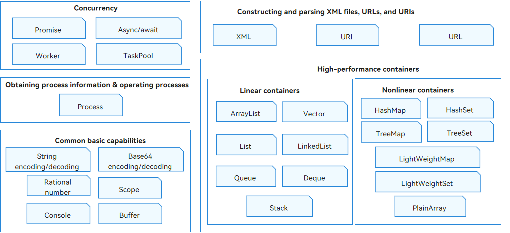

# Introduction to ArkTS

ArkTS is the preferred high-level programming language for application development in OpenHarmony. ArkTS provides capabilities such as declarative UI paradigm and status management, helping you develop applications in a simpler and more natural way.

While maintaining the basic syntax style of TypeScript, ArkTS further enhances static check and analysis. In this way, more errors can be detected during development, improving code robustness and achieving better running performance. For details, see [Getting Started with ArkTS](../quick-start/arkts-get-started.md).

ArkTS provides standard built-in objects, such as Array, Map, TypedArray, and Math, that you can directly use. It also provides a common library for basic capabilities, as shown in the figure below.

**Figure 1** Capabilities of the ArkTS common library

- [Asynchronous concurrency and multithread concurrency](concurrency-overview.md)
  - Standard JavaScript asynchronous concurrency capabilities, such as Promise and async/await, are supported.
  - **TaskPool** provides a multithread running environment for applications. The use of **TaskPool** helps reduce resource consumption and improve system performance. It also frees you from caring about the lifecycle of thread instances.
  - **Worker** is provided for multithread concurrency. The worker thread can communicate with the host thread. You need to proactively create and close a worker thread.

- [Adding, deleting, modifying, and querying elements in containers](container-overview.md)

- Constructing and parsing XML files, URLs, and URIs
  - [Extensible Markup Language (XML)](xml-overview.md) is designed for data transmission and storage.  
  - [URI](../reference/apis-arkts/js-apis-uri.md) is a uniform resource identifier that uniquely identifies a resource. [URL](../reference/apis-arkts/js-apis-url.md) is a uniform resource locator that provides a path for locating a resource.

- [String and binary data processing](../reference/apis-arkts/js-apis-util.md) and [logging](../reference/common/js-apis-logs.md)
  - APIs for encoding and decoding strings
  - APIs for encoding and decoding Base64-encoded bytes
  - APIs for common rational number operations, including comparing rational numbers and obtaining numerators and denominators
  - **Scope** APIs for defining the valid range of a field
  - APIs for processing binary data in scenarios such as TCP flows or file system operations
  - **Console** APIs for logging

- [Obtaining process information and operating processes](../reference/apis-arkts/js-apis-process.md)

   