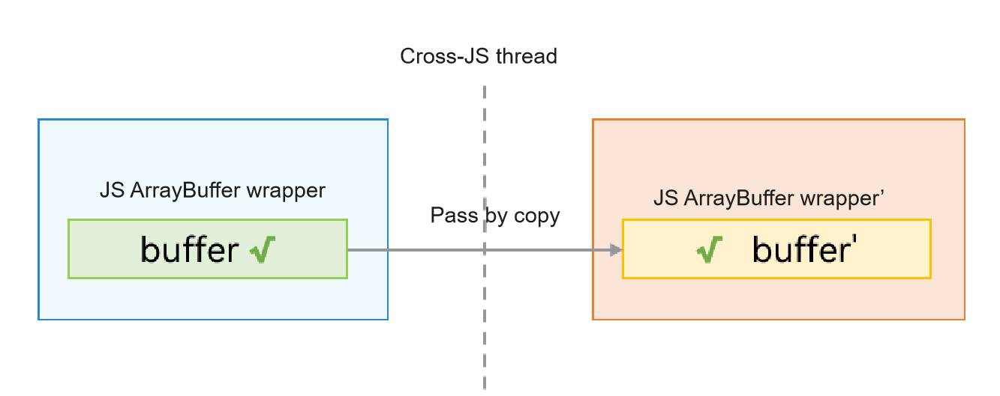
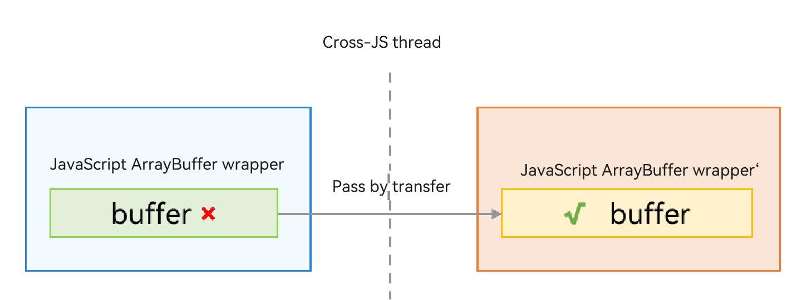

# ArrayBuffer Object

The ArrayBuffer contains a native memory. Similar to common objects, JS object shells need to be copied and transferred through serialization and deserialization. However, the native memory has two transmission modes: copy and transfer.

If copy is used during transmission, deep copy (recursive traversal) is required. After transmission, the two threads can independently access the ArrayBuffer. The following figure shows the communication process.



If the transfer mode is used, the original thread cannot use the ArrayBuffer object. In cross-thread scenarios, only the JS shell needs to be rebuilt, and the native memory does not need to be copied, improving efficiency. The following figure shows the communication process.



ArrayBuffer can be used to represent resources such as images. During application development, image processing is required (for example, the brightness, saturation, and size of an image need to be adjusted). To avoid blocking the UI main thread, you can transfer the image to a subthread to perform these operations. The transfer mode has higher performance. However, the original thread cannot access the ArrayBuffer object. If both threads need to access the ArrayBuffer object, the copy mode must be used. Otherwise, the transfer mode is recommended to improve performance.

The following describes how to transfer an image to a subthread by copying and transferring the image.

## ArrayBuffer copy transfer mode

In ArkTS, when the TaskPool transfers ArrayBuffer data, the transfer mode is used by default. You can call the setTransferList () API to specify the transfer mode as the transfer mode for some data and switch the copy mode for other data.

First, implement an interface that needs to be executed in a task to process ArrayBuffer.

Then, the ArrayBuffer data is transferred to the task in copy mode, and the ArrayBuffer is processed in the task.

Finally, the UI main thread receives the ArrayBuffer data returned after the task is executed and combines the data for display.

```ts
// Index.ets
import { taskpool } from '@kit.ArkTS';
import { BusinessError } from '@kit.BasicServicesKit';

@Concurrent
function adjustImageValue(arrayBuffer: ArrayBuffer): ArrayBuffer {
  // Perform operations on arrayBuffer.
  return arrayBuffer; // The return value is transferred by default.
}

function createImageTask(arrayBuffer: ArrayBuffer, isParamsByTransfer: boolean): taskpool.Task {
  let task: taskpool.Task = new taskpool.Task(adjustImageValue, arrayBuffer);
  if (!isParamsByTransfer) {// Whether to use the transfer mode
    // Transfer an empty array []. All arrayBuffer parameters are transferred in copy mode.
    task.setTransferList([]);
  }
  return task;
}

@Entry
@Component
struct Index {
  @State message: string = 'Hello World';

  build() {
    RelativeContainer() {
      Text(this.message)
        .id('HelloWorld')
        .fontSize(50)
        .fontWeight(FontWeight.Bold)
        .alignRules({
          center: { anchor: '__container__', align: VerticalAlign.Center },
          middle: { anchor: '__container__', align: HorizontalAlign.Center }
        })
        .onClick(() => {
          let taskNum = 4;
          let arrayBuffer = new ArrayBuffer(1024 * 1024);
          let taskPoolGroup = new taskpool.TaskGroup();
          // Create a certain number of tasks based on the input taskNum.
          for (let i: number = 0; i < taskNum; i++) {
            let arrayBufferSlice: ArrayBuffer = arrayBuffer.slice(arrayBuffer.byteLength / taskNum * i, arrayBuffer.byteLength / taskNum * (i + 1));
            // Use the copy method to transmit the ArrayBuffer object. Therefore, isParamsByTransfer is false.
            taskPoolGroup.addTask(createImageTask(arrayBufferSlice, false));
          }
          // Execute the task.
          taskpool.execute(taskPoolGroup).then((data) => {
            // Return the result. Combine the arrays to obtain the final result.
          }).catch((e: BusinessError) => {
            console.error(e.message);
          })
        })
    }
    .height('100%')
    .width('100%')
  }
}
```

## ArrayBuffer transfer mode

In the TaskPool, the transfer mode is used by default when the ArrayBuffer data is transferred. The original thread cannot use the ArrayBuffer data transferred to the subthread. Therefore, based on the preceding example, you can remove the task.setTransferList interface, that is, set the second parameter of createImageTask to true.
