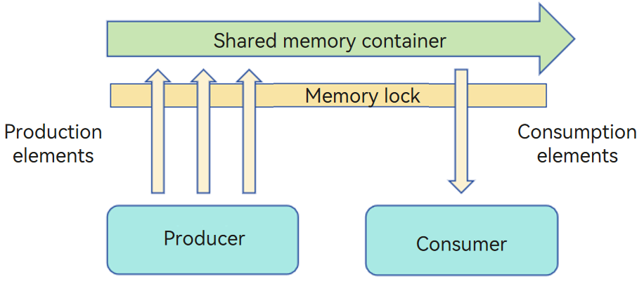
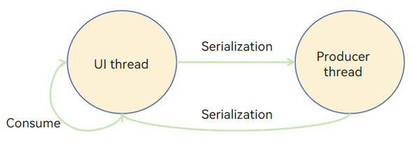

# Multithreaded Concurrency Overview

Concurrency models are used to implement concurrent tasks in different scenarios. Common concurrency models are classified into shared memory models and message passing models.

A typical message passing model is actor. It supports high-scale concurrency while eliminating a series of complex and occasional issues caused by locks.

Currently, ArkTS provides two concurrency capabilities: TaskPool and Worker, both of which are implemented based on the actor model.

For details about the comparison between the Actor concurrency model and the memory sharing concurrency model, see [Multithreaded Concurrency Model](#multithreaded concurrency model).

## Multithreaded Concurrency Model

In the memory sharing model, multiple threads execute complex tasks simultaneously. These threads depend on the same memory and have the permission to access the memory. Before accessing the memory, a thread must preempt and lock the memory. In this case, other threads have to wait for the thread to release the memory.

In the actor model, each thread is an independent actor, which has its own memory. Actors trigger the behavior of each other through message transfer. They cannot directly access the memory space of each other.

Different from the memory sharing model, the actor model provides independent memory space for each thread. As such, it avoids memory preemption and resulting function and performance problems.

In the actor model, concurrent tasks and task results are transmitted through the inter-thread communication.

This topic describes the differences between the two models when solving the producer-consumer problem.

### Memory Sharing Model

The following figure shows how the producer-consumer problem is resolved in the memory sharing model.



To prevent dirty reads and writes caused by simultaneous access, only one producer or consumer can access a shared memory container at a time. This means that producers and consumers need to compete for the lock of the container. After a role obtains the lock, other roles have to wait.

```ts
// The pseudocode is used only as a logic example to help developers understand the differences between the memory sharing model and the Actor model.
class Queue {
  // ...
  push(value: number) {}
 
  empty(): boolean {
    // ...
    return true
  }
 
  pop(value: number) :number {
    // ...
    return value;
  }
}
 
class Mutex {
  // ...
  lock(): boolean {
    // ...
    return true;
  }
 
  unlock() {
 
  }
}
class BufferQueue {
  queue: Queue = new Queue()
  mutex: Mutex = new Mutex()
  add(value: number) {
    // Attempt to acquire the lock.
    if (this.mutex.lock()) {
      this.queue.push(value)
      this.mutex.unlock()
    }
  }
 
  take(value: number): number {
    let res: number = 0;
    // Attempt to acquire the lock.
    if (this.mutex.lock()) {
      if (this.queue.empty()) {
        res = 1;
      }
      let num: number = this.queue.pop(value)
      this.mutex.unlock()
      res = num;
    }
    return res;
  }
}
 
// Construct a globally shared memory segment.
let g_bufferQueue = new BufferQueue()
 
class Producer {
  constructor() {
  }
  run() {
    let value = Math.random()
    // Initiate cross-thread access to the bufferQueue object.
    g_bufferQueue.add(value)
  }
}
 
class ConsumerTest {
  constructor() {
  }
  run() {
    // Initiate cross-thread access to the bufferQueue object.
    let num = 123;
    let res = g_bufferQueue.take(num)
    if (res != null) {
      // Add consumption logic.
    }
  }
}
 
function Main(): void {
  let consumer: ConsumerTest = new ConsumerTest()
  let producer1: Producer = new Producer()
  for (let i = 0;i < 0;i++) {
    // Simulate the startup of multiple threads to execute a production task.
    // let thread = new Thread()
    // thread.run(producer.run())
    // consumer.run()
  }
}
```


### Actor Model

The following figure shows how the producer-consumer problem is resolved by using **TaskPool** in the actor model.



In the Actor model, different roles do not share memory. The producer thread and UI thread have their own VM instances. The two VM instances have exclusive memory and are isolated from each other. After producing the result, the producer sends the result to the UI thread through serialization. After consuming the result, the UI thread sends a new production task to the producer thread.

```ts
import { taskpool } from '@kit.ArkTS';

// Cross-thread concurrent tasks
@Concurrent
async function produce(): Promise<number> {
  // Add production logic.
  console.info("producing...");
  return Math.random();
}

class Consumer {
  public consume(value: Object) {
    // Add consumption logic.
    console.info("consuming value: " + value);
  }
}

@Entry
@Component
struct Index {
  @State message: string = 'Hello World'

  build() {
    Row() {
      Column() {
        Text(this.message)
          .fontSize(50)
          .fontWeight(FontWeight.Bold)
        Button() {
          Text("start")
        }.onClick(() => {
          let produceTask: taskpool.Task = new taskpool.Task(produce);
          let consumer: Consumer = new Consumer();
          for (let index: number = 0; index < 10; index++) {
            // Execute the asynchronous concurrent production task.
            taskpool.execute(produceTask).then((res: Object) => {
              consumer.consume(res);
            }).catch((e: Error) => {
              console.error(e.message);
            })
          }
        })
        .width('20%')
        .height('20%')
      }
      .width('100%')
    }
    .height('100%')
  }
}
```


## TaskPool and Worker

For details about the operation mechanisms and precautions, see [TaskPool Introduction](taskpool-introduction.md) and [Worker Introduction](worker-introduction.md). For details about their differences in the implementation features and use cases, see [Comparison Between TaskPool and Worker](taskpool-vs-worker.md).
