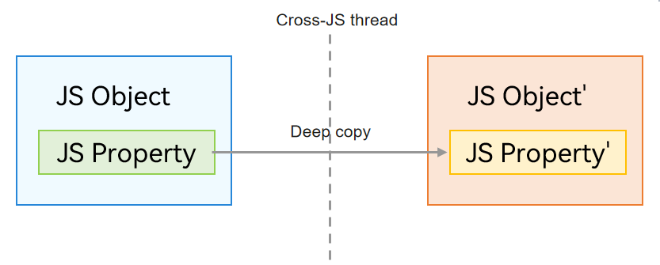

# Regular Object

Regular objects are passed by copy between threads. The objects in the two threads have the same content but point to isolated memory areas in their respective threads, allocated in the local heap of each thread's virtual machine. For example, objects defined by the ECMAScript 262 specification, such as Object, Array, and Map, use this method to communicate across concurrent instances. The following figure shows the communication process.



> **NOTE**
>
> Regular class instances are passed by copy across threads, which means only data is passed, and any methods associated with the class instances are lost. To enable class instances to retain their methods when being passed across threads, you can use the [@Sendable decorator](./arkts-sendable.md#sendable decorator) to mark the class as Sendable.

## Usage Example

The following is a simple example of passing a regular object.

```ts
// Test.ets
// Custom class TestA.
export class TestA {
  constructor(name: string) {
    this.name = name;
  }
  name: string = 'ClassA';
}
```

```ts
// Index.ets
import { taskpool } from '@kit.ArkTS';
import { BusinessError } from '@kit.BasicServicesKit';
import { TestA } from './Test';

@Concurrent
async function test1(arg: TestA) {
  console.info("TestA name is: " + arg.name);
}

@Entry
@Component
struct Index {
  @State message: string = 'Hello World';

  build() {
    RelativeContainer() {
      Text(this.message)
        .id('HelloWorld')
        .fontSize(50)
        .fontWeight(FontWeight.Bold)
        .alignRules({
          center: { anchor: '__container__', align: VerticalAlign.Center },
          middle: { anchor: '__container__', align: HorizontalAlign.Center }
        })
        .onClick(() => {
          // 1. Create a test instance objA.
          let objA = new TestA("TestA");
          // 2. Create a task and transfer objA to the task. objA is not a Sendable object and is transferred to the child thread through serialization.
          let task = new taskpool.Task(test1, objA);
          // 3. Execute the task.
          taskpool.execute(task).then(() => {
            console.info("taskpool: execute task success!");
          }).catch((e:BusinessError) => {
            console.error(`taskpool: execute task: Code: ${e.code}, message: ${e.message}`);
          })
        })
    }
    .height('100%')
    .width('100%')
  }
}
```
