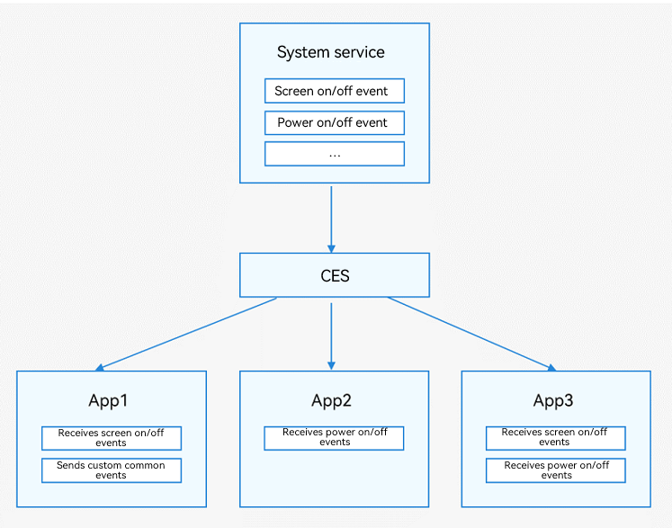

# Introduction to Common Events

Common Event Service (CES) is provided for applications to subscribe to, publish, and unsubscribe from common events.

## Classification
Common events are classified into system common events and custom common events.

- System common events: defined in CES. Currently, only system applications and system services can publish system common events, such as HAP installation, update, and uninstall. For details about the supported system common events, see [System Common Events](../../reference/apis-basic-services-kit/common_event/commonEventManager-definitions.md).
- Custom common events: customized by applications to implement cross-process event communication.

Common events are also classified into unordered, ordered, and sticky common events.

- Unordered common events: common events that CES forwards regardless of whether subscribers receive the events and when they subscribe to the events.
- Ordered common events: common events that CES forwards based on the subscriber priority. CES preferentially forwards an ordered common event to the subscriber with higher priority, waits until the subscriber receives the event, and then forwards the events to the subscriber with lower priority. Subscribers with the same priority receive common events in a random order.
- Sticky common events: common events that can be sent to a subscriber before or after they initiate a subscription. Only system applications and system services can send sticky common events, which remain in the system after being sent. The sends must first request the `ohos.permission.COMMONEVENT_STICKY` permission. For details, see [Declaring Permissions](../../security/AccessToken/declare-permissions.md).

## Working Principles
Each application can subscribe to common events as required. After your application subscribes to a common event, the system sends it to your application every time the event is published. Such an event may be published by the system, other applications, or your own application.

<!--Del-->
The common event service provides two subscription modes: dynamic and static. The biggest difference between these two modes is that dynamic subscription requires the application to be running, while static subscription does not.

- In dynamic subscription mode, a subscriber subscribes to common events by calling an API during the running period. For details, see [Subscribing to Common Events in Dynamic Mode](common-event-subscription.md).

- In static subscription mode, a subscriber subscribes to common events by configuring a declaration file and implementing a class that inherits from **StaticSubscriberExtensionAbility**. For details, see [Subscribing to Common Events in Static Mode](common-event-static-subscription.md).
<!--DelEnd-->

**Figure 1** Common events 

## Safety Precautions

- **For public event publishers**: Without restrictions, any application can subscribe to common events and read related information. In this case, sensitive information should not be carried in common events. Restrict the receiving scope of common events through the following manners:
  - Use the **subscriberPermissions** parameter of [CommonEventPublishData](../../reference/apis-basic-services-kit/js-apis-inner-commonEvent-commonEventPublishData.md) to specify the permissions required by the subscriber.
  - Use the **bundleName** parameter of [CommonEventPublishData](../../reference/apis-basic-services-kit/js-apis-inner-commonEvent-commonEventPublishData.md) to specify the bundle name of the subscriber.
- **For common event subscribers**: After subscribing to custom common events, any application can send potential malicious common events to the subscribers. Restrict the publishing scope of common events through the following manners:
  - Use the **publisherPermission** parameter of [CommonEventSubscribeInfo](../../reference/apis-basic-services-kit/js-apis-inner-commonEvent-commonEventSubscribeInfo.md) to specify the permissions required by the publisher.
  - Use the **publisherBundleName** parameter of [CommonEventSubscribeInfo](../../reference/apis-basic-services-kit/js-apis-inner-commonEvent-commonEventSubscribeInfo.md) to specify the bundle name of the publisher.
- The name of a custom common event must be globally unique. Otherwise, this common event may conflict with other common events.
