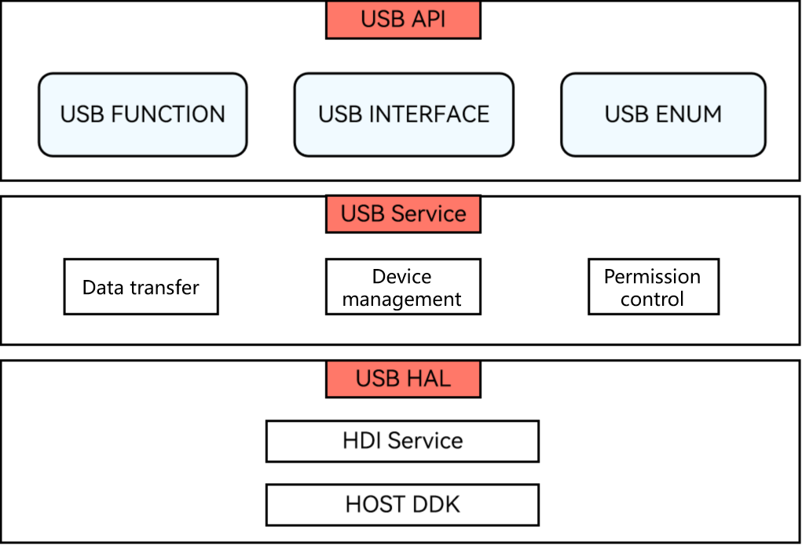

# USB Service Development Overview

## Basic Concepts

The USB service is an abstraction of underlying hardware-based USB devices. It is classified into a host and a device.
In a host, with the APIs provided by the USB service, you can obtain the list of connected USB devices, manage device access permissions, and perform data transfer or control transfer with the connected devices. In addition, for transfer modes, synchronous transfer and asynchronous transfer are available; for transfer types, interrupt transfer, isochronous transfer, and bulk transfer are supported. Before data transfer, you need to obtain the device list, verify the device access permission, enable or connect to the device, and declare the device APIs.

## Working Principles

The USB subsystem logically consists of three parts: USB API, USB Service, and USB HAL. The following figure shows how the USB service is implemented.

**Figure 1** Implementation of the USB service

- USB API: provides USB APIs that implement various basic functions, for example, query of the USB device list, bulk data transfer, control transfer, and permission control.

- USB Service: receives, parses, and distributes Hardware Abstraction Layer (HAL) data, and manages devices.

- USB HAL: provides driver capability APIs that can be directly called in user mode.
