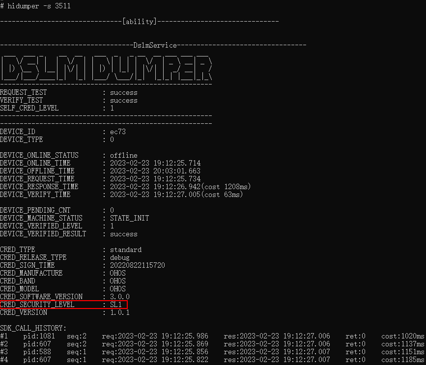

# Access Control by Device and Data Level


## Basic Concepts

Distributed data management implements access control based on data security labels and device security levels.

A higher data security label and device security level indicate stricter encryption and access control measures and higher data security.


### Data Security Labels

The data can be rated into four security levels: S1, S2, S3, and S4.

  | Risk Level| Security Level| Definition| Example| 
| -------- | -------- | -------- | -------- |
| Critical| S4 | Special data types defined by industry laws and regulations, involving the most private individual information or data that may cause severe adverse impact on an individual or group once disclosed, tampered with, corrupted, or destroyed.| Political opinions, religious and philosophical belief, trade union membership, genetic data, biological information, health and sexual life status, sexual orientation, device authentication, and personal credit card information| 
| High| S3 | Data that may cause critical adverse impact on an individual or group once disclosed, tampered with, corrupted, or destroyed.| Individual real-time precise positioning information and movement trajectory| 
| Moderate| S2 | Data that may cause major adverse impact on an individual or group once disclosed, tampered with, corrupted, or destroyed.| Detailed addresses and nicknames of individuals| 
| Low| S1 | Data that may cause minor adverse impact on an individual or group once disclosed, tampered with, corrupted, or destroyed.| Gender, nationality, and user application records| 


### Device Security Levels
<!--RP1-->
Device security levels are classified into SL1 to SL5 based on devices' security capabilities, for example, whether a Trusted Execution Environment (TEE) or a secure storage chip is available. For example, the development boards RK3568 and Hi3516 are SL1 (lower security) devices, and tablets are SL4 (higher security) devices.

During device networking, you can run the **hidumper -s 3511** command to query the device security level. The following example shows how to query the security level of the RK3568 board:
<!--RP1End-->
<!--Del-->

<!--DelEnd-->

## Access Control Mechanism in Cross-Device Sync

In cross-device data sync, data access is controlled based on the device security level and data security labels. In principle, data can be synced only to the devices whose data security labels are not higher than the device's security level. The access control matrix is as follows:

|Device Security Level|Data Security Labels of the Synchornizable Device|
|---|---|
|SL1|S1|
|SL2|S1 to S2|
|SL3|S1 to S3|
|SL4|S1 to S4|
|SL5|S1 to S4| 
<!--RP2-->
For example, the security level of development boards RK3568 and Hi3516 is SL1. The database with data security label S1 can be synced with RK3568 and Hi3516, but the databases with database labels S2-S4 cannot.
<!--RP2End-->

## When to Use

The access control mechanism ensures secure data storage and sync across devices. When creating a database, you need to correctly set the security level for the database.


## Setting the Security Level for a KV Store

When a KV store is created, the **securityLevel** parameter specifies the security level of the KV store. The following example shows how to create a KV store with security level of S3.

For details about the APIs, see [Distributed KV Store](../reference/apis-arkdata/js-apis-distributedKVStore.md).
> **NOTE**
>
> For the scenarios involving a single device, you can upgrade the security level of a KV store by modifying the **securityLevel** parameter. When upgrading the database security level, observe the following:
> * This operation does not apply to the databases that require cross-device sync. Data cannot be synced between databases of different security levels. If you want to upgrade the security level of a database that requires cross-device sync, you are advised to create a database of a higher security level.
> * You need to close the database before modifying the **securityLevel** parameter, and open it after the security level is upgraded.
> * You cannot downgrade the database security level. For example, you can change the database security level from S2 to S3, but cannot change it from S3 to S2.

  
```ts
import { distributedKVStore } from '@kit.ArkData';
import { BusinessError } from '@kit.BasicServicesKit';

let kvManager: distributedKVStore.KVManager;
let kvStore: distributedKVStore.SingleKVStore;
let context = getContext(this);
const kvManagerConfig: distributedKVStore.KVManagerConfig = {
  context: context,
  bundleName: 'com.example.datamanagertest'
}
try {
  kvManager = distributedKVStore.createKVManager(kvManagerConfig);
  console.info('Succeeded in creating KVManager.');
  try {
    const options: distributedKVStore.Options = {
      createIfMissing: true,
      encrypt: true,
      backup: false,
      autoSync: false,
      kvStoreType: distributedKVStore.KVStoreType.SINGLE_VERSION,
      securityLevel: distributedKVStore.SecurityLevel.S3
    };
    kvManager.getKVStore<distributedKVStore.SingleKVStore>('storeId', options, (err, store: distributedKVStore.SingleKVStore) => {
      if (err) {
        console.error(`Failed to get KVStore. Code:${err.code},message:${err.message}`);
        return;
      }
      console.info('Succeeded in getting KVStore.');
      kvStore = store;
    });
  } catch (e) {
    let error = e as BusinessError;
    console.error(`An unexpected error occurred. Code:${error.code},message:${error.message}`);
  }
} catch (e) {
  let error = e as BusinessError;
  console.error(`Failed to create KVManager. Code:${error.code},message:${error.message}`);
}
```

## Setting the Security Level for an RDB Store 

When an RDB store is created, the **securityLevel** parameter specifies the security level of the RDB store. The following example shows how to create an RDB store with security level of S3.

For details about the APIs, see [RDB Store](../reference/apis-arkdata/js-apis-data-relationalStore.md).


  
```ts
import { BusinessError } from '@kit.BasicServicesKit';
import { relationalStore } from '@kit.ArkData';

let store: relationalStore.RdbStore;
let context = getContext(this);
const STORE_CONFIG: relationalStore.StoreConfig = {
  name: 'RdbTest.db',
  securityLevel: relationalStore.SecurityLevel.S3
};
let promise = relationalStore.getRdbStore(context, STORE_CONFIG);
promise.then(async (rdbStore) => {
  store = rdbStore;
  console.info('Succeeded in getting RdbStore.')
}).catch((err: BusinessError) => {
  console.error(`Failed to get RdbStore. Code:${err.code},message:${err.message}`);
})
```
