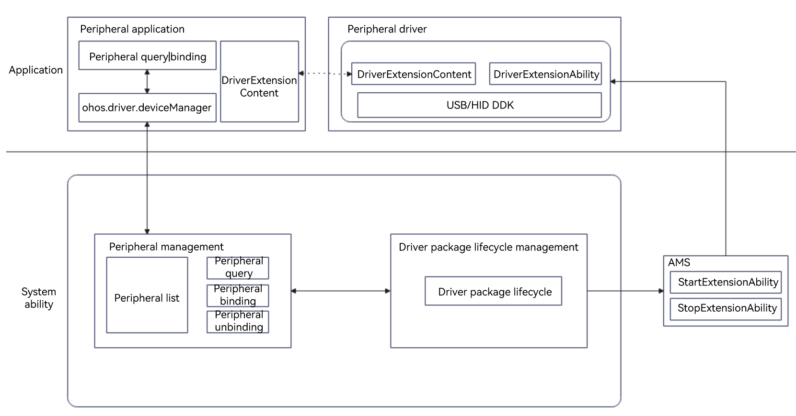

# Introduction to Driver Development Kit
Driver Development Kit provides easy-to-use APIs to elevate your app experience in developing peripheral extension drivers, which bring ultimate plug-and-play experience to users.

1. You can develop advanced peripheral functions to meet user requirements.

2. The extended driver framework supports lifecycle management of peripheral extension drivers and provides APIs for querying and binding peripheral devices.

## When to Use
You can use Driver Development Kit to:

1. Develop drivers of dedicated peripherals for bank counters, enterprise office, and medical detection, such as high-speed document scanners, ID card scanners, fingerprint scanners, and blood oxygen and blood glucose meters.

2. Develop enhanced functions of non-standard peripherals, such as customizing handwriting pad shortcut keys, setting the pressure sensing/drawing area, setting extended enhancement capabilities, setting the mouse lighting effect, customizing mouse extended buttons, and setting DPI and X and Y axes.

## Working Principles

The HDF extended driver framework provides HDF-DDK for user-mode peripheral driver development.

The driver extension system ability (SA), the core service of user-mode peripheral management, performs lifecycle management of peripherals and peripheral drivers. In addition, standard ArkTS APIs are provided to query, bind, and unbind peripherals.

  **Figure 1** Peripheral driver working mechanism 

- Peripheral application: queries and binds the driver, and customizes special device-driver settings.
- Peripheral extension driver (application): dedicated peripheral extension driver or enhanced peripheral driver developed using HDF-DDK.
- Driver extension SA: performs lifecycle management of peripheral devices and driver packages.
