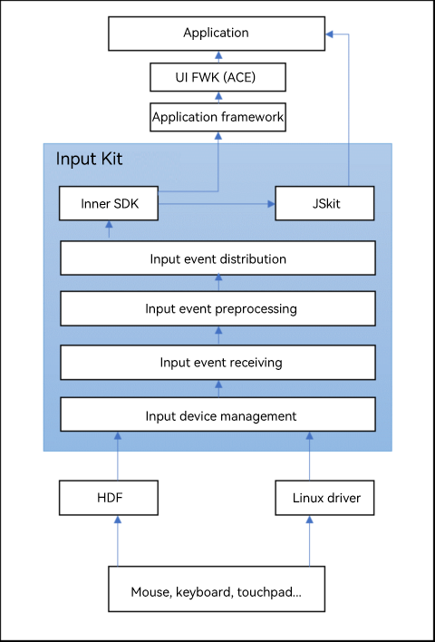

# Introduction to Input Kit

## Function Description

Input Kit provides services for a plurality of input devices, such as the touchpad, touchscreen, mouse, and keyboard. It normalizes various input events to ensure unified and smooth experience for users when interacting with different input devices. In addition to the basic input event services, Input Kit allows you to obtain the device list and change the mouse pointer style.

 

## How Input Kit Works
As a basic service provided by the system for applications, Input Kit fulfills input device management as well as input event receiving, preprocessing, and distribution, and reports the input events to applications through the inner SDK and JSkit. The operation mechanism is as follows:

<!--Del-->
## Constraints

1. Before using the following functions, declare the corresponding permissions.

  | API | Description| Permission|
  | ------------------------------------------------------------ | -------------------------- |-----|
  | setShieldStatus(shieldMode: ShieldMode, isShield: boolean): void | Sets the key shielding status.|ohos.permission.INPUT_CONTROL_DISPATCHING|
  | getShieldStatus(shieldMode: ShieldMode): boolean | Checks whether key shielding is enabled.|ohos.permission.INPUT_CONTROL_DISPATCHING|
    
2. The APIs provided by the [inputConsumer](inputconsumer-guidelines.md), [inputEventClient](inputeventclient-guidelines.md), [inputMonitor](inputmonitor-guidelines.md), and [shortKey](shortkey-guidelines.md) modules are system APIs. Wherein, the APIs provided by the [inputMonitor](inputmonitor-guidelines.md) module require the **ohos.permission.INPUT_MONITORING** permission.

<!--DelEnd-->
