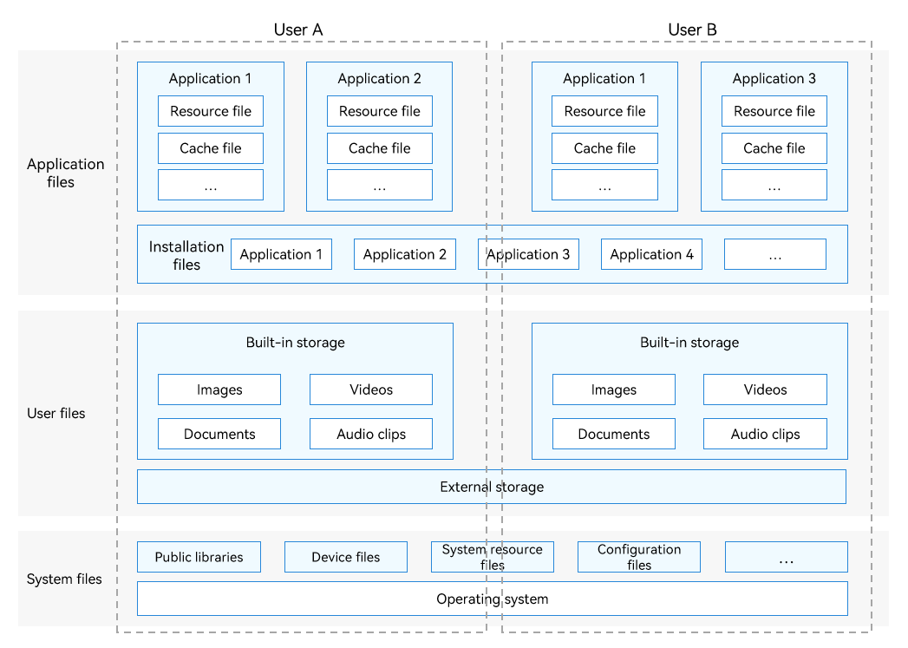

# File Management Overview

The data in an operating system (OS) can be classified into the following types based on the data structure:

- Structured data: data that can be defined in a unified data model and is generally stored in a database. In OpenHarmony application development, the management of structured data is implemented by the [data management module](../database/data-mgmt-overview.md).

- Unstructured data: data that does not conform to any predefined data structure or model and cannot be easily presented in two-dimensional database tables. Unstructured data includes files in a variety of formats, such as documents, images, videos, and audio clips. In OpenHarmony application development, the management of unstructured data is implemented by the file management module, which will be elaborated in this document.

In the file management module, the files can be classified into the following types based on the file owner:

- [Application files](app-file-overview.md): files of an application, including the installation files, resource files, and cache files of the application.

- [User files](user-file-overview.md): files of a user who has logged in to the device. User files include the user's images, videos, audio clips, and documents.

- System files: files irrelevant to applications and users. System files include public libraries, device files, and system resource files. The system files do not need to be managed by developers and are not described in this document.

The file systems can be classified into the following types based on the file storage location (data source location):

- Local file system: allows access to the files stored on a device and its external storage devices (such as USB flash drives and removable hard drives). The local file system is the most basic file system and is not described in this document.

- [Distributed file system](distributed-fs-overview.md): allows access to files across devices, which include not only the local device and its external storage devices, but also the devices connected over a computer network.

**Figure 1** Files in an OS

##  

 

-  
