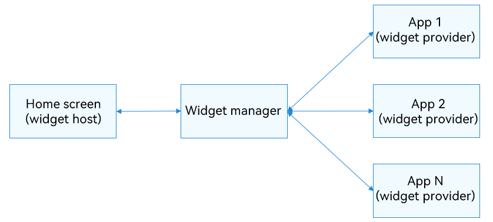

# Introduction to Form Kit
Form Kit provides a development framework and APIs for embedding application information into system entries like the home screen and lock screen. It can extract key user information or frequent operations into service widgets (referred to as "widgets"), which can be added to the home screen for easy access to information and direct service interactions.

## Scenarios for Widget Usage
- Devices supported: Widgets can be used on devices such as phones and tablets.
- Type supported: Both applications and atomic services can develop widgets.
- Widget location: Widgets can be added to system applications such as the home screen and lock screen. Currently, they cannot be embedded in common applications.

## Widget Architecture
**Figure 1** Widget architecture 

**Fundamental Concepts in Widget Usage Scenarios**
- Widget host: an application that displays the widget content and controls the widget location. It enables direct user interactions and manages widget addition, deletion, and display. An example is the home screen in the preceding figure.
- Widget provider: an application or atomic service that provides the widget. It is responsible for implementing the widget features, including designing the UI, updating data, and handling click interactions.

- Widget manager: a system service within the operating system that manages all widget information on the device. As a bridge between widget providers and hosts, it offers capabilities such as querying, adding, and deleting widget information to the hosts, and provides notifications like widget addition, deletion, refresh, and click events to the providers.

Below is the typical procedure of using a widget:

**Figure 2** Typical procedure of using a widget

1. Touch and hold an application icon on the home screen to display the shortcut menu.
2. Touch **Service widget** to access the preview screen.
3. Touch the **Add to home** button. The widget is then added to the home screen.

## Features
- Information display: Key information from applications or atomic services is displayed on the home screen as widgets. The information can be updated periodically so that users can view relevant information at any time.

- Instant service access: Users can perform quick actions by touching buttons within the widget and can also navigate to the corresponding functional pages of the application or atomic service, achieving seamless one-step service access.

## Development Modes

**Choosing the Application Model**

The system currently supports two application development models: stage and FA. Consequently, Form Kit accommodates both models for widget development, with a preference for the stage model.

**Choosing the UI Development Paradigm**
- The stage model allows for two UI development paradigms for widgets: ArkTS-based declarative development paradigm (for developing ArkTS widgets) and web-like development paradigm (for developing JS widgets).
- The FA model supports only the development of JS widgets with the web-like development paradigm.

ArkTS widgets and JS widgets have different implementation principles and features. The following table lists the differences in capabilities.

| Category        | JS Widget   | ArkTS Widget |
| ------------ | --------- | ---------- |
| Development paradigm    | Web-like paradigm| Declarative paradigm|
| Component capability    | Supported     | Supported      |
| Layout capability    | Supported     | Supported      |
| Event capability    | Supported     | Supported      |
| Custom animation  | Not supported   | Supported      |
| Custom drawing  | Not supported   | Supported      |
| Logic code execution| Not supported   | Supported      |

## Related Kits
- Ability Kit: Form Kit relies on the Extension abilities of Ability Kit for its internal implementation and interacts with Ability Kit during lifecycle scheduling.
- ArkUI: Form Kit widget hosts can use some components, events, animations, and state management capabilities provided by ArkUI on their pages.

## Constraints
**Constraints on UI Capabilities**

Given the limited size of widgets, they are designed to convey straightforward and unambiguous information and support simple interactions. As a result, the scope of UI components and animation features available for use in widget development are somewhat restricted.

**Constraints on Motion Capabilities**

Widgets offer the functionality for applications and atomic services to maintain a constant presence for information display and updates on interfaces like the home screen. However, the system enforces specific constraints on the frequency of updates and the operational capabilities of widgets running in the background.
