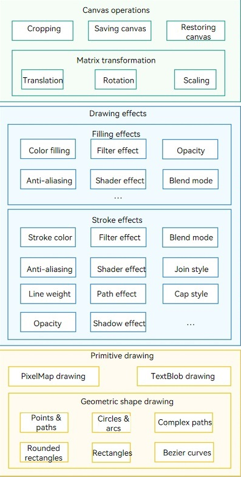
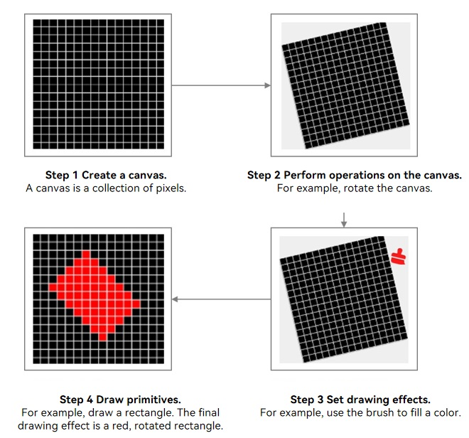

# Overview of Graphics Drawing and Display

## When to Use

During app development, you need to draw different elements. You can directly use the ArkUI component to draw desired elements or effects. However, some custom graphics or effects cannot meet your requirements. In this case, you can use Drawing to flexibly customize drawing effects. In addition, the ArkUI component can be directly displayed on the screen, while the Drawing component focuses more on drawing and depends on other modules to display the drawing result on the screen.

## Drawing Capability Scope and Implementation Process

Figure 1 Graphics drawing capabilities

ArkGraphics 2D provides a series of flexible graphics drawing APIs based on the 2D image rendering engine. The capabilities include canvas operations, drawing effect, and primitive drawing. The preceding figure shows the key capabilities supported by each part. More capabilities may be supported in the future and will not be described here. For details, see the corresponding API reference document.

Canvas operations, drawing effects, and primitive drawing are also key steps and processes for drawing a graph. For details, see the following figure.

FIG. 2 Implementation process of drawing a graph

The 2D graphics drawing process is similar to the actual drawing process. The preceding figure shows the graphics drawing process by using the drawing of a rotated red filled rectangle as an example. The implementation process is as follows:

1. (Mandatory) Create a canvas. The canvas is the most basic and critical for drawing graphics. Before drawing a graph, you need to create a canvas to ensure that the graph can be carried. Then, you can perform subsequent settings and operations.

2. (Optional) Perform operations on the canvas. After creating a canvas, you can perform operations on the canvas, such as cropping, rotation, and scaling. This step is optional. You can perform operations on the canvas based on the scenario requirements.

3. (Optional) Set the drawing effects. The drawing effect is implemented by using the brush and pen. The pen is used for the outline of a graph, and the brush is used for the internal area of the graph. You can use brushes and pens to implement various filling and stroke effects. You can set related effects based on the UI effect and requirements. If you do not set the drawing effect, the default drawing effect is used.

4. (Mandatory) Draw primitives. The last step of drawing a diagram is to draw primitives. No matter how complex a diagram is, it is a combination of primitives. Currently, ArkGraphics 2D supports drawing of multiple primitives. After creating a canvas and performing related operations and settings, you can select the corresponding primitive to complete the entire drawing process.

## Displaying Drawing Results

The preceding content describes the main drawing capabilities and implementation process of ArkGraphics 2D based on the 2D image rendering engine. After the drawing is complete based on the canvas, the drawing result needs to be displayed on the screen to implement the graphical UI content visible on the screen.

Currently, the drawing dependency can be displayed in either of the following modes:

1. Display on the screen using [RenderNode](../reference/apis-arkui/js-apis-arkui-renderNode.md) (ArkTS): Use RenderNode to obtain Canvas for drawing. RenderNode displays the drawing result on the screen. For details, see [Obtaining a Canvas and Displaying Drawing Results (ArkTS)](canvas-get-result-draw-arkts.md#obtaining-the-canvas-that-can-be-directly-displayed).

2. Display on the screen by using the XComponent (C/C++): Create a canvas, perform drawing, and copy the drawing result to the buffer. The XComponent displays the drawing result on the screen. For details, see [Obtaining a Canvas and Displaying Drawing Results (C/C++)](canvas-get-result-draw-c.md#obtaining-the-canvas-that-can-be-directly-displayed).

## Relationship with the Canvas Component

[Canvas component](../reference/apis-arkui/arkui-ts/ts-components-canvas-canvas.md) has the self-drawing capability. Currently, there are two sets of APIs: [CanvasRenderingContext2D](../reference/apis-arkui/arkui-ts/ts-canvasrenderingcontext2d.md)/[OffscreenCanvasRenderingContext2D](../reference/apis-arkui/arkui-ts/ts-offscreencanvasrenderingcontext2d.md) and [DrawingRenderingContext](../reference/apis-arkui/arkui-ts/ts-drawingrenderingcontext.md). The content drawn by an application using the two sets of APIs can be displayed on the bound Canvas component.

**CanvasRenderingContext2D** encapsulates the native Drawing APIs based on the W3C standard, which facilitates the reuse of the drawing logic of web applications. Therefore, **CanvasRenderingContext2D** is applicable to scenarios such as web applications and games, prototyping, data visualization, online drawing boards, teaching tools, and creative applications.

[Canvas component](../reference/apis-arkui/arkui-ts/ts-components-canvas-canvas.md) The bottom layer also uses the native drawing interface to implement the drawing function. There is no essential difference between the two drawing capabilities. However, due to the implementation of multi-layer encapsulation, the Canvas component is not as close to the hardware as the native drawing API. Therefore, the Canvas component is applicable to scenarios with high performance requirements, complex drawing, and strong hardware dependency, such as professional graphics processing software, home screen applications, and mobile applications, when the Canvas component is used for drawing, performance problems such as frame freezing and frame loss may occur. In this case, you can use the self-drawing capability of the native drawing API to ensure the drawing performance of the application.

## Constraints

In a graphic drawing process, a unit used is a pixel unit px.

<!--RP1--><!--RP1End-->
