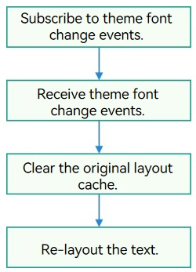
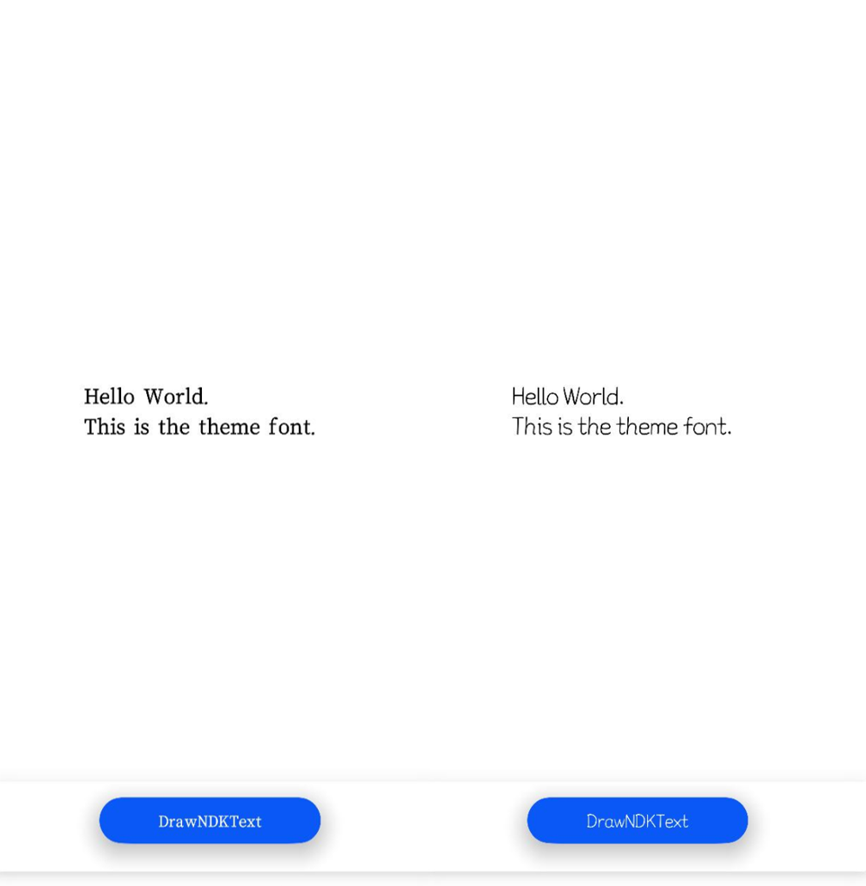

# Using Theme Fonts (C/C++)


## When to Use

Theme fonts refer to the fonts that can be used in system theme applications. They are special custom fonts. You can call related APIs to enable the theme font in the theme application.


## Implementation Mechanism



To switch the subject word, the app must subscribe to the subject word change event. After receiving the font change event, the app proactively calls the page refresh API to switch the subject word. Otherwise, the subject word takes effect only after the app is restarted. To draw the theme font, you need to use OH_Drawing_GetFontCollectionGlobalInstance to obtain the global font set object. Only the object returned by this API has the theme font information.

> **NOTE**
>
> The font set object created by OH_Drawing_CreateSharedFontCollection does not contain the subject word information and cannot be used to draw the subject word.


## Available APIs

The following table lists the common APIs for registering and using theme fonts. For details about the APIs, see [Drawing](../reference/apis-arkgraphics2d/_drawing.md).

| API| Description|
| -------- | -------- |
| OH_Drawing_FontCollection\* OH_Drawing_GetFontCollectionGlobalInstance(void) | Obtains the global font set object OH_Drawing_FontCollection.|
| [onConfigurationUpdate()](../reference/apis-ability-kit/js-apis-app-ability-ability.md#abilityonconfigurationupdate) | Called when the configuration of the environment where the FormExtensionAbility is running is updated.<br>Currently, the theme application provides only the ArkTS API to publish change events. The application needs to process the events for cross-language calling.|


## How to Develop

1. Make sure that you can apply a theme font in the system theme app.

2. Overwrite the onConfigurationUpdate function in the app entry file (EntryAbility.ets in the default project) to respond to fontId changes and adapt to theme font switching and page refreshing.

   ```c++
   // entryability/EntryAbility.ets
   export default class EntryAbility extends UIAbility {
       // ...  
       preFontId ="";
       onConfigurationUpdate(newConfig: Configuration):void{
           let fontId = newConfig.fontId;
           if(fontId && fontId !=this.preFontId){
               this.preFontId = fontId;
               // Invoke the C++ code.
           }
       }
       // ...
   };
   ```

   When newConfig changes, the onConfigurationUpdate function is automatically triggered. The application may obtain the fontId from the sent configuration information, and determine whether the fontId is the same as the fontId stored locally in the application to identify the switching of the subject word. If they are inconsistent, the local font ID is updated and the C++ code is called to update the typesetting result.

3. This step and the following steps describe how to use the theme font on the C++ side. The calling path from ArkTS to C++ needs to be selected based on the actual situation. This example is not recommended.

   Import the header file.
   
   ```c++
   #include <native_drawing/drawing_font_collection.h>
   #include <native_drawing/drawing_text_typography.h>
   #include <native_drawing/drawing_register_font.h>
   #include "common/log_common.h"
   ```
   
4. Creates a font manager.

   > **NOTE**
   >
   > The registered theme font is used for the global object of the font management set. Therefore, you must use OH_Drawing_GetFontCollectionGlobalInstance to obtain the global font set object for drawing. If you use OH_Drawing_CreateSharedFontCollection or OH_Drawing_CreateFontCollection to create a font set object, the theme font cannot be used. The global font set obtained by calling OH_Drawing_GetFontCollectionGlobalInstance cannot be released. Otherwise, the font drawing will be disordered.

   ```c++
   OH_Drawing_FontCollection *fontCollection = OH_Drawing_GetFontCollectionGlobalInstance();
   ```

5. The OH_Drawing_SetTextStyleFontFamilies() interface can be used to specify familyName so that the specified font can be used. However, to use the theme font, you do not need to use the OH_Drawing_SetTextStyleFontFamilies() interface to specify the font. Otherwise, the specified font instead of the theme font is used.

   ```c++
   OH_Drawing_TextStyle textStyle = OH_Drawing_CreateTextStyle();
   // const char* myFontFamilies[] = {"otherFontFamilyName"};
   // Do not use this interface to specify the font.
   // OH_Drawing_SetTextStyleFontFamilies(textStyle, 1, myFontFamilies);
   ```

6. Set the paragraph text to Hello World. \nThis is the theme font.". In this case, the text of the paragraph will use the theme font.

   ```c++
   // Set other text styles.
   OH_Drawing_SetTextStyleColor(textStyle , OH_Drawing_ColorSetArgb(0xFF, 0x00, 0x00, 0x00));
   OH_Drawing_SetTextStyleFontSize(textStyle , 70.0);
   // Create a paragraph style object to set the typesetting style.
   OH_Drawing_TypographyStyle *typographyStyle = OH_Drawing_CreateTypographyStyle();
   OH_Drawing_SetTypographyTextAlign(typographyStyle, TEXT_ALIGN_LEFT); //: sets the paragraph style to left alignment.
   // Create a paragraph generator.
   OH_Drawing_TypographyCreate* handler = OH_Drawing_CreateTypographyHandler(typographyStyle, fontCollection);
   // Set the text style in the paragraph generator.
   OH_Drawing_TypographyHandlerPushTextStyle(handler, textStyle);
   // Set the text content in the paragraph generator.
   const char* text = "Hello World. \nThis is the theme font.";
   OH_Drawing_TypographyHandlerAddText(handler, text);
   // Generate a paragraph using the paragraph generator.
   OH_Drawing_Typography* typography = OH_Drawing_CreateTypography(handler);
   ```


## Effect

The following figure shows the text rendering effect after you switch between different theme fonts in the system theme application.

The font display effect varies depending on the theme. The following is only an example.


