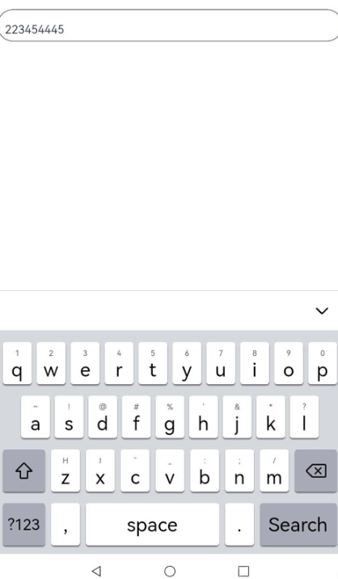

# Using the Input Method in a Custom Edit Box

In the inputmethod framework, use [getController](../reference/apis-ime-kit/js-apis-inputmethod.md#inputmethodgetcontroller9) to obtain the [InputMethodController](../reference/apis-ime-kit/js-apis-inputmethod.md#inputmethodcontroller) instance for binding the input method and listening to various events of the input method application, such as insertion, deletion, selection, and cursor movement. In this way, the input method can be used in the custom edit box, implementing more flexible and free editing operations.

## How to Develop

1. In your project in DevEco Studio, create an .ets file and name it the name of the target custom component, for example, **CustomInput**. Define a custom component in the file, and import **inputMethod** from @kit.IMEKit.

   ```ets
   import { inputMethod } from '@kit.IMEKit';
   
   @Component
   export struct CustomInput {
     build() {
     }
   }
   ```

2. In the component, use the **Text** component to show the text in the custom edit box, and the **inputText** state variable to specify the text to display in the text input box.

   ```ets
   import { inputMethod } from '@kit.IMEKit';
   
   @Component
   export struct CustomInput {
     @State inputText: string = ''; // Specify the text to display in the text input box.
     
     build() {
       Text(this.inputText) // Use the Text component to show the text in the custom edit box.
         .fontSize(16)
         .width('100%')
         .lineHeight(40)
         .id('customInput')
         .height(45)
         .border({ color: '#554455', radius: 30, width: 1 })
         .maxLines(1)
     }
   }
   ```

3. Obtain an **inputMethodController** instance from the component, call the **attach** API of the instance to bind and start the soft keyboard when the text input box is clicked, and register listeners for text input operations, such as listeners for text insertion and removal in this example.

   ```ets
   import { inputMethod } from '@kit.IMEKit';
   
   @Component
   export struct CustomInput {
     @State inputText: string = ''; // Specify the text to display in the text input box.
     private isAttach: boolean = false;
     private inputController: inputMethod.InputMethodController = inputMethod.getController();
   
     build() {
       Text(this.inputText) // Use the Text component to show the text in the custom edit box.
         .fontSize(16)
         .width('100%')
         .lineHeight(40)
         .id('customInput')
         .onBlur(() => {
           this.off();
         })
         .height(45)
         .border({ color: '#554455', radius: 30, width: 1 })
         .maxLines(1)
         .onClick(() => {
           this.attachAndListener(); // Click the component.
         })
     }
   
     async attachAndListener() { // Bind and set a listener.
       focusControl.requestFocus('CustomInput');
       await this.inputController.attach(true, {
         inputAttribute: {
           textInputType: inputMethod.TextInputType.TEXT,
           enterKeyType: inputMethod.EnterKeyType.SEARCH
         }
       });
       if (!this.isAttach) {
         this.inputController.on('insertText', (text) => {
           this.inputText += text;
         })
         this.inputController.on('deleteLeft', (length) => {
           this.inputText = this.inputText.substring(0, this.inputText.length - length);
         })
         this.isAttach = true;
       }
     }

     off() {
       this.isAttach = false;
       this.inputController.off('insertText');
       this.inputController.off('deleteLeft');
     }
   }
   ```

4. Import the component to the application UI layout. In this example, the **Index.ets** and **CustomInput.ets** files are in the same directory.

   ```ets
   import { CustomInput } from './CustomInput'; // Import the component.
   
   @Entry
   @Component
   struct Index {
   
     build() {
       Column() {
         CustomInput() // Use the component.
       }
     }
   }
   ```

   ## Effect
  
