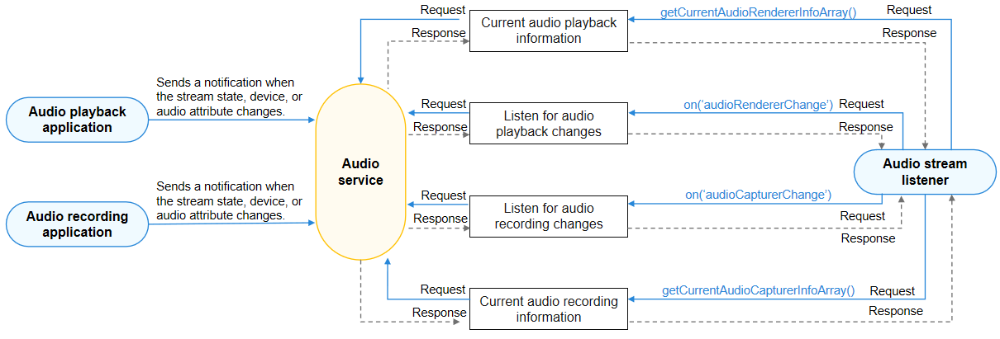

# Audio Recording Stream Management

An audio recording application must notice audio stream state changes and perform corresponding operations. For example, when detecting that the user stops recording, the application must notify the user that the recording finishes.

## Reading or Listening for Audio Stream State Changes in the Application

Create an AudioCapturer by referring to [Using AudioCapturer for Audio Recording](using-audiocapturer-for-recording.md) or [audio.createAudioCapturer](../reference/apis/js-apis-audio.md#audiocreateaudiocapturer8). Then obtain the audio stream state changes in either of the following ways:

- Check the [state](../reference/apis/js-apis-audio.md#attributes) of the AudioCapturer.
    
  ```ts
  let audioCapturerState = audioCapturer.state;
  console.info(`Current state is: ${audioCapturerState }`)
  ```

- Register **stateChange** to listen for state changes of the AudioCapturer.
    
  ```ts
  audioCapturer.on('stateChange', (capturerState) => {
    console.info(`State change to: ${capturerState}`)
  });
  ```

The application then performs an operation, for example, displays a message indicating the end of the recording, by comparing the obtained state with [AudioState](../reference/apis/js-apis-audio.md#audiostate8).

## Reading or Listening for Changes in All Audio Streams

If an application needs to obtain the change information about all audio streams, it can use **AudioStreamManager** to read or listen for the changes of all audio streams.

> **NOTE**
> 
> The audio stream change information marked as the system API can be viewed only by system applications.

The figure below shows the call relationship of audio stream management.



During application development, first use **getStreamManager()** to create an **AudioStreamManager** instance. Then call **on('audioCapturerChange')** to listen for audio stream changes and obtain a notification when the audio stream state or device changes. To cancel the listening for these changes, call **off('audioCapturerChange')**. You can call **getCurrentAudioCapturerInfoArray()** to obtain information such as the unique ID of the recording stream, UID of the recording stream client, and stream status.

For details about the APIs, see [AudioStreamManager](../reference/apis/js-apis-audio.md#audiostreammanager9).


## How to Develop

1. Create an **AudioStreamManager** instance.
   
     Before using **AudioStreamManager** APIs, you must use **getStreamManager()** to create an **AudioStreamManager** instance.
     
   ```ts
   import audio from '@ohos.multimedia.audio';
   let audioManager = audio.getAudioManager();
   let audioStreamManager = audioManager.getStreamManager();
   ```

2. Use **on('audioCapturerChange')** to listen for audio recording stream changes. If the application needs to receive a notification when the audio recording stream state or device changes, it can subscribe to this event.
     
   ```ts
   audioStreamManager.on('audioCapturerChange', (AudioCapturerChangeInfoArray) =>  {
     for (let i = 0; i < AudioCapturerChangeInfoArray.length; i++) {
       console.info(`## CapChange on is called for element ${i} ##`);
       console.info(`StreamId for ${i} is: ${AudioCapturerChangeInfoArray[i].streamId}`);
       console.info(`Source for ${i} is: ${AudioCapturerChangeInfoArray[i].capturerInfo.source}`);
       console.info(`Flag  ${i} is: ${AudioCapturerChangeInfoArray[i].capturerInfo.capturerFlags}`);
       let devDescriptor = AudioCapturerChangeInfoArray[i].deviceDescriptors;
       for (let j = 0; j < AudioCapturerChangeInfoArray[i].deviceDescriptors.length; j++) {
         console.info(`Id: ${i} : ${AudioCapturerChangeInfoArray[i].deviceDescriptors[j].id}`);
         console.info(`Type: ${i} : ${AudioCapturerChangeInfoArray[i].deviceDescriptors[j].deviceType}`);
         console.info(`Role: ${i} : ${AudioCapturerChangeInfoArray[i].deviceDescriptors[j].deviceRole}`);
         console.info(`Name: ${i} : ${AudioCapturerChangeInfoArray[i].deviceDescriptors[j].name}`);
         console.info(`Address: ${i} : ${AudioCapturerChangeInfoArray[i].deviceDescriptors[j].address}`);
         console.info(`SampleRates: ${i} : ${AudioCapturerChangeInfoArray[i].deviceDescriptors[j].sampleRates[0]}`);
         console.info(`ChannelCounts ${i} : ${AudioCapturerChangeInfoArray[i].deviceDescriptors[j].channelCounts[0]}`);
         console.info(`ChannelMask: ${i} : ${AudioCapturerChangeInfoArray[i].deviceDescriptors[j].channelMasks}`);
       }
     }
   });
   ```

3. (Optional) Use **off('audioCapturerChange')** to cancel listening for audio recording stream changes.
     
   ```ts
   audioStreamManager.off('audioCapturerChange');
   console.info('CapturerChange Off is called');
   ```

4. (Optional) Call **getCurrentAudioCapturerInfoArray()** to obtain information about the current audio recording stream.
   
     This API can be used to obtain the unique ID of the audio recording stream, UID of the audio recording client, audio status, and other information about the AudioCapturer.
   > **NOTE**
   > 
   > Before listening for state changes of all audio streams, the application must request the **ohos.permission.USE_BLUETOOTH** [permission](../security/accesstoken-guidelines.md), for the device name and device address (Bluetooth related attributes) to be displayed correctly.

   ```ts
   async function getCurrentAudioCapturerInfoArray(){
     await audioStreamManager.getCurrentAudioCapturerInfoArray().then( function (AudioCapturerChangeInfoArray) {
       console.info('getCurrentAudioCapturerInfoArray  Get Promise Called ');
       if (AudioCapturerChangeInfoArray != null) {
         for (let i = 0; i < AudioCapturerChangeInfoArray.length; i++) {
           console.info(`StreamId for ${i} is: ${AudioCapturerChangeInfoArray[i].streamId}`);
           console.info(`Source for ${i} is: ${AudioCapturerChangeInfoArray[i].capturerInfo.source}`);
           console.info(`Flag  ${i} is: ${AudioCapturerChangeInfoArray[i].capturerInfo.capturerFlags}`);
           for (let j = 0; j < AudioCapturerChangeInfoArray[i].deviceDescriptors.length; j++) {
             console.info(`Id: ${i} : ${AudioCapturerChangeInfoArray[i].deviceDescriptors[j].id}`);
             console.info(`Type: ${i} : ${AudioCapturerChangeInfoArray[i].deviceDescriptors[j].deviceType}`);
             console.info(`Role: ${i} : ${AudioCapturerChangeInfoArray[i].deviceDescriptors[j].deviceRole}`);
             console.info(`Name: ${i} : ${AudioCapturerChangeInfoArray[i].deviceDescriptors[j].name}`);
             console.info(`Address: ${i} : ${AudioCapturerChangeInfoArray[i].deviceDescriptors[j].address}`);
             console.info(`SampleRates: ${i} : ${AudioCapturerChangeInfoArray[i].deviceDescriptors[j].sampleRates[0]}`);
             console.info(`ChannelCounts ${i} : ${AudioCapturerChangeInfoArray[i].deviceDescriptors[j].channelCounts[0]}`);
             console.info(`ChannelMask: ${i} : ${AudioCapturerChangeInfoArray[i].deviceDescriptors[j].channelMasks}`);
           }
         }
       }
     }).catch((err) => {
       console.error(`Invoke getCurrentAudioCapturerInfoArray failed, code is ${err.code}, message is ${err.message}`);
     });
   }
   ```
