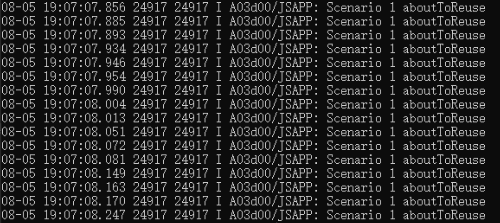
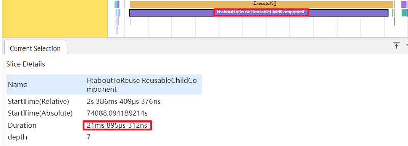
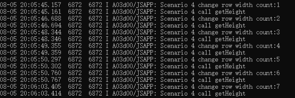

# Do not process time-consuming operations in the high-frequency callback in the sliding scenario.

## Overview
In scenarios such as sliding or frequently creating and destroying components, frame freezing and frame loss may occur. In most cases, interfaces are frequently called and time-consuming operations are performed in the interfaces. As a result, frame freezing and frame loss occur in the application, severely affecting user experience. To help developers optimize application performance and improve user experience, this document describes the following four high-frequency scenarios where time-consuming operations need to be avoided:
- Do not perform time-consuming operations in aboutToReuse during component reuse. For example, in a sliding scenario, using component reuse usually requires the lifecycle callback aboutToReuse to update the status variable of the component. During sliding, aboutToReuse is frequently called. If time-consuming operations are performed in aboutToReuse, the app will freeze and frame loss will occur.
- Do not perform time-consuming operations in aboutToAppear and aboutToDisappear. For example, in a scenario where components need to be frequently created and destroyed, if time-consuming operations are frequently performed in the component lifecycle callback aboutToAppear and aboutToDisappear, frame freezing and frame loss occur in the application.
- Do not perform time-consuming operations in itemGenerator, keyGenerator, and getData of LazyForEach. For example, in the lazy loading sliding scenario, the framework creates components as required based on the visible area of the scrolling container. Therefore, during sliding, the framework frequently calls the subcomponent generation function itemGenerator, key value generation function keyGenerator, and index data obtaining function getData. If time-consuming operations are performed in itemGenerator, keyGenerator, and getData (for example, a time-consuming function is transferred as an input parameter), frame freezing and frame loss occur in the application.
- Do not perform time-consuming operations in the properties of the component. When a single attribute of a component is refreshed, other attributes of the component are refreshed at the same time. In the scenario where component attributes need to be frequently refreshed, if other attributes that do not need to be refreshed in the component use time-consuming functions as input parameters, When an attribute of a component is refreshed, the attributes that do not need to be refreshed in the component call the time-consuming function. As a result, unnecessary performance loss occurs, and the application freezes and frame loss occurs.

## Do not perform time-consuming operations in aboutToReuse during component reuse.

The following uses the Grid lazy loading component reuse scenario (./grid_optimization.md# scenario example) as an example. Add test logs to aboutToReuse and observe the invoking of aboutToReuse when sliding Grid.
```ts
aboutToReuse(params: Record<string, number>) {
  this.item = params.item;
  console.log("Scenario 1 aboutToReuse");
}
```

Figure 1 AboutToReuse log during sliding



As shown in Figure 1, the log shows that the framework frequently calls aboutToReuse reused by the component to update the node during sliding.

The following analyzes the performance difference between the positive and negative scenarios based on the scenario where aboutToReuse is frequently called during component reuse. Time-consuming operations are performed and no time-consuming operations are performed in aboutToReuse.

**Negative example:**

Perform time-consuming operations in aboutToReuse.

```ts
...
//The loop function is used to simulate time-consuming operations.
count(): number {
  let temp: number = 0;
  for (let index = 0; index < 1000000; index++) {
    temp += index;
  }
  return temp;
}

aboutToReuse(params: Record<string, number>) {
  this.item = params.item;
  //Simulate time-consuming operations.
  this.count();
}
...
```

**Positive example:**

Do not perform time-consuming operations in aboutToReuse.

```ts
...
aboutToReuse(params: Record<string, number>) {
  this.item = params.item;
}
...
```

**Effect Comparison**

The following figure shows how to use the SmartPerf tool to capture traces to analyze the performance difference between time-consuming operations and non-time-consuming operations in aboutToReuse during sliding.

Figure 2 Time consumed by a single aboutToReuse during counterexample sliding



Figure 3 Time consumed by a single aboutToReuse during positive example sliding


As shown in Figure 2, the H:aboutToReuse ReusableChildComponent tag in the counterexample trace indicates that the execution of a single aboutToReuse takes 21 ms. According to the H:aboutToReuse ReusableChildComponent tag in the positive trace shown in Figure 3, the execution of a single aboutToReuse takes only 80 μs. In scenarios where aboutToReuse is frequently called, if time-consuming operations are performed each time aboutToReuse is called, the application performance will greatly deteriorate. Therefore, do not perform time-consuming operations in aboutToReuse when reusing components.


## Do not perform time-consuming operations in aboutToAppear and aboutToDisappear.

The following is an example of using conditional rendering to simulate a scenario where components are frequently created and destroyed by clicking a button to switch between custom components A and B. Test logs are added to the lifecycle callback functions aboutToAppear and aboutToDisappear of customized components A and B to observe the invoking status in the scenario where a button is clicked to simulate frequent component creation and destruction.
```ts
@Entry
@Component
struct Index {
  //Switch the customized component flag.
  @State flag: boolean = false;

  build() {
    Column({ space: 10 }) {
      Button('switch custom component').onClick(() => {
        //Click the button to switch the customized component.
        this.flag = !this.flag;
      })
      //Use conditional rendering to simulate the scenario where components are frequently created and destroyed by clicking buttons.
      if (this.flag) {
        //Custom component A
        CustomComponentA()
      } else {
        //Custom component B
        CustomComponentB()
      }
    }.width('100%').height('100%')
  }
}

@Component
struct CustomComponentA {
  aboutToAppear() {
    console.log("CustomComponentA aboutToAppear");
  }

  aboutToDisappear() {
    console.log("CustomComponentA aboutToDisappear");
  }

  build() {
    Column() {
    }.backgroundColor(Color.Blue).width(200).height(200)
  }
}

@Component
struct CustomComponentB {
  aboutToAppear() {
    console.log("CustomComponentB aboutToAppear");
  }

  aboutToDisappear() {
    console.log("CustomComponentB aboutToDisappear");
  }

  build() {
    Column() {
    }.backgroundColor(Color.Red).width(200).height(200)
  }
}
```

Figure 4 AboutToAppear and aboutToDisappear logs when the button is clicked for 10 times


Simulate the scenario where components are frequently created and destroyed, and click the button for 10 times to switch customized components. As shown in Figure 4, the logs show that aboutToAppear and aboutToDisappear are called for 20 times. Conditional rendering is used in the example. Each time the previous customized component is destroyed, the aboutToDisappear function is called. When a new customized component is created, the aboutToAppear function is called again. Therefore, the aboutToDisappear function is called frequently.

In the example, only the scenario where components are frequently created and destroyed between two customized components during conditional rendering is simulated. However, in actual complex application services, a large number of customized components may need to be frequently created and destroyed. As a result, aboutToAppear and aboutToDisappear are frequently called. If time-consuming operations are performed in aboutToAppear and aboutToDisappear (similar to the scenario where time-consuming operations are not performed in aboutToReuse during component reuse), frame freezing and frame loss may occur. Therefore, in scenarios where components are frequently created and destroyed, do not perform time-consuming operations in aboutToAppear and aboutToDisappear.


## Do not perform time-consuming operations in itemGenerator, keyGenerator, and getData of LazyForEach.

The Grid lazy loading component reuse scenario in the aboutToReuse scenario is used as an example. The itemGenerator and keyGenerator parameters are changed to the input parameters itemGeneratorFunc and keyGeneratorFunc of the function. Add test logs to itemGeneratorFunc, keyGeneratorFunc, and getData to observe the invoking status when the lazy loading grid slides.
```ts
//The MyDataSource class implements the IDataSource interface.
class MyDataSource implements IDataSource {
  private dataArray: number[] = [];

  public pushData(data: number): void {
    this.dataArray.push(data);
  }

  //Total data volume of the data source
  public totalCount(): number {
    return this.dataArray.length;
  }

  // Return the data at the specified index position.
  public getData(index: number): number {
    console.log("Scenario 3 getData,index value:" + this.dataArray[index]);
    return this.dataArray[index];
  }

  registerDataChangeListener(listener: DataChangeListener): void {
  }

  unregisterDataChangeListener(listener: DataChangeListener): void {
  }
}

@Entry
@Component
struct MyComponent {
  //Data source
  private data: MyDataSource = new MyDataSource();

  aboutToAppear() {
    for (let i = 1; i < 1000; i++) {
      this.data.pushData(i);
    }
  }
  
  // itemGenerator input parameter function
  itemGeneratorFunc(item: number): number {
    console.log("Scenario 3 itemGenerator,item:" + item);
    return item;
  }

  // Input parameter function of keyGenerator
  keyGeneratorFunc(item: number): string {
    console.log("Scenario 3 keyGenerator,item:" + item);
    return JSON.stringify(item);
  }

  build() {
    Column({ space: 5 }) {
      Grid() {
        LazyForEach(this.data, (item: number) => {
          GridItem() {
            //Use reusable custom components.
            ReusableChildComponent({ item: this.itemGeneratorFunc(item) })
          }
        }, (item: number) => this.keyGeneratorFunc(item))
      }
      .cachedCount(2) //Set the number of cached GridItems.
      .columnsTemplate('1fr 1fr 1fr')
      .columnsGap(10)
      .rowsGap(10)
      .margin(10)
      .height(500)
      .backgroundColor(0xFAEEE0)
    }
  }
}

//The customized component is modified by the @Reusable decorator, indicating that the component can be reused.
@Reusable
@Component
struct ReusableChildComponent {
  @State item: number = 0;

  // aboutToReuse is called before being added to the component tree from the reuse cache. The component status variable can be updated here to display the correct content.
  aboutToReuse(params: Record<string, number>) {
    this.item = params.item;
  }

  build() {
    Column() {
      Image($r('app.media.icon'))
        .objectFit(ImageFit.Fill)
        .layoutWeight(1)
      Text (`Image ${this.item}`)
        .fontSize(16)
        .textAlign(TextAlign.Center)
    }
    .width('100%')
    .height(120)
    .backgroundColor(0xF9CF93)
  }
}
```

Figure 5 Lazy loading sliding grid logs


As shown in Figure 5, the log shows that getData, itemGenerator, and keyGenerator are frequently called during lazy loading Grid sliding. During sliding, the framework compares the item key value to determine whether to use the cache node or create a node. Therefore, getData is called to obtain the data at the index location and provide the data for keyGenerator to compare key values. If a node needs to be created, itemGenerator is called. Therefore, in the lazy loading sliding scenario, getData, itemGenerator, and keyGenerator are frequently called. If time-consuming operations are performed in these functions during sliding, frame freezing and frame loss may occur in the app.

The following are positive and negative examples of performing time-consuming operations and not performing time-consuming operations in itemGenerator, keyGenerator, and getData. Unknown time-consuming operation logic may exist in functions in real scenarios. Therefore, loop functions are used to simulate time-consuming operations.

### Do not perform time-consuming operations in itemGenerator of LazyForEach.

**Negative example:**

Perform time-consuming operations in the itemGenerator input parameter function.

```ts
...
itemGeneratorFunc(item: number): number {
  //The loop function is used to simulate time-consuming operations.
  let temp: number = 0;
  for (let index = 0; index < 1000000; index++) {
    temp += 1;
  }
  item += temp;
  return item;
}
...
Grid() {
  LazyForEach(this.data, (item: number) => {
    GridItem() {
      // Pass the input parameter this.itemGeneratorFunc(item) of the time-consuming operation function.
      ReusableChildComponent({ item: this.itemGeneratorFunc(item) })
    }
  }, (item: number) => JSON.stringify(item))
}
...
```

**Positive example:**

Perform time-consuming operations in aboutToAppear.

```ts
//Value calculated by the time-consuming operation
private timeConsumingValue: number = 0;

aboutToAppear() {
  ...
  //Execute the asynchronous function.
  this.itemGeneratorFunc();
}

//The loop function is used to simulate time-consuming operations.
async itemGeneratorFunc() {
  let temp: number = 0;
  for (let index = 0; index < 1000000; index++) {
    temp += 1;
  }
  this.timeConsumingValue = temp;
}
...
Grid() {
  LazyForEach(this.data, (item: number) => {
    GridItem() {
      //Input the value calculated by the time-consuming operation.
      ReusableChildComponent({ item: item + this.timeConsumingValue })
    }
  }, (item: number) => JSON.stringify(item))
}
...
```

### Do not perform time-consuming operations in keyGenerator of LazyForEach.

**Negative example:**

Perform time-consuming operations in the keyGenerator input parameter function.

```ts
...
keyGeneratorFunc(item: number): string {
  //The loop function is used to simulate time-consuming operations.
  let temp: number = 0;
  for (let index = 0; index < 1000000; index++) {
    temp += 1;
  }
  item += temp;
  return JSON.stringify(item);
}
...
Grid() {
  LazyForEach(this.data, (item: number) => {
    GridItem() {
      ReusableChildComponent({ item: item })
    }
  }, (item: number) => this.keyGeneratorFunc(item)) //Input the input parameter this.keyGeneratorFunc(item) of the time-consuming operation function.
}
...
```

**Positive example:**

Perform time-consuming operations in aboutToAppear.

```ts
//Value calculated by the time-consuming operation
private timeConsumingValue: number = 0;

aboutToAppear() {
  ...
  //Execute the asynchronous function.
  this.keyGeneratorFunc();
}

//The loop function is used to simulate time-consuming operations.
async keyGeneratorFunc() {
  let temp: number = 0;
  for (let index = 0; index < 1000000; index++) {
    temp += 1;
  }
  this.timeConsumingValue = temp;
}
...
Grid() {
  LazyForEach(this.data, (item: number) => {
    GridItem() {
      //Use reusable custom components.
      ReusableChildComponent({ item: item })
    }
  }, (item: number) => JSON.stringify(item + this.timeConsumingValue))
}
...
```

### Do not perform time-consuming operations in getData of LazyForEach.

**Negative example:**

Perform time-consuming operations in getData.

```ts
...
// Return the data at the specified index position.
public getData(index: number): number {
  //The loop function is used to simulate time-consuming operations.
  let temp: number = 0;
  for (let index = 0; index < 1000000; index++) {
    temp += 1;
  }
  return this.dataArray[index];
}
...
```

**Positive example:**

Do not perform time-consuming operations in getData.

```ts
...
// Return the data at the specified index position.
public getData(index: number): number {
  //Do not perform time-consuming operations in getData.
  return this.dataArray[index];
}
...
```

**Effect Comparison**

The comparison effects of the positive and negative examples in the itemGenerator, keyGenerator, and getData sliding scenarios are similar. Therefore, the following describes only the comparison effects of the positive and negative examples of the itemGenerator.

Figure 6 Sliding effect of time-consuming operations in itemGenerator


FIG. 6 shows a sliding effect of performing a time-consuming operation in the itemGenerator input parameter function. It can be obviously seen that problems such as frame freezing and slow item node refreshing exist during sliding.

Figure 7 Sliding effect when no time-consuming operation is performed in itemGenerator


Figure 7 shows the sliding effect of the itemGenerator when the time-consuming operation is performed in aboutToAppear. The value timeConsumingValue calculated by the time-consuming operation is transferred to the itemGenerator. The sliding effect is smooth and no frame freezing occurs.

Therefore, in the lazy loading sliding scenario, do not perform time-consuming operations in itemGenerator, keyGenerator, and getData of LazyForEach. This can effectively reduce frame loss caused by application freezing and improve user experience.

## Do not perform time-consuming operations in component attributes.

The following is an example of changing the width of the Row component by clicking a button. The height of the Row component is called using the input parameter of the getHeight() function. Add test logs to getHeight() to observe the invoking of the input parameter function of the row height attribute when the row width is changed.
```ts
@Entry
@Component
struct Index {
  // Row width
  @State rowWidth: number = 100;
  //Number of times that the button is clicked to change the row width
  private count: number = 0;

  //Obtain the height of the Row component.
  getHeight(): number {
    console.log("Scenario 4 call getHeight");
    return 100;
  }

  build() {
    Column({ space: 10 }) {
      //Click the button to change the width of the Row component.
      Button('change row width').onClick(() => {
        this.rowWidth = this.rowWidth + 20;
        this.count++;
        console.log("Scenario 4 change row width count:" + this.count);
        if (this.rowWidth > 200) {
          this.rowWidth = 100;
        }
      })
      Row().width(this.rowWidth).height(this.getHeight()).backgroundColor(Color.Blue)
    }.width('100%').height('100%')
  }
}
```

Figure 8 Clicking the button to change the row width log



As shown in Figure 8, the log shows that each time the button is clicked to change the width of the Row component, the height of the Row component is refreshed at the same time. Therefore, when a single attribute of a component is refreshed, other attributes of the component are refreshed at the same time. Therefore, in a scenario in which component attributes are frequently refreshed, refreshing of all component attributes is frequently called.

The following uses the time-consuming function input parameter invoking in the component attributes as a negative example, and uses the row height returned to the row after the time-consuming operation is processed by the task pool taskpool (../reference/apis-arkts/js-apis-taskpool.md) as a positive example to compare the performance differences during component attribute update.

**Negative example:**

Add time-consuming operations to getHeight() as a counterexample.

```ts
...
  //Obtain the height of the Row component.
  getHeight(): number {
    let height: number = 0;
    //The loop function is used to simulate time-consuming operations.
    for (let index = 0; index < 1000000; index++) {
      height += 0.0001;
    }
    console.log("Scenario 4 call getHeight");
    return height;
  }
...
```

**Positive example:**

The height (rowHeight) of the result returned to Row after the taskpool is used to process time-consuming operations is used as a positive example.

```ts
import taskpool from '@ohos.taskpool'; //Task pool

@Concurrent
function getHeight(): number {
  let height: number = 0;
  //The loop function is used to simulate time-consuming operations.
  for (let index = 0; index < 1000000; index++) {
    height += 0.0001;
  }
  console.log("Scenario 4 call getHeight");
  return height;
}

//Execute getHeight().
taskpool.execute(getHeight).then((value: Object) => {
  AppStorage.setOrCreate('height', value);
});

@Entry
@Component
struct Index {
  // Row width
  @State rowWidth: number = 100;
  //Row height
  @StorageLink('height') rowHeight: number = 0;
  //Number of times that the button is clicked to change the row width
  private count: number = 0;

  build() {
    Column({ space: 10 }) {
      Button('change row width').onClick(() => {
        this.rowWidth = this.rowWidth + 20;
        this.count++;
        console.log("Scenario 4 change row width count:" + this.count);
        if (this.rowWidth > 200) {
          this.rowWidth = 100;
        }
      })
      Row().width(this.rowWidth).height(this.rowHeight).backgroundColor(Color.Blue)
    }.width('100%').height('100%')
  }
}
```

**Effect Comparison**

Figure 9 Negative example of changing the width of the Row component


As shown in Figure 9, the log shows that each time the width rowWidth of the Row component is changed, the time-consuming Row height input parameter function getHeight() is called.

Figure 10 Positive example of changing the width of the Row component


As shown in Figure 10, the log shows that the time-consuming getHeight() is executed only once in taskpool mode during page loading. Then, the returned result is directly assigned to the row height variable rowHeight. After the width of the Row component is changed for six times, the time-consuming getHeight() does not need to be called repeatedly, effectively reducing unnecessary performance loss.

Therefore, in a scenario in which a component attribute is frequently refreshed, time-consuming operations (for example, using a time-consuming function input parameter by an attribute) should be avoided in the component attribute, so as to effectively reduce frame freezing and frame loss of an application, and improve user experience.
