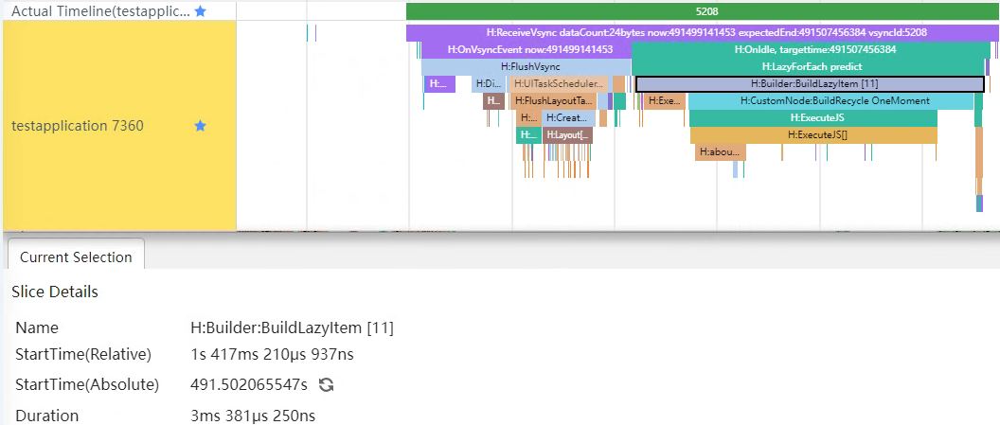
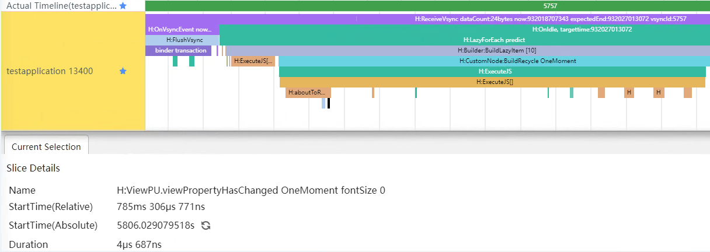
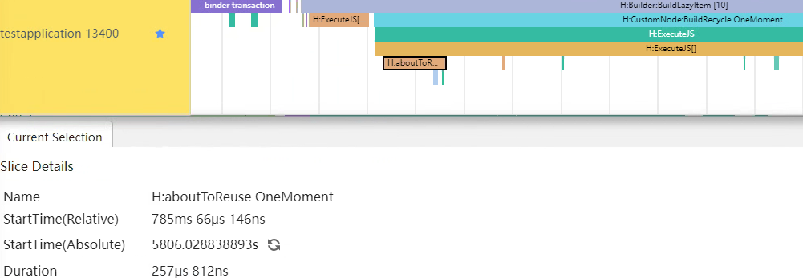
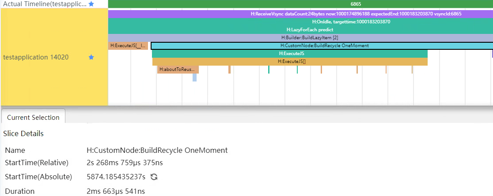

# Component Reuse Performance Optimization Guide

## Overview

In sliding scenarios, instances of the same type of custom components are frequently created and destroyed. In this case, you can reuse components to reduce the power consumption of frequent creation and destruction. During component reuse, there may be many operations that affect the component reuse efficiency. This article focuses on how to improve the reuse performance through the four suggestions on component reuse performance optimization.

Four suggestions for optimizing component reuse performance:

* The number of nesting levels for component reuse is reduced. If a user-defined component is nested in a reused user-defined component, node construction overhead exists. In addition, data needs to be refreshed in the aboutToReuse method of each nested subcomponent, which is time-consuming.
* The status management is optimized to accurately control the component update scope. In the reuse scenario, the update scope of status variables needs to be controlled to avoid expanding the update scope and reducing the component reuse efficiency.
* In scenarios where the nested structure of reused components changes, reuseId is used to mark components with different structures. For example, if the **if else** structure is used to control component creation, the component tree structure changes greatly, reducing the component reuse efficiency. reuseId needs to be used to mark different component structures to improve reuse performance.
* Do not use a function or method as the input parameter of a reusable component. During reuse, component construction is triggered. If time-consuming operations exist in the input parameter of the function, the reuse performance is affected.

## Component Reuse Mechanism


1. As shown in Figure 1, when ListItem N-1 slides out of the visible area and is about to be destroyed, if @Reusable is marked, the reuse buffer of the parent component where the customized component is located is entered. Note that component reuse is not triggered when a customized component is displayed for the first time. When a new component node is created, the node in the cache is reused to save the component re-creation time. Especially when the reused components have the same layout structure and only some data is different, the loading speed and response speed of the list page can be improved through component reuse.

2. As shown in Figure 2, the reuse buffer pool is a data structure of a map array. The reuseId is used as the key. Components with the same reuseId are in the same array. If reuseId is not set, reuseId is the name of the customized component by default.

3. As shown in Figure 3, when reuse occurs, the aboutToReuse callback of the customized component obtained from the reuse pool is automatically called recursively. The application can refresh data at this time.

   

## Reduce the nesting level of component reuse.

In the component reuse scenario, too deep nesting of customized components increases the difficulty of component reuse. For example, the aboutToReuse callback in all nested components needs to be implemented one by one to update data. Therefore, you are advised to use @Builder to replace customized components to reduce nesting levels and improve the page loading speed. The following is an example:

Incorrect usage:

```ts
@Entry
@Component
struct lessEmbeddedComponent {
  aboutToAppear(): void {
    getFriendMomentFromRawfile();
  }

  build() {
    Column() {
      List({ space: ListConstants.LIST_SPACE }) {
        LazyForEach(momentData, (moment: FriendMoment) => {
          ListItem() {
            OneMomentNoBuilder({moment: moment})
          }
        }, (moment: FriendMoment) => moment.id)
      }
      .cachedCount(Constants.CACHED_COUNT)
    }
  }
}

@Reusable
@Component
export struct OneMomentNoBuilder {
  @Prop moment: FriendMoment;
    
  //You do not need to assign aboutToReuse to the variables modified by @Prop because these variables are transferred from the parent component to the child component. If these variables are re-assigned in a subcomponent, the content of the reused component triggers status update again, which reduces the reuse performance of the component.
  build() {
    ...
    //Nest a customized component in a reused component.
    Row() {
        InteractiveButton({
          imageStr: $r('app.media.ic_share'),
          text: $r('app.string.friendMomentsPage_share')
        })
        Blank()
        InteractiveButton({
          imageStr: $r('app.media.ic_thumbsup'),
          text: $r('app.string.friendMomentsPage_thumbsup')
        })
        Blank()
        InteractiveButton({
          imageStr: $r('app.media.ic_message'),
          text: $r('app.string.friendMomentsPage_message')
        })
    }
    ...
  }
}

@Component
export struct InteractiveButton {
  @State imageStr: ResourceStr;
  @State text: ResourceStr;

  //Nested components also need to implement aboutToReuse to refresh the UI.
  aboutToReuse(params: Record<string, Object>): void {
    this.imageStr = params.imageStr as ResourceStr;
    this.text = params.text as ResourceStr;
  }

  build() {
    Row() {
      Image(this.imageStr)
      Text(this.text)
    }
    .alignItems(VerticalAlign.Center)
  }
}

```

In the preceding negative example, a new custom component is nested in the reused custom component. When a customized component is used in ArkUI, a CustomNode node is created in the back-end FrameNode tree in the build phase, and a RenderNode node is created in the rendering phase. When components are reused, CustomNode creation and RenderNod rendering take a long time. The nested customized component InteractiveButton also needs to implement aboutToReuse to refresh data.

Correct usage:

```ts
@Entry
@Component
struct lessEmbeddedComponent {
  aboutToAppear(): void {
    getFriendMomentFromRawfile();
  }

  build() {
    Column() {
      TopBar()
      List({ space: ListConstants.LIST_SPACE }) {
        LazyForEach(momentData, (moment: FriendMoment) => {
          ListItem() {
            OneMoment({moment: moment})
          }
        }, (moment: FriendMoment) => moment.id)
      }
      .cachedCount(Constants.CACHED_COUNT)
    }
  }
}

@Reusable
@Component
export struct OneMoment {
  @Prop moment: FriendMoment;

  build() {
    ...
    //Use @Builder to reduce the time required for creating and rendering customized components.
    Row() {
        interactiveButton({
          imageStr: $r('app.media.ic_share'),
          text: $r('app.string.friendMomentsPage_share')
        })
        Blank()
        interactiveButton({
          imageStr: $r('app.media.ic_thumbsup'),
          text: $r('app.string.friendMomentsPage_thumbsup')
        })
        Blank()
        interactiveButton({
          imageStr: $r('app.media.ic_message'),
          text: $r('app.string.friendMomentsPage_message')
        })
    }
    ...
  }
}

class Temp {
  imageStr: ResourceStr = '';
  text: ResourceStr = '';
}

@Builder
export function interactiveButton($$: Temp) {
  Row() {
    // `${}` is used to transfer data by reference so that @Builder can detect data changes and refresh the UI.
    Image($$.imageStr)
    Text($$.text)
  }
}
```

In the preceding example, @Builder is used to replace the customized component. This avoids the time consumption of CustomNode node creation and RenderNode rendering.

**Optimization Effect**

In the positive and negative examples, for the three interaction buttons in a single list item in the list sliding scenario, the negative example is implemented by using a customized component, and the positive example is implemented by using a customized construction function.

Before the optimization, take the reuse process of No.11 list item as an example. Observe the trace information. It is found that the aboutToReuse callback in all nested components InteractiveButton needs to be implemented one by one. As a result, the reuse takes a long time, and BuildLazyItem takes 7 ms.


After the optimization, when No.11 list item is reused, the aboutToReuse callback in all nested components does not need to be implemented one by one. BuildLazyItem takes 3 ms. In this example, BuildLazyItem is optimized for about 4 ms.



Therefore, trace data proves that @Builder is preferentially used to replace customized components to reduce nesting levels, facilitating maintenance and improving the page loading speed.

## The status management is optimized to accurately control the component update scope.

### 1. The attributeModifier is used to accurately control the update of component attributes to avoid unnecessary attribute update.

Reuse scenarios are usually used in high-frequency refresh scenarios. Precise control of the refresh range of components can effectively reduce the rendering load of the main thread and improve the sliding performance. The following is an example:

Incorrect usage:

```ts
@Entry
@Component
struct lessEmbeddedComponent {
  aboutToAppear(): void {
    getFriendMomentFromRawfile();
  }

  build() {
    Column() {
      TopBar()
      List({ space: ListConstants.LIST_SPACE }) {
        LazyForEach(momentData, (moment: FriendMoment) => {
          ListItem() {
            OneMomentNoModifier({moment: moment, fontSize: moment.size})
          }
        }, (moment: FriendMoment) => moment.id)
      }
      .cachedCount(Constants.CACHED_COUNT)
    }
  }
}

@Reusable
@Component
export struct OneMomentNoModifier {
  @Prop moment: FriendMoment;
  @State fontSize: number | Resource = $r('app.integer.list_history_userText_fontSize');

  aboutToReuse(params: Record<string, Object>): void {
    this.fontSize = params.fontSize as number;
  }
    
  build() {
    Column() {
      ...
      Text(`${this.moment.userName}`)
      Text(this.moment.text)
        .textAlign(TextAlign.Center)
        .fontStyle(FontStyle.Normal)
        .fontSize(this.fontSize) //The attribute is used to refresh the text. As a result, all attributes of the text are refreshed.
        .fontColor($r('app.color.title_font_color'))
        .lineHeight($r('app.integer.list_history_userText_line_height'))
        .opacity($r('app.float.opacity_zero_point_six'))
        .margin({ top: $r('app.integer.list_history_userText_margin_top') })
        .fontWeight(30)
        .clip(false)
        .backgroundBlurStyle(BlurStyle.NONE)
        .foregroundBlurStyle(BlurStyle.NONE)
        .borderWidth(1)
        .borderColor(Color.Pink)
        .borderStyle(BorderStyle.Solid)
        .alignRules({
          'top': { 'anchor': '__container__', 'align': VerticalAlign.Top },
          'left': { 'anchor': 'image', 'align': HorizontalAlign.End }
        })
      ...
    }
  }
}
```

In the preceding negative example, aboutToReuse is used to update the fontSize status variable. As a result, all attributes of the component are updated, causing unnecessary time consumption. You can accurately refresh the attributes of the components to be updated to avoid unnecessary redrawing and rendering.

Correct usage:

```ts
export class MyTextModifier implements AttributeModifier<TextAttribute> {
  private fontSize: number | Resource = $r('app.integer.list_history_userText_fontSize');
  private static instance: MyTextModifier;

  constructor() {
  }

  //Use the singleton mode to avoid creating a new modifier for each component, which increases the performance overhead caused by creation.
  public static getInstance(): MyTextModifier {
    if (MyTextModifier.instance) {
      return MyTextModifier.instance;
    } else {
      return new MyTextModifier();
    }
  }

  setFontSize(fontSize: number | Resource) {
    this.fontSize = fontSize;
  }
  
  applyNormalAttribute(instance: TextAttribute): void {
    instance.textAlign(TextAlign.Center)
    instance.fontStyle(FontStyle.Normal)
    instance.fontSize(this.fontSize) //Differentiated update
    instance.fontColor($r('app.color.title_font_color'))
    instance.lineHeight($r('app.integer.list_history_userText_line_height'))
    instance.opacity($r('app.float.opacity_zero_point_six'))
    instance.margin({ top: $r('app.integer.list_history_userText_margin_top') })
    instance.fontWeight(30)
    instance.clip(false)
    instance.backgroundBlurStyle(BlurStyle.NONE)
    instance.foregroundBlurStyle(BlurStyle.NONE)
    instance.borderWidth(1)
    instance.borderColor(Color.Pink)
    instance.borderStyle(BorderStyle.Solid)
    instance.alignRules({
      'top': { 'anchor': '__container__', 'align': VerticalAlign.Top },
      'left': { 'anchor': 'image', 'align': HorizontalAlign.End }
    })
  }
}

@Entry
@Component
struct lessEmbeddedComponent {
  aboutToAppear(): void {
    getFriendMomentFromRawfile();
  }

  build() {
    Column() {
      TopBar()
      List({ space: ListConstants.LIST_SPACE }) {
        LazyForEach(momentData, (moment: FriendMoment) => {
          ListItem() {
            OneMomentNoModifier({moment: moment, fontSize: moment.size})
          }
        }, (moment: FriendMoment) => moment.id)
      }
      .cachedCount(Constants.CACHED_COUNT)
    }
  }
}

@Reusable
@Component
export struct OneMomentNoModifier {
  @Prop moment: FriendMoment;
  @State fontSize: number | Resource = $r('app.integer.list_history_userText_fontSize');
  textModifier: MyTextModifier = MyTextModifier.getInstance();

  aboutToReuse(params: Record<string, Object>): void {
    this.fontSize = params.fontSize as number;
    this.textModifier.setFontSize(this.fontSize);
  }

  build() {
    Column() {
      ...
      Text(`${this.moment.userName}`)
      Text(this.moment.text)
        //Use attributeModifier to accurately refresh the fontSize attribute to be updated to avoid unnecessary attribute refreshing.
        .attributeModifier(this.textModifier)
      ...
     }
  }
}
```

In the preceding positive example, the attributeModifier attribute is used to accurately refresh the fontSize attribute of the Text component to avoid refreshing other attributes that do not need to be modified.

**Optimization Effect**

In the positive and negative examples, for the modification of the font size attribute of the Text component in a single list item in the list sliding scenario, the negative example is implemented by refreshing the common component attribute, and the positive example is implemented by setting the attributeModifier dynamic attribute.

Before the optimization, according to the `viewPropertyHasChanged OneMomentNoModifier fontSize 1` tag, the status variable fontSize of the OneMomentNoModifier component changes, and the number of child controls associated with the component is 1. That is, a child control is marked dirty, and then all Text attributes are updated.


In this case, aboutToReuse takes 336 μs, and Create[Text] takes 8 μs.


After the optimization, the `viewPropertyHasChanged OneMomentNoModifier fontSize 0` tag shows that the status variable fontSize of the OneMomentNoModifier component changes, and the number of child controls associated with the component is 0. That is, the Text component is not marked dirty and not all attributes are updated.



After the optimization, the time required for aboutToReuse is shortened to 257 μs, and the time required for Create[Text] is shortened to 4 μs.




Therefore, trace data proves that precise control of the component refresh range can effectively reduce the rendering load of the main thread and improve the sliding performance.

Note: The absolute value of the optimization time is small because the example involves the attribute update of only one Text component. If a large number of components are involved, the performance improvement will be more obvious.

### 2. Replace @Prop with @Link/@ObjectLink to reduce deep copy and improve the component creation speed.

During data synchronization between parent and child components, if only the parent component needs to synchronize data to the child component, the requirement that the data change of the child component is not synchronized to the parent component does not exist. You are advised to use @Link/@ObjectLink to replace @Prop. @Prop performs deep copy when decorating variables. During the copy, types except basic types, Map, Set, Date, and Array are lost. The following is an example:

Incorrect usage:

```ts
@Entry
@Component
struct lessEmbeddedComponent {
  aboutToAppear(): void {
    getFriendMomentFromRawfile();
  }

  build() {
    Column() {
      TopBar()
      List({ space: ListConstants.LIST_SPACE }) {
        LazyForEach(momentData, (moment: FriendMoment) => {
          ListItem() {
            OneMoment({moment: moment})
          }
        }, (moment: FriendMoment) => moment.id)
      }
      .cachedCount(Constants.CACHED_COUNT)
    }
  }
}

@Reusable
@Component
export struct OneMoment {
  @Prop moment: FriendMoment;
    
  build() {
    Column() {
      ...
      Text(`${this.moment.userName}`)
      ...
    }
  }
}

export const momentData: FriendMomentsData = new FriendMomentsData(); 
    
export class FriendMoment {
  id: string; 
  userName: string; 
  avatar: string; 
  text: string; 
  size: number; 
  image?: string; 

  constructor(id: string, userName: string, avatar: string, text: string, size: number, image?: string) {
    this.id = id;
    this.userName = userName;
    this.avatar = avatar;
    this.text = text;
    this.size = size;
    if (image !== undefined) {
      this.image = image;
    }
  }
}
```

In the preceding negative example, @Prop is used to synchronize data between parent and child components. Variables decorated by @Prop copy data locally during initialization. The creation time and memory consumption increase, causing performance problems.

Correct usage:

```ts
@Entry
@Component
struct lessEmbeddedComponent {
  @State momentData: FriendMomentsData = new FriendMomentsData();
  aboutToAppear(): void {
    getFriendMomentFromRawfile();
  }

  build() {
    Column() {
      TopBar()
      List({ space: ListConstants.LIST_SPACE }) {
        LazyForEach(momentData, (moment: FriendMoment) => {
          ListItem() {
            OneMoment({moment: moment})
          }
        }, (moment: FriendMoment) => moment.id)
      }
      .cachedCount(Constants.CACHED_COUNT)
    }
  }
}

@Reusable
@Component
export struct OneMoment {
  @ObjectLink moment: FriendMoment;
    
  build() {
    Column() {
      ...
      Text(`${this.moment.userName}`)
      ...
    }
  }
}
    
@Observed
export class FriendMoment {
  id: string; 
  userName: string; 
  avatar: string; 
  text: string; 
  size: number; 
  image?: string; 

  constructor(id: string, userName: string, avatar: string, text: string, size: number, image?: string) {
    this.id = id;
    this.userName = userName;
    this.avatar = avatar;
    this.text = text;
    this.size = size;
    if (image !== undefined) {
      this.image = image;
    }
  }
}
```

In the preceding positive example, @ObjectLink is used to synchronize data between parent and child components. The @ObjectLink wrapper class of the child component registers the current this pointer with the parent component and directly synchronizes the data of the parent component to the child component, implementing bidirectional data synchronization between the parent and child components, the subcomponent creation time and memory consumption are reduced.

**Optimization Effect**

In the positive and negative examples, for the list sliding scenario, the font size attribute of the Text component in a single list item is modified. In the negative example, the common component attribute is refreshed. In the positive example, the attributeModifier dynamic attribute is set.

Before the optimization, subcomponents copy data locally during initialization, and BuildItem takes 7 ms and 175 μs.


After the optimization, subcomponents directly synchronize parent component data without deep copy. The BuildItem time is shortened to 7 ms and 1 μs.


Therefore, the trace data proves that using @Link/@ObjectLink instead of @Prop to reduce deep copy can improve the component creation speed.

Note: The example involves only the deep copy of a simple object FriendMoment. Therefore, the absolute value of the optimization time is small. If a large number of variables are involved and objects are complex, the performance improvement is more obvious.

## In scenarios where the nested structure of reused components changes, reuseId is used to mark the composition of components with different structures.

In the scenario where customized components are reused, if the if/else condition statement is used to control the layout structure, components with different layout structures are created in different logics. As a result, the component tree structure is different. In this case, reuseId should be used to distinguish components of different structures to ensure that the system can cache components of various structures based on reuseId and improve reuse performance. The following is an example:

Incorrect usage:

```ts
@Entry
@Component
struct withoutReuseId {
  aboutToAppear(): void {
    getFriendMomentFromRawfile();
  }

  build() {
    Column() {
      TopBar()
      List({ space: ListConstants.LIST_SPACE }) {
        LazyForEach(momentData, (moment: FriendMoment) => {
          ListItem() {
            OneMoment({
              moment: moment,
              fontSize: moment.size
            })
          }
        }, (moment: FriendMoment) => moment.id)
      }
      .cachedCount(Constants.CACHED_COUNT) 
    }
  }
}


@Reusable
@Component
export struct OneMoment {
  @Prop moment: FriendMoment;

  build() {
    Column() {
      ...
      Text(this.moment.text)

      if (this.moment.image !== '') {
        Flex({ wrap: FlexWrap.Wrap }) {
          Image($r(this.moment.image))
          Image($r(this.moment.image))
          Image($r(this.moment.image))
          Image($r(this.moment.image))
        }
      }
      ...
    }
  }
}
```

In the preceding negative example, if is used to control the component tree to go through different branches and determine whether to create Flex components. As a result, the logic of deleting and recreating the if branch may still be used when the **if** branch is updated. Different reuseIds are set for different branches to improve the reuse performance.

Correct usage:

```ts
@Entry
@Component
struct withoutReuseId {
  aboutToAppear(): void {
    getFriendMomentFromRawfile();
  }

  build() {
    Column() {
      TopBar()
      List({ space: ListConstants.LIST_SPACE }) {
        LazyForEach(momentData, (moment: FriendMoment) => {
          ListItem() {
            OneMoment({moment: moment})
              //Use reuseId to control component reuse.
              .reuseId((moment.image !== '') ? 'withImage' : 'noImage')
          }
        }, (moment: FriendMoment) => moment.id)
      }
      .cachedCount(Constants.CACHED_COUNT) 
    }
  }
}re

@Reusable
@Component
export struct OneMoment {
  @Prop moment: FriendMoment;

  build() {
    Column() {
      ...
      Text(this.moment.text)

      if (this.moment.image !== '') {
        Flex({ wrap: FlexWrap.Wrap }) {
          Image($r(this.moment.image))
          Image($r(this.moment.image))
          Image($r(this.moment.image))
          Image($r(this.moment.image))
        }
      }
      ...
    }
  }
}
```

In the preceding example, reuseId is used to identify the component to be reused. In this way, the **if** deletion and recreation logic is not required, improving the component reuse efficiency and performance.

**Optimization Effect**

In the list sliding scenario, a Flex container component that contains four Image components in a single list item is rendered based on conditions using **if**. Components nested in different layout structures may be created based on different logic. In the negative example, reuseId is not used, in the positive example, reuseId is used to distinguish components of different structures.

Before the optimization, the multiplexing duration of list item 2 is 3 ms.


After the optimization, the reuse duration of list item 2 is shortened to 2 ms.



Therefore, the trace data proves that when components with different layout structures are created for different logics, reuseId can be used to distinguish components with different structures. This reduces the logic of deleting and recreating components and improves the efficiency and performance of component reuse.

## Do not use functions or methods as input parameters for creating reused components.

In the component reuse scenario, the data object associated with the component needs to be re-created each time the component is reused. As a result, the function in the input parameter is repeatedly executed to obtain the input parameter result. If time-consuming operations exist in the function, the performance will be severely affected. The following is an example:

[Incorrect Usage]

```ts
@Entry
@Component
struct withFuncParam {
  aboutToAppear(): void {
    getFriendMomentFromRawfile();
  }
  //Unknown time-consuming operation logic may exist in functions in real scenarios. In this example, a loop function is used to simulate time-consuming operations.
  countAndReturn(): number {
    let temp: number = 0;
    for (let index = 0; index < 100000; index++) {
      temp += index;
    }
    return temp;
  }

  build() {
    Column() {
      TopBar()
      List({ space: ListConstants.LIST_SPACE }) {
        LazyForEach(momentData, (moment: FriendMoment) => {
          ListItem() {
            OneMoment({
              moment: moment,
              sum: this.countAndReturn()
            })
          }
        }, (moment: FriendMoment) => moment.id)
      }
      .cachedCount(Constants.CACHED_COUNT) 
    }
  }
}

@Reusable
@Component
export struct OneMoment {
  @Prop moment: FriendMoment;
  @State sum: number = 0;

  aboutToReuse(params: Record<string, Object>): void {
    this.sum = params.sum as number;
  }

  build() {
    Column() {
      ...
      Text(`${this.moment.userName} (${this.moment.id} / ${this.sum}) `)
      ...
    }
  }
}
```

In the preceding negative example, the reused subcomponent parameter sum is generated by using a time-consuming function. This function needs to be executed each time a component is reused, which causes performance problems and even frame freezing and loss during list sliding.

[Correct Usage]

```ts
@Entry
@Component
struct withFuncParam {
  @State sum: number = 0;
    
  aboutToAppear(): void {
    getFriendMomentFromRawfile();
    //Execute the asynchronous function.
    this.countAndRecord();
  }
  //Unknown time-consuming operation logic may exist in functions in real scenarios. In this example, a loop function is used to simulate time-consuming operations.
  async countAndRecord() {
    let temp: number = 0;
    for (let index = 0; index < 100000; index++) {
      temp += index;
    }
    //Put the result into the state variable.
    this.sum = temp;
  }

  build() {
    Column() {
      TopBar()
      List({ space: ListConstants.LIST_SPACE }) {
        LazyForEach(momentData, (moment: FriendMoment) => {
          ListItem() {
            //The parameters of the subcomponent are transferred through the status variable.
            OneMoment({
              moment: moment,
              sum: this.sum
            })
          }
        }, (moment: FriendMoment) => moment.id)
      }
      .cachedCount(Constants.CACHED_COUNT) 
    }
  }
}

@Reusable
@Component
export struct OneMoment {
  @Prop moment: FriendMoment;
  @State sum: number = 0;

  aboutToReuse(params: Record<string, Object>): void {
    this.sum = params.sum as number;
  }

  build() {
    Column() {
      ...
      Text(`${this.moment.userName} (${this.moment.id} / ${this.sum}) `)
      ...
    }
  }
}
```

In the preceding positive example, the result generated by the time-consuming function countAndRecord remains unchanged. You can execute the result during initial page rendering and assign the result to this.sum. This.sum is used to transfer parameters of reused components.

**Optimization Effect**

In the list sliding scenario, a Text component in a single list item depends on the input parameters during component creation. In the negative example, the input parameters are directly transferred to the function. In the positive example, the input parameters are transferred through status variables.

Before the optimization, the function in the input parameter needs to be repeatedly executed in aboutToReuse to obtain the input parameter result. As a result, the time is 4 ms.


After the optimization, parameters are transferred only through variables in aboutToReuse, and the calculation function does not need to be executed repeatedly. The time required is shortened to 2 ms.


Therefore, trace data proves that functions or methods are not used as input parameters for creating reused components, reducing performance consumption caused by repeated execution of functions in input parameters.
