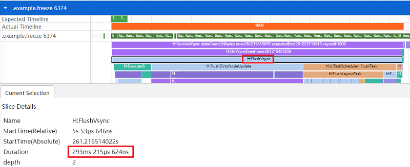
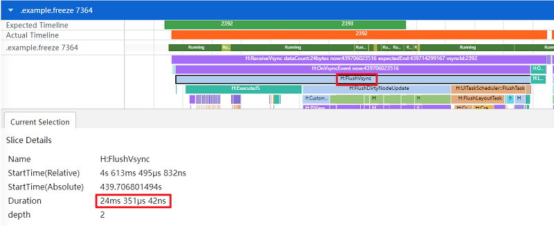
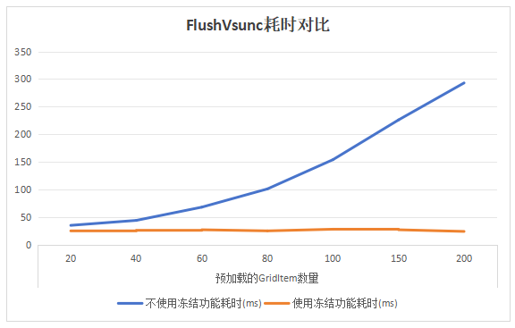

# Properly Using the Freezing Function of Customized PV Modules

## Overview
The function of freezing customized widgets is to set [freezeWhenInactive](../quick-start/arkts-create-custom-components.md#freezewheninactive11) to true to freeze inactive pages or customized widgets so that they do not respond to UI updates caused by status variables. When the status variable changes, the status variable of the page or customized component in the inactive state does not respond to the update, the @Watch function of the status variable is not called, and the associated node is not refreshed. The status variable is updated only when the page or custom component is reactivated or visible. This document describes the principle, mechanism, and application scenarios of the freezing function, and compares the performance before and after the freezing function is used in lazy loading scenarios to help developers optimize page performance, reduce page rendering time, and improve user experience.

## Mechanism
- The active and inactive states of a component are not equivalent to visible and invisible. For example, in a stack, the components stacked below are invisible but activated.
- Note that freezing a component does not mean that the component is not updated. Instead, the update is delayed to reduce the UI refresh complexity in some scenarios. When the page is visible again or restored to the active state, the components that are refreshed with a delay are refreshed. **For example, for Navigation, freezing a currently invisible page does not trigger component update. When the page is returned, the @Watch callback is triggered to refresh the page. Therefore, when the POP returns to the previous page, the components that are not updated in the freezing are refreshed. As a result, the POP load may increase.**
- All freezing is based on user-defined components. After the freezing function is enabled, user-defined components and their system components can be frozen. The minimum unit for freezing user-defined components is user-defined components. A system component cannot be frozen separately.
- The backend of freezeWhenInactive in @Component({freezeWhenInactive: true}) supports only constants.

## Applicable Scenario
Currently, the function of freezing custom PV modules supports the following scenarios: For details about how to freeze custom PV modules, see Freezing Custom PV Modules (../quick-start/arkts-custom-components-freeze.md).

Page routing: When page A calls the router.pushUrl interface to jump to page B, page A is hidden and invisible. In this case, if the status variable on page A is updated, page A is not refreshed.

**TabContent**: Freezes the tab content that is currently invisible in the tabs. The component update is not triggered. After TabContent is switched, the components to be refreshed are refreshed.

**LazyforEach**: Freezes custom components cached in LazyforEach. Component updates will not be triggered.

**Navigation**: Freezes the page that is currently invisible. The component update will not be triggered. When you return to this page, the node is refreshed only when it becomes activated again.

## Scenario Examples


The preceding figure shows a scenario where the check box is displayed when you touch and hold an image in the simulation gallery that uses Grid lazy loading. The following compares and analyzes the performance differences before and after the freezing capability is used based on this scenario.

The following is an example of displaying a check box by touching and holding an image in the imitating gallery. To facilitate comparison, isUseFreezeWhenInactive is used in the example to control whether to use the customized component freezing function. You can set @Component({freezeWhenInactive: true}) on UseFreezeItem to use the component freezing function. If the freezeWhenInactive attribute is not set for the customized component NotUseFreezeItem, the component freezing function is not used.

```ts
//Image class
@Observed
class ImageInfo {
  id: number; //Image ID.
  icon: ResourceStr; //Image
  isSelected: boolean; // Indicates whether an image is selected.

  constructor(id: number = 0, icon: ResourceStr = '', isSelected: boolean = false) {
    this.id = id;
    this.icon = icon;
    this.isSelected = isSelected;
  }
}

//The MyDataSource class implements the IDataSource interface.
class MyDataSource implements IDataSource {
  private dataArray: ImageInfo[] = [];

  public pushData(data: ImageInfo): void {
    this.dataArray.push(data);
  }

  //Total data volume of the data source
  public totalCount(): number {
    return this.dataArray.length;
  }

  // Return the data at the specified index position.
  public getData(index: number): ImageInfo {
    return this.dataArray[index];
  }

  registerDataChangeListener(listener: DataChangeListener): void {
  }

  unregisterDataChangeListener(listener: DataChangeListener): void {
  }
}

//Number of preloaded GridItems
const CACHED_COUNT: number = 200;

@Entry
@Component
struct ImitationGallery {
  //Data source
  @State data: MyDataSource = new MyDataSource();
  //Select a mode flag.
  @State isSelectedMode: boolean = false;
  //Select all flags.
  @State isSelectedAll: boolean = false;
  //Number of selected images in the selection mode.
  @State selectCount: number = 0;
  //Image selection list. ID of the selected image.
  @State @Watch('onSelectChange') selectedList: number[] = [];
  // Indicates whether to enable the component freezing function.
  @State isUseFreezeWhenInactive: boolean = false;

  //Listen to the number of selected images.
  private onSelectChange() {
    this.selectCount = this.selectedList.length;
  }

  aboutToAppear() {
    //Add an image data source.
    for (let i = 0; i < 2000; i++) {
      this.data.pushData(new ImageInfo(i, $r('app.media.custom_component_freeze_photo'), false));
    }
  }

  build() {
    Column() {
      Row() {
        if (!this.isSelectedMode) {
          Text("All photos") .fontSize(25).padding({ left: 15 }).fontWeight(FontWeight.Medium)
          Blank()
          Text("Whether to enable component freezing").fontSize(15)
          Toggle({ type: ToggleType.Switch, isOn: this.isUseFreezeWhenInactive })
            .margin({ right: 20 })
            .onChange((isOn: boolean) => {
              this.isUseFreezeWhenInactive = isOn ? true : false;
            })
        } else {
          Row() {
            Image($r('app.media.custom_component_freeze_cancel'))
              .margin({ left: 15, right: 15 })
              .width(25)
              .onClick((): void => {
                if (this.isSelectedMode) {
                  //Cancel the selection mode.
                  this.isSelectedMode = false;
                  //Deselect all check boxes.
                  for (let i = 0; i < this.selectedList.length; i++) {
                    this.data.getData(this.selectedList[i]).isSelected = false;
                  }
                  //Deselect all.
                  this.isSelectedAll = false;
                  this.selectedList = [];
                }
              })
            Text (`Selected ${this.selectCount} item`).fontSize (20)
            Blank()
            Image(this.isSelectedAll ? $r('app.media.custom_component_freeze_select_all') : $r('app.media.custom_component_freeze_no_select_all'))
              .width(30)
              .height(30)
              .margin({ right: 20 })
              .onClick(() => {
                if (!this.isSelectedMode) {
                  return;
                }
                //Select all.
                if (this.isSelectedAll) {
                  this.isSelectedAll = false;
                  //Deselect all and change the selection status.
                  for (let i = 0; i < this.selectedList.length; i++) {
                    this.data.getData(this.selectedList[i]).isSelected = false;
                  }
                  this.selectedList = [];
                } else {
                  //Select all and add it to the image selection list.
                  this.isSelectedAll = true;
                  this.selectedList = [];
                  for (let i = 0; i < this.data.totalCount(); i++) {
                    this.data.getData(i).isSelected = true;
                    this.selectedList.push(i);
                  }
                }
              })
          }.width('100%')
        }
      }.width('100%').height(48)

      Stack() {
        if (this.isUseFreezeWhenInactive) {
          Grid() {
            LazyForEach(this.data, (imageItem: ImageInfo) => {
              GridItem() {
                UseFreezeItem({
                  imageItem: imageItem,
                  isSelectedMode: this.isSelectedMode,
                  selectedList: this.selectedList
                })
              }
            }, (item: string) => item)
          }
          .cachedCount(CACHED_COUNT) //Set the number of cached GridItems.
          .columnsTemplate('1fr 1fr 1fr 1fr')
          .columnsGap(2)
          .rowsGap(2)
        } else {
          Grid() {
            LazyForEach(this.data, (imageItem: ImageInfo) => {
              GridItem() {
                NotUseFreezeItem({
                  imageItem: imageItem,
                  isSelectedMode: this.isSelectedMode,
                  selectedList: this.selectedList
                })
              }
            }, (item: string) => item)
          }
          .cachedCount(CACHED_COUNT) //Set the number of cached GridItems.
          .columnsTemplate('1fr 1fr 1fr 1fr')
          .columnsGap(2)
          .rowsGap(2)
        }
      }.layoutWeight(1)
    }
  }
}

//Use the component to freeze.
@Component({ freezeWhenInactive: true })
struct UseFreezeItem {
  @ObjectLink imageItem: ImageInfo; // Image information object.
  @Link isSelectedMode: boolean; // Indicates whether to select a mode.
  @Link selectedList: number[]; //Image selection list. ID of the selected image.

  build() {
    Stack() {
      Image(this.imageItem.icon).aspectRatio(1).draggable(false)
      if (this.isSelectedMode) {
        Image(this.imageItem.isSelected ? $r('app.media.custom_component_freeze_checkbox_on') : $r('app.media.custom_component_freeze_checkbox_off'))
          .height(24)
          .width(24)
          .position({ x: '100%', y: '100%' })
          .markAnchor({
            x: 28,
            y: 28
          })
      }
    }
    .width('100%')
    .aspectRatio(1)
    .gesture(LongPressGesture().onAction((event: GestureEvent): void => {
      //Press and hold to enter the selection mode. Select and hold the current picture.
      if (!this.isSelectedMode) {
        this.isSelectedMode = true;
        this.imageItem.isSelected = true;
        this.selectedList.push(this.imageItem.id);
      }
    }))
    .onClick((): void => {
      if (!this.isSelectedMode) {
        return;
      }
      if (this.imageItem.isSelected) {
        //Deselect the image and delete it from the image selection list.
        this.imageItem.isSelected = false;
        this.selectedList = this.selectedList.filter(num => num !== this.imageItem.id);
      } else {
        //Select an image and add it to the image selection list.
        this.imageItem.isSelected = true;
        this.selectedList.push(this.imageItem.id);
      }
    })
  }
}

//Do not use component freezing.
@Component
struct NotUseFreezeItem {
  @ObjectLink imageItem: ImageInfo; // Image information object.
  @Link isSelectedMode: boolean; // Indicates whether to select a mode.
  @Link selectedList: number[]; //Image selection list. ID of the selected image.

  build() {
    Stack() {
      Image(this.imageItem.icon).aspectRatio(1).draggable(false)
      if (this.isSelectedMode) {
        Image(this.imageItem.isSelected ? $r('app.media.custom_component_freeze_checkbox_on') : $r('app.media.custom_component_freeze_checkbox_off'))
          .height(24)
          .width(24)
          .position({ x: '100%', y: '100%' })
          .markAnchor({
            x: 28,
            y: 28
          })
      }
    }
    .width('100%')
    .aspectRatio(1)
    .gesture(LongPressGesture().onAction((event: GestureEvent): void => {
      //Press and hold to enter the selection mode. Select and hold the current picture.
      if (!this.isSelectedMode) {
        this.isSelectedMode = true;
        this.imageItem.isSelected = true;
        this.selectedList.push(this.imageItem.id);
      }
    }))
    .onClick((): void => {
      if (!this.isSelectedMode) {
        return;
      }
      if (this.imageItem.isSelected) {
        //Deselect the image and delete it from the image selection list.
        this.imageItem.isSelected = false;
        this.selectedList = this.selectedList.filter(num => num !== this.imageItem.id);
      } else {
        //Select an image and add it to the image selection list.
        this.imageItem.isSelected = true;
        this.selectedList.push(this.imageItem.id);
      }
    })
  }
}
```

## Effect

The following describes how to use the SmartPerf tool to capture traces and analyze the performance difference of displaying the check box by touching and holding the image before and after the customized component freezing function is used.

### Disable the freezing function.

As shown in Figure 1, when the number of GridItems to be preloaded is set to 200, the component freezing function is disabled, and the trace of the check box is displayed when you touch and hold the image. It can be seen that the FlushVsync (executing the layout task, executing the rendering task, and notifying the graph to render) that displays the check box takes 293 ms. FlushDirtyNodeUpdate (update dirty nodes) takes 153 ms, and UITaskScheduler::FlushTask (relay out lazy loaded GridItems) takes 94 ms.

Figure 1 Disabling the function of freezing customized PV modules


As shown in Figure 2, 832 CustomNodeUpdate NotUseFreezeItem tasks are executed in FlushDirtyNodeUpdate, the 832 custom component nodes refer to the 32 GridItem nodes visible on the screen and the 800 cached GridItem nodes invisible on the screen.

Figure 2 CustomNodeUpdate duration after the freezing function is disabled


### Enabling the Freezing Function

As shown in Figure 3, when the number of GridItems preloaded by Grid is set to 200, enable the component freezing function and capture the trace of the check box displayed when you touch and hold the image. It takes only 24 ms to display the FlushVsync check box. FlushDirtyNodeUpdate takes 10 ms, and UITaskScheduler::FlushTask takes 5 ms. Compared with the time when the freezing function is disabled, the time is shortened by 11 times.

Figure 3 Enabling the function of freezing customized PV modules


As shown in Figure 4, 32 CustomNodeUpdate UseFreezeItem tasks are executed in FlushDirtyNodeUpdate. The 32 CustomNodeUpdate UseFreezeItem nodes refer to all GridItem nodes visible on the screen. Compared with Figure 2, it can be found that 800 refresh tasks of customized component nodes are executed less when the freezing function is enabled than when the freezing function is disabled, greatly shortening the rendering time.

Figure 4 CustomNodeUpdate duration after the freezing function is enabled


Figure 5 compares the FlushVsunc time required for setting different numbers of GridItems (cachedCount) in the Grid lazy loading scenario. The larger the number of GridItems set in lazy loading, the longer the FlushVsync takes.

Figure 5 FlushVsunc time consumption comparison



According to the preceding comparison, after the freezing function is enabled in the lazy loading scenario, only the GridItem visible on the screen is refreshed, and the GridItem invisible outside the screen is not refreshed. Compared with the scenario where the freezing function is disabled, the number of customized component nodes to be refreshed is greatly reduced, this effectively reduces the time required for page re-rendering. In actual service scenarios, the layout of customized components is more complex and more status variables need to be updated. Proper use of the customized component freezing function can effectively reduce the rendering time and operation freezing, improve page performance, and bring better user experience.
