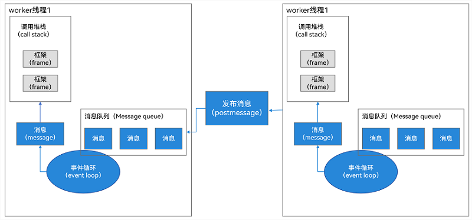
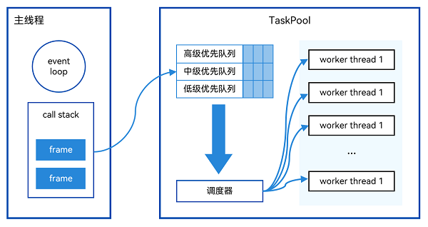
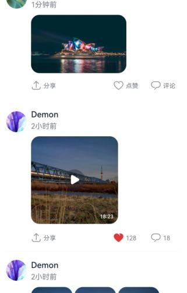

# Scenario-based Practice of the Multithread Capability

## Introduction

Each process (../application-models/process-model-stage.md) in an application has a main thread. The main thread is responsible for UI drawing, creating and destroying ArkTS engine instances, distributing and processing events, and managing the Ability lifecycle. For details, see Thread Model Overview. (../application-models/thread-model-stage.md). Therefore, do not perform time-consuming operations in the main thread during application development. ArkTS provides two types of multi-thread concurrency capabilities: **Worker** and **TaskPool**. Multi-thread concurrency allows multiple code segments to be executed at the same time. For details about the basic capabilities of the two types of concurrency, see [Comparison Between TaskPool and Worker] (../arkts-utils/taskpool-vs-worker.md).

Before introducing the detailed usage of **Worker** and **TaskPool**, let's briefly introduce the concepts related to the concurrency model.

## Concurrency Model Overview

Concurrent means that multiple tasks are executed at the same time. There are two types of concurrency models: memory sharing-based concurrency model and message passing-based concurrency model.

In the concurrency model based on memory sharing, concurrent threads interact by reading and writing shared objects in memory. Concurrent programming based on shared memory must meet the following requirements:

- Atomicity: An operation cannot be interrupted, either all successful or all failed.

- Order: The program execution sequence must meet the expectation.

- Visibility: When a thread modifies a shared variable, other threads can immediately know the modification.

Modern programming languages generally meet these three properties through locks, memory barriers, and atomic instructions. The memory sharing-based concurrency model is close to the underlying hardware. When concurrent code can be correctly written, the underlying hardware performance can be maximized to implement multi-thread programs with excellent performance. But this concurrency model is difficult to master, and even senior programmers are very prone to make mistakes. Typical programming languages based on the memory sharing concurrency model include C++, Swift, and Java.

In the concurrency model based on message transfer, the memory of concurrent threads is isolated from each other, and messages need to be sent to each other through communication channels for interaction. There are two typical concurrency models based on message passing: CSP and Actor.

Computing units in the Communicating Sequential Processes (CSP) cannot directly send information to each other. Messages need to be transferred through channels. The sender needs to send messages to channels, and the receiver needs to read messages from channels. Different from the CSP, in the Actor model, each Actor can be considered as an independent computing unit and its memory is isolated from each other. Each Actor has a mail box, and messages can be directly transferred between Actors, as shown in the following figure. 

Figure 1 Actor message transfer 


The differences between the CSP and Actor are as follows:

- The Actor needs to specify the message receiver. The processing unit in the CSP only needs to send the message to the channel, and the receiver only needs to read the message from the channel.

- By default, the channel is not cached. Therefore, the sending (Send) action of the channel is blocked synchronously until another execution block that holds the channel reference fetches the message. In the Actor model, the mailbox is essentially a queue, therefore, messages can be sent and received asynchronously.

Typical programming languages for message-passing-based concurrency models are Dart, JS, and ArkTS. In the current system, Worker and TaskPool implement the concurrency capability based on the Actor concurrency model.

## Worker

### Basic Concepts and Operation Principles

The worker in the current system is an independent thread. For details about basic concepts, see [Comparison Between TaskPool and Worker] (../arkts-utils/taskpool-vs-worker.md). Workers have independent running environments. Like the main thread, each Worker thread has its own memory space, message queue (MessageQueue), event polling mechanism (EventLoop), and call stack (CallStack). Threads interact with each other through messages, as shown in the following figure. 

Figure 2 Thread interaction



In the case of multiple cores (CPU 1 and CPU 2 in the following figure work at the same time), multiple Worker threads (worker thread 1 and worker thread 2 in the following figure) can be executed at the same time. Therefore, Worker threads achieve real concurrency, as shown in the following figure. 

Figure 3 Worker thread concurrency 


### Application Scenarios and Development Examples

Workers are applicable to the following scenarios:

- Workers are required for tasks that have been running for more than 3 minutes.

- A series of associated synchronization tasks, such as adding, deleting, modifying, and querying a database, must use the same handle.

Take the video decompression scenario as an example. Click the download button in the upper right corner. In this example, the network download and listening are performed. After the download is complete, the decompression operation is automatically performed. When the video is too large, the decompression duration may exceed 3 minutes. Therefore, this scenario is used to describe how to use Worker.

The following figure shows the scenario preview. 

Figure 4 Scenario preview


Procedure:

1. The host thread creates a Worker thread. Use `new worker.ThreadWorker()` to create a Worker instance. The sample code is as follows:

    ```typescript
    //Introduce the worker module.
    import worker, { MessageEvents } from '@ohos.worker';
    import type common from '@ohos.app.ability.common';
            
    let workerInstance: worker.ThreadWorker = new worker.ThreadWorker('entry/ets/pages/workers/worker.ts', { 
      name: 'FriendsMoments Worker'
    });
    ```

2. The host thread sends a task message to the worker thread. The host thread uses the postMessage method to send a message to the Worker thread to start the download and decompression task. The sample code is as follows:  

    ```typescript
    //Request network data.
    let context: common.UIAbilityContext = getContext(this) as common.UIAbilityContext;
    // mediaData and isImageData are added based on service requirements. mediaData indicates the data path, and isImageData indicates the identifier for determining an image or video.
    workerInstance.postMessage({ context, mediaData: this.mediaData, isImageData: this.isImageData });
    ```

3. The Worker thread listens to messages sent by the host thread. The worker thread receives the postMessage request from the host thread in onmessage and executes the download and decompression task. The sample code is as follows:

    ```typescript
    //Introduce the worker module.
    import worker, { MessageEvents } from '@ohos.worker';
        
    let workerPort = worker.workerPort;
    //Receive the postMessage request from the host thread.
    workerPort.onmessage = (e: MessageEvents): void => {
      //Download a video file.
      let context: common.UIAbilityContext = e.data.context;
      let filesDir: string = context.filesDir;
      let time: number = new Date().getTime();
      let inFilePath: string = `${filesDir}/${time.toString()}.zip`;
      let mediaDataUrl: string = e.data.mediaData;
      let urlPart: string = mediaDataUrl.split('.')[1];
      let length: number = urlPart.split('/').length;
      let fileName: string = urlPart.split('/')[length-1];
      let options: zlib.Options = {
        level: zlib.CompressLevel.COMPRESS_LEVEL_DEFAULT_COMPRESSION
      };
      request.downloadFile(context, {
        url: mediaDataUrl,
        filePath: inFilePath
      }).then((downloadTask) => {
        downloadTask.on('progress', (receivedSize: number, totalSize: number) => {
          Logger.info(`receivedSize:${receivedSize},totalSize:${totalSize}`);
        });
        downloadTask.on('complete', () => {
          // Decompress the package after the download is complete.
          zlib.decompressFile(inFilePath, filesDir, options, (errData: BusinessError) => {
            if (errData !== null) {
              ...
              // Exception handling.
            }
            let videoPath: string = `${filesDir}/${fileName}/${fileName}.mp4`;
            workerPort.postMessage({ 'isComplete': true, 'filePath': videoPath });
          })
        });
        downloadTask.on('fail', () => {
          ...
          // Exception handling.
        });
      }).catch((err) => {
        ...
        // Exception handling.
      });
    };
    ```

4. The host thread listens to the information sent by the Worker thread. The host thread receives the message sent by the Worker thread through onmessage and executes the download result notification.

5. This API is used to release Worker resources. When the service is complete or the page is destroyed, call the workerPort.close() interface to release worker resources. The sample code is as follows:

    ```typescript
    workerInstance.onmessage = (e: MessageEvents): void => {
      if (e.data) {
        this.downComplete = e.data['isComplete'];
        this.filePath = e.data['filePath'];
        workerInstance.terminate();
        setTimeout(() => {
          this.downloadStatus = false;
        }, LOADING_DURATION_OPEN);
      }
    };
    ```

## TaskPool

### Basic Concepts and Operation Principles

Compared with using Worker to implement multi-thread concurrency, TaskPool is easier to use and the creation overhead is less than that of Worker. In addition, the number of Worker threads is limited and needs to be mastered by developers. For details about the basic concepts of TaskPool, see [Comparison Between TaskPool and Worker] (../arkts-utils/taskpool-vs-worker.md). The TaskPool provides a multi-thread running environment for applications. The TaskPool implements the scheduler and worker thread pool based on the worker. The TaskPool places tasks in different priority queues based on their priorities. The scheduler obtains tasks from the priority queues based on its own scheduling algorithm (priority and anti-hunger). The Worker thread pool in the TaskPool executes related tasks. The following figure shows the process.

Figure 5 TaskPool process



TaskPool has the following features:

- Lightweight parallel mechanism.

- The overall resource consumption is reduced.

- The overall system performance is improved.

- You do not need to pay attention to the lifecycle of a thread instance.

- You can use the TaskPool API to create background tasks and perform operations such as task execution and cancellation on the created tasks.

- The number of worker threads in the TaskPool is dynamically adjusted based on the task load so that the task can be completed as expected.

- You can set the priority of a task.

- You can set a task group to associate tasks.

### Application Scenarios and Development Examples

TaskPool applies to the following scenarios:

- Use **TaskPool** for a task for which the priority needs to be set.

- Use **TaskPool** for a task that is subject to cancellation at any time.

- Use **TaskPool** for a large number of tasks or tasks with scattered scheduling points.

In Moments, different friends upload video images at the same time. When they slide frequently, download tasks are triggered for multiple times. The following uses Moments as an example to describe how to use TaskPool to develop and process a large number of tasks or tasks with scattered scheduling points. The following figure shows the preview image of the scenario. 

Figure 6 Preview of the Moments scenario 



Procedure:

1. Import the TaskPool module. For details about the TaskPool API, see [@ohos.taskpool](../reference/apis-arkts/js-apis-taskpool.md).

    ```typescript
    import taskpool from '@ohos.taskpool';
    ```

2. Create a task object, in which the called method and parameters are transferred.

    ```typescript
    ... 
    //Create a task item. Parameters: 1. Function parameters need to be transferred for task execution. 2. Function parameters need to be transferred for task execution. (In this example, this parameter is the string of the called network address.)
    let task: taskpool.Task = new taskpool.Task(getWebData, jsonUrl);
    ...
    
    //Obtain network data.
    @Concurrent
    async function getWebData(url: string): Promise<Array<FriendMoment>> {
      try {
        let webData: http.HttpResponse = await http.createHttp().request(
          url,
          { header: {
              'Content-Type': 'application/json'
          },
            connectTimeout: 60000, readTimeout: 60000
          })
        if (typeof (webData.result) === 'string') {
          //Parse the JSON string.
          let jsonObj: Array<FriendMoment> = await JSON.parse(webData.result).FriendMoment;
          let friendMomentBuckets: Array<FriendMoment> = new Array<FriendMoment>();
          //The following source code is omitted. It is mainly used for data parsing and time-consuming operation processing.
          ...
          return friendMomentBuckets;
        } else {
          // Exception handling.
          ...
        }
      } catch (err) {
        // Exception handling.
        ...
      }
    }
    ```
3. Use taskpool.execute to execute the TaskPool task and place the function to be executed in the internal task queue of the TaskPool for execution. execute requires two parameters: created task object and priority of the task group to be executed. The default value is Priority.MEDIUM. After data is downloaded, parsed, and processed in the TaskPool, the data is returned to the main thread.

    ```typescript
    let friendMomentArray: Array<FriendMoment> = await taskpool.execute(task, taskpool.Priority.MEDIUM) as Array<FriendMoment>;
    ```

4. Transfer the newly obtained momentData to the page component through AppStorage.setOrCreate.

    ```typescript
    //Obtain the momentData object from the page component, including the username, image, and video data required by the component.
    let momentData = AppStorage.get<FriendMomentsData>('momentData');
    // Traverse objects cyclically and transfer momentData in sequence.
    for (let i = 0; i < friendMomentArray.length; i++) {
      momentData.pushData(friendMomentArray[i]);
    }
    // Return the updated momentData to the page component.
    AppStorage.setOrCreate('momentData', momentData);
    ```

## Examples of Other Scenarios and Solution Thinking

During routine development, we may encounter some problems in other concurrency scenarios. The following describes the recommended solutions for common concurrency scenarios.

### The Worker thread calls the method of the main thread type.

We create an object in the main thread. If the type is MyMath, we need to transfer the object to the Worker thread, and then execute some time-consuming operation methods of the type in the Worker thread, for example, the compute method in Math. The sample code of the class structure is as follows:

```typescript
class MyMath {
  a: number = 0;
  b: number = 1;

  constructor(a: number, b: number) {
    this.a = a;
    this.b = b;
  }

  compute(): number {
    return this.a + this.b;
  }
}
```

Main thread code:

```typescript
private math: MyMath = new MyMath (2, 3);//Initialize the values of a and b to 2 and 3.
private workerInstance: worker.ThreadWorker;

this.workerInstance = new worker.ThreadWorker("entry/ets/worker/MyWorker.ts");
this.workerInstance.postMessage(this.math); // Sent to the Worker thread and expected to execute the compute method in MyMath. The expected value is 5 (2 + 3).
```

After the MyMath object is transferred by a thread, the method attributes in the class are lost. As a result, the MyMath data can be obtained only in the Worker thread, but the compute method of MyMath cannot be directly called in the subsystem. The code is as follows:

```typescript
const workerPort = worker.workerPort;
workerPort.onmessage = (e: MessageEvents): void => {
  let a = e.data.a;
  let b = e.data.b;
}
```

In this case, how can we implement the method of invoking the class in the main thread in the Worker thread?

First, try to forcibly convert the data received by the Worker thread to the MyMath type. The sample code is as follows:

```typescript
const workerPort = worker.workerPort;
workerPort.onmessage = (e: MessageEvents): void => {
  let math = e.data as MyMath; //Method 1: Forcibly convert data.
  console.log('math compute:' + math.compute()); //This log is not printed if the execution fails.
}
```

If the method fails to be executed after forcible conversion, this log is not recorded. When common objects are transmitted in serial mode, only attributes can be transferred, and prototypes and methods cannot be transferred. Next, let's try the second method. Reinitialize a MyMath object based on the data, and then execute the compute method. The sample code is as follows:

```typescript
const workerPort = worker.workerPort;
workerPort.onmessage = (e: MessageEvents): void => {
  //Reconstruct the object of the original type.
  let math = new MyMath(0, 0);
  math.a = e.data.a;
  math.b = e.data.b;
  console.log('math compute:' + math.compute()); //Successfully print result: 5
}
```

The second method successfully calls the compute method of MyMath in the Worker thread. However, this method has disadvantages. For example, each time this class is used for transfer, we have to reconstruct and initialize the class. In addition, the constructed code is distributed to all parts of the project, which is difficult to maintain. Therefore, we have a third improvement solution.

For the third method, we need to construct an interface class, which contains the basic methods that need to be called between threads. This interface class is used to manage and restrict the function specifications of the MyMath class, ensure that the functions of the MyMath class and its proxy class MyMathProxy are the same in the main thread and subthreads. The sample code is as follows:

```typescript
interface MyMathInterface {
  compute():number;
}
```

Then, the MyMath class inherits this method and constructs a proxy class that inherits the MyMath class. The sample code is as follows:

```typescript
class MyMath implements MyMathInterface {
  a: number = 0;
  b: number = 1;

  constructor(a: number, b: number) {
    console.log('MyMath constructor a:' + a + ' b:' + b)
    this.a = a;
    this.b = b;
  }

  compute(): number {
    return this.a + this.b;
  }
}
        
class MyMathProxy implements MyMathInterface {
  private myMath: MyMath;
  constructor(math: MyMath) {
    this.myMath = new MyMath(math.a, math.b);
  }  
  //Proxy the compute method of the MyMath class.
  compute(): number {
    return this.myMath.compute();
  }
}
```

After the MyMath object is constructed and transferred in the main thread, the MyMath object is converted into MyMathProxy in the Worker thread. Then the compute method of MyMath can be called without initialization construction in multiple places, you only need to place the construction logic in the constructor function of MyMathProxy or MyMath. The sample code in the Worker thread is as follows:

```typescript
const workerPort = worker.workerPort;
workerPort.onmessage = (e: MessageEvents): void => {
  //Method 3: Use the proxy class to construct an object.
  let proxy = new MyMathProxy(e.data)
  console.log('math compute:' + proxy.compute()); //Successfully printed result: 5
}
```

You can select the second or third solution based on the actual scenario.

## Samples
For multi-thread concurrency, the following instances are available for reference: 
* [Chat Instance Application (ArkTS) (API10)] (https://gitee.com/openharmony/applications_app_samples/tree/master/code/Solutions/IM/Chat)
