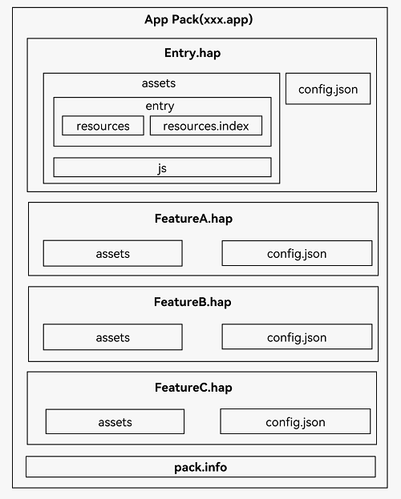

# Application Package Structure in FA Model

To develop an application based on the [FA model](application-configuration-file-overview-fa.md), it is essential to understand the application package structure in this model.

The difference between the application package structures in the FA model and stage model lies in where the internal files of a HAP file are stored. In the FA model, all the resource files, library files, and code files are stored in the **assets** folder, where the files are further organized.

- **config.json** is an application configuration file, where the template code is automatically created by DevEco Studio. You can modify the configuration as required. For details about the fields in this file, see [Internal Structure of the app Tag](app-structure.md).

- The **assets** folder is a collection of all the resource files, library files, and code files in a HAP file. It can be further organized into the **entry** folder and the **js** folder. The **entry** folder stores the **resources** folder and the **resources.index** file.

- The **resources** folder stores resource files (such as strings and images) of the application. For details, see [Resource Categories and Access](resource-categories-and-access.md).

- The **resources.index** file provides a resource index table, which is generated by DevEco Studio invoking the specific SDK tool.

- The **js** folder stores code files created after compilation.

- The **pack.info** file describes the HAP attributes in the bundle, for example, **bundleName** and **versionCode** in **app** and **name**, **type**, and **abilities** in **module**. The file is automatically generated when DevEco Studio generates the bundle.

**Figure 1** Application package structure in FA model

