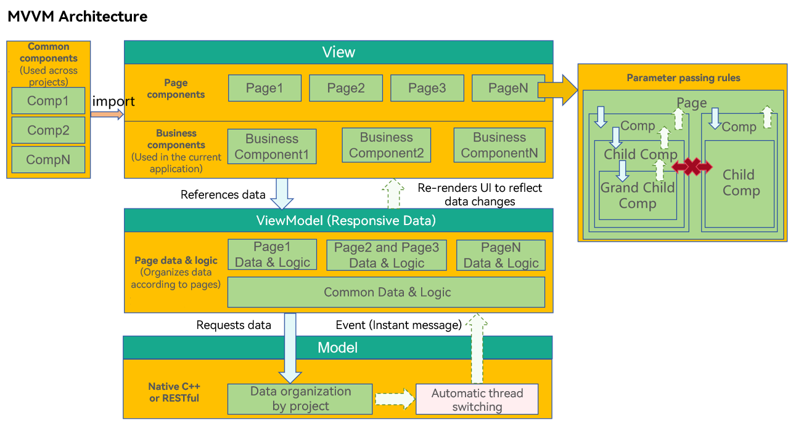
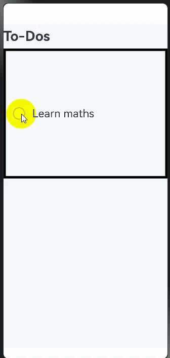
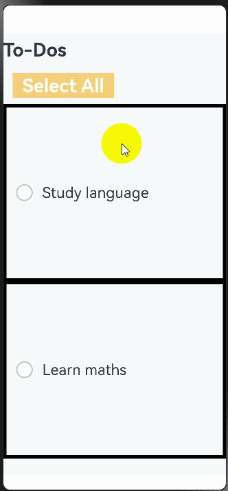
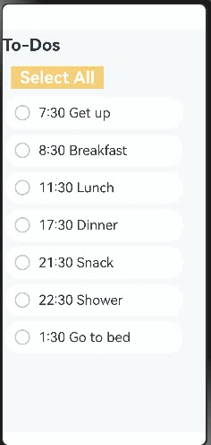
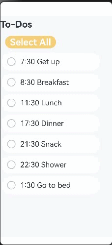
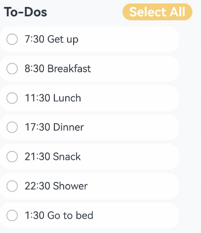

# MVVM

After understanding the concept of state management, you may be eager to develop your own applications. However, if you do not pay attention to the project structure during application development, the relationship between components becomes blurred as the project becomes larger and more state variables are designed. When you develop a new function, the costs of development and maintenance will increase exponentially. Therefore, this document describes the MVVM mode and the relationship between the UI development mode of ArkUI and the MVVM, and provides guidance for you to design your own project structures. In this way, product development and maintenance are easier during product iteration and upgrade.


This topic covers most decorators of the state management V1. You are advised to read [State Management Overview](./arkts-state-management-overview.md) and topics related to decorators of V1 in advance.

## Introduction

### Concepts

During application development, UI updates need to be synchronized in real time with data state changes. This synchronization usually determines the performance and user experience of applications. To reduce the complexity of data and UI synchronization, ArkUI uses the Model-View-ViewModel (MVVM) architecture. The MVVM divides an application into three core parts: Model, View, and ViewModel to separate data, views, and logic. In this mode, the UI can be automatically updated with the state change without manual processing, thereby more efficiently managing the binding and update of data and views.

- Model: stores and manages application data and service logic without directly interacting with the UI. Generally, Model obtains data from back-end APIs and serves as the data basis of applications, which ensures data consistency and integrity.
- View: displays data on the UI and interacts with users. No service logic is contained. It dynamically updates the UI by binding the data provided by the ViewModel.
- ViewModel: manages UI state and interaction logic. As a bridge between Model and View, ViewModel monitors data changes in Model, notifies views to update the UI, processes user interaction events, and converts the events into data operations.

The UI development mode of ArkUI belongs to the MVVM mode. By introducing the concept of MVVM, you may have basic understanding on how the state management work in MVVM. State management aims to drive data update and enable you to focus only on page design without paying attention to the UI re-render logic. In addition, ViewModel enables state variables to automatically maintain data. In this way, MVVM provides a more efficient way for you to develop applications.

### ArkUI Development

The UI development mode of ArkUI is the MVVM mode, in which the state variables play the role of ViewModel to re-render the UI and data. The following figure shows the overall architecture.



### Layer Description

**View**

* Page components: All applications are classified by page, such as the login page, list page, editing page, help page, and copyright page. The data required by each page may be completely different, or the same set of data can be shared with multiple pages.
* Business components: a functional component that has some service capabilities of the application. Typically, the business component may be associated with the data in the ViewModel of the project and cannot be shared with other projects.
* Common components: Similar to built-in components, these components are not associated with the ViewModel data in the application. These components can be shared across multiple projects to implement common functions.

**ViewModel**

* Page data: organized by page. When a user opens a page, some pages may not be switched to. Therefore, it is recommended that the page data be designed in lazy loading mode.

> The differences between the ViewModel data and the Model data are as follows:
>
> Model data, a set of service data of the application, is organized based on the entire project.
>
> ViewModel data provides data used on a page. It may be a part of the service data of the entire application. In addition, ViewModel also provides auxiliary data for page display, which may be irrelevant to the application services.

**Model**

Model provides the original data of applications. From the perspective of the UI, there are two ways to implement this layer:

* Local implementation: through native C++.

* Remote implementation: through the I/O port (RESTful).

> **NOTE**
>
> When the local implementation is used, the non-UI thread model must exist when the system processes data. At this time, the processed data change needs to be notified to the ViewModel in real time, causing data changes and UI re-renders. In this case, automatic thread switching becomes very important. Generally, the ViewModel and View can work properly only when they are executed in the UI thread. Therefore, a mechanism is required to automatically complete thread switching when the UI needs to be notified of a re-render.

### Core Principles of the Architecture

**Cross-layer access is not allowed.**

* View cannot directly call data from Model. Instead, use the methods provided by ViewModel to call.
* Model data cannot modify the UI directly but notifies the ViewModel to update the data.

**The lower layer cannot access the upper layer data.**

The lower layer can only notify the upper layer to update the data. In the service logic, you cannot write code at the lower layer to obtain the upper-layer data. For example, the logic processing at ViewModel cannot depend on a value on the UI at View.

**Non-parent-child components cannot directly access each other.**

This is the core principle of View design. A component should comply with the following logic:

* Do not directly access the parent component (using the event or subscription capability).
* Do not directly access sibling components. This is because components can access only the child nodes (through parameter passing) and parent nodes (through events or notifications) that they can see. In this way, components are decoupled.

Reasons:

* The child components used by the component are clear, therefore, access is allowed.
* The parent node where the component is placed is unknown. Therefore, the component can access the parent node only through notifications or events.
* It is impossible for a component to know its sibling nodes, so the component cannot manipulate the sibling nodes.

## Memo Development

This section describes how to use ArkUI to design your own applications. The sample code in this section directly develops functions without designing the code architecture and considering subsequent maintenance, and the decorators required for function development are introduced as well.

### @State

* As the most commonly used decorator, @State is used to define state variables. Generally, the @State decorator is used as the data source of the parent component. When you click @State, the state variable is updated to re-render the UI. If the @State decorator is removed, the UI cannot be refreshed.

```typescript
@Entry
@Component
struct Index {
  @State isFinished: boolean = false;

  build() {
    Column() {
      Row() {
        Text('To-Dos')
          .fontSize(30)
          .fontWeight(FontWeight.Bold)
      }
      .width('100%')
      .margin({top: 10, bottom: 10})

      // To-Do list
      Row({space: 15}) {
        if (this.isFinished) {
          // 'app.media.finished' is only an example. Replace it with the actual one in use. Otherwise, the imageSource instance fails to be created, and subsequent operations cannot be performed.
          Image($r('app.media.finished'))
            .width(28)
            .height(28)
        }
        else {
          // 'app.media.unfinished' is only an example. Replace it with the actual one in use. Otherwise, the imageSource instance fails to be created, and subsequent operations cannot be performed.
          Image($r('app.media.unfinished'))
            .width(28)
            .height(28)
        }
        Text('Learn maths')
          .fontSize(24)
          .fontWeight(450)
          .decoration({type: this.isFinished ? TextDecorationType.LineThrough : TextDecorationType.None})
      }
      .height('40%')
      .width('100%')
      .border({width: 5})
      .padding({left: 15})
      .onClick(() => {
        this.isFinished = !this.isFinished;
      })
    }
    .height('100%')
    .width('100%')
    .margin({top: 5, bottom: 5})
    .backgroundColor('#90f1f3f5')
  }
}
```

The following figure shows the final effect.



### @Prop and @Link

In the preceding example, all code is written in the @Entry decorated component. As more and more components need to be rendered, you need to split the @Entry decorated component and use the @Prop and @Link decorators to decorate the split child components.

* @Prop creates a one-way synchronization between the parent and child components. The child component can perform deep copy of the data from the parent component or update the data from the parent component or itself. However, it cannot synchronize data from the parent component.
* @Link creates a two-way synchronization between the parent and child components. When the parent component changes, all @Links are notified. In addition, when @Link is updated, the corresponding variables of the parent component are notified as well.

```typescript
@Component
struct TodoComponent {
  build() {
    Row() {
      Text('To-Dos')
        .fontSize(30)
        .fontWeight(FontWeight.Bold)
    }
    .width('100%')
    .margin({top: 10, bottom: 10})
  }
}

@Component
struct AllChooseComponent {
  @Link isFinished: boolean;

  build() {
    Row() {
      Button('Select All', {type: ButtonType.Normal})
        .onClick(() => {
          this.isFinished = !this.isFinished;
        })
        .fontSize(30)
        .fontWeight(FontWeight.Bold)
        .backgroundColor('#f7f6cc74')
    }
    .padding({left: 15})
    .width('100%')
    .margin({top: 10, bottom: 10})
  }
}

@Component
struct ThingsComponent1 {
  @Prop isFinished: boolean;

  build() {
    // Task 1
    Row({space: 15}) {
      if (this.isFinished) {
        // 'app.media.finished' is only an example. Replace it with the actual one in use. Otherwise, the imageSource instance fails to be created, and subsequent operations cannot be performed.
        Image($r('app.media.finished'))
          .width(28)
          .height(28)
      }
      else {
        // 'app.media.unfinished' is only an example. Replace it with the actual one in use. Otherwise, the imageSource instance fails to be created, and subsequent operations cannot be performed.
        Image($r('app.media.unfinished'))
          .width(28)
          .height(28)
      }
      Text('Study language')
        .fontSize(24)
        .fontWeight(450)
        .decoration({type: this.isFinished ? TextDecorationType.LineThrough : TextDecorationType.None})
    }
    .height('40%')
    .width('100%')
    .border({width: 5})
    .padding({left: 15})
    .onClick(() => {
      this.isFinished = !this.isFinished;
    })
  }
}

@Component
struct ThingsComponent2 {
  @Prop isFinished: boolean;

  build() {
    // Task 1
    Row({space: 15}) {
      if (this.isFinished) {
        // 'app.media.finished' is only an example. Replace it with the actual one in use. Otherwise, the imageSource instance fails to be created, and subsequent operations cannot be performed.
        Image($r('app.media.finished'))
          .width(28)
          .height(28)
      }
      else {
        // 'app.media.unfinished' is only an example. Replace it with the actual one in use. Otherwise, the imageSource instance fails to be created, and subsequent operations cannot be performed.
        Image($r('app.media.unfinished'))
          .width(28)
          .height(28)
      }
      Text('Learn maths')
        .fontSize(24)
        .fontWeight(450)
        .decoration({type: this.isFinished ? TextDecorationType.LineThrough : TextDecorationType.None})
    }
    .height('40%')
    .width('100%')
    .border({width: 5})
    .padding({left: 15})
    .onClick(() => {
      this.isFinished = !this.isFinished;
    })
  }
}

@Entry
@Component
struct Index {
  @State isFinished: boolean = false;

  build() {
    Column() {
      // All To-Do items.
      TodoComponent()

      // Select all.
      AllChooseComponent({isFinished: this.isFinished})

      // Task 1
      ThingsComponent1({isFinished: this.isFinished})

      // Task 2
      ThingsComponent2({isFinished: this.isFinished})
    }
    .height('100%')
    .width('100%')
    .margin({top: 5, bottom: 5})
    .backgroundColor('#90f1f3f5')
  }
}
```

The following figure shows the effect.



### Rendering Repeated Components

* In the previous example, although the child component is split, the code of component 1 is similar to that of component 2. When the rendered components have the same configurations except data, **ForEach** is used to render the repeated components.
* In this way, redundant code is decreased and the code structure is clearer.

```typescript
@Component
struct TodoComponent {
  build() {
    Row() {
      Text('To-Dos')
        .fontSize(30)
        .fontWeight(FontWeight.Bold)
    }
    .width('100%')
    .margin({top: 10, bottom: 10})
  }
}

@Component
struct AllChooseComponent {
  @Link isFinished: boolean;

  build() {
    Row() {
      Button('Select All', {type: ButtonType.Normal})
        .onClick(() => {
          this.isFinished = !this.isFinished;
        })
        .fontSize(30)
        .fontWeight(FontWeight.Bold)
        .backgroundColor('#f7f6cc74')
    }
    .padding({left: 15})
    .width('100%')
    .margin({top: 10, bottom: 10})
  }
}

@Component
struct ThingsComponent {
  @Prop isFinished: boolean;
  @Prop things: string;
  build() {
    // Task 1
    Row({space: 15}) {
      if (this.isFinished) {
        // 'app.media.finished' is only an example. Replace it with the actual one in use. Otherwise, the imageSource instance fails to be created, and subsequent operations cannot be performed.
        Image($r('app.media.finished'))
          .width(28)
          .height(28)
      }
      else {
        // 'app.media.unfinished' is only an example. Replace it with the actual one in use. Otherwise, the imageSource instance fails to be created, and subsequent operations cannot be performed.
        Image($r('app.media.unfinished'))
          .width(28)
          .height(28)
      }
      Text(`${this.things}`)
        .fontSize(24)
        .fontWeight(450)
        .decoration({type: this.isFinished ? TextDecorationType.LineThrough : TextDecorationType.None})
    }
    .height('8%')
    .width('90%')
    .padding({left: 15})
    .opacity(this.isFinished ? 0.3: 1)
    .border({width:1})
    .borderColor(Color.White)
    .borderRadius(25)
    .backgroundColor(Color.White)
    .onClick(() => {
      this.isFinished = !this.isFinished;
    })
  }
}

@Entry
@Component
struct Index {
  @State isFinished: boolean = false;
  @State planList: string[] = [
    '7:30 Get up'
    '8:30 Breakfast'
    '11:30 Lunch'
    '17:30 Dinner'
    '21:30 Snack'
    '22:30 Shower'
    '1:30 Go to sleep'
  ];

  build() {
    Column() {
      // All To-Do items.
      TodoComponent()

      // Select all.
      AllChooseComponent({isFinished: this.isFinished})

      List() {
        ForEach(this.planList, (item: string) => {
          // Task 1
          ThingsComponent({isFinished: this.isFinished, things: item})
            .margin(5)
        })
      }

    }
    .height('100%')
    .width('100%')
    .margin({top: 5, bottom: 5})
    .backgroundColor('#90f1f3f5')
  }
}
```

The following figure shows the effect.



### @Builder

* The **Builder** method is used to define methods in a component so that the same code can be reused in the component.
* In this example, the @Builder method is used for deduplication and moving out data so that the code is clearer and easier to read. Compared with the initial code, the @Entry decorated component is used only to process page construction logic and does not process a large amount of content irrelevant to page design.

```typescript
@Observed
class TodoListData {
  planList: string[] = [
    '7:30 Get up'
    '8:30 Breakfast'
    '11:30 Lunch'
    '17:30 Dinner'
    '21:30 Snack'
    '22:30 Shower'
    '1:30 Go to sleep'
  ];
}

@Component
struct TodoComponent {
  build() {
    Row() {
      Text('To-Dos')
        .fontSize(30)
        .fontWeight(FontWeight.Bold)
    }
    .width('100%')
    .margin({top: 10, bottom: 10})
  }
}

@Component
struct AllChooseComponent {
  @Link isFinished: boolean;

  build() {
    Row() {
      Button('Select All', {type: ButtonType.Capsule})
        .onClick(() => {
          this.isFinished = !this.isFinished;
        })
        .fontSize(30)
        .fontWeight(FontWeight.Bold)
        .backgroundColor('#f7f6cc74')
    }
    .padding({left: 15})
    .width('100%')
    .margin({top: 10, bottom: 10})
  }
}

@Component
struct ThingsComponent {
  @Prop isFinished: boolean;
  @Prop things: string;

  @Builder displayIcon(icon: Resource) {
    Image(icon)
      .width(28)
      .height(28)
      .onClick(() => {
        this.isFinished = !this.isFinished;
      })
  }

  build() {
    // Task 1
    Row({space: 15}) {
      if (this.isFinished) {
        // 'app.media.finished' is only an example. Replace it with the actual one in use. Otherwise, the imageSource instance fails to be created, and subsequent operations cannot be performed.
        this.displayIcon($r('app.media.finished'));
      }
      else {
        // 'app.media.unfinished' is only an example. Replace it with the actual one in use. Otherwise, the imageSource instance fails to be created, and subsequent operations cannot be performed.
        this.displayIcon($r('app.media.unfinished'));
      }
      Text(`${this.things}`)
        .fontSize(24)
        .fontWeight(450)
        .decoration({type: this.isFinished ? TextDecorationType.LineThrough : TextDecorationType.None})
        .onClick(() => {
          this.things += '!'
        })
    }
    .height('8%')
    .width('90%')
    .padding({left: 15})
    .opacity(this.isFinished ? 0.3: 1)
    .border({width:1})
    .borderColor(Color.White)
    .borderRadius(25)
    .backgroundColor(Color.White)
  }
}

@Entry
@Component
struct Index {
  @State isFinished: boolean = false;
  @State data: TodoListData = new TodoListData();

  build() {
    Column() {
      // All To-Do items.
      TodoComponent()

      // Select all.
      AllChooseComponent({isFinished: this.isFinished})

      List() {
        ForEach(this.data.planList, (item: string) => {
          // Task 1
          ThingsComponent({isFinished: this.isFinished, things: item})
            .margin(5)
        })
      }

    }
    .height('100%')
    .width('100%')
    .margin({top: 5, bottom: 5})
    .backgroundColor('#90f1f3f5')
  }
}
```

 The following figure shows the effect.



### Summary

* After the code structure is optimized step by step, you can see that the @Entry decorated component serves as the entry of the page and the **build** function only needs to combine the required components, which is similar to building blocks. A child component called by a page is similar to a block and waits to be called by a required page. A state variable is similar to an adhesive. When a UI re-render event is triggered, the state variable can automatically re-render the bound component to implement on-demand page refresh.
* Although the existing architecture does not use the MVVM design concept, the core concept of MVVM shows that the UI development of ArkUI should use the MVVM mode. Pages and components are at the View layer, and pages are responsible for combining components. A state variable is used to drive the component re-render to refresh the page. The ViewModel data needs to have a source, which is from the Model layer.
* The code functions in the example are simple. However, as the number of functions increases, the code of the main page increases. When more functions are added to the Memo application and other pages need to use the components of the main page, how to organize the project structure? The MVVM mode is the answer.

## Developing a To-Do List Through MVVM

The previous section describes how to organize code in non-MVVM mode. As the code of the main page becomes larger, a proper layering method should be adopted to make the project structure clear and prevent components from referencing each other. Therefore, the entire system will not be affected during subsequent maintenance. This section uses MVVM to reorganize the code in the previous section to introduce the core file organization of MVVM.

### MVVM File Structure

* src
  * ets
    * pages ------ Stores page components.
    * views ------ Stores business components.
    * shares ------ Stores common components.
    * service ------ Data services.
      * app.ts ------ Service entry.
      * LoginViewMode ----- Login page
      * xxxModel ------ Other pages.

### Layered Design

**Model**

* The Model layer stores the core data structure of the application. This layer is not closely related to UI development. You can encapsulate the data structure based on your service logic.

**ViewModel**

> **NOTE**
>
> The ViewModel layer not only stores data, but also provides data services and processing. Therefore, many frameworks use "service" to represent this layer.

* The ViewModel layer is the data layer that serves views. Generally, it has two features:
  1. Data is organized based on pages.
  2. Data on each page is lazy loaded.

**View**

The View layer is organized as required. You need to distinguish the following three types of components at this layer:

* Page components: provides the overall page layout, implements redirection between multiple pages, and processes foreground and background events.
* Business components: referenced by a page to construct a page.
* Shared components: shared by multiple projects.

> The differences between shared components and business components are as follows:
>
> A business component contains ViewModel data. Without ViewModel, the component cannot be executed.
>
> A shared component does not contain ViewModel data. The data required needs to be passed from external systems. A shared component contains a self-contained component that can work as long as external parameters (without service parameters) are met.

### Example

The file structure is reconstructed based on the MVVM mode as follows:

* src
  * ets
    * pages
      * index
    * View
      * TodoComponent
      * AllchooseComponent
      * ThingsComponent
    * ViewModel
      * ThingsViewModel

The code is as follows:

* Index.ets

  ```typescript
  // import view
  import { TodoComponent } from './../View/TodoComponent'
  import { MultiChooseComponent } from './../View/AllchooseComponent'
  import { ThingsComponent } from './../View/ThingsComponent'
  
  // import viewModel
  import { TodoListData } from '../ViewModel/ThingsViewModel'
  
  @Entry
  @Component
  struct Index {
    @State isFinished: boolean = false;
    @State data: TodoListData = new TodoListData();
  
    build() {
      Column() {
        Row({space: 40}) {
          // All To-Do items.
          TodoComponent()
  
          // Select all.
          MultiChooseComponent({isFinished: this.isFinished})
        }
  
        List() {
          ForEach(this.data.planList, (item: string) => {
            // Task 1
            ThingsComponent({isFinished: this.isFinished, things: item})
              .margin(5)
          })
        }
  
      }
      .height('100%')
      .width('100%')
      .margin({top: 5, bottom: 5})
      .backgroundColor('#90f1f3f5')
    }
  }
  ```

  * TodoComponent

  ```typescript
  @Component
  export struct TodoComponent {
    build() {
      Row() {
        Text('To-Dos')
          .fontSize(30)
          .fontWeight(FontWeight.Bold)
      }
      .padding({left: 15})
      .width('50%')
      .margin({top: 10, bottom: 10})
    }
  }
  ```

  * AllchooseComponent.ets

  ```typescript
@Component
  export struct MultiChooseComponent {
    @Link isFinished: boolean;
  
    build() {
      Row() {
        Button('Multiselect', {type: ButtonType.Capsule})
          .onClick(() => {
            this.isFinished = !this.isFinished;
          })
          .fontSize(30)
          .fontWeight(FontWeight.Bold)
          .backgroundColor('#f7f6cc74')
      }
      .padding({left: 15})
      .width('100%')
      .margin({top: 10, bottom: 10})
    }
  }
  ```
  
  * ThingsComponent

  ```typescript
@Component
  export struct ThingsComponent {
    @Prop isFinished: boolean;
    @Prop things: string;
  
    @Builder displayIcon(icon: Resource) {
      Image(icon)
        .width(28)
        .height(28)
        .onClick(() => {
          this.isFinished = !this.isFinished;
        })
    }
  
    build() {
      // Task 1
      Row({space: 15}) {
        if (this.isFinished) {
          // 'app.media.finished' is only an example. Replace it with the actual one in use. Otherwise, the imageSource instance fails to be created, and subsequent operations cannot be performed.
          this.displayIcon($r('app.media.finished'));
        }
        else {
          // 'app.media.unfinished' is only an example. Replace it with the actual one in use. Otherwise, the imageSource instance fails to be created, and subsequent operations cannot be performed.
          this.displayIcon($r('app.media.unfinished'));
        }
        Text(`${this.things}`)
          .fontSize(24)
          .fontWeight(450)
          .decoration({type: this.isFinished ? TextDecorationType.LineThrough : TextDecorationType.None})
          .onClick(() => {
            this.things += '!'
          })
      }
      .height('8%')
      .width('90%')
      .padding({left: 15})
      .opacity(this.isFinished ? 0.3: 1)
      .border({width:1})
      .borderColor(Color.White)
      .borderRadius(25)
      .backgroundColor(Color.White)
    }
  }
  
  ```
  
  ThingsViewModel.ets

  ```typescript
@Observed
  export class TodoListData {
    planList: string[] = [
      '7:30 Get up'
      '8:30 Breakfast'
      '11:30 Lunch'
      '17:30 Dinner'
      '21:30 Snack'
      '22:30 Shower'
      '1:30 Go to sleep'
    ];
  }
  ```
  
  After the code is split in MVVM mode, the project structure and responsibilities of each module are clearer. If a new page needs to use the event component, you only need to import the corresponding component because the local data is fixed and the logic at the Model layer is not written. You can reconstruct your project structures based on the example.

  The following figure shows the effect.

  

  

  
