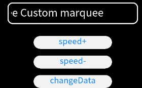

# marquee

The **\<marquee>** component is used to display a scrolling piece of text.

> **NOTE**
>
> This component is supported since API version 4. Updates will be marked with a superscript to indicate their earliest API version.


## Child Components

Not supported


## Attributes

| Name| Type| Default Value| Mandatory| Description|
| -------- | -------- | -------- | -------- | -------- |
| scrollamount | number | 6 | No| Maximum length of each scroll.|
| id | string | - | No| Unique ID of the component.|
| style | string | - | No| Style declaration of the component.|
| class | string | - | No| Style class of the component, which is used to refer to a style table.|
| ref | string | - | No| Reference information of child elements, which is registered with the parent component on **$refs**.|


## Events

| Name| Parameter| Description|
| -------- | -------- | -------- |
| click | - | Triggered when the component is clicked. |
| longpress | - | Triggered when the component is long pressed. |
| swipe<sup>5+</sup> | [SwipeEvent](js-lite-common-events.md) | Triggered when a user quickly swipes on the component. |


## Styles

| Name| Type| Default Value| Mandatory| Description|
| -------- | -------- | -------- | -------- | -------- |
| color | &lt;color&gt; | \#ffffff<br><br><br>| No| Font color of the scrolling text.|
| font-size | &lt;length&gt; | <br>30 | No| Font size of the scrolling text.|
| font-family | string | <br><br>SourceHanSansSC-Regular | No| <br><br>Font. Only the **SourceHanSansSC-Regular** font is supported.|
| width | &lt;length&gt; \| &lt;percentage&gt;<sup>5+</sup> | - | No| Component width.<br><br>If this attribute is not set, the default value **0** is used.|
| height | &lt;length&gt; \| &lt;percentage&gt;<sup>5+</sup> | - | No| Component height.<br><br>If this attribute is not set, the default value **0** is used.|
| padding | &lt;length&gt; | 0 | No| Shorthand attribute to set the padding for all sides.<br>The attribute can have one to four values:<br>- If you set only one value, it specifies the padding for all the four sides.<br>- If you set two values, the first value specifies the top and bottom padding, and the second value specifies the left and right padding.<br>- If you set three values, the first value specifies the top padding, the second value specifies the left and right padding, and the third value specifies the bottom padding.<br>- If you set four values, they respectively specify the padding for top, right, bottom, and left sides (in clockwise order).|
| padding-[left\|top\|right\|bottom] | &lt;length&gt; | 0 | No| Left, top, right, and bottom padding.|
| margin | &lt;length&gt; \| &lt;percentage&gt;<sup>5+</sup> | 0 | No| Shorthand attribute to set the margin for all sides. The attribute can have one to four values:<br>- If you set only one value, it specifies the margin for all the four sides.<br>- If you set two values, the first value specifies the top and bottom margins, and the second value specifies the left and right margins.<br>- If you set three values, the first value specifies the top margin, the second value specifies the left and right margins, and the third value specifies the bottom margin.<br>- If you set four values, they respectively specify the margin for top, right, bottom, and left sides (in clockwise order).|
| margin-[left\|top\|right\|bottom] | &lt;length&gt; \| &lt;percentage&gt;<sup>5+</sup> | 0 | No| Left, top, right, and bottom margins.|
| border-width | &lt;length&gt; | 0 | No| Shorthand attribute to set the border width for all sides.|
| border-color | &lt;color&gt; | black | No| Shorthand attribute to set the color for all borders.|
| border-radius | &lt;length&gt; | - | No| Radius of round-corner borders.|
| background-color | &lt;color&gt; | - | No| Background color.|
| opacity<sup>5+</sup> | number | 1 | No| Opacity of an element. The value ranges from **0** to **1**. The value **1** means opaque, and **0** means completely transparent.|
| display | string | flex | No| How and whether to display the box containing an element. Available values are as follows:<br>- **flex**: flexible layout<br>- **none**: not rendered|
| [left\|top] | &lt;length&gt; \| &lt;percentage&gt;<sup>6+</sup> | - | No| left\|Edge of the element.<br>- **left**: left edge position of the element. This attribute defines the offset between the left edge of the margin area of a positioned element and left edge of its containing block.<br>- **top**: top edge position of the element. This attribute defines the offset between the top edge of a positioned element and that of a block included in the element.|

## Example

```html
<!-- xxx.hml -->
<div class="container">
  <marquee class="customMarquee" scrollamount="{{scrollAmount}}">{{marqueeCustomData}}</marquee>
  <text class="text" onclick="addSpeed">speed+</text>
  <text class="text" onclick="downSpeed">speed-</text>
  <text class="text" onclick="changeData">changeData</text>
</div>
```

```css
/* xxx.css */
.container {
  flex-direction: column;
  width: 100%;
  height: 100%;
  flex-direction: column;
  align-items: center;
}
.customMarquee {
  width: 50%;
  height: 80px;
  padding: 10px;
  margin: 20px;
  border-width: 4px;
  border-color: #ffffff;
  border-radius: 20px;
  font-size: 38px;
}
.text {
  font-size: 30px;
  text-align: center;
  width: 30%;
  height: 10%;
  margin-top: 5%;
  background-color: #f2f2f2;
  border-radius: 40px;
  color: #0d81f2;
}
```

```javascript
// xxx.js
export default {
  data: {
    scrollAmount: 30,
    marqueeCustomData: 'Custom marquee Custom marquee Custom marquee'
  },
  addSpeed() {
    this.scrollAmount++;
  },
  downSpeed() {
    this.scrollAmount--;
  },
  changeData() {
    this.marqueeCustomData = 'Change Data Change Data Change Data';
  }
}
```


