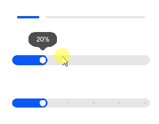

# slider

>  **NOTE**
>
> This component is supported since API version 4. Updates will be marked with a superscript to indicate their earliest API version.

The **\<slider>** component is used to quickly adjust settings, such as the volume and brightness.


## Child Components

Not supported


## Attributes

In addition to the [universal attributes](js-components-common-attributes.md), the following attributes are supported.

| Name| Type| Default Value| Mandatory| Description|
| -------- | -------- | -------- | -------- | -------- |
| min | number | 0 | No| Minimum value of the slider.|
| max | number | 100 | No| Maximum value of the slider.|
| step | number | 1 | No| Step of each slide.|
| value | number | 0 | No| Initial value of the slider.|
| mode<sup>5+</sup> | string | outset | No| Slider style. Available values are as follows:<br>- **outset**: The slider is on the slider track.<br>- **inset**: The slider is in the slider track.|
| showsteps<sup>5+</sup> | boolean | false | No| Whether to display slider scales.|
| showtips<sup>5+</sup> | boolean | false | No| Whether a tooltip is displayed to show the percentage value on the slider.|


## Styles

In addition to the [universal styles](js-components-common-styles.md), the following styles are supported.

| Name| Type| Default Value| Mandatory| Description|
| -------- | -------- | -------- | -------- | -------- |
| color | &lt;color&gt; | #19000000 | No| Background color of the slider.|
| selected-color | &lt;color&gt; | #ff007dff | No| Selected color of the slider.|
| block-color | &lt;color&gt; | \#ffffff | No| Slider color.|


## Events

In addition to the [universal events](js-components-common-events.md), the following events are supported.

| Name| Parameter| Description|
| -------- | -------- | -------- |
| change | ChangeEvent | Triggered when the value changes.|

**Table 1** ChangeEvent

| Attribute| Type| Description|
| -------- | -------- | -------- |
| value<sup>5+</sup> | number | Current value of the slider.|
| mode<sup>5+</sup> | string | Type of the change event. Available values are as follows:<br>- **start**: The **value** starts to change.<br>- **move**: The **value** is changing with users' dragging.<br>- **end**: The **value** stops changing.<br>- **click**: The **value** changes upon a touch on the slider.|


## Example

```html
<!-- xxx.hml -->
<div class="container">
    <slider min="0" max="100" value="{{ value }}" mode="outset" showtips="true"></slider>
    <slider class="" min="0" max="100" value="{{ value }}" step="20" mode="inset"  showtips="true"></slider>
    <slider class="" min="0" max="100" value="{{ value }}" showsteps="true" step="20" mode="inset"  showtips="false"></slider>
</div>
```

```css
/* xxx.css */
.container {
    flex-direction: column;
    justify-content: center;
    align-items: center;
}
slider{
    margin-top: 100px;
}
```



