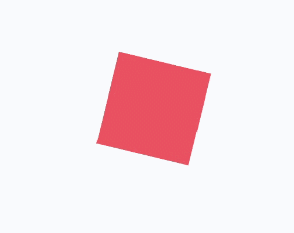

# Animation Styles

> **NOTE**
>
> The initial APIs of this component  are supported since API version 7. Newly added APIs will be marked with a superscript to indicate their earliest API version.

Components support dynamic rotation, translation, and scaling effects. These effects can be set in the **style** attribute or CSS files.

| Name                      | Type                                                         | Description                                                  |
| ------------------------- | ------------------------------------------------------------ | ------------------------------------------------------------ |
| transform-origin          | string<sup>6+</sup> \| \<percentage> \| \<length> string<sup>6+</sup> \| \<percentage> \| \<length> | Origin position of the transformed element. The unit can be px or a percentage (relative to the animation target component). If only one value is specified, the other one is **50%**. The available values for the first string are **left**, **center**, and **right**. The available values for the second string are **top**, **center**, and **bottom**.<br>Example:<br/>transform-origin: 200px 30%<br/>transform-origin: 100px top<br/>transform-origin: center center<br/>Default value: **center center** |
| transform                 | string                                                       | Translation, rotation, and scaling attributes.<br/>For details, see **transform**. |
| animation<sup>6+</sup>               | string                                                       | Animation attributes in the format of **duration \| timing-function \| delay \| iteration-count \| direction \| fill-mode \| play-state \| name**. The order of the parameters is not specified, but the **duration** and **delay** parameters are parsed based on where they are placed.<br/>Default value: 0s&nbsp;ease&nbsp;0s&nbsp;1&nbsp;normal&nbsp;none&nbsp;running&nbsp;none |
| animation-name            | string                                                       | @keyframes rule. For details, see **@keyframes**. |
| animation-delay           | \<time>                                                      | Delay for playing the animation, in ms or s, for example, **1000 ms** or **1s**. The default unit is ms.<br/>Default value: 0 |
| animation-duration        | \<time>                                                      | Animation duration, in ms or s, for example, **1000 ms** or **1s**. The default unit is ms.<br/>**NOTE**<br/>**animation-duration** must be specified. Otherwise, the duration is **0**, which means the animation will not be played.<br/>Default value: **0** |
| animation-iteration-count | number \| infinite                                           | Number of times that an animation is played. The animation is played once by default. You can set the value to **infinite** to play the animation infinitely.<br/>Default value: **1** |
| animation-timing-function | string                                                       | Speed curve of an animation, which makes the animation more fluent.Available values are as follows:  <br>- **linear**: The animation speed keeps unchanged. <br>- **ease**: The animation starts slowly, accelerates, and then slows down towards the end. The cubic-bezier curve (0.25, 0.1, 0.25, 1.0) is used.<br>- **ease-in**: The animation starts at a low speed. The cubic-bezier curve (0.42, 0.0, 1.0, 1.0) is used.<br>- **ease-out**: The animation ends at a low speed. The cubic-bezier curve (0.0, 0.0, 0.58, 1.0) is used.<br>- **ease-in-out**: The animation starts and ends at a low speed. The cubic-bezier curve (0.42, 0.0, 0.58, 1.0) is used.<br>- **friction**: The animation uses the friction cubic-bezier curve (0.2, 0.0, 0.2, 1.0).<br>- **extreme-deceleration**: The animation uses the extreme deceleration cubic-bezier curve (0.0, 0.0, 0.0, 1.0).<br>- **sharp**: The animation uses the sharp cubic-bezier curve (0.33, 0.0, 0.67, 1.0).<br>- **rhythm**: The animation uses the rhythm cubic-bezier curve (0.7, 0.0, 0.2, 1.0).<br>- **smooth**: The animation uses the smooth cubic-bezier curve (0.4, 0.0, 0.4, 1.0).<br>- **cubic-bezier**: You can customize an animation speed curve in the **cubic-bezier()** function. The x and y values of each input parameter must be between 0 and 1.<br>- **steps**: The animation uses the step curve<sup>6+</sup>. The syntax is as follows: steps(number[, end\|start]), where the first parameter **number** is mandatory and must be a positive integer; the second parameter is optional and indicates that the start point or end point (default) of each interval changes step by step.<br/>Default value: **ease** |
| animation-direction<sup>6+</sup>     | string                                                       | Mode of playing the animation.   <br>- **normal**: Plays the animation in forward loop mode.  <br>- **reverse**: Plays the animation in reverse loop mode.  <br>- **alternate**: Plays the animation in alternating loop mode. When the animation is played for an odd number of times, the playback is in forward direction. When the animation is played for an even number of times, the playback is in backward direction.  <br>- **alternate-reverse**: Plays the animation in reverse-alternating loop mode. When the animation is played for an odd number of times, the playback is in backward direction. When the animation is played for an even number of times, the playback is in forward direction.<br/>Default value: **normal** |
| animation-fill-mode       | string                                                       | Start and end styles of the animation   <br>- **none**: No style is applied to the target before or after the animation is executed.  <br>- **forwards**: The target keeps the state at the end of the animation (defined in the last key frame) after the animation is executed.  <br>- **backwards**<sup>6+</sup>: The animation uses the value defined in the first key frame during the **animation-delay**. When **animation-direction** is set to **normal** or **alternate**, the value in the **from** key frame is used. When **animation-direction** is set to **reverse** or **alternate-reverse**, the value in the **to** key frame is used.  <br>- **both**<sup>6+</sup>: The animation follows the **forwards** and **backwards** rules.<br/>Default value: none |
| animation-play-state<sup>6+</sup>    | string                                                       | Current state of the animation.  <br>- **paused**: paused  <br>- **running**: playing<br/>Default value: **running** |
| transition<sup>6+</sup>              | string                                                       | Transition effect when the component status is switched. The following four attributes can be set through the **transition** attribute.<br>- **transition-property**: name of the CSS property for setting the transition effect. Currently, the width, height, and background color are supported.  <br>- **transition-duration**: duration required for completing the transition effect, in seconds.  <br>- **transition-timing-function**: time curve of the transition effect. The curve provided by the style animation is supported.  <br>- **transition-delay**: delay for starting the transition effect, in seconds.<br/>Default value: **all&nbsp;0&nbsp;ease&nbsp;0** |

**Table 1** transform

| Name          | Type                                   | Description                                                  |
| ------------- | -------------------------------------- | ------------------------------------------------------------ |
| none<sup>6+</sup>        | -                                      | Does not perform any transformation. |
| matrix<sup>6+</sup>      | \<number>                              | Defines a matrix of six values, which represent scaleX, skewY, skewX, scaleY, translateX, translateY. |
| matrix3d<sup>6+</sup>    | \<number>                              | Defines a 4 x 4 matrix of 16 values.                          |
| translate     | \<length> \| \<percent>                | Moves an element in 2D space.      |
| translate3d<sup>6+</sup> | \<length> \| \<percent>                | Moves an element in 3D space. There are three input parameters, indicating the translation distance of the x-axis, y-axis, and z-axis, respectively. |
| translateX    | \<length> \| \<percent>                | Moves an element along the x-axis.                           |
| translateY    | \<length> \| \<percent>                | Moves an element along the y-axis.                           |
| translateZ<sup>6+</sup>  | \<length> \| \<percent>                | Moves an element along the z-axis. |
| scale         | \<number>                              | Resizes an element in 2D space. You need to set the target width and height on the x-axis and y-axis. |
| scale3d<sup>6+</sup>     | \<number>                              | Resizes an element in 3D space. There are three input parameters, indicating the scale ratio of the x-axis, y-axis, and z-axis, respectively. |
| scaleX        | \<number>                              | Resizes an element along the x-axis. |
| scaleY        | \<number>                              | Resizes an element along the y-axis. |
| scaleZ<sup>6+</sup>      | \<number>                              | Resizes an element along the z-axis. |
| rotate        | \<deg> \| \<rad> \| \<grad><sup>6+</sup> \| \<turn><sup>6+</sup> | Rotates an element in 2D space. You can set the element to rotate around its x-axis or y-axis. |
| rotate3d<sup>6+</sup>    | \<deg> \| \<rad> \| \<grad> \| \<turn> | Rotates an element in 3D space. There are four input parameters: The first three parameters are the rotation vectors of the x-axis, y-axis, and z-axis, and the fourth parameter is the rotation angle. |
| rotateX       | \<deg> \| \<rad> \| \<grad><sup>6+</sup> \| \<turn><sup>6+</sup> | Rotates an element around the x-axis.                        |
| rotateY       | \<deg> \| \<rad> \| \<grad><sup>6+</sup> \| \<turn><sup>6+</sup> | Rotates an element around the y-axis.                        |
| rotateZ<sup>6+</sup>     | \<deg> \| \<rad> \| \<grad> \| \<turn> | Rotates an element around the z-axis. |
| skew<sup>6+</sup>        | \<deg> \| \<rad> \| \<grad> \| \<turn> | Skews an element in 2D space. There are two input parameters, indicating the 2D skew angle of the x-axis and y-axis, respectively. |
| skewX<sup>6+</sup>       | \<deg> \| \<rad> \| \<grad> \| \<turn> | Skews an element along the x-axis in 2D space. |
| skewY<sup>6+</sup>       | \<deg> \| \<rad> \| \<grad> \| \<turn> | Skews an element along the y-axis in 2D space. |
| perspective<sup>6+</sup> | \<number>                              | Sets the distance from the lens to the element's surface in the 3D perspective scenario. |

**Table 2** @keyframes

| Name                  | Type                                                         | Default Value | Description                                                  |
| --------------------- | ------------------------------------------------------------ | ------------- | ------------------------------------------------------------ |
| background-color      | \<color>                                                     | -             | Background color applied to the component after the animation is played. |
| opacity               | number                                                       | 1             | Opacity value applied to the component after the animation is played. The value ranges from **0** to **1**. The default value is **1**. |
| width                 | \<length>                                                    | -             | Width value applied to the component after the animation is played. |
| height                | \<length>                                                    | -             | Height value applied to the component after the animation is played. |
| transform             | string                                                       | -             | Transformation type applied to the component. For details, see **transform**. |
| background-position<sup>6+</sup> | string \| \<percentage> \| \<length> string \| \<percentage> \| \<length> | 50% 50%       | Position of the background image. The unit can be percentage or px. The first value indicates the horizontal position, and the second value indicates the vertical position. If only one value is specified, the other one is **50%**. The available values for the first string are **left**, **center**, and **right**. The available values for the second string are **top**, **center**, and **bottom**.<br>Example:<br>- background-position: 200px 30%<br>- background-position: 100px top<br>- background-position: center center |

If there is no default value for when an animation will start or end, use **from** and **to** to specify the start and end of the display. You can use a percentage value to specify an intermediate state of the animation.<sup>6+</sup> The following is an example:

```html
<!-- xxx.hml -->
<div class="container">
  <div class="rect">
  </div>
</div>
```

```css
/* xxx.css */
.container {
  display: flex;
  justify-content: center;
  align-items: center;
  margin: 150px;
}
.rect{
  width: 200px;
  height: 200px;
  background-color: #f76160;
  animation: Go 3s infinite;
}
@keyframes Go
{
  from {
    background-color: #f76160;
    transform:translate(100px) rotate(0deg) scale(1.0);
  }
  /* Specify the intermediate state of the animation by a percentage value.<sup>6+</sup> */
  50% {
    background-color: #f76160;
    transform:translate(100px) rotate(60deg) scale(1.3);
  }
  to {
    background-color: #09ba07;
    transform:translate(100px) rotate(180deg) scale(2.0);
  }
}
```



```html
<!-- xxx.hml -->
<div class="container">
  <div class="simpleAnimation simpleSize" style="animation-play-state: {{playState}}"></div>
  <text onclick="toggleState">animation-play-state: {{playState}}</text>
</div>
```

```css
/* xxx.css */
.container {
  flex-direction: column;
  justify-content: center;
  align-items: center;
}
.simpleSize {
  background-color: blue;
  width: 100px;
  height: 100px;
}
.simpleAnimation {
  animation: simpleFrames 9s;
}
@keyframes simpleFrames {
  from { transform: translateX(0px); }
  to { transform: translateX(100px); }
}
```

```js
// xxx.js
export default {
  data: {
    title: "",
    playState: "running"
  },
  toggleState() {
    if (this.playState ===  "running") {
      this.playState = "paused";
    } else {
      this.playState = "running";
    }
  }
}
```


```html
<!-- xxx.hml -->
<div id='img' class="img"></div>
```

```css
/* xxx.css */
.img {
  width: 294px;
  height: 233px;
  background-image: url('common/heartBeat.jpg');
  background-repeat: no-repeat;
  background-position: 0% 0%;
  background-size: 900%;
  animation-name: heartBeating;
  animation-duration: 1s;
  animation-delay: 0s;
  animation-fill-mode: forwards;
  animation-iteration-count: -1;
  animation-timing-function: steps(8, end);
}

@keyframes heartBeating {
  from { background-position: 0% 0%;}
  to { background-position: 100% 0%;}
}
```

```html
<!-- xxx.hml -->
<div class="container">
  <div class="content"></div>
</div>
```

```css
/* xxx.css */
.container {
    flex-direction: column;
    justify-content: center;
    align-items: center;
}
.content { /* Component state 1 */
    height: 200px;
    width: 200px;
    background-color: red;
    transition: all 5s ease 0s;
}
.content:active { /* Component state 2 */
    height: 400px;
    width: 400px;
    background-color: blue;
    transition: all 5s linear 0s;
}
```


> **NOTE**
>
> The @keyframes rule with **from** and **to** defined cannot be dynamically bound to an element.
>
> The following figure shows the meanings of **end** and **start** in the **steps** function.
>
> 