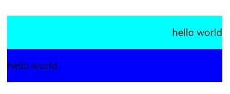

# Universal Attributes

>  **NOTE**
>
>  Universal attributes are supported since API version 4. Updates will be marked with a superscript to indicate their earliest API version.

## Common Attributes

Common attributes are used to set component identities and appearance.

| Name                       | Type     | Default Value  | Mandatory  | Description                                      |
| ------------------------- | ------- | ----- | ---- | ---------------------------------------- |
| id                        | string  | -     | No   | Unique ID of the component.                                |
| style                     | string  | -     | No   | Style declaration of the component.                                |
| class                     | string  | -     | No   | Style class of the component, which is used to refer to a style table.                         |
| ref                       | string  | -     | No   | Reference information of child elements or child components, which is registered with the parent component on `$refs`.|
| disabled                  | boolean | false | No   | Whether the component is disabled. If it is disabled, it cannot respond to user interaction.           |
| data                      | string  | -     | No   | Attribute set for the component to facilitate data storage and reading. In the JS file:<br>- Use **e.target.attr.data** to read data in the event callback, where **e** is the input parameter.<br>- Use `$element` or `$refs` to obtain a DOM element, which can then be accessed through **attr.data**.<br>You are advised to use **data-*** instead since API version 6.|
| data-\*<sup>6+</sup>      | string  | -     | No   | Attribute set for the component to facilitate data storage and reading. The value is case insensitive. For example, **data-A** and **data-a** are the same by default. In the JS file:<br>- Use **e.target.dataSet.a** to read data in the event callback, where **e** is the input parameter.<br>- After a DOM element is obtained by using **$element** or **$refs**, it can be accessed through **dataSet.a**.|
| click-effect<sup>5+</sup> | string  | -     | No   | Click effect complying with spring physics. Available values are as follows:<br>- **spring-small**: The component scales down to 90% of its size when it is selected. This is appropriate for small components.<br>- **spring-medium**: The component scales down to 95% of its size when it is selected. This is appropriate for medium-sized components.<br>- **spring-large**: The component scales down to 95% of its size when it is selected. This is appropriate for large components.|
| dir<sup>6+</sup>          | string  | auto  | No   | Element layout mode. Available values are as follows:<br>- **rtl**: right-to-left layout.<br>- **ltr**: left-to-right layout.<br>- **auto**: follows the system language environment.|


## Rendering Attributes

Rendering attributes are used to set whether a component is rendered.

| Name  | Type     | Default Value | Description                      |
| ---- | ------- | ---- | ------------------------ |
| for  | Array   | -    | Expands the current element based on the configured data list.       |
| if   | boolean | -    | Whether the element is added or removed.|
| show | boolean | -    | Whether the element is displayed or hidden.|

>  **NOTE**
>
>  Do not set styles in attribute fields.

## Example

### Example 1

```html
<!-- xxx.hml -->
<div id="container">
    <button class="btn" type="capsule" value="toggleDisplay" onclick="toggleDisplay"></button>
	<list class="list">
		<list-item for="{{ array }}" class="listItem">
			<text class="text" onclick="toggleShow" show="{{ visible }}"
                  if="{{ display }}">{{ $item.value }}</text>
		</list-item>
	</list>
</div>
```

```css
/* xxx.css */
#container {
    flex-direction: column;
    width: 100%;
    margin-top: 10px;
}
.text {
    font-size: 50px;
    font-weight: 500;
    margin-left: 12px;
}
.listItem {
    width: 100%;
    height: 100px;
    line-height: 60px;
    border-bottom: 1px solid #DEDEDE;
    font-size: 20px;
}
.btn{
    width: 280px;
    font-size: 26px;
    margin: 10px 0;
}
```

```js
// xxx.js
export default {
	data: {
        visible: true,
        display: true,
        title: "",
        i: 4,
        array: [
            {"value": "Item 0"},
            {"value": "Item 1"},
            {"value": "Item 2"},
            {"value": "Item 3"},
        ],
    },
    toggleShow: function() {
        this.array.push ({"value": "Item" + this.i })
        this.i++
    },
    toggleDisplay: function() {
        this.display = !this.display
    },
}
```


### Example 2

```html
<!-- xxx.hml -->
<div class="container">
    <div>
        <text class="text1" dir='rtl' >hello world</text>
    </div>
    <div>
        <text class="text2" dir='ltr' >hello world</text>
    </div>
</div>
```

```css
/* xxx.css */
.container {
    display: flex;
    flex-direction: column;
    justify-content: center;
    align-items: center;
    width: 100%;
    height: 100%;
}
.text1{
    width: 90%;
    height: 100px;
    background-color: aqua;
}
.text2{
    width: 90%;
    height: 100px;
    background-color: blue;
}
```


