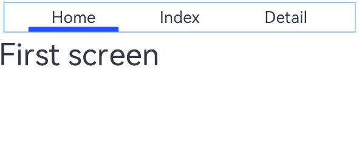

# tabs

>  **NOTE**
>
>  This component is supported since API version 4. Updates will be marked with a superscript to indicate their earliest API version.

The **\<tabs>** component provides a tab container.

## Required Permissions

None


## Child Components

Only [\<tab-bar>](js-components-container-tab-bar.md) and [\<tab-content>](js-components-container-tab-content.md) are supported.

## Attributes

In addition to the [universal attributes](js-components-common-attributes.md), the following attributes are supported.

| Name      | Type     | Default Value  | Mandatory  | Description                                      |
| -------- | ------- | ----- | ---- | ---------------------------------------- |
| index    | number  | 0     | No   | Index of the active tab.                          |
| vertical | boolean | false | No   | Whether the tab is vertical. Available values are as follows:<br>- **false**: The **\<tab-bar>** and **\<tab-content>** are arranged vertically.<br>- **true**: The **\<tab-bar>** and **\<tab-content>** are arranged horizontally. |


## Styles

The [universal styles](js-components-common-styles.md) are supported.


## Events

In addition to the [universal events](js-components-common-events.md), the following events are supported.

| Name    | Parameter                                  | Description                           |
| ------ | ------------------------------------ | ----------------------------- |
| change | { index: indexValue } | Triggered upon tab switching. This event is not triggered when the **index** value is dynamically changed.|


## Example

```html
<!-- xxx.hml -->
<div class="container">
  <tabs class = "tabs" index="0" vertical="false" onchange="change">
    <tab-bar class="tab-bar" mode="fixed">
      <text class="tab-text">Home</text>
      <text class="tab-text">Index</text>
      <text class="tab-text">Detail</text>
    </tab-bar>
    <tab-content class="tabcontent" scrollable="true">
      <div class="item-content" >
        <text class="item-title">First screen</text>
      </div>
      <div class="item-content" >
        <text class="item-title">Second screen</text>
      </div>
      <div class="item-content" >
        <text class="item-title">Third screen</text>
      </div>
    </tab-content>
  </tabs>
</div>
```

```css
/* xxx.css */
.container {
  flex-direction: column;
  justify-content: flex-start;
  align-items: center;
}
.tabs {
  width: 100%;
}
.tabcontent {
  width: 100%;
  height: 80%;
  justify-content: center;
}
.item-content {
  height: 100%;
  justify-content: center;
}
.item-title {
  font-size: 60px;
}
.tab-bar {
  margin: 10px;
  height: 60px;
  border-color: #007dff;
  border-width: 1px;
}
.tab-text {
  width: 300px;
  text-align: center;
}
```

```js
// xxx.js
export default {
  change: function(e) {
    console.log("Tab index: " + e.index);
  },
}
```


