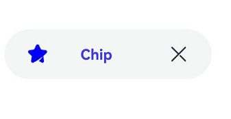
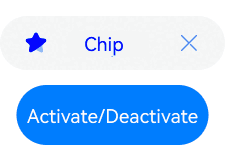
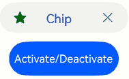

# Chip

The chip component is typically used in the search box history or email address list.

> **NOTE**
>
> This component is supported since API version 11. Updates will be marked with a superscript to indicate their earliest API version.

## Modules to Import

```ts
import { Chip, ChipOptions, ChipSize } from '@kit.ArkUI';
```

## Child Components

Not supported

## Chip

Chip({options:ChipOptions})

**Decorator**: @Builder

**Atomic service API**: This API can be used in atomic services since API version 12.

**System capability**: SystemCapability.ArkUI.ArkUI.Full

**Parameters**

| Name   | Type                       | Mandatory| Decorator| Description                |
| ------- | --------------------------- | ---- | ---------- | -------------------- |
| options | [ChipOptions](#chipoptions) | Yes  | @Builder   | Parameters of the chip.|

## ChipOptions

Defines the type and style parameters of the chip.

**System capability**: SystemCapability.ArkUI.ArkUI.Full

| Name           | Type                                                        | Mandatory| Description                                                        |
| --------------- | ------------------------------------------------------------ | ---- | ------------------------------------------------------------ |
| size            | [ChipSize](#chipsize) \| [SizeOptions](ts-types.md#sizeoptions) | No  | Size of the chip.<br>Default value: **ChipSize**: **ChipSize.NORMAL**<br>   If of the SizeOptions type, this parameter cannot be set in percentage.<br>**Atomic service API**: This API can be used in atomic services since API version 12.|
| enabled         | boolean                                                      | No  | Whether the chip can be selected.<br>Default value: **true**<br>**Atomic service API**: This API can be used in atomic services since API version 12.|
| activated      | boolean                                        | No  | Whether the chip is activated.<br>Default value: **false**<br>**Atomic service API**: This API can be used in atomic services since API version 12.                     |
| prefixIcon      | [PrefixIconOptions](#prefixiconoptions)                      | No  | Prefix icon of the chip.<br>**Atomic service API**: This API can be used in atomic services since API version 12.|
| prefixSymbol   | [ChipSymbolGlyphOptions](#chipsymbolglyphoptions12)              | No  | Symbol-type prefix icon of the chip.<br>**Atomic service API**: This API can be used in atomic services since API version 12.|
| label           | [LabelOptions](#labeloptions)                                | Yes  | Text of the chip.<br>**Atomic service API**: This API can be used in atomic services since API version 12.  |
| suffixIcon      | [SuffixIconOptions](#suffixiconoptions)                      | No  | Suffix icon of the chip.<br>**Atomic service API**: This API can be used in atomic services since API version 12.|
| suffixSymbol    | [ChipSymbolGlyphOptions](#chipsymbolglyphoptions12)              | No  | Symbol-type suffix icon of the chip.<br>**Atomic service API**: This API can be used in atomic services since API version 12.|
| suffixSymbolOptions<sup>14+</sup> | [ChipSuffixSymbolGlyphOptions](#chipsuffixsymbolglyphoptions14) | No| Accessibility settings of the symbol-type suffix icon.<br>**Atomic service API**: This API can be used in atomic services since API version 14.|
| backgroundColor | [ResourceColor](ts-types.md#resourcecolor)                   | No  | Background color of the chip.<br>Default value: **$r('sys.color.ohos_id_color_button_normal')**<br>**Atomic service API**: This API can be used in atomic services since API version 12.|
| activatedBackgroundColor | [ResourceColor](ts-types.md#resourcecolor)          | No  | Background color of the chip when it is activated.<br>Default value: **$r('sys.color.ohos_id_color_emphasize').**<br>**Atomic service API**: This API can be used in atomic services since API version 12.|
| borderRadius    | [Dimension](ts-types.md#dimension10)                         | No  | Border radius of the chip. This parameter cannot be set in percentage.<br>Default value: **$r('sys.float.ohos_id_corner_radius_button')**<br>**Atomic service API**: This API can be used in atomic services since API version 12.|
| allowClose      | boolean                                                      | No  | Whether to show the close icon.<br>Default value: **true**<br>**Atomic service API**: This API can be used in atomic services since API version 12.|
| onClose         | ()=>void                                                     | No  | Event triggered when the close icon is clicked.<br>**Atomic service API**: This API can be used in atomic services since API version 12.|
| onClicked      | Callback\<void> | No  | Event triggered when the chip is clicked.<br>**Atomic service API**: This API can be used in atomic services since API version 12.                                      |
| direction | [Direction](ts-appendix-enums.md#direction) | No| Layout direction.<br>Default value: **Direction.Auto**<br>**Atomic service API**: This API can be used in atomic services since API version 12.|
| closeOptions<sup>14+</sup> | [CloseOptions](#closeoptions14) | No| Accessibility settings of the default close icon.<br>**Atomic service API**: This API can be used in atomic services since API version 14.|
| accessibilityDescription<sup>14+</sup> | [ResourceStr](ts-types.md#resourcestr) | No| Accessibility description of the chip.<br>**Atomic service API**: This API can be used in atomic services since API version 14.|
| accessibilityLevel<sup>14+</sup> | string | No| Accessibility level of the chip.<br>Default value: **"auto"**<br>**Atomic service API**: This API can be used in atomic services since API version 14.|
| accessibilitySelectedType<sup>14+</sup> | [AccessibilitySelectedType](#accessibilityselectedtype14) | No| Type of selected state for the chip.<br>**Atomic service API**: This API can be used in atomic services since API version 14.|

> **NOTE**
>
> 1. When **suffixSymbol** is provided with an argument, **suffixIcon** and **allowClose** will not take effect. If **suffixSymbol** is not provided, but **suffixIcon** is, **allowClose** still will not take effect. When neither **suffixSymbol** nor **suffixIcon** is provided with arguments, **allowClose** determines whether the deletion icon is displayed.
>
> 2. If **undefined** is assigned to **backgroundColor** or **activatedBackgroundColor**, the default background color is used. If an invalid value is specified, the background color is transparent.
>
> 3. Default font colors for **prefixSymbol** and **suffixSymbol**: **normalFontColor**: **[$r('sys.color.ohos_id_color_primary')]**; **activatedFontColor**: **[$r('sys.color.ohos_id_color_text_primary_contrary')]**. The default value of **fontColor** is **16**.
>
> 4. The default value of **fillColor** is **$r('sys.color.ohos_id_color_secondary')** for **prefixIcon** and **$r('sys.color.ohos_id_color_primary')** for **suffixIcon**. The color parsing of **fillColor** is the same as that of the **Image** component.
>
> 5. The default value of **activatedFillColor** is **$r('sys.color.ohos_id_color_text_primary_contrary')** for **prefixIcon** and **$r('sys.color.ohos_id_color_text_primary_contrary')** for **suffixIcon**. The color parsing of **activatedFillColor** is the same as that of the **Image** component.

## ChipSize

Enumerates the size types of the chip.

**Atomic service API**: This API can be used in atomic services since API version 12.

**System capability**: SystemCapability.ArkUI.ArkUI.Full

| Name  | Value      | Description              |
| ------ | -------- | ------------------ |
| NORMAL | "NORMAL" | Normal size.|
| SMALL  | "SMALL"  | Small size. |

## AccessibilitySelectedType<sup>14+</sup>

Enumerates the selected state types of the chip.

**Atomic service API**: This API can be used in atomic services since API version 14.

**System capability**: SystemCapability.ArkUI.ArkUI.Full

| Name| Value| Description|
| ---- | -- | ---- |
| CLICKED | 0 | Default selected state type of the chip.|
| CHECKED | 1 | Selected state type of the chip when used as a check box.|
| SELECTED | 2 | Selected state type of the chip when used as a radio button.|

## IconCommonOptions

Defines the common icon options of the chip.

**Atomic service API**: This API can be used in atomic services since API version 12.

**System capability**: SystemCapability.ArkUI.ArkUI.Full

| Name     | Type                                      | Mandatory| Description                                                        |
| --------- | ------------------------------------------ | ---- | ------------------------------------------------------------ |
| src       | [ResourceStr](ts-types.md#resourcestr)     | Yes  | Icon source, which can be a specific image path or an image reference.|
| size      | [SizeOptions](ts-types.md#sizeoptions)     | No  | Icon size. This parameter cannot be set in percentage.<br>Default value: **{width: 16,height: 16}**|
| fillColor | [ResourceColor](ts-types.md#resourcecolor) | No  | Icon fill color.|
| activatedFillColor<sup>12+</sup> | [ResourceColor](ts-types.md#resourcecolor) | No  | Icon fill color when the chip is activated.                           |

> **NOTE**
>
> **fillColor** and **activatedFillColor** take effect only when the icon format is SVG.
>

## PrefixIconOptions

Defines the prefix icon options.

Inherits [IconCommonOptions](#iconcommonoptions).

**Atomic service API**: This API can be used in atomic services since API version 12.

**System capability**: SystemCapability.ArkUI.ArkUI.Full

## SuffixIconOptions

Defines the suffix icon options.

Inherits [IconCommonOptions](#iconcommonoptions).

**System capability**: SystemCapability.ArkUI.ArkUI.Full

| Name  | Type      | Mandatory| Description              |
| ------ | ---------- | ---- | ------------------ |
| action | () => void | No  | Action of the suffix icon.<br>**Atomic service API**: This API can be used in atomic services since API version 12.|
| accessibilityText<sup>14+</sup> | [ResourceStr](ts-types.md#resourcestr) | No| Accessibility text of the suffix icon.<br>**Atomic service API**: This API can be used in atomic services since API version 14.|
| accessibilityDescription<sup>14+</sup> | [ResourceStr](ts-types.md#resourcestr) | No| Accessibility description of the suffix icon.<br>**Atomic service API**: This API can be used in atomic services since API version 14.|
| accessibilityLevel<sup>14+</sup> | string | No| Accessibility level of the suffix icon.<br>Default value: **"auto"**<br>**Atomic service API**: This API can be used in atomic services since API version 14.|

## AccessibilityOptions<sup>14+</sup>

Defines the accessibility options of the suffix icon.

**Atomic service API**: This API can be used in atomic services since API version 14.

**System capability**: SystemCapability.ArkUI.ArkUI.Full

| Name| Type| Mandatory| Description|
| ------ | ---------- | ---- | ------------------ |
| accessibilityText | [ResourceStr](ts-types.md#resourcestr) | No| Accessibility text.|
| accessibilityDescription | [ResourceStr](ts-types.md#resourcestr) | No| Accessibility description.|
| accessibilityLevel | string | No| Accessibility level.<br>Default value: **"auto"**|

## ChipSuffixSymbolGlyphOptions<sup>14+</sup>

Defines the accessibility options of the symbol-type suffix icon.

**Atomic service API**: This API can be used in atomic services since API version 14.

**System capability**: SystemCapability.ArkUI.ArkUI.Full

| Name| Type| Mandatory| Description|
| ---- | ---- | --- | ---- |
| action | [VoidCallback](ts-types.md#voidcallback12) | No| Action of the suffix icon.|
| normalAccessibility | [AccessibilityOptions](#accessibilityoptions14) | No| Accessibility settings for the normal state.|
| activatedAccessibility | [AccessibilityOptions](#accessibilityoptions14) | No| Accessibility settings for the activated state.|

## ChipSymbolGlyphOptions<sup>12+</sup>

Defines the prefix and suffix icon options.

**Atomic service API**: This API can be used in atomic services since API version 12.

**System capability**: SystemCapability.ArkUI.ArkUI.Full

| Name  | Type      | Mandatory| Description              |
| ------ | ---------- | ---- | ------------------ |
| normal | [SymbolGlyphModifier](ts-universal-attributes-attribute-modifier.md) | No  | Icon setup event.|
| activated | [SymbolGlyphModifier](ts-universal-attributes-attribute-modifier.md) | No  | Icon setup event when the icon is activated.|

> **NOTE**
>
> Modifying the animation type with **symbolEffect** and setting the animation with **effectStrategy** are not supported.
>

## LabelOptions

Defines the label options of the chip.

**Atomic service API**: This API can be used in atomic services since API version 12.

**System capability**: SystemCapability.ArkUI.ArkUI.Full

| Name       | Type                                      | Mandatory| Description                                                        |
| ----------- | ------------------------------------------ | ---- | ------------------------------------------------------------ |
| text        | string                                     | Yes  | Text content.|
| fontSize    | [Dimension](ts-types.md#dimension10)       | No  | Font size. This parameter cannot be set in percentage.<br>Default value: **$r('sys.float.ohos_id_text_size_button2')**|
| fontColor   | [ResourceColor](ts-types.md#resourcecolor) | No  | Font color.<br>Default value: **$r('sys.color.ohos_id_color_text_primary')**|
| activatedFontColor<sup>12+</sup>   | [ResourceColor](ts-types.md#resourcecolor) | No  | Font color when the chip is activated.<br>Default value: **$r('sys.color.ohos_id_color_text_primary_contrary').**|
| fontFamily  | string                                     | No  | Font family.<br>Default value: **"HarmonyOS Sans"**|
| labelMargin | [LabelMarginOptions](#labelmarginoptions)  | No  | Spacing between the text and the left and right icons.|
| localizedLabelMargin<sup>12+</sup> | [LocalizedLabelMarginOptions](#localizedlabelmarginoptions12) | No| Spacing between the localized text and the left and right icons.<br>Default value: {<br>start:  LengthMetrics.vp(6), end: LengthMetrics.vp(6)<br>} |

## CloseOptions<sup>14+</sup>

Defines the accessibility settings of the close icon. The default value of **accessibilityText** is **Delete**.

Inherits [AccessibilityOptions](#accessibilityoptions14).

**Atomic service API**: This API can be used in atomic services since API version 14.

**System capability**: SystemCapability.ArkUI.ArkUI.Full

## LabelMarginOptions

Defines the spacing between the text and the left and right icons.

**Atomic service API**: This API can be used in atomic services since API version 12.

**System capability**: SystemCapability.ArkUI.ArkUI.Full

| Name | Type                                | Mandatory| Description                                  |
| ----- | ------------------------------------ | ---- | -------------------------------------- |
| left  | [Dimension](ts-types.md#dimension10) | No  | Spacing between the text and the left icon. This parameter cannot be set in percentage.|
| right | [Dimension](ts-types.md#dimension10) | No  | Spacing between the text and the right icon. This parameter cannot be set in percentage.|

## LocalizedLabelMarginOptions<sup>12+</sup>

Defines the spacing between the localized text and the left and right icons.

**Atomic service API**: This API can be used in atomic services since API version 12.

**System capability**: SystemCapability.ArkUI.ArkUI.Full

| Name | Type                                                        | Mandatory| Description                                  |
| ----- | ------------------------------------------------------------ | ---- | -------------------------------------- |
| start | [LengthMetrics](../js-apis-arkui-graphics.md#lengthmetrics12) | No  | Spacing between the text and the left icon. This parameter cannot be set in percentage.|
| end   | [LengthMetrics](../js-apis-arkui-graphics.md#lengthmetrics12) | No  | Spacing between the text and the right icon. This parameter cannot be set in percentage.|

## Example

### Example 1

This example defines a custom chip for the deletion icon.

```ts
import { Chip, ChipSize } from '@kit.ArkUI';

@Entry
@Component
struct Index {
  build() {
    Column({ space: 10 }) {
      Chip({
        prefixIcon: {
          src: $r('app.media.chips'),
          size: { width: 16, height: 16 },
          fillColor: Color.Red
        },
        label: {
          text: "Chip",
          fontSize: 12,
          fontColor: Color.Blue,
          fontFamily: "HarmonyOS Sans",
          labelMargin: { left: 20, right: 30 }
        },
        suffixIcon: {
          src: $r('app.media.close'),
          size: { width: 16, height: 16 },
          fillColor: Color.Red
        },
        size: ChipSize.NORMAL,
        allowClose: false,
        enabled: true,
        backgroundColor: $r('sys.color.ohos_id_color_button_normal'),
        borderRadius: $r('sys.float.ohos_id_corner_radius_button')
      })
    }
  }
}
```


### Example 2

This example implements the default chip for the deletion icon.

```ts
import { Chip, ChipSize } from '@kit.ArkUI';

@Entry
@Component
struct Index {
  build() {
    Column({ space: 10 }) {
      Chip({
        prefixIcon: {
          src: $r('app.media.chips'),
          size: { width: 16, height: 16 },
          fillColor: Color.Blue
        },
        label: {
          text: "Chip",
          fontSize: 12,
          fontColor: Color.Blue,
          fontFamily: "HarmonyOS Sans",
          labelMargin: { left: 20, right: 30 }
        },
        size: ChipSize.NORMAL,
        allowClose: true,
        enabled: true,
        backgroundColor: $r('sys.color.ohos_id_color_button_normal'),
        borderRadius: $r('sys.float.ohos_id_corner_radius_button')
      })
    }
  }
}
```




### Example 3

This example shows how to hide the chip for the deletion icon.

```ts
import { Chip, ChipSize } from '@kit.ArkUI';

@Entry
@Component
struct Index {
  build() {
    Column({ space: 10 }) {
      Chip({
        prefixIcon: {
          src: $r('app.media.chips'),
          size: { width: 16, height: 16 },
          fillColor: Color.Blue
        },
        label: {
          text: "Chip",
          fontSize: 12,
          fontColor: Color.Blue,
          fontFamily: "HarmonyOS Sans",
          labelMargin: { left: 20, right: 30 }
        },
        size: ChipSize.SMALL,
        allowClose: false,
        enabled: true,
        backgroundColor: $r('sys.color.ohos_id_color_button_normal'),
        borderRadius: $r('sys.float.ohos_id_corner_radius_button'),
        onClose:()=>{
          console.log("chip on close")
      }
      })
    }
  }
}
```


### Example 4

This example implements a chip in the activated state.

```ts
import { Chip, ChipSize } from '@kit.ArkUI';

@Entry
@Component
struct Index {
  @State isActivated: boolean = false

  build() {
    Column({ space: 10 }) {
      Chip({
        prefixIcon: {
          src: $r('app.media.chips'),
          size: { width: 16, height: 16 },
          fillColor: Color.Blue,
          activatedFillColor: $r('sys.color.ohos_id_color_text_primary_contrary')
        },
        label: {
          text: "Chip",
          fontSize: 12,
          fontColor: Color.Blue,
          activatedFontColor: $r('sys.color.ohos_id_color_text_primary_contrary'),
          fontFamily: "HarmonyOS Sans",
          labelMargin: { left: 20, right: 30 }
        },
        size: ChipSize.NORMAL,
        allowClose: true,
        enabled: true,
        activated: this.isActivated,
        backgroundColor: $r('sys.color.ohos_id_color_button_normal'),
        activatedBackgroundColor: $r('sys.color.ohos_id_color_emphasize'),
        borderRadius: $r('sys.float.ohos_id_corner_radius_button'),
        onClose:()=>{
          console.log("chip on close")
        },
        onClicked:()=>{
          console.log("chip on clicked")
        }
      })

      Button('Activate/Deactivate').onClick(()=>{
        this.isActivated = !this.isActivated
      })
    }
  }
}
```




### Example 5

This example implements symbol-type prefix and suffix icons for the **Chip** component.

```ts
import { Chip, ChipSize, SymbolGlyphModifier } from '@kit.ArkUI';

@Entry
@Component
struct Index {
  @State isActivated: boolean = false

  build() {
    Column({ space: 10 }) {
      Chip({
        prefixIcon: {
          src: $r('app.media.chips'),
          size: { width: 16, height: 16 },
          fillColor: Color.Blue,
          activatedFillColor: $r('sys.color.ohos_id_color_text_primary_contrary')
        },
		prefixSymbol: {
          normal: new SymbolGlyphModifier($r('sys.symbol.ohos_star')).fontSize(16).fontColor([Color.Green]),
          activated: new SymbolGlyphModifier($r('sys.symbol.ohos_star')).fontSize(16).fontColor([Color.Red]),
		},
        label: {
          text: "Chip",
          fontSize: 12,
          fontColor: Color.Blue,
          activatedFontColor: $r('sys.color.ohos_id_color_text_primary_contrary'),
          fontFamily: "HarmonyOS Sans",
          labelMargin: { left: 20, right: 30 },
        },
        size: ChipSize.NORMAL,
        allowClose: true,
        enabled: true,
        activated: this.isActivated,
        backgroundColor: $r('sys.color.ohos_id_color_button_normal'),
        activatedBackgroundColor: $r('sys.color.ohos_id_color_emphasize'),
        borderRadius: $r('sys.float.ohos_id_corner_radius_button'),
        onClose:()=>{
          console.log("chip on close")
        },
        onClicked:()=>{
          console.log("chip on clicked")
        }
      })

      Button('Activate/Deactivate').onClick(()=>{
        this.isActivated = !this.isActivated
      })
    }
  }
}
```



### Example 6

This example mirrors the layout of the **Chip** component.

```ts

import { Chip, ChipSize,LengthMetrics } from '@kit.ArkUI';

@Entry
@Component
struct ChipPage {

  build() {
    Column() {
      Chip({
        direction: Direction.Rtl,
        prefixIcon: {
          src: $r('app.media.chips'),
          size: { width: 16, height: 16 },
          fillColor: Color.Red,
        },
        label: {
          text: "Chip",
          fontSize: 12,
          fontColor: Color.Blue,
          fontFamily: "HarmonyOS Sans",
          localizedLabelMargin: { start: LengthMetrics.vp(20), end: LengthMetrics.vp(20) },
        },
        suffixIcon: {
          src: $r('app.media.close'),
          size: { width: 16, height: 16 },
          fillColor: Color.Red,
        },
        size: ChipSize.NORMAL,
        allowClose: false,
        enabled: true,
        backgroundColor: $r('sys.color.ohos_id_color_button_normal'),
        borderRadius: $r('sys.float.ohos_id_corner_radius_button')
      })
    }.justifyContent(FlexAlign.Center)
    .width('100%')
    .height('100%')
  }
}
```


### Example 7

This example implements the accessibility feature for a chip with an image-type suffix icon.

```ts

import { Chip, SymbolGlyphModifier } from '@kit.ArkUI';

@Builder
function DefaultFunction(): void {
}

@Component
struct SectionGroup {
  @Prop
  @Require
  title: ResourceStr;
  @BuilderParam
  @Require
  content: () => void = DefaultFunction;

  build() {
    Column({ space: 4 }) {
      Text(this.title)
        .fontColor('#FF666666')
        .fontSize(12)
      Column({ space: 8 }) {
        this.content()
      }
    }
    .alignItems(HorizontalAlign.Start)
    .width('100%')
  }
}

@Component
struct SectionItem {
  @Prop
  @Require
  title: ResourceStr;
  @BuilderParam
  @Require
  content: () => void = DefaultFunction;

  build() {
    Column({ space: 12 }) {
      Text(this.title)
      this.content()
    }
    .backgroundColor('#FFFFFFFF')
    .borderRadius(12)
    .padding(12)
    .width('100%')
  }
}

@Entry
@Component
struct ChipExample2 {
  @State activated: boolean = false;

  build() {
    NavDestination() {
      Scroll() {
        SectionGroup({ title: 'Suffix icon readout' }) {
          SectionItem({ title: 'Custom Readout' }) {
            Chip({
              label: { text: 'Chip' },
              suffixIcon: {
                src: $r('sys.media.ohos_ic_public_cut'),
                accessibilityText: 'Icon',
                accessibilityDescription: 'Usage hints',
                action: () => {
                  this.getUIContext().getPromptAction().showToast({
                    message: 'Suffix icon touched.'
                  });
                }
              },
              onClicked: () => {
                this.getUIContext().getPromptAction().showToast({
                  message: 'Chip touched.'
                });
              }
            })
          }
        }
      }
    }
  }
}
```

### Example 8

This example implements the accessibility feature for a chip with a symbol-type suffix icon.

```ts

import { Chip, SymbolGlyphModifier } from '@kit.ArkUI';

@Builder
function DefaultFunction(): void {
}

@Component
struct SectionGroup {
  @Prop
  @Require
  title: ResourceStr;
  @BuilderParam
  @Require
  content: () => void = DefaultFunction;

  build() {
    Column({ space: 4 }) {
      Text(this.title)
        .fontColor('#FF666666')
        .fontSize(12)
      Column({ space: 8 }) {
        this.content()
      }
    }
    .alignItems(HorizontalAlign.Start)
    .width('100%')
  }
}

@Component
struct SectionItem {
  @Prop
  @Require
  title: ResourceStr;
  @BuilderParam
  @Require
  content: () => void = DefaultFunction;

  build() {
    Column({ space: 12 }) {
      Text(this.title)
      this.content()
    }
    .backgroundColor('#FFFFFFFF')
    .borderRadius(12)
    .padding(12)
    .width('100%')
  }
}

@Entry
@Component
struct ChipExample2 {
  @State activated: boolean = false;

  build() {
    NavDestination() {
      Scroll() {
          SectionGroup({ title: 'Suffix symbol readout' }) {
            SectionItem({ title: 'activatedAccessibility' }) {
              Chip({
                label: { text: 'Chip' },
                activated: true,
                suffixSymbol: {
                  activated: new SymbolGlyphModifier($r('sys.symbol.media_sound'))
                    .fontSize(72),
                },
                suffixSymbolOptions: {
                  activatedAccessibility: {
                    accessibilityText: 'Music',
                    accessibilityDescription: 'Usage hints'
                  },
                  action: () => {
                    this.getUIContext().getPromptAction().showToast({
                      message: 'Suffix symbol touched.'
                    });
                  }
                },
                onClicked: () => {
                  this.getUIContext().getPromptAction().showToast({
                    message: 'Chip touched.'
                  });
                }
              })
            }
            SectionItem({ title: 'normalAccessibility' }) {
              Chip({
                label: { text: 'Chip' },
                suffixSymbol: {
                  normal: new SymbolGlyphModifier($r('sys.symbol.media_sound'))
                    .fontSize(72),
                },
                suffixSymbolOptions: {
                  normalAccessibility: {
                    accessibilityText: 'Music',
                    accessibilityDescription: 'Usage hints'
                  },
                  action: () => {
                    this.getUIContext().getPromptAction().showToast({
                      message: 'Suffix symbol touched.'
                    });
                  }
                },
                onClicked: () => {
                  this.getUIContext().getPromptAction().showToast({
                    message: 'Chip touched.'
                  });
                }
              })
            }
          }
        }
      }
      .padding({
        top: 8,
        bottom: 8,
        left: 16,
        right: 16,
      })
    }
}
```
