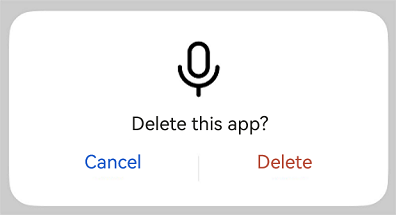
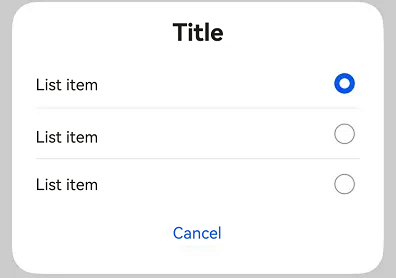
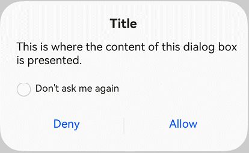
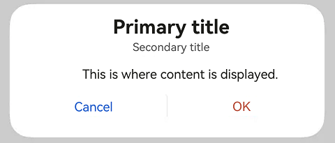
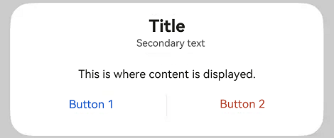
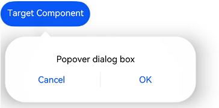
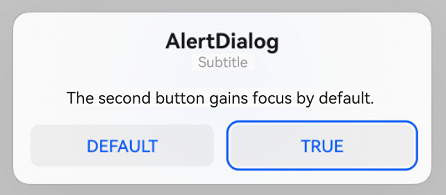

#  Dialog Box (Dialog)


The dialog box is a modal window that commands attention while retaining the current context. It is frequently used to draw the user's attention to vital information or prompt the user to complete a specific task. As all modal windows, this component requires the user to interact before exiting.


> **NOTE**
>
> This component is supported since API version 10. Updates will be marked with a superscript to indicate their earliest API version.


## Modules to Import

```
import { TipsDialog, SelectDialog, ConfirmDialog, AlertDialog, LoadingDialog, CustomContentDialog } from '@kit.ArkUI'
```


## Child Components

Not supported

## Attributes

The [universal attributes](ts-component-general-attributes.md) are not supported.

## TipsDialog


TipsDialog({controller: CustomDialogController, imageRes: Resource, imageSize?: SizeOptions, title?: ResourceStr, content?: ResourceStr, checkTips?: ResourceStr, ischecked?: boolean, checkAction?: (isChecked: boolean) => void, primaryButton?: ButtonOptions, secondaryButton?: ButtonOptions})


Displays an image-attached confirmation dialog box. If necessary, the confirmation dialog box can be displayed in a graphical manner.


**Decorator type**: @CustomDialog


**System capability**: SystemCapability.ArkUI.ArkUI.Full

| Name                         | Type                                                        | Mandatory| Decorator| Description                                                        |
| ----------------------------- | ------------------------------------------------------------ | ---- | ---------- | ------------------------------------------------------------ |
| controller                    | [CustomDialogController](ts-methods-custom-dialog-box.md#customdialogcontroller) | Yes| -          | Dialog box controller.<br>**NOTE**<br>If not decorated by @Require, this parameter is not subject to mandatory validation during construction.<br>**Atomic service API**: This API can be used in atomic services since API version 11.|
| imageRes                      | [ResourceStr<sup>12+</sup>](ts-types.md#resourcestr) \| [PixelMap<sup>12+</sup>](../../apis-image-kit/js-apis-image.md#pixelmap7) | Yes  | -          | Image to be displayed.<br>**Atomic service API**: This API can be used in atomic services since API version 11.|
| imageSize                     | [SizeOptions](ts-types.md#sizeoptions)                       | No  | -          | Image size.<br>Default value: **64*64vp**<br>**Atomic service API**: This API can be used in atomic services since API version 11.|
| title                         | [ResourceStr](ts-types.md#resourcestr)                       | No  | -          | Title of the dialog box.<br>**Atomic service API**: This API can be used in atomic services since API version 11.|
| content                       | [ResourceStr](ts-types.md#resourcestr)                       | No  | -          | Content of the dialog box.<br>**Atomic service API**: This API can be used in atomic services since API version 11.|
| checkTips                     | [ResourceStr](ts-types.md#resourcestr)                       | No  | -          | Content of the check box.<br>**Atomic service API**: This API can be used in atomic services since API version 11.|
| isChecked                     | boolean                                                      | No  | \@Prop     | Whether to select the check box. The value **true** means to select the checkbox , and **false** means the opposite.<br>Default value: **false**<br>**Atomic service API**: This API can be used in atomic services since API version 11.|
| checkAction<sup>12+</sup>     | (isChecked: boolean) => void                                 | No  | -          | Event triggered when the selected status of the check box changes. You are advised to use **onCheckedChange<sup>12+</sup>** instead.<br>**Atomic service API**: This API can be used in atomic services since API version 12.|
| onCheckedChange<sup>12+</sup> | Callback\<boolean>                                           | No  | -          | Event triggered when the selected status of the check box changes.<br>**Atomic service API**: This API can be used in atomic services since API version 12.|
| primaryButton                 | [ButtonOptions](#buttonoptions)                              | No  | -          | Left button of the dialog box.<br>**Atomic service API**: This API can be used in atomic services since API version 11.|
| secondaryButton               | [ButtonOptions](#buttonoptions)                              | No  | -          | Right button of the dialog box.<br>**Atomic service API**: This API can be used in atomic services since API version 11.|
| theme<sup>12+</sup>           | [Theme](../js-apis-arkui-theme.md#theme) \| [CustomTheme](../js-apis-arkui-theme.md#customtheme) | No  | -          | Theme information, which can be a custom theme or a **Theme** instance obtained from **onWillApplyTheme**.<br>**Atomic service API**: This API can be used in atomic services since API version 12.|
| themeColorMode<sup>12+</sup>  | [ThemeColorMode](ts-container-with-theme.md#themecolormode10) | No| -     | Theme color mode of the dialog box.<br>**Atomic service API**: This API can be used in atomic services since API version 12.                                                |

## SelectDialog

SelectDialog({controller: CustomDialogController, title: ResourceStr, content?: ResourceStr, selectedIndex?: number, confirm?: ButtonOptions, radioContent: Array&lt;SheetInfo&gt;})

Displays a dialog box from which the user can select options presented in a list or grid.

**Decorator type**: @CustomDialog

**System capability**: SystemCapability.ArkUI.ArkUI.Full

| Name               | Type                                                        | Mandatory| Description                                                                                                                     |
| ------------------- | ------------------------------------------------------------ | ---- |-------------------------------------------------------------------------------------------------------------------------|
| controller          | [CustomDialogController](ts-methods-custom-dialog-box.md#customdialogcontroller) | Yes| Dialog box controller.<br>**NOTE**<br>If not decorated by @Require, this parameter is not subject to mandatory validation during construction.<br>**Atomic service API**: This API can be used in atomic services since API version 11.                    |
| title               | [ResourceStr](ts-types.md#resourcestr)                       | Yes  | Title of the dialog box.<br>**Atomic service API**: This API can be used in atomic services since API version 11.                                                           |
| content             | [ResourceStr](ts-types.md#resourcestr)                       | No  | Content of the dialog box.<br>**Atomic service API**: This API can be used in atomic services since API version 11.                                                           |
| selectedIndex       | number                                                       | No  | Index of the selected option in the dialog box.<br>Value range: an integer no less than -1<br>The default value is **-1**, indicating that there is no selected option. Values less than -1 are treated as no selected option.<br>**Atomic service API**: This API can be used in atomic services since API version 11.|
| confirm             | [ButtonOptions](#buttonoptions)                              | No  | Button at the bottom of the dialog box.<br>**Atomic service API**: This API can be used in atomic services since API version 11.                                                         |
| radioContent        | Array&lt;[SheetInfo](ts-methods-action-sheet.md#sheetinfo)&gt; | Yes  | List of subitems in the dialog box. You can set text and a select callback for each subitem.<br>**Atomic service API**: This API can be used in atomic services since API version 11.                                  |
| theme<sup>12+</sup> | [Theme](../js-apis-arkui-theme.md#theme) \| [CustomTheme](../js-apis-arkui-theme.md#customtheme) | No  | Theme information, which can be a custom theme or a **Theme** instance obtained from **onWillApplyTheme**.<br>**Atomic service API**: This API can be used in atomic services since API version 12.                  |
| themeColorMode<sup>12+</sup> | [ThemeColorMode](ts-container-with-theme.md#themecolormode10) | No| Theme color mode of the dialog box.<br>**Atomic service API**: This API can be used in atomic services since API version 12.                                                        |

## ConfirmDialog

ConfirmDialog({controller: CustomDialogController, title: ResourceStr, content?: ResourceStr, checkTips?: ResourceStr, ischecked?: boolean, primaryButton?: ButtonOptions, secondaryButton?: ButtonOptions})

Displays an error dialog box that informs the user of an operational error (for example, a network error or low battery level) or an incorrect operation (for example, fingerprint enrollment).

**Decorator type**: @CustomDialog

**System capability**: SystemCapability.ArkUI.ArkUI.Full

| Name                         | Type                                                        | Mandatory| Decorator| Description                                                        |
| ----------------------------- | ------------------------------------------------------------ | ---- | ---------- | ------------------------------------------------------------ |
| controller                    | [CustomDialogController](ts-methods-custom-dialog-box.md#customdialogcontroller) | Yes| -          | Controller of the dialog box.<br>**NOTE**<br>If not decorated by @Require, this parameter is not subject to mandatory validation during construction.<br>**Atomic service API**: This API can be used in atomic services since API version 11.|
| title                         | [ResourceStr](ts-types.md#resourcestr)                       | Yes  | -          | Title of the dialog box.<br>**Atomic service API**: This API can be used in atomic services since API version 11.|
| content                       | [ResourceStr](ts-types.md#resourcestr)                       | No  | -          | Content of the dialog box.<br>**Atomic service API**: This API can be used in atomic services since API version 11.|
| checkTips                     | [ResourceStr](ts-types.md#resourcestr)                       | No  | -          | Content of the check box.<br>**Atomic service API**: This API can be used in atomic services since API version 11.|
| isChecked                     | boolean                                                      | No  | \@Prop     | Whether to select the check box. The value **true** means to select the checkbox , and **false** means the opposite.<br>Default value: **false**<br>**Atomic service API**: This API can be used in atomic services since API version 11.|
| onCheckedChange<sup>12+</sup> | Callback\<boolean>                                           | No  | -          | Event triggered when the selected status of the check box changes.<br>**Atomic service API**: This API can be used in atomic services since API version 12.|
| primaryButton                 | [ButtonOptions](#buttonoptions)                              | No  | -          | Left button of the dialog box.<br>**Atomic service API**: This API can be used in atomic services since API version 11.|
| secondaryButton               | [ButtonOptions](#buttonoptions)                              | No  | -          | Right button of the dialog box.<br>**Atomic service API**: This API can be used in atomic services since API version 11.|
| theme<sup>12+</sup>           | [Theme](../js-apis-arkui-theme.md#theme)\| [CustomTheme](../js-apis-arkui-theme.md#customtheme) | No  | -          | Theme information, which can be a custom theme or a **Theme** instance obtained from **onWillApplyTheme**.<br>**Atomic service API**: This API can be used in atomic services since API version 12.|
| themeColorMode<sup>12+</sup>  | [ThemeColorMode](ts-container-with-theme.md#themecolormode10) | No| -     | Theme color mode of the dialog box.<br>**Atomic service API**: This API can be used in atomic services since API version 12.                                                |


## AlertDialog

AlertDialog({controller: CustomDialogController, primaryTitle?: ResourceStr, secondaryTitle?: ResourceStr, content: ResourceStr, primaryButton?: ButtonOptions, secondaryButton?: ButtonOptions})

Displays an alert dialog box to prompt the user to confirm an action that is irreversible and may cause serious consequences, such as deletion, reset, editing cancellation, and stop.

**Decorator type**: @CustomDialog

**System capability**: SystemCapability.ArkUI.ArkUI.Full

| Name                        | Type                                                        | Mandatory| Description                                                        |
| ---------------------------- | ------------------------------------------------------------ | ---- | ------------------------------------------------------------ |
| controller                   | [CustomDialogController](ts-methods-custom-dialog-box.md#customdialogcontroller) | Yes| Controller of the dialog box.<br>**NOTE**<br>If not decorated by @Require, this parameter is not subject to mandatory validation during construction.<br>**Atomic service API**: This API can be used in atomic services since API version 11.|
| primaryTitle<sup>12+</sup>   | [ResourceStr](ts-types.md#resourcestr)                       | No  | Primary title of the dialog box.<br>**Atomic service API**: This API can be used in atomic services since API version 12.|
| secondaryTitle<sup>12+</sup> | [ResourceStr](ts-types.md#resourcestr)                       | No  | Secondary title of the dialog box.<br>**Atomic service API**: This API can be used in atomic services since API version 12.|
| content                      | [ResourceStr](ts-types.md#resourcestr)                       | Yes  | Content of the dialog box.<br>**Atomic service API**: This API can be used in atomic services since API version 11.|
| primaryButton                | [ButtonOptions](#buttonoptions)                              | No  | Left button of the dialog box.<br>**Atomic service API**: This API can be used in atomic services since API version 11.|
| secondaryButton              | [ButtonOptions](#buttonoptions)                              | No  | Right button of the dialog box.<br>**Atomic service API**: This API can be used in atomic services since API version 11.|
| theme<sup>12+</sup>          | [Theme](../js-apis-arkui-theme.md#theme) \| [CustomTheme](../js-apis-arkui-theme.md#customtheme) | No  | Theme information, which can be a custom theme or a **Theme** instance obtained from **onWillApplyTheme**.<br>**Atomic service API**: This API can be used in atomic services since API version 12.|
| themeColorMode<sup>12+</sup> | [ThemeColorMode](ts-container-with-theme.md#themecolormode10) | No| Theme color mode of the dialog box.<br>**Atomic service API**: This API can be used in atomic services since API version 12.|


## LoadingDialog

LoadingDialog({controller: CustomDialogController, content?: ResourceStr})

Displays a loading dialog box to inform the user of the operation progress.

**Decorator type**: @CustomDialog

**System capability**: SystemCapability.ArkUI.ArkUI.Full

| Name               | Type                                                        | Mandatory| Description                                                        |
| ------------------- | ------------------------------------------------------------ | ---- | ------------------------------------------------------------ |
| Controller         | [CustomDialogController](ts-methods-custom-dialog-box.md#customdialogcontroller) | Yes| Controller of the dialog box.<br>**NOTE**<br>If not decorated by @Require, this parameter is not subject to mandatory validation during construction.<br>**Atomic service API**: This API can be used in atomic services since API version 11.|
| content             | [ResourceStr](ts-types.md#resourcestr)                       | No  | Content of the dialog box.<br>**Atomic service API**: This API can be used in atomic services since API version 11.|
| theme<sup>12+</sup> | [Theme](../js-apis-arkui-theme.md#theme)\| [CustomTheme](../js-apis-arkui-theme.md#customtheme) | No  | Theme information, which can be a custom theme or a **Theme** instance obtained from **onWillApplyTheme**.<br>**Atomic service API**: This API can be used in atomic services since API version 12.|
| themeColorMode<sup>12+</sup> | [ThemeColorMode](ts-container-with-theme.md#themecolormode10) | No| Theme color mode of the dialog box.<br>**Atomic service API**: This API can be used in atomic services since API version 12.|


## CustomContentDialog<sup>12+</sup>

CustomContentDialog({controller: CustomDialogController, contentBuilder: () => void, primaryTitle?: ResourceStr, secondaryTitle?: ResourceStr, contentAreaPadding?: Padding, buttons?: ButtonOptions[]})

Displays a dialog box that contains custom content and operation area.

**Decorator type**: @CustomDialog

**Atomic service API**: This API can be used in atomic services since API version 12.

**System capability**: SystemCapability.ArkUI.ArkUI.Full

| Name               | Type                                                    | Mandatory| Decorator| Description                                                        |
| ------------------- | ------------------------------------------------------------ | ---- | ------------------------------------------------------------ | ------------------------------------------------------------ |
| controller          | [CustomDialogController](ts-methods-custom-dialog-box.md#customdialogcontroller) | Yes| -  | Controller of the dialog box.<br>**NOTE**<br>If not decorated by @Require, this parameter is not subject to mandatory validation during construction.                                              |
| contentBuilder      | () => void                                                   | Yes  | @BuilderParam | Content of the dialog box.                                                |
| primaryTitle        | [ResourceStr](ts-types.md#resourcestr)                       | No  | -  | Primary title of the dialog box.                                                |
| secondaryTitle      | [ResourceStr](ts-types.md#resourcestr)                       | No  | -  | Secondary title of the dialog box.                                            |
| localizedContentAreaPadding | [LocalizedPadding](ts-types.md#localizedpadding12)     | No  | -  | Padding of the content area of the dialog box.                                        |
| contentAreaPadding  | [Padding](ts-types.md#padding)                               | No  | -  | Padding of the content area of the dialog box. This attribute does not take effect when **localizedContentAreaPadding** is set.|
| buttons             | [ButtonOptions](#buttonoptions)[]                     | No  | -  | Buttons in the operation area of the dialog box. A maximum of four buttons are allowed.                         |
| theme | [Theme](../js-apis-arkui-theme.md#theme) \| [CustomTheme](../js-apis-arkui-theme.md#customtheme) | No  | -  | Theme information, which can be a custom theme or a **Theme** instance obtained from **onWillApplyTheme**.|
| themeColorMode | [ThemeColorMode](ts-container-with-theme.md#themecolormode10) | No| - | Theme color mode of the dialog box.|


## PopoverDialog<sup>14+</sup>

PopoverDialog({visible: boolean, popover: PopoverOptions, targetBuilder: Callback\<void>})

Displays a popover dialog box that is positioned relative to the target component. This dialog box can contain a variety of content types, including: TipsDialog, SelectDialog, ConfirmDialog, AlertDialog, LoadingDialog, and CustomContentDialog.

**Decorator**: \@Component

**Atomic service API**: This API can be used in atomic services since API version 14.

**System capability**: SystemCapability.ArkUI.ArkUI.Full

| Name| Type| Mandatory| Decorator| Description|
| -------- | -------- | -------- | -------- | -------- |
| visible | boolean | Yes| \@Link | Whether the popover dialog box is visible.<br>Default value: **false**, indicating that the popover dialog box is hidden|
| popover | [PopoverOptions](#popoveroptions14) | Yes| \@Prop<br>\@Require | Options of the popover dialog box.|
| targetBuilder | Callback\<void> | Yes| \@Require<br>\@BuilderParam | Target component relative to which the popover dialog box is positioned.|


## ButtonOptions

**System capability**: SystemCapability.ArkUI.ArkUI.Full

| Name                     | Type                                                        | Mandatory| Description                                                        |
| ------------------------- | ------------------------------------------------------------ | ---- | ------------------------------------------------------------ |
| value                     | [ResourceStr](ts-types.md#resourcestr)                       | Yes  | Content of the button.<br>**Atomic service API**: This API can be used in atomic services since API version 11.|
| action                    | () =&gt; void                                      | No  | Click event of the button.<br>**Atomic service API**: This API can be used in atomic services since API version 11.|
| background                | [ResourceColor](ts-types.md#resourcecolor)                   | No  | Background of the button.<br>**Atomic service API**: This API can be used in atomic services since API version 11.|
| fontColor                 | [ResourceColor](ts-types.md#resourcecolor)                   | No  | Font color of the button.<br>**Atomic service API**: This API can be used in atomic services since API version 11.|
| buttonStyle<sup>12+</sup> | [ButtonStyleMode](ts-basic-components-button.md#buttonstylemode11) | No  | Style of the button.<br>Default value: **ButtonStyleMode.NORMAL** for 2-in-1 devices and **ButtonStyleMode.TEXTUAL** for other devices<br>**Atomic service API**: This API can be used in atomic services since API version 12.|
| role<sup>12+</sup>        | [ButtonRole](ts-basic-components-button.md#buttonrole12) | No  | Role of the button.<br>Default value: **ButtonRole.NORMAL**<br>**Atomic service API**: This API can be used in atomic services since API version 12.                |
| defaultFocus<sup>18+</sup> | boolean | No  | Whether the button gains focus by default.<br>Default value: **false**<br>**Atomic service API**: This API can be used in atomic services since API version 18.                                                |

>  **NOTE**
>
>  The priority of **buttonStyle** and **role** is higher than that of **fontColor** and **background**. If **buttonStyle** and **role** are at the default values, the settings of **fontColor** and **background** take effect.
> If **defaultFocus** is set for multiple buttons, the default focus is the first button in the display order that has **defaultFocus** set to **true**.

## PopoverOptions<sup>14+</sup>

Defines a set of options used to configure the popover dialog box, including its content and position.

Inherits [CustomPopupOptions](../arkui-ts/ts-universal-attributes-popup.md#custompopupoptions8).

> **NOTE**
>
> The default value of **radius** is **32vp**.

**Atomic service API**: This API can be used in atomic services since API version 14.

**System capability**: SystemCapability.ArkUI.ArkUI.Full

## Events

The [universal events](ts-component-general-events.md) are not supported.

## Example

### Example 1: Dialog Box with an Image Above Text
This example implements a dialog box with an image above the text content, through the use of **imageRes**, **content**, and other properties.

```ts
import { TipsDialog } from '@kit.ArkUI';

@Entry
@Component
struct Index {
  dialogControllerImage: CustomDialogController = new CustomDialogController({
    builder: TipsDialog({
      imageRes: $r('sys.media.ohos_ic_public_voice'),
      content: 'Delete this app?',
      primaryButton: {
        value: 'Cancel',
        action: () => {
          console.info('Callback when the first button is clicked')
        },
      },
      secondaryButton: {
        value: 'Delete',
        role: ButtonRole.ERROR,
        action: () => {
          console.info('Callback when the second button is clicked')
        }
      },
      onCheckedChange: () => {
        console.info('Callback when the checkbox is clicked')
      }
    }),
  })

  build() {
    Row() {
      Stack() {
        Column(){
          Button("Text Below Image")
            .width(96)
            .height(40)
            .onClick(() => {
              this.dialogControllerImage.open()
            })
        }.margin({bottom: 300})
      }.align(Alignment.Bottom)
      .width('100%').height('100%')
    }
    .backgroundImageSize({ width: '100%', height: '100%' })
    .height('100%')
  }
}
```



### Example 2: List-only Dialog Box
This example presents a dialog box consisting solely of a list defined with **selectedIndex** and **radioContent**.

```ts
import { SelectDialog } from '@kit.ArkUI'

@Entry
@Component
struct Index {
  // Set the index of the default selected option.
  radioIndex = 0;
  dialogControllerList: CustomDialogController = new CustomDialogController({
    builder: SelectDialog({
      title:'Title',
      selectedIndex: this.radioIndex,
      confirm: {
        value: 'Cancel',
        action: () => {},
      },
      radioContent: [
        {
          title: 'List item',
          action: () => {
            this.radioIndex = 0
          }
        },
        {
          title: 'List item',
          action: () => {
            this.radioIndex = 1
          }
        },
        {
          title: 'List item',
          action: () => {
            this.radioIndex = 2
          }
        },
      ]
    }),
  })

  build() {
    Row() {
      Stack() {
        Column() {
          Button("List Dialog Box")
            .width(96)
            .height(40)
            .onClick(() => {
              this.dialogControllerList.open()
            })
        }.margin({ bottom: 300 })
      }
      .align(Alignment.Bottom)
      .width('100%')
      .height('100%')
    }
    .backgroundImageSize({ width: '100%', height: '100%' })
    .height('100%')
  }
}
```



### Example 3: Dialog Box with Text and Check Boxes
This example illustrates a dialog box that combines text content with check boxes defined with **content** and **checkTips**.

```ts
import { ConfirmDialog } from '@kit.ArkUI'

@Entry
@Component
struct Index {
  isChecked = false;
  dialogControllerCheckBox: CustomDialogController = new CustomDialogController({
    builder: ConfirmDialog({
      title:'Title',
      content: 'This is where content is displayed. This is where content is displayed.',
      // Selected state of the check box
      isChecked: this.isChecked,
      // Content of the check box
      checkTips: 'Don't ask again after denying',
      primaryButton: {
        value: 'Deny',
        action: () => {},
      },
      secondaryButton: {
        value: 'Allow',
        action: () => {
          this.isChecked = false
          console.info('Callback when the second button is clicked')
        }
      },
      onCheckedChange: () => {
        console.info('Callback when the checkbox is clicked')
      },
    }),
    autoCancel: true,
    alignment: DialogAlignment.Bottom
  })

  build() {
    Row() {
      Stack() {
        Column(){
          Button("Text + Check Box Dialog Box")
            .width(96)
            .height(40)
            .onClick(() => {
              this.dialogControllerCheckBox.open()
            })
        }
        .margin({bottom: 300})
      }
      .align(Alignment.Bottom)
      .width('100%')
      .height('100%')
    }
    .backgroundImageSize({ width: '100%', height: '100%' })
    .height('100%')
  }
}
```



### Example 4: Text-only Dialog Box
This example demonstrates a simple text-only dialog box defined with **primaryTitle**, **secondaryTitle**, and **content**.

```ts
import { AlertDialog } from '@kit.ArkUI'

@Entry
@Component
struct Index {
  dialogControllerConfirm: CustomDialogController = new CustomDialogController({
    builder: AlertDialog({
      primaryTitle: 'Primary title',
      secondaryTitle: 'Secondary title',
      content: 'This is where content is displayed.',
      primaryButton: {
        value: 'Cancel',
        action: () => {
        },
      },
      secondaryButton: {
        value: 'OK',
        role: ButtonRole.ERROR,
        action: () => {
          console.info('Callback when the second button is clicked')
        }
      },
    }),
  })

  build() {
    Row() {
      Stack() {
        Column() {
          Button("Text Dialog Box")
            .width(96)
            .height(40)
            .onClick(() => {
              this.dialogControllerConfirm.open()
            })
        }
        .margin({ bottom: 300 })
      }
      .align(Alignment.Bottom)
      .width('100%')
      .height('100%')
    }
    .backgroundImageSize({ width: '100%', height: '100%' })
    .height('100%')
  }
}
```



### Example 5: Loading Dialog Box
This example implements a loading dialog box that contains a progress indicator.

```ts
import { LoadingDialog } from '@kit.ArkUI'

@Entry
@Component
struct Index {
  dialogControllerProgress: CustomDialogController = new CustomDialogController({
    builder: LoadingDialog({
      content: 'This is where content is displayed.',
    }),
  })

  build() {
    Row() {
      Stack() {
        Column() {
          Button("Progress Dialog Box")
            .width(96)
            .height(40)
            .onClick(() => {
              this.dialogControllerProgress.open()
            })
        }
        .margin({ bottom: 300 })
      }
      .align(Alignment.Bottom)
      .width('100%')
      .height('100%')
    }
    .backgroundImageSize({ width: '100%', height: '100%' })
    .height('100%')
  }
}
```


### Example 6: Dialog Box with a Custom Theme
This example presents a dialog box with a custom theme, through the use of **content**, **theme**, and other properties.

```ts
import { CustomColors, CustomTheme, LoadingDialog } from '@kit.ArkUI'

class CustomThemeImpl implements CustomTheme {
  colors?: CustomColors;

  constructor(colors: CustomColors) {
    this.colors = colors;
  }
}

// Custom text content and colors for the dialog box theme
class CustomThemeColors implements CustomColors {
  fontPrimary = '#ffd0a300';
  iconSecondary = '#ffd000cd';
}

@Entry
@Component
struct Index {
  @State customTheme: CustomTheme = new CustomThemeImpl(new CustomThemeColors());
  dialogController: CustomDialogController = new CustomDialogController({
    builder: LoadingDialog({
      content: 'text',
      theme: this.customTheme,
    })
  });

  build() {
    Row() {
      Stack() {
        Column() {
          Button('dialog')
            .width(96)
            .height(40)
            .onClick(() => {
              this.dialogController.open();
            })
        }
        .margin({ bottom: 300 })
      }
      .align(Alignment.Bottom)
      .width('100%')
      .height('100%')
    }
    .backgroundImageSize({ width: '100%', height: '100%' })
    .height('100%')
  }
}
```


### Example 7: Dialog Box in Custom Color Mode
This example presents a dialog box in the specified light or dark mode, through the use of **content**, **themeColorMode**, and other properties.

```ts
import { LoadingDialog } from '@kit.ArkUI'

@Entry
@Component
struct Index {
  dialogController: CustomDialogController = new CustomDialogController({
    builder: LoadingDialog({
      content: 'Text',
      themeColorMode: ThemeColorMode.DARK, // Set the color mode to dark mode.
    })
  });

  build() {
    Row() {
      Stack() {
        Column() {
          Button('Dialog')
            .width(96)
            .height(40)
            .onClick(() => {
              this.dialogController.open();
            })
        }
        .margin({ bottom: 300 })
      }
      .align(Alignment.Bottom)
      .width('100%')
      .height('100%')
    }
    .backgroundImageSize({ width: '100%', height: '100%' })
    .height('100%')
  }
}
```


### Example 8: Dialog Box with Custom Content
This example implements a dialog box with custom content defined with **contentBuilder** and **buttons**.

```ts
import { CustomContentDialog } from '@kit.ArkUI'

@Entry
@Component
struct Index {
  dialogController: CustomDialogController = new CustomDialogController({
    builder: CustomContentDialog({
      primaryTitle: 'Primary title',
      secondaryTitle: 'Secondary title',
      contentBuilder: () => {
        this.buildContent();
      },
      buttons: [
        { 
          value: 'Button 1',
          buttonStyle: ButtonStyleMode.TEXTUAL, 
          action: () => {
            console.info('Callback when the button is clicked')
          }
        },
        {
          value: 'Button 2',
          buttonStyle: ButtonStyleMode.TEXTUAL,
          role: ButtonRole.ERROR
        }
      ],
    }),
  });

  build() {
    Column() {
      Button("Dialog Box with Custom Content")
        .onClick(() => {
          this.dialogController.open()
        })
    }
    .width('100%')
    .height('100%')
    .justifyContent(FlexAlign.Center)
  }
  
  // Custom content area of the dialog box
  @Builder
  buildContent(): void {
    Column() {
      Text('Content area')
    }
    .width('100%')
  }
}
```



### Example 9: Popover Dialog Box
This example demonstrates a popover dialog box for alert purposes, through the use of **visible**, **popover**, **targetBuilder**, and other properties.

```ts
import { AlertDialog, PopoverDialog, PopoverOptions } from '@kit.ArkUI';

@Entry
@Component
struct Index {
  @State isShow: boolean = false;
  @State popoverOptions: PopoverOptions = {
    builder: () => {
      this.dialogBuilder();
    },
    width: 320,
  }
  
  // Content of the popover dialog box
  @Builder dialogBuilder() {
    AlertDialog({
      content: 'Popover dialog box',
      primaryButton: {
        value: 'Cancel',
        action: () => {
          this.isShow = false;
        },
      },
      secondaryButton: {
        value: 'OK',
        action: () => {
          this.isShow = false;
        },
      },
    });
  }
  
  // Builder for the button that triggers the popover dialog box
  @Builder buttonBuilder() {
    Button('Target Component')
    .onClick(() => {
      this.isShow = true;
    });
  }

  build() {
    Column() {
      PopoverDialog({
        visible: this.isShow,
        popover: this.popoverOptions,
        targetBuilder: () => {
          this.buttonBuilder();
        },
      })
    }
  }
}
```



### Example 10: Setting the Default Focus Button for a Dialog Box
This example demonstrates how to set a default focus button in a dialog box using **AlertDialog**, including the **defaultFocus** property.

```ts
import { AlertDialog } from '@kit.ArkUI'

@Entry
@Component
struct Index {
  dialogController: CustomDialogController = new CustomDialogController({
    builder: AlertDialog({
      primaryTitle: 'AlertDialog',
      secondaryTitle: 'Subtitle',
      content: 'The second button gains focus by default.',
      primaryButton: {
        value: 'DEFAULT',
        action: () => {}
      },
      secondaryButton: {
        value: 'TRUE',
        defaultFocus: true, // Set the button as the default focus button.
        action: () => {}
      },
    })
  });

  build() {
    Row() {
      Stack() {
        Column() {
          Button("AlertDialog")
            .width(96)
            .height(40)
            .onClick(() => {
              this.dialogController.open()
            })
        }
        .margin({ bottom: 300 })
      }
      .align(Alignment.Bottom)
      .width('100%')
      .height('100%')
    }
    .backgroundImageSize({ width: '100%', height: '100%' })
    .height('100%')
  }
}
```

