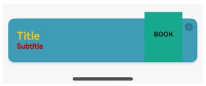
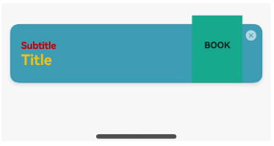

# @ohos.atomicservice.InterstitialDialogAction (Dialog Box)

The **InterstitialDialogAction** component is a dialog box used in atomic services to temporarily display information that requires user attention or actions to be taken while maintaining the current context. Users can trigger corresponding actions by clicking different areas of the dialog box.

> **NOTE**
>
> This component is supported since API version 12. Updates will be marked with a superscript to indicate their earliest API version.

## Modules to Import

```
import { InterstitialDialogAction, IconStyle, TitlePosition, BottomOffset } from '@kit.ArkUI';
```

## Child Components

Not supported

## Attributes

The [universal attributes](ts-universal-attributes-size.md) are not supported.

## InterstitialDialogAction

InterstitialDialogAction {
    uiContext: UIContext,
    contentNode: ComponentContent\<object\>,
    dialogParam: DialogParams,
    bottomOffsetType?: BottomOffset,
    constructor: (dialogOptions: DialogOptions),
    openDialog(): Callback\<void\>,
    closeDialog(): Callback\<void\>
}

**Atomic service API**: This API can be used in atomic services since API version 12.

**System capability**: SystemCapability.ArkUI.ArkUI.Full

**Parameters**

| Name | Type | Mandatory | Description |
| - | - | - | - |
| uiContext | [UIContext](../js-apis-arkui-UIContext.md#uicontext) | Yes | UI context. |
| contentNode | [ComponentContent](../js-apis-arkui-ComponentContent.md)\<object\> | Yes | Component node object. |
| dialogParam | [DialogParams](#dialogparams) | Yes | Parameters of the dialog box. |
| bottomOffsetType | [BottomOffset](#bottomoffset) | No | Type of distance with the bottom of the window<br>Default value: **[BottomOffset](#bottomoffset).OFFSET_FOR_BAR** |
| constructor | (dialogOptions: [DialogOptions](#dialogoptions)) | Yes | Constructor used to create an **InterstitialDialogAction** instance. |
| openDialog | Callback\<void\> | No | Opens the dialog box. |
| closeDialog | Callback\<void\> | Yes | Closes the dialog box. |

## DialogParams

**Atomic service API**: This API can be used in atomic services since API version 12.

**System capability**: SystemCapability.ArkUI.ArkUI.Full

Defines the unique attributes of the dialog box and the default close action function.

| Name | Type | Mandatory | Description |
| - | - | - | - |
| dialogOptions | [DialogOptions](#dialogoptions) | Yes | Unique attributes of the dialog box. |
| defaultCloseAction | Callback\<void\> | Yes | Default close action executed when the dialog box or the close button is clicked. |

## DialogOptions

**Atomic service API**: This API can be used in atomic services since API version 12.

**System capability**: SystemCapability.ArkUI.ArkUI.Full

Defines the unique attributes of the dialog box and custom click actions for the user.

| Name| Type | Mandatory | Description |
| - | - | - | - |
| uiContext | [UIContext](../js-apis-arkui-UIContext.md#uicontext) | Yes | UI context. |
| title | [ResourceColor](ts-types.md#resourcecolor) | No | Title of the dialog box. |
| subtitle | [ResourceColor](ts-types.md#resourcecolor) | No | Subtitle of the dialog box. |
| titleColor | [ResourceColor](ts-types.md#resourcecolor) \| [Color](ts-appendix-enums.md#color) | No | Font color of the dialog box title. |
| subtitleColor | [ResourceColor](ts-types.md#resourcecolor) \| [Color](ts-appendix-enums.md#color) | No | Font color of the dialog box subtitle. |
| backgroundImage | [Resource](ts-types.md#resource) | No | Background image of the dialog box. |
| foregroundImage | [Resource](ts-types.md#resource) | No | Foreground image of the dialog box. |
| iconStyle | [IconStyle](#iconstyle) | No | Style of the close button icon (light or dark).<br>Default value: **[IconStyle](#iconstyle).Light** |
| titlePosition | [TitlePosition](#titleposition) | No | Vertical position of the title in relation to the subtitle in the dialog box.<br>Default value: **[TitlePosition](#titleposition).Top** |
| onDialogClick | Callback\<void\> | No | Custom action triggered by clicking anywhere on the dialog box. |
| onDialogClose | Callback\<void\> | No | Custom action triggered by clicking the close button.|

## IconStyle

**Atomic service API**: This API can be used in atomic services since API version 12.

**System capability**: SystemCapability.ArkUI.ArkUI.Full

Sets the color style of the close button. By default, the close button is set to light color.

| Name | Value | Description |
| - | - | - |
| DARK | 0 | The close button is in dark color. |
| LIGHT | 1 | The close button is in light color.<br>Default value. |

## TitlePosition

**Atomic service API**: This API can be used in atomic services since API version 12.

**System capability**: SystemCapability.ArkUI.ArkUI.Full

Defines the vertical position of the title in relation to the subtitle in the dialog box. By default, the title is above the subtitle.

| Name | Value | Description |
| - | - | - |
| TOP | 0 | The title is above the subtitle.<br>Default value. |
| BOTTOM | 1 | The title is below the subtitle. |

## BottomOffset

**Atomic service API**: This API can be used in atomic services since API version 12.

**System capability**: SystemCapability.ArkUI.ArkUI.Full

Defines the distance between the popup and the bottom in different scenario modes, based on the presence or absence of a menu bar, with the default being the distance when there is no menu bar.

| Name | Value | Description |
| - | - | - |
| OFFSET_FOR_BAR | 0 | Distance from the bottom of the window when there is a menu bar.<br>Default value. It sets the dialog box 88 vp away from the bottom of the window. |
| OFFSET_FOR_NONE | 1 | Distance from the bottom of the window when there is no menu bar.<br>It sets the dialog box 44 vp away from the bottom of the window. |

## Events
The [universal events](ts-universal-events-click.md) are not supported.

## Example

### Example 1

In this example,
color values are assigned to the title and subtitle using two different parameter types; the close button is set to dark color; the title is set to above the subtitle; and the distance type is set to the distance used when there is no menu bar.

```ts
// ../entryability/EntryAbility
import { AbilityConstant, UIAbility, Want } from '@kit.AbilityKit';
import { hilog } from '@kit.PerformanceAnalysisKit';
import { window } from '@kit.ArkUI';
import { BusinessError } from '@kit.BasicServicesKit';

let dialogUIContext: UIContext | null = null;

export function getDialogUIContext(): UIContext | null {
  return dialogUIContext;
}

export default class EntryAbility extends UIAbility {
  onCreate(want: Want, launchParam: AbilityConstant.LaunchParam): void {
    hilog.info(0x0000, 'testTag', '%{public}s', 'Ability onCreate');
  }

  onDestroy(): void {
    hilog.info(0x0000, 'testTag', '%{public}s', 'Ability onDestroy');
  }

  onWindowStageCreate(windowStage: window.WindowStage): void {
    // Main window is created, set main page for this ability
    hilog.info(0x0000, 'testTag', '%{public}s', 'Ability onWindowStageCreate');

    windowStage.loadContent('pages/Index', (err) => {
      if (err.code) {
        hilog.error(0x0000, 'testTag', 'Failed to load the content. Cause: %{public}s', JSON.stringify(err) ?? '');
        return;
      }
      hilog.info(0x0000, 'testTag', 'Succeeded in loading the content.');
    });

    let windowClass: window.Window | undefined = undefined;
    windowStage.getMainWindow((err: BusinessError, data) => {
      let errCode: number = err.code;
      if (errCode) {
        console.error('Failed to obtain the main window. Cause: ' + JSON.stringify(err));
        return;
      }
      windowClass = data;
      console.info('Succeeded in obtaining the main window. Data: ' + JSON.stringify(data));
      dialogUIContext = windowClass.getUIContext();
    })

    // Obtain the main window.
    windowStage.getMainWindow((err, data) => {
      if (err.code) {
        console.error('Failed to obtain the main window. Cause: ' + JSON.stringify(err));
        return;
      }
      windowClass = data;
      console.info('Succeeded in obtaining the main window. Data: ' + JSON.stringify(data));
      // Set the window to full screen.
      windowClass.setWindowLayoutFullScreen(false)
    })
  }

  onWindowStageDestroy(): void {
    // Main window is destroyed, release UI related resources
    hilog.info(0x0000, 'testTag', '%{public}s', 'Ability onWindowStageDestroy');
  }

  onForeground(): void {
    // Ability has brought to foreground
    hilog.info(0x0000, 'testTag', '%{public}s', 'Ability onForeground');
  }

  onBackground(): void {
    // Ability has back to background
    hilog.info(0x0000, 'testTag', '%{public}s', 'Ability onBackground');
  }
}
```

```ts
// Index.ets
import { getMyUiContext } from '../entryability/EntryAbility';
import { UIContext, InterstitialDialogAction, IconStyle, TitlePosition, BottomOffset } from '@kit.ArkUI';

@Entry
@Component
struct Index {
  build() {
    Row() {
      Column() {
        Text("show dialog")
          .fontSize(50)
          .fontWeight(FontWeight.Bold)
          .onClick(() => {
            let ctx: UIContext | null = getMyUiContext();
            let interstitialDialogAction: InterstitialDialogAction = new InterstitialDialogAction({
              uiContext: ctx as UIContext,
              title: "Title",
              subtitle: "Subtitle",
              titleColor: 'rgb(255, 192, 0)',
              subtitleColor: Color.Red,
              backgroundImage: $r('app.media.testBackgroundImg'),
              foregroundImage: $r('app.media.testForegroundImg'),
              iconStyle: IconStyle.DARK,
              titlePosition: TitlePosition.TOP,
              bottomOffsetType: BottomOffset.OFFSET_FOR_NONE,
              onDialogClick: () => { console.log('outer dialog click action') },
              onDialogClose: () => { console.log('outer close action') }
            });
            interstitialDialogAction.openDialog();
          })
      }
      .width('100%')
    }
    .height('100%')
    .backgroundColor('rgba(0, 0, 0, 0.1)')
  }
}
```



### Example 2

In this example, color values are assigned to the title and subtitle using two different parameter types; the close button is set to light color; the title is set to below the subtitle; and the distance type is set to the distance used when there is a menu bar.

```ts
// ../entryability/EntryAbility
import { AbilityConstant, UIAbility, Want } from '@kit.AbilityKit';
import { hilog } from '@kit.PerformanceAnalysisKit';
import { window } from '@kit.ArkUI';
import { BusinessError } from '@kit.BasicServicesKit';

let dialogUIContext: UIContext | null = null;

export function getDialogUIContext(): UIContext | null {
  return dialogUIContext;
}

export default class EntryAbility extends UIAbility {
  onCreate(want: Want, launchParam: AbilityConstant.LaunchParam): void {
    hilog.info(0x0000, 'testTag', '%{public}s', 'Ability onCreate');
  }

  onDestroy(): void {
    hilog.info(0x0000, 'testTag', '%{public}s', 'Ability onDestroy');
  }

  onWindowStageCreate(windowStage: window.WindowStage): void {
    // Main window is created, set main page for this ability
    hilog.info(0x0000, 'testTag', '%{public}s', 'Ability onWindowStageCreate');

    windowStage.loadContent('pages/Index', (err) => {
      if (err.code) {
        hilog.error(0x0000, 'testTag', 'Failed to load the content. Cause: %{public}s', JSON.stringify(err) ?? '');
        return;
      }
      hilog.info(0x0000, 'testTag', 'Succeeded in loading the content.');
    });

    let windowClass: window.Window | undefined = undefined;
    windowStage.getMainWindow((err: BusinessError, data) => {
      let errCode: number = err.code;
      if (errCode) {
        console.error('Failed to obtain the main window. Cause: ' + JSON.stringify(err));
        return;
      }
      windowClass = data;
      console.info('Succeeded in obtaining the main window. Data: ' + JSON.stringify(data));
      dialogUIContext = windowClass.getUIContext();
    })

    // Obtain the main window.
    windowStage.getMainWindow((err, data) => {
      if (err.code) {
        console.error('Failed to obtain the main window. Cause: ' + JSON.stringify(err));
        return;
      }
      windowClass = data;
      console.info('Succeeded in obtaining the main window. Data: ' + JSON.stringify(data));
      // Set the window to full screen.
      windowClass.setWindowLayoutFullScreen(false)
    })
  }

  onWindowStageDestroy(): void {
    // Main window is destroyed, release UI related resources
    hilog.info(0x0000, 'testTag', '%{public}s', 'Ability onWindowStageDestroy');
  }

  onForeground(): void {
    // Ability has brought to foreground
    hilog.info(0x0000, 'testTag', '%{public}s', 'Ability onForeground');
  }

  onBackground(): void {
    // Ability has back to background
    hilog.info(0x0000, 'testTag', '%{public}s', 'Ability onBackground');
  }
}
```

```ts
// Index.ets
import { getMyUiContext } from '../entryability/EntryAbility';
import { UIContext, InterstitialDialogAction, IconStyle, TitlePosition, BottomOffset } from '@kit.ArkUI';

@Entry
@Component
struct Index {
  build() {
    Row() {
      Column() {
        Text("show dialog")
          .fontSize(50)
          .fontWeight(FontWeight.Bold)
          .onClick(() => {
            let ctx: UIContext | null = getMyUiContext();
            let interstitialDialogAction: InterstitialDialogAction = new InterstitialDialogAction({
              uiContext: ctx as UIContext,
              title: "Title",
              subtitle: "Subtitle",
              titleColor: 'rgb(255, 192, 0)',
              subtitleColor: Color.Red,
              backgroundImage: $r('app.media.testBackgroundImg'),
              foregroundImage: $r('app.media.testForegroundImg'),
              iconStyle: IconStyle.LIGHT,
              titlePosition: TitlePosition.BOTTOM,
              bottomOffsetType: BottomOffset.OFFSET_FOR_BAR,
              onDialogClick: () => { console.log('outer dialog click action') },
              onDialogClose: () => { console.log('outer close action') }
            });
            interstitialDialogAction.openDialog();
          })
      }
      .width('100%')
    }
    .height('100%')
    .backgroundColor('rgba(0, 0, 0, 0.1)')
  }
}
```


