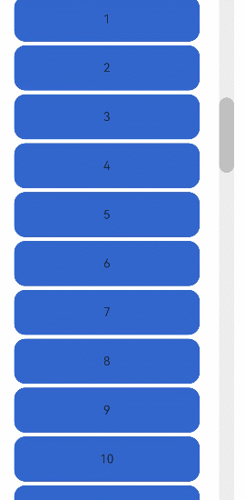
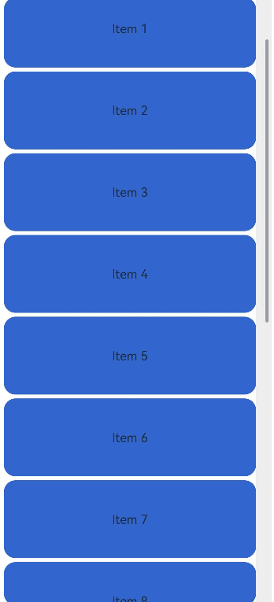
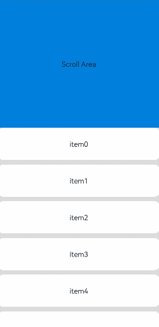

# ScrollBar

The **ScrollBar** component is designed to be used together with scrollable components such as [ArcList](ts-container-arclist.md), [List](ts-container-list.md), [Grid](ts-container-grid.md), [Scroll](ts-container-scroll.md), and [WaterFlow](ts-container-waterflow.md).

>  **NOTE**
>
>  This component is supported since API version 8. Updates will be marked with a superscript to indicate their earliest API version.


## Child Components

This component can contain a single child component.


## APIs

ScrollBar(value: ScrollBarOptions)

**Atomic service API**: This API can be used in atomic services since API version 11.

**System capability**: SystemCapability.ArkUI.ArkUI.Full

**Parameters**

| Name| Type| Mandatory| Description|
| -------- | -------- | -------- | -------- |
| value |  [ScrollBarOptions](#scrollbaroptions)| Yes| Scrollbar settings.|

## Properties

In addition to the [universal attributes](ts-component-general-attributes.md), the following attributes are supported.

### enableNestedScroll<sup>14+</sup>

enableNestedScroll(enabled: Optional\<boolean>)

Sets whether nested scrolling is enabled.

**Atomic service API**: This API can be used in atomic services since API version 14.

**System capability**: SystemCapability.ArkUI.ArkUI.Full

**Parameters**

| Name| Type   | Mandatory| Description                                 |
| ------ | ------- | ---- | ------------------------------------- |
| enabled  | Optional\<boolean> | Yes  | Whether nested scrolling is enabled. The value **true** means that nested scrolling is enabled, and **false** means the opposite.<br>Default value: **false**|

>  **NOTE**
>
> When nested scrolling is enabled, the scroll offset is first passed to the inner scrollable component, which then passes it to the outer parent scrollable component based on the set nested scrolling priority.
>
> Nested scrolling is not supported when the **WaterFlow** component is in **SLIDING_WINDOW** layout mode.
>
> When the nested scrolling mode is set to **PARALLEL**, both the parent and child components scroll simultaneously. You need to manage the scroll order in the **onScrollFrameBegin** event according to the desired logic.

## ScrollBarOptions

**Atomic service API**: This API can be used in atomic services since API version 11.

**System capability**: SystemCapability.ArkUI.ArkUI.Full

| Name| Type| Mandatory| Description|
| -------- | -------- | -------- | -------- |
| scroller | [Scroller](ts-container-scroll.md#scroller) | Yes| Scroller, which can be bound to scrollable components.|
| direction | [ScrollBarDirection](#scrollbardirection) | No| Scrollbar direction in which scrollable components scroll.<br>Default value: **ScrollBarDirection.Vertical**|
| state | [BarState](ts-appendix-enums.md#barstate) | No| Scrollbar state.<br>Default value: **BarState.Auto**|

>  **NOTE**
>
> The **ScrollBar** component defines the behavior style of the scrollable area, and its subnodes define the behavior style of the scrollbar.
> 
> This component is bound to a scrollable component through **scroller**, and can be used to scroll the scrollable component only when their directions are the same. The **ScrollBar** component can be bound to only one scrollable component, and vice versa.
>
> Since API version 12, the **ScrollBar** component displays a default scrollbar style when without child nodes.

## ScrollBarDirection

**Atomic service API**: This API can be used in atomic services since API version 11.

**System capability**: SystemCapability.ArkUI.ArkUI.Full

| Name| Description|
| -------- | -------- |
| Vertical | Vertical scrollbar.|
| Horizontal | Horizontal scrollbar.|


## Example 1: Implementing a ScrollBar Component with Child Components

This example illustrates the style of a **ScrollBar** component with child components.

```ts
// xxx.ets
@Entry
@Component
struct ScrollBarExample {
  private scroller: Scroller = new Scroller()
  private arr: number[] = [0, 1, 2, 3, 4, 5, 6, 7, 8, 9, 10, 11, 12, 13, 14, 15]

  build() {
    Column() {
      Stack({ alignContent: Alignment.End }) {
        Scroll(this.scroller) {
          Flex({ direction: FlexDirection.Column }) {
            ForEach(this.arr, (item: number) => {
              Row() {
                Text(item.toString())
                  .width('80%')
                  .height(60)
                  .backgroundColor('#3366CC')
                  .borderRadius(15)
                  .fontSize(16)
                  .textAlign(TextAlign.Center)
                  .margin({ top: 5 })
              }
            }, (item:number) => item.toString())
          }.margin({ right: 15 })
        }
        .width('90%')
        .scrollBar(BarState.Off)
        .scrollable(ScrollDirection.Vertical)
        ScrollBar({ scroller: this.scroller, direction: ScrollBarDirection.Vertical,state: BarState.Auto }) {
          Text()
            .width(20)
            .height(100)
            .borderRadius(10)
            .backgroundColor('#C0C0C0')
        }.width(20).backgroundColor('#ededed')
      }
    }
  }
}
```




## Example 2: Implementing a ScrollBar Component Without Child Components

This example illustrates the style of a **ScrollBar** component without child components.

```ts
@Entry
@Component
struct ScrollBarExample {
  private scroller: Scroller = new Scroller()
  private arr: number[] = [0, 1, 2, 3, 4, 5, 6, 7, 8, 9, 10, 11, 12, 13, 14, 15]

  build() {
    Column() {
      Stack({ alignContent: Alignment.End }) {
        Scroll(this.scroller) {
          Flex({ direction: FlexDirection.Column }) {
            ForEach(this.arr, (item: number) => {
              Row() {
                Text(item.toString())
                  .width('80%')
                  .height(60)
                  .backgroundColor('#3366CC')
                  .borderRadius(15)
                  .fontSize(16)
                  .textAlign(TextAlign.Center)
                  .margin({ top: 5 })
              }
            }, (item:number) => item.toString())
          }.margin({ right: 15 })
        }
        .width('90%')
        .scrollBar(BarState.Off)
        .scrollable(ScrollDirection.Vertical)
        ScrollBar({ scroller: this.scroller, direction: ScrollBarDirection.Vertical,state: BarState.Auto })
      }
    }
  }
}
```




## Example 3: Enabling Nested Scrolling

This example demonstrates how to enable nested scrolling for a **ScrollBar** component using the **enableNestedScroll** attribute.
```ts
@Entry
@Component
struct StickyNestedScroll {
  listScroller: Scroller = new Scroller();
  @State array: number[] = []

  @Styles
  listCard() {
    .backgroundColor(Color.White)
    .height(72)
    .width("100%")
    .borderRadius(12)
  }

  build() {
    Stack() {
      Scroll() {
        Column() {
          Text('Scroll Area')
            .width("100%")
            .height("40%")
            .backgroundColor('#0080DC')
            .textAlign(TextAlign.Center)
          List({ space: 10, scroller: this.listScroller }) {
            ForEach(this.array, (item: number) => {
              ListItem() {
                Text('item' + item)
                  .fontSize(16)
              }
              .listCard()
            }, (item: string) => item)
          }
          .scrollBar(BarState.Off)
          .nestedScroll({
            scrollForward: NestedScrollMode.PARENT_FIRST,
            scrollBackward: NestedScrollMode.SELF_FIRST
          })
          .height("100%")
        }
        .width("100%")
      }
      .edgeEffect(EdgeEffect.Spring)
      .backgroundColor('#DCDCDC')
      .scrollBar(BarState.Off)
      .width('100%')
      .height('100%')
      ScrollBar({ scroller: this.listScroller})
        .position({right:0})
        .enableNestedScroll(true)
    }
  }

  aboutToAppear() {
    for (let i = 0; i < 15; i++) {
      this.array.push(i)
    }
  }
}
```

