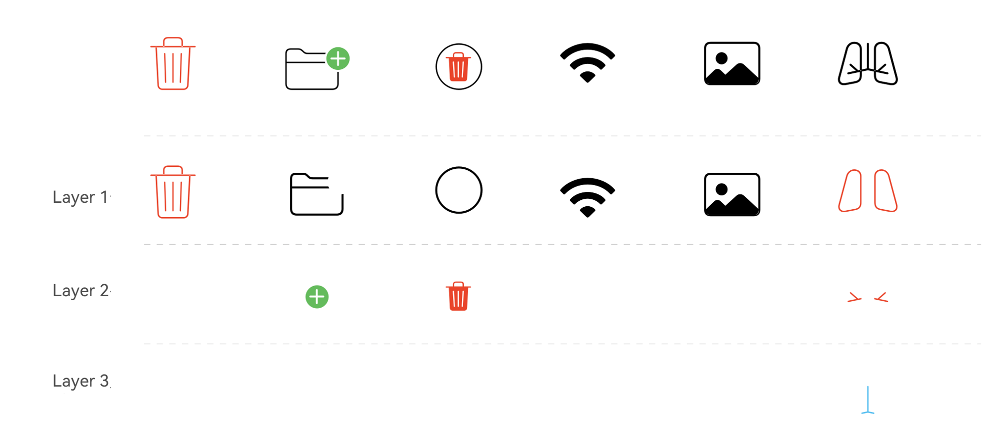

# SymbolGlyph

The **\<SymbolGlyph>** component is used to display a small symbol.

>  **NOTE**
>
>  This component is supported since API version 11. Updates will be marked with a superscript to indicate their earliest API version.

## Child Components

Not supported

## APIs

SymbolGlyph(value: Resource)

**Parameters**

| Name| Type| Mandatory| Description|
| -------- | -------- | -------- | -------- |
| value | [Resource](ts-types.md#resource)| Yes| Resource of the **\<SymbolGlyph>** component, for example, **$r('sys.symbol.ohos_wifi')**.|

>  **NOTE**
>
>  The resources referenced in **$r('sys.symbol.ohos_wifi')** are preset in the system. The **\<SymbolGlyph>** component supports only the preset symbol resources. If unsupported resources are referenced, an exception occurs.

## Attributes

The [universal attributes](ts-universal-attributes-size.md) are supported. With regard to text attributes, only the following attributes are supported.

| Name| Type| Mandatory| Description                              |
| ------ | -------- | ---- | -------------------------------------- |
| fontColor | Array\<[ResourceColor](ts-types.md#resourcecolor)\> | No| Color of the **\<SymbolGlyph>** component.<br> Default value: depending on the rendering strategy|
| fontSize | number \| string \| [Resource](ts-types.md#resource) | No| Size of the **\<SymbolGlyph>** component.<br>The display size of the symbol glyph is controlled by the **fontSize** setting. Once **width** or **height** is specified, other universal attributes will only affect the size of the component's placeholder, not the symbol glyph itself.<br>Default value: system default value|
| fontWeight | [FontWeight](ts-appendix-enums.md#fontweight) \| number \| string | No| Font weight of the **\<SymbolGlyph>** component.<br>For the number type, the value ranges from 100 to 900, at an interval of 100. A larger value indicates a heavier font weight. The default value is **400**.<br>For the string type, only strings of the number type are supported, for example, **"400"**, **"bold"**, **"bolder"**, **"lighter"**, **"regular"**, and **"medium"**, which correspond to the enumerated values in **FontWeight**.<br>Default value: **FontWeight.Normal**|
| renderingStrategy | [SymbolRenderingStrategy](ts-appendix-enums.md#symbolrenderingstrategy11)	| No| Rendering strategy of the **\<SymbolGlyph>** component.<br>Default value: **SymbolRenderingStrategy.SINGLE**<br>**NOTE**<br>For the resources referenced in **$r('sys.symbol.ohos_*')**, only **ohos_folder_badge_plus** supports the **MULTIPLE_COLOR** and **MULTIPLE_OPACITY** modes.|
| effectStrategy | [SymbolEffectStrategy](ts-appendix-enums.md#symboleffectstrategy11)	| No| Symbol effect of the **\<SymbolGlyph>** component.<br>Default value: **SymbolEffectStrategy.NONE**<br>**NOTE**<br>For the resources referenced in **$r('sys.symbol.ohos_*')**, only **ohos_wifi** supports the hierarchical effect.|

The figure below shows the effects of different rendering strategies.



## Events

The [universal events](ts-universal-events-click.md) are supported.

## Example

```ts
// xxx.ets
@Entry
@Component
struct Index {
  build() {
    Column() {
      Row() {
        Column() {
          Text("Light")
          SymbolGlyph($r('sys.symbol.ohos_trash'))
            .fontWeight(FontWeight.Lighter)
            .fontSize(96)
        }

        Column() {
          Text("Normal")
          SymbolGlyph($r('sys.symbol.ohos_trash'))
            .fontWeight(FontWeight.Normal)
            .fontSize(96)
        }

        Column() {
          Text("Bold")
          SymbolGlyph($r('sys.symbol.ohos_trash'))
            .fontWeight(FontWeight.Bold)
            .fontSize(96)
        }
      }

      Row() {
        Column() {
          Text("Monochrome")
          SymbolGlyph($r('sys.symbol.ohos_folder_badge_plus'))
            .fontSize(96)
            .renderingStrategy(SymbolRenderingStrategy.SINGLE)
            .fontColor([Color.Black, Color.Green, Color.White])
        }

        Column() {
          Text("Multicolor")
          SymbolGlyph($r('sys.symbol.ohos_folder_badge_plus'))
            .fontSize(96)
            .renderingStrategy(SymbolRenderingStrategy.MULTIPLE_COLOR)
            .fontColor([Color.Black, Color.Green, Color.White])
        }

        Column() {
          Text("Multilayer")
          SymbolGlyph($r('sys.symbol.ohos_folder_badge_plus'))
            .fontSize(96)
            .renderingStrategy(SymbolRenderingStrategy.MULTIPLE_OPACITY)
            .fontColor([Color.Black, Color.Green, Color.White])
        }
      }

      Row() {
        Column() {
          Text("No effect")
          SymbolGlyph($r('sys.symbol.ohos_wifi'))
            .fontSize(96)
            .effectStrategy(SymbolEffectStrategy.NONE)
        }

        Column() {
          Text("Overall scale effect")
          SymbolGlyph($r('sys.symbol.ohos_wifi'))
            .fontSize(96)
            .effectStrategy(1)
        }

        Column() {
          Text("Hierarchical effect")
          SymbolGlyph($r('sys.symbol.ohos_wifi'))
            .fontSize(96)
            .effectStrategy(2)
        }
      }
    }
  }
}
```

