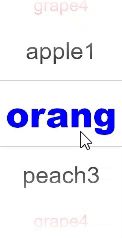
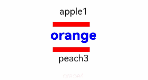
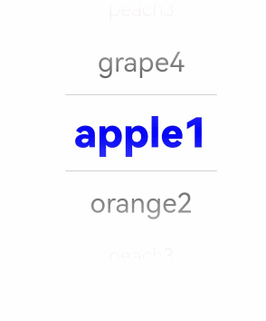

# TextPicker

The **TextPicker** component allows users to scroll to select text.

>  **NOTE**
>
>  This component is supported since API version 8. Updates will be marked with a superscript to indicate their earliest API version.


## Child Components

Not supported


## APIs

TextPicker(options?: TextPickerOptions)

Creates a text picker based on the selection range specified by **range**.

**Atomic service API**: This API can be used in atomic services since API version 11.

**System capability**: SystemCapability.ArkUI.ArkUI.Full

**Parameters**

| Name | Type                                           | Mandatory| Description                  |
| ------- | ----------------------------------------------- | ---- | ---------------------- |
| options | [TextPickerOptions](#textpickeroptions) | No  | Parameters of the text picker.|

## TextPickerOptions

**Atomic service API**: This API can be used in atomic services since API version 11.

**System capability**: SystemCapability.ArkUI.ArkUI.Full

| Name| Type| Mandatory| Description|
| -------- | -------- | -------- | -------- |
| range | string[] \| string[] []<sup>10+</sup> \| [Resource](ts-types.md#resource) \|<br>[TextPickerRangeContent](#textpickerrangecontent10)[]<sup>10+</sup> \| [TextCascadePickerRangeContent](#textcascadepickerrangecontent10)[]<sup>10+</sup> | Yes| Data selection range of the picker. This parameter cannot be set to an empty array. If set to an empty array, it will not be displayed. If it is dynamically changed to an empty array, the current value remains displayed.<br>**NOTE**<br>For a single-column picker, use a value of the string[], Resource, or TextPickerRangeContent[] type.<br>For a multi-column picker, use a value of the string[] type.<br>For a multi-column linked picker, use a value of the TextCascadePickerRangeContent[] type.<br>The Resource type supports only [strarray.json](../../../quick-start/resource-categories-and-access.md#resource-group-directories).<br>The type and number of columns in the range cannot be dynamically modified.|
| selected | number \| number[]<sup>10+</sup> | No| Index of the default item in the range.<br>Default value: **0**<br>**NOTE**<br>For a single-column picker, use a value of the number type.<br>For a multi-column (linked) picker, use a value of the number[] type.<br>Since API version 10, this attribute supports two-way binding through [$$](../../../quick-start/arkts-two-way-sync.md).|
| value | string \| string[]<sup>10+</sup> | No| Value of the default item in the range. The priority of this parameter is lower than that of **selected**.<br>Default value: value of the first item<br>**NOTE**<br>This parameter works only when the picker contains text only.  <br>For a single-column picker, use a value of the string type.<br>For a multi-column (linked) picker, use a value of the string[] type.<br>Since API version 10, this attribute supports two-way binding through [$$](../../../quick-start/arkts-two-way-sync.md).|

## TextPickerRangeContent<sup>10+</sup>

**Atomic service API**: This API can be used in atomic services since API version 11.

**System capability**: SystemCapability.ArkUI.ArkUI.Full

| Name| Type                                                | Mandatory| Description  |
| ------ | -------------------------------------------------------- | ---- | ---------- |
| icon   | string \| [Resource](ts-types.md#resource) | Yes  | Image resource.|
| text   | string \| [Resource](ts-types.md#resource) | No  | Text information.|

## TextCascadePickerRangeContent<sup>10+</sup>

**Atomic service API**: This API can be used in atomic services since API version 11.

**System capability**: SystemCapability.ArkUI.ArkUI.Full

| Name| Type                                                | Mandatory| Description  |
| ------ | -------------------------------------------------------- | ---- | ---------- |
| text   | string \| [Resource](ts-types.md#resource) | Yes  | Text information.|
| children   | [TextCascadePickerRangeContent](#textcascadepickerrangecontent10)[] | No  | Linkage data.|
## DividerOptions<sup>12+</sup>

**Atomic service API**: This API can be used in atomic services since API version 12.

**System capability**: SystemCapability.ArkUI.ArkUI.Full

| Name     | Type     | Mandatory| Description                                                      |
| ----------- | ------------- | ---- | -------------------------------------------------------------- |
| strokeWidth | [Dimension](ts-types.md#dimension10)     | No  | Stroke width of the divider. The unit is vp by default. You can also specify it as px. The percentage type is not supported.|
| startMargin | [Dimension](ts-types.md#dimension10)      | No  | Distance between the divider and the start edge of the picker. The unit is vp by default. You can also specify it as px. The percentage type is not supported.|
| endMargin   | [Dimension](ts-types.md#dimension10)     | No  | Distance between the divider and the end edge of the picker. The unit is vp by default. You can also specify it as px. The percentage type is not supported.|
| color       | [ResourceColor](ts-types.md#resourcecolor)  | No  | Color of the divider.

## Attributes

In addition to the [universal attributes](ts-universal-attributes-size.md), the following attributes are supported.

### defaultPickerItemHeight

defaultPickerItemHeight(value: number | string)

Sets the height of each item in the picker.

**Atomic service API**: This API can be used in atomic services since API version 11.

**System capability**: SystemCapability.ArkUI.ArkUI.Full

**Parameters**

| Name| Type                      | Mandatory| Description                  |
| ------ | -------------------------- | ---- | ---------------------- |
| value  | number \| string | Yes  | Height of each item in the picker.|

### disappearTextStyle<sup>10+</sup>

disappearTextStyle(value: PickerTextStyle)

Sets the font color, font size, and font weight for the top and bottom items.

**Atomic service API**: This API can be used in atomic services since API version 11.

**System capability**: SystemCapability.ArkUI.ArkUI.Full

**Parameters**

| Name| Type                                                        | Mandatory| Description                                                        |
| ------ | ------------------------------------------------------------ | ---- | ------------------------------------------------------------ |
| value  | [PickerTextStyle](ts-basic-components-datepicker.md#pickertextstyle10) | Yes  | Font color, font size, and font weight of the top and bottom items.<br>Default value:<br>{<br>color: '#ff182431',<br>font: {<br>size: '14fp', <br>weight: FontWeight.Regular<br>}<br>} |

### textStyle<sup>10+</sup>

textStyle(value: PickerTextStyle)

Sets the font color, font size, and font weight for all items except the top, bottom, and selected items.

**Atomic service API**: This API can be used in atomic services since API version 11.

**System capability**: SystemCapability.ArkUI.ArkUI.Full

**Parameters**

| Name| Type                                                        | Mandatory| Description                                                        |
| ------ | ------------------------------------------------------------ | ---- | ------------------------------------------------------------ |
| value  | [PickerTextStyle](ts-basic-components-datepicker.md#pickertextstyle10) | Yes  | Font color, font size, and font weight of all items except the top, bottom, and selected items.<br>Default value:<br>{<br>color: '#ff182431',<br>font: {<br>size: '16fp', <br>weight: FontWeight.Regular<br>}<br>} |

### selectedTextStyle<sup>10+</sup>

selectedTextStyle(value: PickerTextStyle)

Sets the font color, font size, and font weight for the selected item.

**Atomic service API**: This API can be used in atomic services since API version 11.

**System capability**: SystemCapability.ArkUI.ArkUI.Full

**Parameters**

| Name| Type                                                        | Mandatory| Description                                                        |
| ------ | ------------------------------------------------------------ | ---- | ------------------------------------------------------------ |
| value  | [PickerTextStyle](ts-basic-components-datepicker.md#pickertextstyle10) | Yes  | Font color, font size, and font weight of the selected item.<br>Default value:<br>{<br>color: '#ff007dff',<br>font: {<br>size: '20vp', <br>weight: FontWeight.Medium<br>}<br>} |

### selectedIndex<sup>10+</sup>

selectedIndex(value: number | number[])

Sets the index of the default selected item in the array. Its priority is higher than that of the selected value in **options**. For a single-column picker, use a value of the number type. For a multi-column (linked) picker, use a value of the number[] type.

**Atomic service API**: This API can be used in atomic services since API version 11.

**System capability**: SystemCapability.ArkUI.ArkUI.Full

**Parameters**

| Name| Type                        | Mandatory| Description                        |
| ------ | ---------------------------- | ---- | ---------------------------- |
| value  | number \| number[] | Yes  | Index of the default selected item in the array.<br>Default value: **0**<br>|

### canLoop<sup>10+</sup>

canLoop(value: boolean)

Sets whether scrolling is loopable.

**Atomic service API**: This API can be used in atomic services since API version 11.

**System capability**: SystemCapability.ArkUI.ArkUI.Full

**Parameters**

| Name| Type   | Mandatory| Description                                                        |
| ------ | ------- | ---- | ------------------------------------------------------------ |
| value  | boolean | Yes  | Whether scrolling is loopable.<br>**true**: loopable<br>**false**: not loopable<br>Default value: **true**|

### divider<sup>12+</sup>

divider(value: DividerOptions | null)

Sets the divider style. If this attribute is not set, the divider is displayed based on the default value.

If the sum of **startMargin** and **endMargin** exceeds the component width, both **startMargin** and **endMargin** will be set to **0**.

**Atomic service API**: This API can be used in atomic services since API version 12.

**System capability**: SystemCapability.ArkUI.ArkUI.Full

**Parameters**
| Name| Type   | Mandatory| Description                                                                 |
| ------ | ------- | ---- | --------------------------------------------------------------------- |
| value | [DividerOptions](#divideroptions12) \| null | Yes  | Divider options.<br>1. If **DividerOptions** is set, the divider is displayed in the configured style.<br>Default value:<br>{<br>strokeWidth: '2px', <br>startMargin: 0, <br>endMargin: 0, <br>color: '#33000000'<br>}<br>2. If this parameter is set to **null**, the divider is not displayed.|

### gradientHeight<sup>12+</sup>

gradientHeight(value: Dimension)

Sets the height for the fade-out effect. If this attribute is not set, the default fade-out effect will be displayed.

**Atomic service API**: This API can be used in atomic services since API version 12.

**System capability**: SystemCapability.ArkUI.ArkUI.Full

**Parameters**

| Name| Type   | Mandatory| Description                                                        |
| ------ | ------- | ---- | ------------------------------------------------------------ |
| value  | [Dimension](ts-types.md#dimension10) | Yes  | Height of the gradient effect at the top and bottom edges of the content area. It can be set in percentage, with 100% (the maximum value) being half the height of the picker. Setting it to **0** will result in no gradient effect, while negative numbers or other invalid values will display the default gradient effect. Default value: **36vp**|

> **NOTE**
>
> Avoid changing the attribute data during the animation process of this component.

## Events

In addition to the [universal events](ts-universal-events-click.md), the following events are supported.

### onAccept<sup>(deprecated) </sup>

onAccept(callback: (value: string, index: number) => void)

Triggered when the OK button in the dialog box is clicked. This event can be triggered only in the [text picker dialog box](ts-methods-textpicker-dialog.md).

This API is deprecated since API version 10.

**System capability**: SystemCapability.ArkUI.ArkUI.Full

**Parameters**

| Name| Type  | Mandatory| Description                |
| ------ | ------ | ---- | -------------------- |
| value  | string | Yes  | Text of the selected item.  |
| index  | number | Yes  | Index of the selected item.|

### onCancel<sup>(deprecated) </sup>

onCancel(callback: () => void)

Triggered when the Cancel button in the dialog box is clicked. This event can be triggered only in the [text picker dialog box](ts-methods-textpicker-dialog.md).

This API is deprecated since API version 10.

**System capability**: SystemCapability.ArkUI.ArkUI.Full

### onChange

onChange(callback: (value: string \| string[], index: number \| number[]) =&gt; void)

Triggered when an item in the picker is selected. When the picker contains text only or both text and imagery, **value** indicates the text of the selected item. When the picker contains imagery only, **value** is empty.

**Atomic service API**: This API can be used in atomic services since API version 11.

**System capability**: SystemCapability.ArkUI.ArkUI.Full

**Parameters**

| Name| Type                                      | Mandatory| Description                                             |
| ------ | ------------------------------------------ | ---- | ------------------------------------------------- |
| value  | string \| string[]<sup>10+</sup> | Yes  | Text of the selected item. For a multi-column picker, **value** is of the array type.  |
| index  | number \| number[]<sup>10+</sup> | Yes  | Index of the selected item. For a multi-column picker, **index** is of the array type.|

### onScrollStop<sup>14+</sup>

onScrollStop(callback: (value: string \| string[], index: number \| number[]) =&gt; void)

Triggered when the scrolling in the text picker stops.

If the scrolling is initiated by a gesture, this event is triggered when the finger is lifted from the screen and the scrolling stops.

When the picker contains text only or a combination of images and text, **value** indicates the text of the selected item. When the picker contains images only, **value** is empty.

**Atomic service API**: This API can be used in atomic services since API version 14.

**System capability**: SystemCapability.ArkUI.ArkUI.Full

**Parameters**

| Name| Type                                      | Mandatory| Description                                             |
| ------ | ------------------------------------------ | ---- | ------------------------------------------------- |
| value  | string \| string[] | Yes  | Text of the selected item. For a multi-column picker, **value** is of the array type.  |
| index  | number \| number[] | Yes  | Index of the selected item. For a multi-column picker, **index** is of the array type.|

## Example

### Example 1: Setting the Number of Columns in the Picker

This example demonstrates how to set **range** to implement single-column or multi-column text pickers.

```ts
// xxx.ets
class bottom {
  bottom:number = 50
}
let bott:bottom = new bottom()
@Entry
@Component
struct TextPickerExample {
  private select: number = 1
  private apfruits: string[] = ['apple1', 'apple2', 'apple3', 'apple4']
  private orfruits: string[] = ['orange1', 'orange2', 'orange3', 'orange4']
  private pefruits: string[] = ['peach1', 'peach2', 'peach3', 'peach4']
  private multi: string[][] = [this.apfruits, this.orfruits, this.pefruits]
  private cascade: TextCascadePickerRangeContent[] = [
    {
      text: 'Asia',
      children: [{ text: 'China', children: [{ text: 'Beijing' }, { text: 'Shanghai' }, { text: 'Chongqing' }] },
        { text: 'Japan', children: [{ text: 'Tokyo' }, { text: 'Hokkaido' }, { text: 'Osaka' }] }]
    },
    {
      text: 'Europe',
      children: [{ text: 'Germany', children: [{ text: 'Berlin' }, { text: 'Munich' }, { text: 'Nuremberg' }] },
        { text: 'France', children: [{ text: 'Paris' }, { text: 'Lille' }, { text: 'Orleans' }] }]
    },
    {
      text: 'Africa',
      children: [{ text: 'Egypt', children: [{ text: 'Cairo' }, { text: 'Damietta' }, { text: 'Girga' }] },
        { text: 'Algeria', children: [{ text: 'Alger' }, { text: 'Oran' }, { text: 'Adrar' }] }]
    }
  ]

  build() {
    Column() {

      TextPicker({ range: this.apfruits, selected: this.select })
        .onChange((value: string | string[], index: number | number[]) => {
          console.info('Picker item changed, value: ' + value + ', index: ' + index)
        })
        .onScrollStop((value: string | string[], index: number | number[]) => {
          console.info('Picker scroll stopped, value: ' + value + ', index: ' + index)
        }).margin(bott)

      TextPicker({ range: this.multi })
        .onChange((value: string | string[], index: number | number[]) => {
          console.info('TextPicker multi-column: onChange' + JSON.stringify(value) + ',' + 'index:' + JSON.stringify(index))
        })
        .onScrollStop((value: string | string[], index: number | number[]) => {
          console.info('TextPicker multi-column: onScrollStop ' + JSON.stringify(value) + ', ' + 'index: ' + JSON.stringify(index))
        }).margin(bott)

      TextPicker({ range: this.cascade })
        .onChange((value: string | string[], index: number | number[]) => {
          console.info('TextPicker multi-column linkage: onChange' + JSON.stringify(value) + ',' + 'index:' + JSON.stringify(index))
        })
        .onScrollStop((value: string | string[], index: number | number[]) => {
          console.info('TextPicker multi-column linkage: onScrollStop ' + JSON.stringify(value) + ', ' + 'index: ' + JSON.stringify(index))
        })
    }
  }
}
```


### Example 2: Setting the Text Style

This example demonstrates how to configure **disappearTextStyle**, **textStyle**, and **selectedTextStyle** to customize the text style in a text picker.

```ts
// xxx.ets
@Entry
@Component
struct TextPickerExample {
  private select: number = 1
  private fruits: string[] = ['apple1', 'orange2', 'peach3', 'grape4']

  build() {
    Column() {
      TextPicker({ range: this.fruits, selected: this.select })
        .onChange((value: string | string[], index: number | number[]) => {
          console.info('Picker item changed, value: ' + value + ', index: ' + index)
        })
        .onScrollStop((value: string | string[], index: number | number[]) => {
          console.info('Picker scroll stopped, value: ' + value + ', index: ' + index)
        })
        .disappearTextStyle({color: Color.Red, font: {size: 15, weight: FontWeight.Lighter}})
        .textStyle({color: Color.Black, font: {size: 20, weight: FontWeight.Normal}})
        .selectedTextStyle({color: Color.Blue, font: {size: 30, weight: FontWeight.Bolder}})
    }.width('100%').height('100%')
  }
}
```



### Example 3: Using the No-Divider Style

This example demonstrates how to configure a text picker with no divider by setting **divider** to **null**.

```ts
// xxx.ets
@Entry
@Component
struct TextPickerExample {
  private select: number = 1
  private fruits: string[] = ['apple1', 'orange2', 'peach3', 'grape4']

  build() {
    Column() {
      TextPicker({ range: this.fruits, selected: this.select })
        .onChange((value: string | string[], index: number | number[]) => {
          console.info('Picker item changed, value: ' + value + ', index: ' + index)
        })
        .onScrollStop((value: string | string[], index: number | number[]) => {
          console.info('Picker scroll stopped, value: ' + value + ', index: ' + index)
        })
        .disappearTextStyle({color: Color.Red, font: {size: 15, weight: FontWeight.Lighter}})
        .textStyle({color: Color.Black, font: {size: 20, weight: FontWeight.Normal}})
        .selectedTextStyle({color: Color.Blue, font: {size: 30, weight: FontWeight.Bolder}})
        .divider(null)
    }.width('100%').height('100%')
  }
}
```


### Example 3: Using the Divider Style

This example demonstrates how to configure a text picker with a custom divider style by setting **divider** with **DividerOptions**.

```ts
// xxx.ets
@Entry
@Component
struct TextPickerExample {
  private select: number = 1
  private fruits: string[] = ['apple1', 'orange2', 'peach3', 'grape4']

  build() {
    Column() {
      TextPicker({ range: this.fruits, selected: this.select })
        .onChange((value: string | string[], index: number | number[]) => {
          console.info('Picker item changed, value: ' + value + ', index: ' + index)
        })
        .onScrollStop((value: string | string[], index: number | number[]) => {
          console.info('Picker scroll stopped, value: ' + value + ', index: ' + index)
        })
        .disappearTextStyle({color: Color.Red, font: {size: 15, weight: FontWeight.Lighter}})
        .textStyle({color: Color.Black, font: {size: 20, weight: FontWeight.Normal}})
        .selectedTextStyle({color: Color.Blue, font: {size: 30, weight: FontWeight.Bolder}})
        .divider({
          strokeWidth: 10,
          color: Color.Red,
          startMargin: 10,
          endMargin: 20
        } as DividerOptions)
    }.width('100%').height('100%')
  }
}
```


### Example 5: Setting the Fade Effect

This example demonstrates how to customize the height of the fade effect in a text picker using **gradientHeight**.

```ts
// xxx.ets
@Entry
@Component
struct TextPickerExample {
  private select: number = 1
  private fruits: string[] = ['apple1', 'orange2', 'peach3', 'grape4']

  build() {
    Column() {
      TextPicker({ range: this.fruits, selected: this.select })
        .onChange((value: string | string[], index: number | number[]) => {
          console.info('Picker item changed, value: ' + value + ', index: ' + index)
        })
        .onScrollStop((value: string | string[], index: number | number[]) => {
          console.info('Picker scroll stopped, value: ' + value + ', index: ' + index)
        })
        .disappearTextStyle({color: Color.Red, font: {size: 15, weight: FontWeight.Lighter}})
        .textStyle({color: Color.Black, font: {size: 20, weight: FontWeight.Normal}})
        .selectedTextStyle({color: Color.Blue, font: {size: 30, weight: FontWeight.Bolder}})
        .gradientHeight(100)
    }.width('100%').height('100%')
  }
}
```


