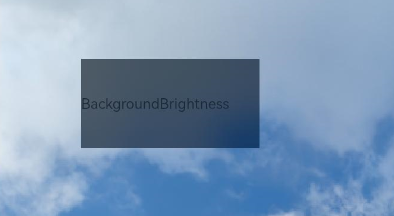

# Background (System API)

You can set the background for a component.

>  **NOTE**
>
>  The APIs of this module are supported since API version 7. Updates will be marked with a superscript to indicate their earliest API version.
>
>  This topic describes only system APIs provided by the module. For details about its public APIs, see [Background](ts-universal-attributes-background.md).

## backgroundBrightness<sup>11+</sup> 

backgroundBrightness(params: BackgroundBrightnessOptions)

Sets the background brightness of the component.

**System capability**: SystemCapability.ArkUI.ArkUI.Full

**System API**: This is a system API.

**Parameters**

| Name           | Type                                    | Mandatory  | Description                                      |
| ------------- | ---------------------------------------- | ---- | ---------------------------------------- |
| params        | [BackgroundBrightnessOptions](#backgroundbrightnessoptions11) | Yes   |  Background brightness of the component, including the brightness change rate and lightning up degree.     |

## BackgroundBlurStyleOptions<sup>10+</sup>

Inherited from [BlurStyleOptions](ts-universal-attributes-foreground-blur-style-sys.md).

## BackgroundBrightnessOptions<sup>11+</sup>

**System API**: This is a system API.

| Name           | Type                                    | Mandatory  | Description                                      |
| ------------- | ---------------------------------------- | ---- | ---------------------------------------- |
| rate          | number | Yes   | Brightness change rate. A larger value indicates faster brightness decrease and a lower lightning up degree.<br>Default value: **0.0**<br>Value range: (0.0, +∞)<br>|
| lightUpDegree | number | Yes   | Lightning up degree. A larger value indicates a higher lightning up degree.<br> Default value: **0.0**<br>Value range: [-1.0, 1.0]<br>|

## Example

Example of setting the background brightness for the component:

```ts
// xxx.ets
@Entry
@Component
struct BackgroundBrightnessDemo {
  build() {
    Column() {
      Row() {
        Text("BackgroundBrightness")
      }
      .width(200)
      .height(100)
      .position({ x: 100, y: 100 })
      .backgroundBlurStyle(BlurStyle.Thin, { colorMode: ThemeColorMode.LIGHT, adaptiveColor: AdaptiveColor.DEFAULT, scale: 1.0 })
      .backgroundBrightness({rate:0.5,lightUpDegree:0.5}) // Background brightness
    }
    .width('100%')
    .height('100%')
    .backgroundImage($r('app.media.image'))
    .backgroundImageSize(ImageSize.Cover)
  }
}
```

The following figures show how the component looks with the background brightness set.

When **rate** and **lightUpDegree** are both set to **0.5**


When **rate** is set to **0.5** and **lightUpDegree** **-0.1**



The following figure shows how the component looks without the background brightness set.


