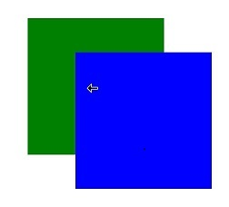

# Cursor Control

Cursor control attributes control how the cursor is displayed when the mouse pointer is placed over an element.

>  **NOTE**
>
>  This feature is supported since API Version 11. Updates will be marked with a superscript to indicate their earliest API version.


## cursorControl

### setCursor

setCursor(value: PointerStyle): void

**Atomic service API**: This API can be used in atomic services since API version 12.

Sets the cursor style. This API is a global API.

**Parameters**

| Name| Type| Mandatory| Description|
| ----- | ------ | ---- | ---- |
| value | [PointerStyle](../../apis-input-kit/js-apis-pointer.md#pointerstyle) | All consistent  | Cursor style.|


### restoreDefault

restoreDefault(): void

**Atomic service API**: This API can be used in atomic services since API version 12.

Restores the cursor to its default style. This API is a global API.


## Example

This example demonstrates how to change the mouse cursor style using **setCursor**.

> **NOTE**
> 
> To avoid confusion with **cursorControl** instances, it is recommended that you obtain a **UIContext** instance using the [getUIContext](../js-apis-arkui-UIContext.md#uicontext) API, and then obtain the **cursorControl** instance bound to the context through the [getCursorController](../js-apis-arkui-UIContext.md#getcursorcontroller12) API.

```ts
// xxx.ets
import { pointer } from '@kit.InputKit';

@Entry
@Component
struct CursorControlExample {
  @State text: string = ''
  controller: TextInputController = new TextInputController()

  build() {
    Column() {
      Row().height(200).width(200).backgroundColor(Color.Green).position({x: 150 ,y:70})
        .onHover((flag) => {
          if (flag) {
            // You are advised to use this.getUIContext().getCursorController().setCursor().
            cursorControl.setCursor(pointer.PointerStyle.EAST)
          } else {
            // You are advised to use this.getUIContext().getCursorController().restoreDefault().
            cursorControl.restoreDefault()
          }
        })
      Row().height(200).width(200).backgroundColor(Color.Blue).position({x: 220 ,y:120})
        .onHover((flag) => {
          if (flag) {
            // You are advised to use this.getUIContext().getCursorController().setCursor().
            cursorControl.setCursor(pointer.PointerStyle.WEST)
          } else {
            // You are advised to use this.getUIContext().getCursorController().restoreDefault().
            cursorControl.restoreDefault()
          }
        })
    }.width('100%')
  }
}
```
Diagram:

When the mouse pointer is placed over the blue area, the west arrow cursor is displayed.



When the mouse pointer is placed over the green area, the east arrow cursor is displayed.


