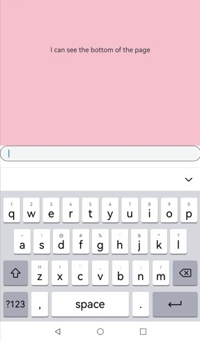
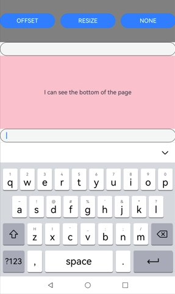
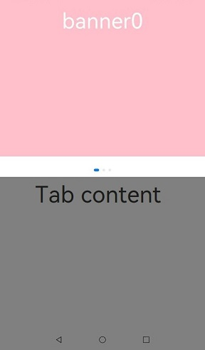

# Safe Area

A safe area refers to the display area that isn't covered by a status bar, navigation bar, or any other component in the system-defined non-safe areas. By default, all the content you develop is placed within the safe area. If necessary, you can expand a component's safe area through the [expandSafeArea](#expandsafearea) attribute. This allows the component to extend its rendering area beyond the safe area without altering the layout. In addition, you can specify how to make space for the virtual keyboard through the [setKeyboardAvoidMode](#setkeyboardavoidmode11) attribute. To prevent text elements, such as a title bar, from overlapping with non-safe areas, you are advised to set the **expandSafeArea** attribute for the component to achieve an immersive effect. Alternatively, you can use the [setWindowLayoutFullScreen](../js-apis-window.md#setwindowlayoutfullscreen9) API directly to set an immersive layout.

> **NOTE**
>
> This attribute is supported since API version 10. Updates will be marked with a superscript to indicate their earliest API version.<br>
> By default, the notch area is not a non-safe area, and content can be displayed in this area.<br>
> You can set the notch area as a non-safe area since API version 12, so that content is not displayed in this area. To do so, add the following to the **module.json5** file:<br>
  "metadata": [<br>
      {<br>
        "name": "avoid_cutout",<br>
        "value": "true",<br>
      }<br>
  ],<br>
  

## expandSafeArea

expandSafeArea(types?: Array&lt;SafeAreaType&gt;, edges?: Array&lt;SafeAreaEdge&gt;)

Sets the safe area to be expanded to.

**Atomic service API**: This API can be used in atomic services since API version 11.

**System capability**: SystemCapability.ArkUI.ArkUI.Full

**Parameters**

| Name| Type                                              | Mandatory| Description                                                        |
| ------ | -------------------------------------------------- | ---- | ------------------------------------------------------------ |
| types  | Array <[SafeAreaType](ts-types.md#safeareatype10)> | No  | Types of non-safe areas to extend into. For the **CUTOUT** type to take effect, the [Metadata](../../apis-ability-kit/js-apis-bundleManager-metadata.md) item must be added to the configuration file.<br>Default value: **[SafeAreaType.SYSTEM, SafeAreaType.CUTOUT, SafeAreaType.KEYBOARD]**|
| edges  | Array <[SafeAreaEdge](ts-types.md#safeareaedge10)> | No  | Edges for expanding the safe area.<br>Default value: **[SafeAreaEdge.TOP, SafeAreaEdge.BOTTOM, SafeAreaEdge.START, SafeAreaEdge.END]**<br>The default value expands the safe area on all available edges.|

>  **NOTE**
>
>  To set the **expandSafeArea** attribute for a component, this component cannot have its width and height fixed (except to a percentage).
>
>  The safe area does not restrict the layout or size of components inside, nor does it clip the components.
>
>  If the parent container is a scroll container, the **expandSafeArea** attribute does not take effect.
>
>  When **expandSafeArea()** is set, no parameter is passed in, and the default value is used. When **expandSafeArea([],[])** is set, an empty array is passed in, and the settings do not take effect.
>   
>  After **expandSafeArea** is set: 
>  1. If **type** is set to **SafeAreaType.KEYBOARD**, the settings take effect without additional conditions. 
>  2. If **type** is set to any other value, the settings take effect under the prerequisite that the component can extend to the safe area when the component border overlaps with the safe area. For example, if the height of the status bar is 100, the absolute position of the component on the screen must be 0 <= y <= 100 for the settings to take effect. 
>   
>  When the component extends to the safe area, the system may intercept events in the safe area to preferentially respond to events of system components, such as the status bar.
>  
>  Avoid setting the **expandSafeArea** attribute for components within scrollable containers. If you do set it, you must apply the **expandSafeArea** attribute to all direct nodes from the current node to the scrollable ancestor container, following the component nesting relationship. Otherwise, the **expandSafeArea** attribute may become ineffective after scrolling. For the correct implementation, see [Example 6]](#example-6-expanding-the-safe-area-in-scrollable-containers).
> 
>  The **expandSafeArea** attribute only affects the current component and does not propagate to parent or child components. Therefore, all relevant components must be configured individually.
> 
>  When both **expandSafeArea** and **position** attributes are set, the **position** attribute takes precedence, and the **expandSafeArea** attribute is applied afterward. For components that do not have **position**, **offset**, or other rendering attributes set, the **expandSafeArea** attribute will not take effect if the component's boundary does not overlap with the safe area, such as with dialog boxes and sheets.
> 
>  In scenarios where the **expandSafeArea** attribute is ineffective, and you need to place a component in the safe area, you will need to manually adjust the component's coordinates.

## setKeyboardAvoidMode<sup>11+</sup>

setKeyboardAvoidMode(value: KeyboardAvoidMode): void

Sets the avoidance mode for the virtual keyboard.

**Atomic service API**: This API can be used in atomic services since API version 11.

**System capability**: SystemCapability.ArkUI.ArkUI.Full

**Parameters**

| Name| Type                                                | Mandatory| Description                                                        |
| ------ | ---------------------------------------------------- | ---- | ------------------------------------------------------------ |
| value  | [KeyboardAvoidMode](../js-apis-arkui-UIContext.md#keyboardavoidmode11) | Yes  | Avoidance mode of the virtual keyboard.<br>Default value: **KeyboardAvoidMode.OFFSET**, which means that the page moves up when the keyboard is displayed.|

>  **NOTE**
>
>  With **KeyboardAvoidMode.RESIZE**, the page is resized to prevent the virtual keyboard from obstructing the view. Regarding components on the page, those with percentage-based width and height are resized with the page, and those with fixed width and height are laid out according to their set sizes. With **KeyboardAvoidMode.RESIZE**, **expandSafeArea([SafeAreaType.KEYBOARD],[SafeAreaEdge.BOTTOM])** does not take effect.
>
>  With **KeyboardAvoidMode.NONE**, the page is covered by the displayed keyboard.

## getKeyboardAvoidMode

getKeyboardAvoidMode(): KeyboardAvoidMode

Obtains the avoidance mode of the virtual keyboard.

**Atomic service API**: This API can be used in atomic services since API version 11.

**System capability**: SystemCapability.ArkUI.ArkUI.Full

**Return value**

| Name                                                | Description                              |
| ---------------------------------------------------- | ---------------------------------- |
| [KeyboardAvoidMode](../js-apis-arkui-UIContext.md#keyboardavoidmode11) | Avoidance mode of the virtual keyboard.|

## Example

### Example 1: Implementing an Immersive Effect

This example demonstrates how to use the **expandSafeArea** attribute to expand the safe area to the top and bottom to achieve an immersive effect.

```ts
// xxx.ets
@Entry
@Component
struct SafeAreaExample1 {
  @State text: string = ''
  controller: TextInputController = new TextInputController()

  build() {
    Row() {
        Column()
          .height('100%').width('100%')
          .backgroundImage($r('app.media.bg')).backgroundImageSize(ImageSize.Cover)
          .expandSafeArea([SafeAreaType.SYSTEM], [SafeAreaEdge.TOP, SafeAreaEdge.BOTTOM])
    }.height('100%')
  }
}
```


### Example 2: Fixing the Background Image Position During Keyboard Avoidance

This example shows how to set the **expandSafeArea** attribute for the background image to keep it fixed when the keyboard is displayed and the layout is adjusted.

```ts
// xxx.ets
@Entry
@Component
struct SafeAreaExample2 {
  @State text: string = ''
  controller: TextInputController = new TextInputController()

  build() {
    Row() {
      Stack() {
        Column()
          .height('100%').width('100%')
          .backgroundImage($r('app.media.bg')).backgroundImageSize(ImageSize.Cover)
          .expandSafeArea([SafeAreaType.KEYBOARD, SafeAreaType.SYSTEM])
        Column() {
          Button('Set caretPosition 1')
            .onClick(() => {
              this.controller.caretPosition(1)
            })
          TextInput({ text: this.text, placeholder: 'input your word...', controller: this.controller })
            .placeholderFont({ size: 14, weight: 400 })
            .width(320).height(40).offset({y: 120})
            .fontSize(14).fontColor(Color.Black)
            .backgroundColor(Color.White)
        }.width('100%').alignItems(HorizontalAlign.Center)
      }
    }.height('100%')
  }
}
```


### Example 3: Setting the Keyboard Avoidance Mode to Resize

This example demonstrates how to use **setKeyboardAvoidMode** to set the keyboard avoidance mode to **RESIZE**, which resizes the page when the keyboard is displayed.

```ts
// EntryAbility.ets
import { KeyboardAvoidMode } from '@kit.ArkUI';

onWindowStageCreate(windowStage: window.WindowStage) {
  // Main window is created, set main page for this ability
  hilog.info(0x0000, 'testTag', '%{public}s', 'Ability onWindowStageCreate');

  windowStage.loadContent('pages/Index', (err, data) => {
    let keyboardAvoidMode = windowStage.getMainWindowSync().getUIContext().getKeyboardAvoidMode();
    // When the virtual keyboard is displayed, the page is resized to its original height minus the keyboard height.
  windowStage.getMainWindowSync().getUIContext().setKeyboardAvoidMode(KeyboardAvoidMode.RESIZE);
    if (err.code) {
      hilog.error(0x0000, 'testTag', 'Failed to load the content. Cause: %{public}s', JSON.stringify(err) ?? '');
      return;
    }
    hilog.info(0x0000, 'testTag', 'Succeeded in loading the content. Data: %{public}s', JSON.stringify(data) ?? '');
  });
}
```

```ts
// xxx.ets
@Entry
@Component
struct KeyboardAvoidExample1 {
  build() {
    Column() {
      Row().height("30%").width("100%").backgroundColor(Color.Gray)
      TextArea().width("100%").borderWidth(1)
      Text("I can see the bottom of the page").width("100%").textAlign(TextAlign.Center).backgroundColor(Color.Pink).layoutWeight(1)
    }.width('100%').height("100%")
  }
}
```


### Example 4: Setting Keyboard Avoidance Mode to Offset

This example demonstrates how to use **setKeyboardAvoidMode** to set the keyboard avoidance mode to **OFFSET**, which lifts the page when the keyboard is displayed. However, if the input cursor is positioned more than the keyboard's height from the bottom of the screen, the page will not be lifted, as demonstrated in this example.

```ts
// EntryAbility.ets
import { KeyboardAvoidMode } from '@kit.ArkUI';

onWindowStageCreate(windowStage: window.WindowStage) {
  // Main window is created, set main page for this ability
  hilog.info(0x0000, 'testTag', '%{public}s', 'Ability onWindowStageCreate');

  windowStage.loadContent('pages/Index', (err, data) => {
    let keyboardAvoidMode = windowStage.getMainWindowSync().getUIContext().getKeyboardAvoidMode();
    // When the virtual keyboard is displayed, the page is moved up until the caret is displayed.
  windowStage.getMainWindowSync().getUIContext().setKeyboardAvoidMode(KeyboardAvoidMode.OFFSET);
    if (err.code) {
      hilog.error(0x0000, 'testTag', 'Failed to load the content. Cause: %{public}s', JSON.stringify(err) ?? '');
      return;
    }
    hilog.info(0x0000, 'testTag', 'Succeeded in loading the content. Data: %{public}s', JSON.stringify(data) ?? '');
  });
}
```

```ts
// xxx.ets
@Entry
@Component
struct KeyboardAvoidExample2 {
  build() {
    Column() {
      Row().height("30%").width("100%").backgroundColor(Color.Gray)
      TextArea().width("100%").borderWidth(1)
      Text("I can see the bottom of the page").width("100%").textAlign(TextAlign.Center).backgroundColor(Color.Pink).layoutWeight(1)
    }.width('100%').height("100%")
  }
}
```


### Example 5: Switching Avoidance Modes

This example demonstrates how to switch between **OFFSET**, **RESIZE**, and **NONE** modes using **setKeyboardAvoidMode** to achieve three different keyboard avoidance effects.

```ts
import { hilog } from '@kit.PerformanceAnalysisKit';
import { KeyboardAvoidMode } from '@kit.ArkUI';
@Entry
@Component

struct KeyboardAvoidExample3 {
  build() {
    Column() {
      Row({space:15}) {
        Button('OFFSET')
          .onClick(() => {
            this.getUIContext().setKeyboardAvoidMode(KeyboardAvoidMode.OFFSET);
            hilog.info(0x0000, 'keyboardAvoidMode: %{public}s', JSON.stringify(this.getUIContext().getKeyboardAvoidMode()));
          })
          .layoutWeight(1)
        Button('RESIZE')
          .onClick(() => {
            this.getUIContext().setKeyboardAvoidMode(KeyboardAvoidMode.RESIZE);
            hilog.info(0x0000, 'keyboardAvoidMode: %{public}s', JSON.stringify(this.getUIContext().getKeyboardAvoidMode()));
          })
          .layoutWeight(1)
        Button('NONE')
          .onClick(() => {
            this.getUIContext().setKeyboardAvoidMode(KeyboardAvoidMode.NONE);
            hilog.info(0x0000, 'keyboardAvoidMode: %{public}s', JSON.stringify(this.getUIContext().getKeyboardAvoidMode()));
          })
          .layoutWeight(1)
      }
      .height("30%")
      .width("100%")
      .backgroundColor(Color.Gray)

      TextArea()
        .width("100%")
        .borderWidth(1)
      
      Text("I can see the bottom of the page")
        .width("100%")
        .textAlign(TextAlign.Center)
        .backgroundColor(Color.Pink)
        .layoutWeight(1)
      
      TextArea()
        .width("100%")
        .borderWidth(1)
    }
    .width('100%')
    .height("100%")
  }
}
```
OFFSET mode



RESIZE mode



NONE mode


### Example 6: Expanding the Safe Area in Scrollable Containers

This example demonstrates how to use the **expandSafeArea** attribute within a scrollable container to achieve an immersive effect.

```ts
class SwiperDataSource implements IDataSource {
  private list: Array<Color> = []
  constructor(list: Array<Color>) {
    this.list = list
  }
  totalCount(): number {
    return this.list.length
  }
  getData(index: number): Color {
    return this.list[index]
  }
  registerDataChangeListener(listener: DataChangeListener): void {
  }
  unregisterDataChangeListener(listener: DataChangeListener): void {
  }
}
@Entry
@Component
struct ExpandSafeAreaTest {
  private swiperController: SwiperController = new SwiperController()
  private swiperData: SwiperDataSource = new SwiperDataSource([])
  private list: Array<Color> = [
    Color.Pink,
    Color.Blue,
    Color.Green
  ]
  aboutToAppear(): void {
    this.swiperData = new SwiperDataSource(this.list)
  }
  build() {
    Scroll() {
      Column() {
        Swiper(this.swiperController) {
          LazyForEach(this.swiperData, (item: Color, index: number) => {
            Column() {
              Text('banner' + index).fontSize(50).fontColor(Color.White)
            }
            .expandSafeArea([SafeAreaType.SYSTEM], [SafeAreaEdge.TOP, SafeAreaEdge.BOTTOM])
            .width('100%')
            .height(400)
            .backgroundColor(item)
          })
        }
        .loop(true)
        .expandSafeArea([SafeAreaType.SYSTEM], [SafeAreaEdge.TOP, SafeAreaEdge.BOTTOM])
        .clip(false)
        Column(){
          Text("Tab content").fontSize(50)
        }.width("100%").height(1000)
        .backgroundColor(Color.Grey)
      }.expandSafeArea([SafeAreaType.SYSTEM], [SafeAreaEdge.TOP, SafeAreaEdge.BOTTOM])
    }
    .clip(false)
    .edgeEffect(EdgeEffect.None)
    .width("100%").height("100%")
  }
}
```

