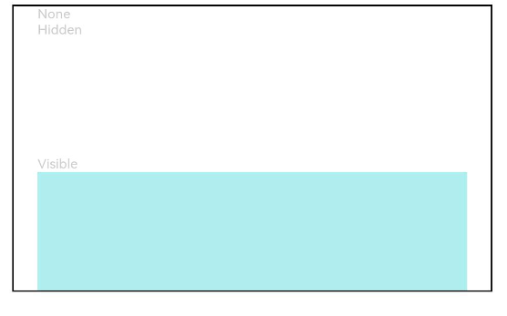

# Visibility

The visibility attribute controls whether a component is visible.

>  **NOTE**
>
> This event is supported since API version 7. Updates will be marked with a superscript to indicate their earliest API version.

## visibility

visibility(value: Visibility)

Sets the visibility of this component.

**Widget capability**: Since API version 9, this feature is supported in ArkTS widgets.

**Atomic service API**: This API can be used in atomic services since API version 11.

**System capability**: SystemCapability.ArkUI.ArkUI.Full

**Parameters**

| Name| Type                                         | Mandatory| Description                                                        |
| ------ | --------------------------------------------- | ---- | ------------------------------------------------------------ |
| value  | [Visibility](ts-appendix-enums.md#visibility) | Yes  | Whether the component is visible. When appropriate, consider using [conditional rendering](../../../quick-start/arkts-rendering-control-ifelse.md) as a substitute.<br>Default value: **Visibility.Visible**|


## Example

 This example demonstrates how to use the **visibility** configuration to achieve different visibility control effects.

```ts
// xxx.ets
@Entry
@Component
struct VisibilityExample {
  build() {
    Column() {
      Column() {
        // The component is hidden and does not take up space in the layout.
        Text('None').fontSize(9).width('90%').fontColor(0xCCCCCC)
        Row().visibility(Visibility.None).width('90%').height(80).backgroundColor(0xAFEEEE)

        // The component is hidden but takes up space in the layout.
        Text('Hidden').fontSize(9).width('90%').fontColor(0xCCCCCC)
        Row().visibility(Visibility.Hidden).width('90%').height(80).backgroundColor(0xAFEEEE)

        // The component is visible, which is the default display mode.
        Text('Visible').fontSize(9).width('90%').fontColor(0xCCCCCC)
        Row().visibility(Visibility.Visible).width('90%').height(80).backgroundColor(0xAFEEEE)
      }.width('90%').border({ width: 1 })
    }.width('100%').margin({ top: 5 })
  }
}
```


