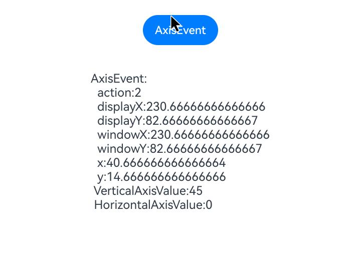

# Axis Event

An axis event is triggered when a user interacts with a component by scrolling the mouse wheel or swiping two fingers on a touchpad along a specific direction (axis). The term "axis" here refers to the direction in a 2D coordinate system, which includes the horizontal direction (x-axis) and the vertical direction (y-axis).

>  **NOTE**
>
>  This event is supported since API version 18. Updates will be marked with a superscript to indicate their earliest API version.

## onAxisEvent

onAxisEvent(event: (event: AxisEvent) => void): T

Called when the mouse wheel is scrolled or two fingers are swiped on a touchpad.

**Widget capability**: This API can be used in ArkTS widgets since API version 18.

**Atomic service API**: This API can be used in atomic services since API version 18.

**System capability**: SystemCapability.ArkUI.ArkUI.Full

**Parameters**

| Name| Type                             | Mandatory| Description                |
| ------ | --------------------------------- | ---- | -------------------- |
| event  | [AxisEvent](#axisevent) | Yes  | [AxisEvent](#axisevent) object.|

**Return value**

| Type| Description|
| -------- | -------- |
| T | Current component.|

## AxisEvent

Defines an axis event object that inherits from [BaseEvent](ts-gesture-customize-judge.md#baseevent8).

**Atomic service API**: This API can be used in atomic services since API version 18.

**System capability**: SystemCapability.ArkUI.ArkUI.Full

### Properties

| Name           | Type | Read-Only|Optional                             | Description                                                   |
| ------------------- | -----------------------|------|----- | -------------------------------------------------------- |
| action              | [AxisAction](ts-appendix-enums.md#axisaction18)           | Yes  | No  | Action type of the axis event.                  |
| x                   | number                 | Yes  | No  | X coordinate of the cursor relative to the left edge of the element.<br>Unit: vp |
| y                   | number                 | Yes  | No  | Y coordinate of the cursor relative to the top edge of the element.<br>Unit: vp |
| windowX             | number                 | Yes  | No  | X coordinate of the cursor relative to the upper left corner of the current window.<br>Unit: vp|
| windowY             | number                 | Yes  | No  | Y coordinate of the cursor relative to the upper left corner of the current window.<br>Unit: vp|
| displayX            | number                 | Yes  | No  | X coordinate of the cursor relative to the upper left corner of the screen.<br>Unit: vp|
| displayY            | number                 | Yes  | No  | Y coordinate of the cursor relative to the upper left corner of the current screen.<br>Unit: vp|
| scrollStep          | number                 | Yes  | No  | Scroll step length for the mouse wheel.<br> **NOTE**<br>Only the mouse wheel is supported. The value ranges from 0 to 65535.|
| propagation         | Callback\<void>        | Yes  | No  | Callback to activate event bubbling.  |

### getHorizontalAxisValue

getHorizontalAxisValue(): number

Obtains the horizontal axis value of this axis event.

**Atomic service API**: This API can be used in atomic services since API version 18.

**System capability**: SystemCapability.ArkUI.ArkUI.Full

**Return value**

| Type             |Description      |
| ------- | --------------------------------- | 
| number | Horizontal axis value.|

### getVerticalAxisValue

getVerticalAxisValue(): number

Obtains the vertical axis value of this axis event.

**Atomic service API**: This API can be used in atomic services since API version 18.

**System capability**: SystemCapability.ArkUI.ArkUI.Full

**Return value**

| Type             |Description      |
| ------- | --------------------------------- | 
| number | Vertical axis value.|

## Example

This example shows how to set up an axis event on a button. When the user scrolls the mouse wheel over the button, the event parameters are captured and displayed.

```ts
// xxx.ets
@Entry
@Component
struct AxisEventExample {
  @State text: string = ''

  build() {
    Column() {
      Row({ space: 20 }) {
        Button('AxisEvent').width(100).height(40)
          .onAxisEvent((event?: AxisEvent) => {
            if (event) {
              this.text =
                'AxisEvent:' + '\n  action:' + event.action + '\n  displayX:' + event.displayX + '\n  displayY:' +
                event.displayY + '\n  windowX:' + event.windowX + '\n  windowY:' + event.windowY + '\n  x:' + event.x +
                  '\n  y:' + event.y + '\n VerticalAxisValue:' + event.getVerticalAxisValue() +
                  '\n HorizontalAxisValue:' + event.getHorizontalAxisValue()
            }
          })
      }.margin(20)

      Text(this.text).margin(15)
    }.width('100%')
  }
}
```

The figure below shows the event parameters captured when the user scrolls the mouse wheel over the button.


