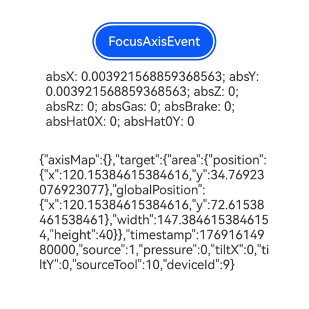

# Focus Axis Event

A focus axis event is an event triggered by interacting with a game controller through the directional pad or joystick. This type of event is dispatched to the component that currently has focus and are then passed back to the application. Components that are focusable by default, such as **Button**, do not require additional attributes to handle focus axis events. For components that are not focusable by default, such as **Text** and **Image**, you can enable focus axis events by setting the **focusable** attribute to **true**.

>  **NOTE**
>
>  The focus axis event is supported since API version 15. Updates will be marked with a superscript to indicate their earliest API version.

## onFocusAxisEvent

onFocusAxisEvent(event: Callback\<FocusAxisEvent>): T

Triggered when any operation is performed with the game controller's directional pad or joystick on the bound component.

**Atomic service API**: This API can be used in atomic services since API version 15.

**System capability**: SystemCapability.ArkUI.ArkUI.Full

**Parameters**

| Name| Type                         | Mandatory| Description              |
| ------ | ----------------------------- | ---- | ------------------ |
| event  | [FocusAxisEvent](#focusaxisevent) | Yes  | **FocusAxisEvent** object.|

**Return value**

| Type| Description|
| -------- | -------- |
| T | Current component.|

## FocusAxisEvent

Inherits from [BaseEvent](ts-gesture-customize-judge.md#baseevent).

**Atomic service API**: This API can be used in atomic services since API version 15.

**System capability**: SystemCapability.ArkUI.ArkUI.Full

| Name                                   | Type                                      | Description                |
| ------------------------------------- | ---------------------------------------- | --------------------------- |
| axisMap                               | Map<[AxisModel](ts-appendix-enums.md#axismodel15), number>     | Axis value table of the focus axis event.         |
| stopPropagation                       | Callback\<void>                           | Stops a key event from bubbling upwards or downwards.           |

## Example

This example demonstrates how to set up a focus axis event on a button. When the button gains focus, operating the game controller's directional pad or joystick will trigger the **onFocusAxisEvent** callback.

```ts
// xxx.ets
@Entry
@Component
struct FocusAxisEventExample {
  @State text: string = ''
  @State axisValue: string = ''

  aboutToAppear(): void {
    this.getUIContext().getFocusController().activate(true)
  }

  aboutToDisappear(): void {
    this.getUIContext().getFocusController().activate(false)
  }

  build() {
    Column() {
      Button('FocusAxisEvent')
        .defaultFocus(true)
        .onFocusAxisEvent((event: FocusAxisEvent) => {
          let absX = event.axisMap.get(AxisModel.ABS_X);
          let absY = event.axisMap.get(AxisModel.ABS_Y);
          let absZ = event.axisMap.get(AxisModel.ABS_Z);
          let absRz = event.axisMap.get(AxisModel.ABS_RZ);
          let absGas = event.axisMap.get(AxisModel.ABS_GAS);
          let absBrake = event.axisMap.get(AxisModel.ABS_BRAKE);
          let absHat0X = event.axisMap.get(AxisModel.ABS_HAT0X);
          let absHat0Y = event.axisMap.get(AxisModel.ABS_HAT0Y);
          this.axisValue = 'absX: ' + absX + '; absY: ' + absY + '; absZ: ' + absZ + '; absRz: ' + absRz + '; absGas: ' + absGas + '; absBrake: ' + absBrake + '; absHat0X: ' + absHat0X + '; absHat0Y: ' + absHat0Y;
          this.text = JSON.stringify(event);
        })
      Text(this.axisValue).padding(15)
      Text(this.text).padding(15)
    }.height(300).width('100%').padding(35)
  }
}
```

When the game controller's joystick is moved, the **onFocusAxisEvent** callback is triggered, and the axis values are updated accordingly.


