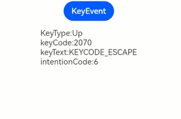
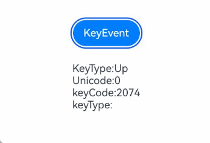

# Key Event

A key event is triggered when a focusable component, such as **Button**, interacts with a keyboard, remote control, or any other input device with keys. To use a key event for components that are not focusable by default, such as **Text** and **Image**, first set their **focusable** attribute to **true**.
For details about the process and specific timing of the key event triggering, see [Key Event Data Flow](../../../ui/arkts-common-events-device-input-event.md#key-event-data-flow).

>  **NOTE**
>
>  The APIs of this module are supported since API version 7. Updates will be marked with a superscript to indicate their earliest API version.

## onKeyEvent

onKeyEvent(event: (event: KeyEvent) => void): T

Triggered when a key event occurs.

**Atomic service API**: This API can be used in atomic services since API version 11.

**System capability**: SystemCapability.ArkUI.ArkUI.Full

**Parameters**

| Name| Type                         | Mandatory| Description              |
| ------ | ----------------------------- | ---- | ------------------ |
| event  | [KeyEvent](#keyevent) | Yes  | **KeyEvent** object.|

**Return value**

| Type| Description|
| -------- | -------- |
| T | Current component.|

## onKeyPreIme<sup>12+</sup>

onKeyPreIme(event: Callback<KeyEvent, boolean>): T

Triggered before other callbacks when a key operation is performed on the bound component after it obtains focus.

If the return value of this callback is **true**, the key event is considered consumed, and subsequent event callbacks (**keyboardShortcut**, input method events, **onKeyEvent**) will be intercepted and no longer triggered.

**Atomic service API**: This API can be used in atomic services since API version 12.

**System capability**: SystemCapability.ArkUI.ArkUI.Full

**Parameters**

| Name| Type                         | Mandatory| Description              |
| ------ | ----------------------------- | ---- | ------------------ |
| event  | [Callback](./ts-types.md#callback12)<[KeyEvent](#keyevent), boolean>| Yes  | Callback for handling the key event.|

**Return value**

| Type| Description|
| -------- | -------- |
| T | Current component.|

## KeyEvent

**Atomic service API**: This API can be used in atomic services since API version 11.

**System capability**: SystemCapability.ArkUI.ArkUI.Full

| Name                                   | Type                                      | Description                        |
| ------------------------------------- | ---------------------------------------- | -------------------------- |
| type                                  | [KeyType](ts-appendix-enums.md#keytype)  | Key type.                    |
| [keyCode](../../apis-input-kit/js-apis-keycode.md#keycode) | number                                   | Key code.                    |
| keyText                               | string                                   | Key value.                    |
| keySource                             | [KeySource](ts-appendix-enums.md#keysource) | Type of the input device that triggers the key event.            |
| deviceId                              | number                                   | ID of the input device that triggers the key event.            |
| metaKey                               | number                                   | State of the metakey when the key is pressed. The value **1** means the pressed state, and **0** means the unpressed state.|
| timestamp                             | number                                   | Timestamp of the event. It is the interval between the time when the event is triggered and the time when the system starts, in nanoseconds.|
| stopPropagation                       | () => void                               | Stops the event from bubbling upwards or downwards.                 |
| intentionCode<sup>10+</sup>           | [IntentionCode](../../apis-input-kit/js-apis-intentioncode.md) | Intention corresponding to the key.      |
| getModifierKeyState<sup>12+</sup> | (Array&lt;string&gt;) => bool | Obtains the pressed status of modifier keys. For details about the error message, see the following error codes. The following modifier keys are supported: 'Ctrl'\|'Alt'\|'Shift'\|'Fn'. However, the **Fn** key on external keyboards is not supported.<br>**Atomic service API**: This API can be used in atomic services since API version 13.|
| unicode<sup>14+</sup>                              | number                                   | Unicode value of the key. Non-space basic Latin characters in the 0x0021-0x007E range are supported. Characters with a value of 0 are not supported. In the case of key combination, this API returns the Unicode value of the key corresponding to the key event.<br>**Atomic service API**: This API can be used in atomic services since API version 14.|

**Error codes**

For details about the error codes, see [Universal Error Codes](../../errorcode-universal.md).

| ID| Error Message|
| ------- | -------- |
| 401 | Parameter error. Possible causes: 1. Incorrect parameter types. 2. Parameter verification failed. |

## Example 1: Triggering the onKeyEvent Callback

This example demonstrates how to set a key event on a button. When the button gains focus, the **onKeyEvent** callback is triggered.

```ts
// xxx.ets
@Entry
@Component
struct KeyEventExample {
  @State text: string = ''
  @State eventType: string = ''

  build() {
    Column() {
      Button('KeyEvent')
        .onKeyEvent((event?: KeyEvent) => {
          if(event){
            if (event.type === KeyType.Down) {
              this.eventType = 'Down'
            }
            if (event.type === KeyType.Up) {
              this.eventType = 'Up'
            }
            this.text = 'KeyType:' + this.eventType + '\nkeyCode:' + event.keyCode + '\nkeyText:' + event.keyText + '\nintentionCode:' + event.intentionCode
          }
        })
      Text(this.text).padding(15)
    }.height(300).width('100%').padding(35)
  }
}
```

  

## Example 2: Obtaining Unicode Values

This example demonstrates how to obtain the Unicode value of the pressed key using the key event.

```ts
// xxx.ets
@Entry
@Component
struct KeyEventExample {
  @State text: string = ''
  @State eventType: string = ''
  @State keyType: string = ''

  build() {
    Column({ space: 10 }) {
      Button('KeyEvent')
        .onKeyEvent((event?: KeyEvent) => {
          if(event){
            if (event.type === KeyType.Down) {
              this.eventType = 'Down'
            }
            if (event.type === KeyType.Up) {
              this.eventType = 'Up'
            }
            if (event.unicode == 97) {
              this.keyType = 'a'
            } else if (event.unicode == 65) {
              this.keyType = 'A'
            } else {
              this.keyType = ' '
            }
            this.text = 'KeyType:' + this.eventType + '\nUnicode:' + event.unicode + '\nkeyCode:' + event.keyCode + '\nkeyType:' + this.keyType
          }
        })
      Text(this.text).padding(15)
    }.height(300).width('100%').padding(35)
  }
}
```

 
