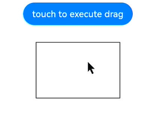
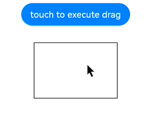
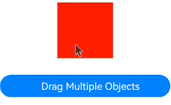
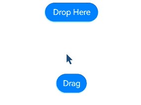

# @ohos.arkui.dragController (DragController)

The **dragController** module provides APIs for initiating drag actions. When receiving a gesture event, such as a touch or long-press event, an application can initiate a drag action and carry drag information therein.

> **NOTE**
>
> The initial APIs of this module are supported since API version 10. Newly added APIs will be marked with a superscript to indicate their earliest API version.
> The functionality of this module depends on UI context. This means that the APIs of this module cannot be used where the UI context is unclear. For details, see [UIContext](js-apis-arkui-UIContext.md#uicontext).
> Since API version 10, you can use the [getDragController](js-apis-arkui-UIContext.md#getdragcontroller11) API in **UIContext** to obtain the **DragController** object associated with the current UI context.
> You can preview how this component looks on a real device, but not in DevEco Studio Previewer.

## Modules to Import

```ts
import { dragController } from "@kit.ArkUI";
```

## dragController.executeDrag

executeDrag(custom: CustomBuilder | DragItemInfo, dragInfo: DragInfo,callback:AsyncCallback\<DragEventParam>): void

Initiates a drag action, with the object to be dragged and the drag information passed in. This API uses an asynchronous callback to return the result.

**Atomic service API**: This API can be used in atomic services since API version 12.

**System capability**: SystemCapability.ArkUI.ArkUI.Full

**Parameters**

| Name  | Type                                                        | Mandatory| Description                                                        |
| -------- | ------------------------------------------------------------ | ---- | ------------------------------------------------------------ |
| custom   | [CustomBuilder](arkui-ts/ts-types.md#custombuilder8) \| [DragItemInfo](arkui-ts/ts-universal-events-drag-drop.md#dragiteminfo) | Yes  | Object to be dragged.<br>**NOTE**<br>The global builder is not supported. If the [Image](arkui-ts/ts-basic-components-image.md) component is used in the builder, enable synchronous loading, that is, set the [syncLoad](arkui-ts/ts-basic-components-image.md#syncload8) attribute of the component to **true**. The builder is used only to generate the image displayed during the current dragging. Changes to the builder, if any, apply to the next dragging, but not to the current dragging.|
| dragInfo | [DragInfo](#draginfo)                                        | Yes  | Drag information.                                                  |
| callback | [AsyncCallback](../apis-basic-services-kit/js-apis-base.md#asynccallback)&lt;[DragEventParam](#drageventparam12)&gt; | Yes  | Callback used to return the result.                                    |

**Error codes**

For details about the error codes, see [Universal Error Codes](../errorcode-universal.md).

| ID| Error Message     |
| -------- | ------------- |
| 401      | Parameter error. Possible causes: 1. Mandatory parameters are left unspecified; 2.Incorrect parameters types; 3. Parameter verification failed.   |
| 100001   | Internal handling failed. |

**Example**

> **NOTE**
>
> You are advised to use the [getDragController](js-apis-arkui-UIContext.md#getdragcontroller11) API in [UIContext](js-apis-arkui-UIContext.md#uicontext) to obtain the **DragController** object associated with the current UI context.

```ts
import { dragController } from "@kit.ArkUI";
import { unifiedDataChannel } from '@kit.ArkData';

@Entry
@Component
struct DragControllerPage {
  @State text: string = ''

  @Builder DraggingBuilder() {
    Column() {
      Text("DraggingBuilder")
        .fontColor(Color.White)
        .fontSize(12)
    }
    .width(100)
    .height(100)
    .backgroundColor(Color.Blue)
  }

  build() {
    Column() {
      Button('touch to execute drag')
        .margin(10)
        .onTouch((event?:TouchEvent) => {
          if(event){
            if (event.type == TouchType.Down) {
              let text = new unifiedDataChannel.PlainText()
              text.textContent = 'drag text'
              text.abstract = 'abstract'
              let unifiedData = new unifiedDataChannel.UnifiedData(text)

              let dragInfo: dragController.DragInfo = {
                pointerId: 0,
                data: unifiedData,
                extraParams: ''
              }
              class tmp{
                event:DragEvent|undefined = undefined
                extraParams:string = ''
              }
              let eve:tmp = new tmp()
              dragController.executeDrag(()=>{this.DraggingBuilder()}, dragInfo, (err, eve) => { // You are advised to use this.getUIContext().getDragController().executeDrag().
                if(eve.event){
                  if (eve.event.getResult() == DragResult.DRAG_SUCCESSFUL) {
                    // ...
                  } else if (eve.event.getResult() == DragResult.DRAG_FAILED) {
                    // ...
                  }
                }
              })
            }
          }
        })
      Text(this.text)
        .height(100)
        .width(150)
        .margin({top:20})
        .border({color:Color.Black,width:1})
        .onDrop((dragEvent?:DragEvent)=>{
          if(dragEvent){
            let records: Array<unifiedDataChannel.UnifiedRecord> = dragEvent.getData().getRecords();
            let plainText: unifiedDataChannel.PlainText = records[0] as unifiedDataChannel.PlainText;
            this.text = plainText.textContent;
          }
        })
    }
    .width('100%')
    .height('100%')
  }
}
```
  
## dragController.executeDrag

executeDrag(custom: CustomBuilder | DragItemInfo, dragInfo: DragInfo): Promise\<DragEventParam>

Initiates a drag action, with the object to be dragged and the drag information passed in. This API uses a promise to return the result.

**Atomic service API**: This API can be used in atomic services since API version 12.

**System capability**: SystemCapability.ArkUI.ArkUI.Full

**Parameters**

| Name  | Type                                                        | Mandatory| Description                            |
| -------- | ------------------------------------------------------------ | ---- | -------------------------------- |
| custom   | [CustomBuilder](arkui-ts/ts-types.md#custombuilder8) \| [DragItemInfo](arkui-ts/ts-universal-events-drag-drop.md#dragiteminfo) | Yes  | Object to be dragged.|
| dragInfo | [DragInfo](#draginfo)                                        | Yes  | Drag information.                      |

**Return value**

| Type                                              | Description                    |
| -------------------------------------------------- | ------------------------ |
| Promise&lt;[DragEventParam](#drageventparam12)&gt; | Promise used to return the result.|

**Error codes**
For details about the error codes, see [Universal Error Codes](../errorcode-universal.md).
| ID| Error Message     |
| -------- | ------------- |
| 401      | Parameter error. Possible causes: 1. Mandatory parameters are left unspecified; 2.Incorrect parameters types; 3. Parameter verification failed.   |
| 100001   | Internal handling failed. |

**Example**

> **NOTE**
>
> You are advised to use the [getDragController](js-apis-arkui-UIContext.md#getdragcontroller11) API in [UIContext](js-apis-arkui-UIContext.md#uicontext) to obtain the **DragController** object associated with the current UI context.

```ts
import { dragController, componentSnapshot } from "@kit.ArkUI"
import { image } from '@kit.ImageKit';
import { unifiedDataChannel } from '@kit.ArkData';

@Entry
@Component
struct DragControllerPage {
  @State pixmap: image.PixelMap|undefined = undefined
  @State text: string = ''

  @Builder DraggingBuilder() {
    Column() {
      Text("DraggingBuilder")
        .fontColor(Color.White)
    }
    .width(100)
    .height(100)
    .backgroundColor(Color.Blue)
  }

  @Builder PixmapBuilder() {
    Column() {
      Text("PixmapBuilder")
        .fontColor(Color.White)
        .fontSize(15)
    }
    .width(100)
    .height(100)
    .backgroundColor(Color.Blue)
  }

  aboutToAppear() {
    let pb: CustomBuilder = (): void => {
      this.PixmapBuilder()
    }
    componentSnapshot.createFromBuilder(pb).then((pix: image.PixelMap) => {
      this.pixmap = pix;
    })
  }

  build() {
    Column() {
      Button('touch to execute drag')
        .margin(10)
        .onTouch((event?:TouchEvent) => {
          if(event){
            if (event.type == TouchType.Down) {
              let text = new unifiedDataChannel.PlainText()
              text.textContent = 'drag text'
              text.abstract = 'abstract'
              let unifiedData = new unifiedDataChannel.UnifiedData(text)

              let dragInfo: dragController.DragInfo = {
                pointerId: 0,
                data: unifiedData,
                extraParams: ''
              }
              let dragItemInfo: DragItemInfo = {
                pixelMap: this.pixmap,
                builder: ()=>{this.DraggingBuilder()},
                extraInfo: "DragItemInfoTest"
              }

              class tmp{
                event:DragResult|undefined = undefined
                extraParams:string = ''
              }
              let eve:tmp = new tmp()
              dragController.executeDrag(dragItemInfo, dragInfo) // You are advised to use this.getUIContext().getDragController().executeDrag().
                .then((eve) => {
                  if (eve.event.getResult() == DragResult.DRAG_SUCCESSFUL) {
                    // ...
                  } else if (eve.event.getResult() == DragResult.DRAG_FAILED) {
                    // ...
                  }
                })
                .catch((err:Error) => {
                })
            }
          }
        })
      Text(this.text)
        .height(100)
        .width(150)
        .margin({top:20})
        .border({color:Color.Black,width:1})
        .onDrop((dragEvent?:DragEvent)=>{
          if(dragEvent){
            let records: Array<unifiedDataChannel.UnifiedRecord> = dragEvent.getData().getRecords();
            let plainText: unifiedDataChannel.PlainText = records[0] as unifiedDataChannel.PlainText;
            this.text = plainText.textContent;
          }
        })
    }
    .width('100%')
    .height('100%')
  }
}
```
  
## DragInfo

**Atomic service API**: This API can be used in atomic services since API version 12.

**System capability**: SystemCapability.ArkUI.ArkUI.Full

Defines the attributes required for initiating a drag action and information carried in the dragging process.

| Name       | Type                                                  | Mandatory| Description                                    |
| ----------- | ------------------------------------------------------ | ---- | ---------------------------------------- |
| pointerId   | number                                                 | Yes  | ID of the touch point on the screen when dragging is started.        |
| data        | [unifiedDataChannel.UnifiedData](../apis-arkdata/js-apis-data-unifiedDataChannel.md#unifieddata) | No  | Data carried in the dragging process.              |
| extraParams | string                                                 | No  | Additional information about the drag action. Not supported currently.|
| touchPoint<sup>11+</sup>    | [TouchPoint](arkui-ts/ts-types.md#touchpoint11)  | No  | Coordinates of the touch point. If this parameter is not set, the touch point is centered.|
| previewOptions<sup>11+</sup>| [DragPreviewOptions](arkui-ts/ts-universal-attributes-drag-drop.md#dragpreviewoptions11)                                | No  | Custom configuration of the drag preview.|

## dragController.createDragAction<sup>11+</sup>

createDragAction(customArray: Array&lt;CustomBuilder \| DragItemInfo&gt;, dragInfo: DragInfo): DragAction

Creates a drag action object for initiating drag and drop operations. You need to explicitly specify one or more drag previews, the drag data, and the drag handle point. If a drag operation initiated by an existing drag action object is not completed, no new object can be created, and calling the API will throw an exception. After the lifecycle of the drag action object ends, the callback functions registered on this object become invalid. Therefore, it is necessary to hold this object within a longer scope and replace the old value with a new object returned by **createDragAction** before each drag initiation.

**NOTE**<br>You are advised to control the number of drag previews. If too many previews are passed in, the drag efficiency may be affected.

**Atomic service API**: This API can be used in atomic services since API version 12.

**System capability**: SystemCapability.ArkUI.ArkUI.Full

**Parameters**

| Name  | Type                                                        | Mandatory| Description                            |
| --------      | ------------------------------------------------------------ | ---- | -------------------------------- |
| customArray  | Array&lt;[CustomBuilder](arkui-ts/ts-types.md#custombuilder8) \| [DragItemInfo](arkui-ts/ts-universal-events-drag-drop.md#dragiteminfo)&gt; | Yes  | Object to be dragged.|
| dragInfo | [DragInfo](#draginfo)                                        | Yes  | Drag information.                      |

**Return value**

| Type                                                  | Description              |
| ------------------------------------------------------ | ------------------ |
| [DragAction](#dragaction11)| **DragAction** object, which is used to subscribe to drag state changes and start the drag service.|

**Error codes**

For details about the error codes, see [Universal Error Codes](../errorcode-universal.md).
| ID| Error Message     |
| -------- | ------------- |
| 401      | Parameter error. Possible causes: 1. Mandatory parameters are left unspecified; 2.Incorrect parameters types; 3. Parameter verification failed.   |
| 100001   | Internal handling failed. |

**Example**

> **NOTE**
>
> You are advised to use the [getDragController](js-apis-arkui-UIContext.md#getdragcontroller11) API in [UIContext](js-apis-arkui-UIContext.md#uicontext) to obtain the **DragController** object associated with the current UI context.

```ts
import { dragController, componentSnapshot } from "@kit.ArkUI";
import { image } from '@kit.ImageKit';
import { unifiedDataChannel } from '@kit.ArkData';

@Entry
@Component
struct DragControllerPage {
  @State pixmap: image.PixelMap | null = null
  @State text: string = ''
  private dragAction: dragController.DragAction | null = null;
  customBuilders:Array<CustomBuilder | DragItemInfo> = new Array<CustomBuilder | DragItemInfo>();
  @Builder DraggingBuilder() {
    Column() {
      Text("DraggingBuilder")
        .fontColor(Color.White)
        .fontSize(12)
    }
    .width(100)
    .height(100)
    .backgroundColor(Color.Blue)
  }

  build() {
    Column() {

      Column() {
        Text(this.text)
          .width('100%')
          .height('100%')
          .fontColor(Color.White)
          .fontSize(18)
          .onDrop((dragEvent?:DragEvent)=>{
            if(dragEvent){
              let records: Array<unifiedDataChannel.UnifiedRecord> = dragEvent.getData().getRecords();
              let plainText: unifiedDataChannel.PlainText = records[0] as unifiedDataChannel.PlainText;
              this.text = plainText.textContent;
            }
          })
      }
      .width(100)
      .height(100)
      .backgroundColor(Color.Red)
      .margin(10)

      Button('Drag Multiple Objects').onTouch((event?:TouchEvent) => {
        if(event){
          if (event.type == TouchType.Down) {
            console.info("muti drag Down by listener");
            this.customBuilders.splice(0, this.customBuilders.length);
            this.customBuilders.push(()=>{this.DraggingBuilder()});
            this.customBuilders.push(()=>{this.DraggingBuilder()});
            this.customBuilders.push(()=>{this.DraggingBuilder()});
            let text = new unifiedDataChannel.PlainText()
            text.textContent = 'drag text'
            let unifiedData = new unifiedDataChannel.UnifiedData(text)
            let dragInfo: dragController.DragInfo = {
              pointerId: 0,
              data: unifiedData,
              extraParams: ''
            }
            try{
              this.dragAction = dragController.createDragAction(this.customBuilders, dragInfo) // You are advised to use this.getUIContext().getDragController().createDragAction().
              if(!this.dragAction){
                console.info("listener dragAction is null");
                return
              }
              this.dragAction.on('statusChange', (dragAndDropInfo: dragController.DragAndDropInfo)=>{
                if (dragAndDropInfo.status == dragController.DragStatus.STARTED) {
                  console.info("drag has start");
                } else if (dragAndDropInfo.status == dragController.DragStatus.ENDED){
                  console.info("drag has end");
                  if (!this.dragAction) {
                    return
                  }
                  this.dragAction.off('statusChange')
                }
              })
              this.dragAction.startDrag().then(()=>{}).catch((err:Error)=>{
                console.info("start drag Error:" + err.message);
              })
            } catch(err) {
              console.info("create dragAction Error:" + err.message);
            }
          }
        }
      }).margin({top:20})
    }
  }
}
```
  
## DragAction<sup>11+</sup>

Implements a **DragAction** object to subscribe to drag state changes and start the drag service.

**Atomic service API**: This API can be used in atomic services since API version 12.

**System capability**: SystemCapability.ArkUI.ArkUI.Full

### startDrag<sup>11+</sup>

startDrag(): Promise&lt;void&gt;

Starts the drag service. This API uses a promise to return the result.

**Atomic service API**: This API can be used in atomic services since API version 12.

**System capability**: SystemCapability.ArkUI.ArkUI.Full

**Error codes**

| ID| Error Message     |
| -------- | ------------- |
| 100001   | Internal handling failed. |

**Example**

> **NOTE**
>
> You are advised to use the [getDragController](js-apis-arkui-UIContext.md#getdragcontroller11) API in [UIContext](js-apis-arkui-UIContext.md#uicontext) to obtain the **DragController** object associated with the current UI context.

```ts
import { dragController } from "@kit.ArkUI"
import { unifiedDataChannel } from '@kit.ArkData';

@Entry
@Component
struct DragControllerPage {
  build() {
    Column() {
      Button('touch to execute drag')
        .onTouch((event?:TouchEvent) => {
          let customBuilders:Array<CustomBuilder | DragItemInfo> = new Array<CustomBuilder | DragItemInfo>();
          let text = new unifiedDataChannel.Text()
          let unifiedData = new unifiedDataChannel.UnifiedData(text)
          let dragInfo: dragController.DragInfo = {
            pointerId: 0,
            data: unifiedData,
            extraParams: ''
          }
          try {
            let dragAction: dragController.DragAction | null = dragController.createDragAction(customBuilders, dragInfo); // You are advised to use this.getUIContext().getDragController().createDragAction().
            if(!dragAction){
              console.info("listener dragAction is null");
              return
            }
            dragAction.startDrag().then(()=>{}).catch((err:Error)=>{
              console.info("start drag Error:" + err.message);
            })
          } catch (err) {
            console.info("create dragAction Error:" + err.message);
          }
        })
    }
  }
}

```

### on('statusChange')<sup>11+</sup>

on(type: 'statusChange', callback: Callback&lt;[DragAndDropInfo](#draganddropinfo11)&gt;): void

Subscribes to drag state changes.

**Atomic service API**: This API can be used in atomic services since API version 12.

**System capability**: SystemCapability.ArkUI.ArkUI.Full

**Parameters**
| Name    | Type | Mandatory   | Description            |
| ------ | ------ | ------- | ---------------- |
|  type  | string | Yes     | Event type. The value is fixed at **'statusChange'**, which indicates the drag state change event.|
|  callback  | Callback&lt;[DragAndDropInfo](#draganddropinfo11)&gt; | Yes     | Callback used to return a [DragAndDropInfo](#draganddropinfo11) instance.|

**Example**

> **NOTE**
>
> You are advised to use the [getDragController](js-apis-arkui-UIContext.md#getdragcontroller11) API in [UIContext](js-apis-arkui-UIContext.md#uicontext) to obtain the **DragController** object associated with the current UI context.

```ts
import { dragController } from "@kit.ArkUI";
import { unifiedDataChannel } from '@kit.ArkData';

@Entry
@Component
struct DragControllerPage {
  build() {
    Column() {
      Button('touch to execute drag')
        .onTouch((event?:TouchEvent) => {
          let customBuilders:Array<CustomBuilder | DragItemInfo> = new Array<CustomBuilder | DragItemInfo>();
          let text = new unifiedDataChannel.Text()
          let unifiedData = new unifiedDataChannel.UnifiedData(text)
          let dragInfo: dragController.DragInfo = {
            pointerId: 0,
            data: unifiedData,
            extraParams: ''
          }
          try{
            let dragAction: dragController.DragAction | null = dragController.createDragAction(customBuilders, dragInfo); // You are advised to use this.getUIContext().getDragController().createDragAction().
            if(!dragAction){
              console.info("listener dragAction is null");
              return
            }
            dragAction.on('statusChange', (dragAndDropInfo: dragController.DragAndDropInfo)=>{
              console.info("Register to listen on drag status", JSON.stringify(dragAndDropInfo));
            })
          }catch(err) {
            console.info("create dragAction Error:" + err.message);
          }
        })
    }
  }
}
```

### off('statusChange')<sup>11+</sup>

 off(type: 'statusChange', callback?: Callback&lt;[DragAndDropInfo](#draganddropinfo11)&gt;): void

Unsubscribes from drag state changes.

**Atomic service API**: This API can be used in atomic services since API version 12.

**System capability**: SystemCapability.ArkUI.ArkUI.Full

**Parameters**
| Name    | Type | Mandatory   | Description            |
| ------ | ------ | ------- | ---------------- |
|  type  | string | Yes     | Event type. The value is fixed at **'statusChange'**, which indicates the drag state change event.|
|  callback  | Callback&lt;[DragAndDropInfo](#draganddropinfo11)&gt; | No     | Callback used to return a [DragAndDropInfo](#draganddropinfo11) instance. If this parameter is not set, this API unsubscribes from all callbacks corresponding to **type**.|

**Example**

> **NOTE**
>
> You are advised to use the [getDragController](js-apis-arkui-UIContext.md#getdragcontroller11) API in [UIContext](js-apis-arkui-UIContext.md#uicontext) to obtain the **DragController** object associated with the current UI context.

```ts
import { dragController } from "@kit.ArkUI"
import { unifiedDataChannel } from '@kit.ArkData';

@Entry
@Component
struct DragControllerPage {
  build() {
    Column() {
      Button('touch to execute drag')
        .onTouch((event?:TouchEvent) => {
          let customBuilders:Array<CustomBuilder | DragItemInfo> = new Array<CustomBuilder | DragItemInfo>();
          let text = new unifiedDataChannel.Text()
          let unifiedData = new unifiedDataChannel.UnifiedData(text)
          let dragInfo: dragController.DragInfo = {
            pointerId: 0,
            data: unifiedData,
            extraParams: ''
          }
          try{
            let dragAction: dragController.DragAction | null = dragController.createDragAction(customBuilders, dragInfo); // You are advised to use this.getUIContext().getDragController().createDragAction().
            if(!dragAction){
              console.info("listener dragAction is null");
              return
            }
            dragAction.off('statusChange', (dragAndDropInfo: dragController.DragAndDropInfo)=>{
              console.info("Cancel listening on drag status", JSON.stringify(dragAndDropInfo));
            })
          }catch(err) {
            console.info("create dragAction Error:" + err.message);
          }
        })
    }
  }
}
```

## DragAndDropInfo<sup>11+</sup>

**Atomic service API**: This API can be used in atomic services since API version 12.

**System capability**: SystemCapability.ArkUI.ArkUI.Full

Provides the data reported when the state changes during dragging.

| Name         | Type                                                  | Mandatory| Description                                    |
| -----------   | ------------------------------------------------------ | ---- | ---------------------------------------- |
| status       | [DragStatus](#dragstatus11)                                                 | Yes  | Current dragging state (started or ended).        |
| event        | [DragEvent](arkui-ts/ts-universal-events-drag-drop.md#dragevent) | Yes  | Drag event corresponding to the current state.              |
| extraParams| string                                                 | No  | Additional information about the drag action. Not supported currently.|

## DragStatus<sup>11+</sup>

**Atomic service API**: This API can be used in atomic services since API version 12.

**System capability**: SystemCapability.ArkUI.ArkUI.Full

Describes the dragging start and end states.

| Name         | Value                                                  | Description                                    |
| -----------   | ------------------------------------------------------| ---------------------------------------- |
| STARTED       | 0                                                  | Dragging is started.        |
| ENDED        | 1                                                  | Dragging ends.              |

## AnimationOptions<sup>11+</sup>

**Atomic service API**: This API can be used in atomic services since API version 12.

**System capability**: SystemCapability.ArkUI.ArkUI.Full

Defines the attributes required for initiating a drag action and information carried in the dragging process.

| Name       | Type                                                  | Mandatory| Description                                    |
| ----------- | ------------------------------------------------------ | ---- | ---------------------------------------- |
| duration    | number                                                 | No  | Animation duration, in ms.<br>Default value: **1000**<br>**NOTE**<br>- If this parameter is set to a value less than 0, the value **0** is used.<br>- Floating-point values will be rounded down to integers. For example, if the value set is 1.2, **1** will be used.|
| curve       | [Curve](arkui-ts/ts-appendix-enums.md#curve) \| [ICurve](js-apis-curve.md#icurve9) | No   | Animation curve.<br>Default value: **Curve.EaseInOut**|                          |

## DragEventParam<sup>12+</sup>

**Atomic service API**: This API can be used in atomic services since API version 12.

**System capability**: SystemCapability.ArkUI.ArkUI.Full

Represents the callback used to return the result after a drag ends.

| Name       | Type                                                        | Mandatory| Description                          |
| ----------- | ------------------------------------------------------------ | ---- | ------------------------------ |
| event       | [DragEvent](arkui-ts/ts-universal-events-drag-drop.md#dragevent) | Yes  | Drag event information that includes only the drag result.|
| extraParams | string                                                       | Yes  | Additional information about the drag event.            |

## dragController.getDragPreview<sup>11+</sup>

getDragPreview(): DragPreview

Obtains the **DragPreview** object, which represents the preview displayed during a drag.

**Atomic service API**: This API can be used in atomic services since API version 12.

**System capability**: SystemCapability.ArkUI.ArkUI.Full

**Return value**

| Type       | Description                                           |
| ------------| ------------------------------------------------|
| [DragPreview](#dragpreview11) | **DragPreview** object. It provides the API for setting the preview style. It does not work in the **OnDrop** and **OnDragEnd** callbacks.|

**Example**

For details, see [animate](#animate11).

## DragPreview<sup>11+</sup>

Implements a **DragPreview** object. This API does not work in the **OnDrop** and **OnDragEnd** callbacks.

**Atomic service API**: This API can be used in atomic services since API version 12.

**System capability**: SystemCapability.ArkUI.ArkUI.Full

### setForegroundColor<sup>11+</sup>

setForegroundColor(color: ResourceColor): void

Sets the foreground color of the drag preview. This API does not work in the **OnDrop** and **OnDragEnd** callbacks. It can only be used on the object obtained through the [getDragPreview()](js-apis-arkui-UIContext.md#getdragpreview11) API.

**Atomic service API**: This API can be used in atomic services since API version 12.

**System capability**: SystemCapability.ArkUI.ArkUI.Full

**Parameters**

| Name  | Type                            | Mandatory| Description                    |
| -------- | -------------------------------- | ---- | ------------------------ |
| color    | [ResourceColor](arkui-ts/ts-types.md#resourcecolor) | Yes  |      Foreground color of the drag preview.                   |

**Example**

For details, see [animate](#animate11).

  ### animate<sup>11+</sup>

animate(options: AnimationOptions, handler: () => void): void

Applies a foreground color animation to the drag preview. This API does not work in the **OnDrop** and **OnDragEnd** callbacks. It can only be used on the object obtained through the [getDragPreview()](js-apis-arkui-UIContext.md#getdragpreview11) API.

**Atomic service API**: This API can be used in atomic services since API version 12.

**System capability**: SystemCapability.ArkUI.ArkUI.Full

**Parameters**

| Name  | Type                            | Mandatory| Description                              |
| -------- | -------------------------------- | ---- | -----------------------------------|
| options  | [AnimationOptions](#animationoptions11)                | Yes  | Animation settings.                          |
| handler  | () => void                         | Yes  | Callback used to change attributes such as the background mask color. |

**Example**

> **NOTE**
>
> You are advised to use the [getDragController](js-apis-arkui-UIContext.md#getdragcontroller11) API in [UIContext](js-apis-arkui-UIContext.md#uicontext) to obtain the **DragController** object associated with the current UI context.

1. In the **EntryAbility.ets** file, obtain the UI context and save it to LocalStorage.
  ```ts
import { AbilityConstant, UIAbility, Want } from '@kit.AbilityKit';
import { hilog } from '@kit.PerformanceAnalysisKit';
import { window, UIContext } from '@kit.ArkUI';

let uiContext: UIContext;
let localStorage: LocalStorage = new LocalStorage('uiContext');

export default class EntryAbility extends UIAbility {
  storage: LocalStorage = localStorage;

  onCreate(want: Want, launchParam: AbilityConstant.LaunchParam): void {
    hilog.info(0x0000, 'testTag', '%{public}s', 'Ability onCreate');
  }

  onDestroy(): void {
    hilog.info(0x0000, 'testTag', '%{public}s', 'Ability onDestroy');
  }

  onWindowStageCreate(windowStage: window.WindowStage): void {
    hilog.info(0x0000, 'testTag', '%{public}s', 'Ability onWindowStageCreate');

    windowStage.loadContent('pages/Index', (err, data) => {
      if (err.code) {
        hilog.error(0x0000, 'testTag', 'Failed to load the content. Cause: %{public}s', JSON.stringify(err) ?? '');
        return;
      }
      hilog.info(0x0000, 'testTag', 'Succeeded in loading the content. Data: %{public}s', JSON.stringify(data) ?? '');
      windowStage.getMainWindow((err, data) => {
        if (err.code) {
          hilog.error(0x0000, 'Failed to abtain the main window. Cause:' + err.message, '');
          return;
        }
        let windowClass: window.Window = data;
        uiContext = windowClass.getUIContext();
        this.storage.setOrCreate<UIContext>('uiContext', uiContext);
      })
    });
  }
}
  ```
2. In the **Index.ets** file, call **LocalStorage.getShared()** to obtain the UI context and then use the **DragController** object obtained to perform subsequent operations.
  ```ts

import { unifiedDataChannel } from '@kit.ArkData';
import { hilog } from '@kit.PerformanceAnalysisKit';
import { dragController, curves, promptAction, UIContext } from "@kit.ArkUI";
import { image } from '@kit.ImageKit';
import { BusinessError } from '@kit.BasicServicesKit';

let storages = LocalStorage.getShared();

@Entry(storages)
@Component
struct DragControllerPage {
  @State pixmap: image.PixelMap|null = null

  @Builder DraggingBuilder() {
    Column() {
      Text("DraggingBuilder")
        .fontColor(Color.White)
        .fontSize(12)
    }
    .width(100)
    .height(100)
    .backgroundColor(Color.Blue)
  }

  @Builder PixmapBuilder() {
    Column() {
      Text("PixmapBuilder")
    }
    .width(100)
    .height(100)
    .backgroundColor(Color.Blue)
  }

  build() {
    Column() {
      Button('Drag Here')
        .margin(10)
        .onDragEnter(() => {
        try {
          let uiContext: UIContext = storages.get<UIContext>('uiContext') as UIContext;
          let previewObj: dragController.DragPreview = uiContext.getDragController().getDragPreview();
          let foregroundColor: ResourceColor = Color.Green;

          let previewAnimation: dragController.AnimationOptions = {
            curve: curves.cubicBezierCurve(0.2,0,0,1),
          }
          previewObj.animate(previewAnimation, () => {
            previewObj.setForegroundColor(foregroundColor);
          });
        } catch (error) {
          let msg = (error as BusinessError).message;
          let code = (error as BusinessError).code;
          hilog.error(0x0000, `show error code is ${code}, message is ${msg}`, '');
        }
      })
        .onDrop(() => {
          promptAction.showToast({duration: 100, message: 'Drag Success', bottom: 400})
        })
      Button('Drag').onTouch ((event?:TouchEvent) => {
        if(event){
          if (event.type == TouchType.Down) {
            let text = new unifiedDataChannel.Text()
            let unifiedData = new unifiedDataChannel.UnifiedData(text)
            let dragInfo: dragController.DragInfo = {
              pointerId: 0,
              data: unifiedData,
              extraParams: ''
            }
            class tmp{
              event:DragEvent|undefined = undefined
              extraParams:string = ''
            }
            let eve:tmp = new tmp()
            dragController.executeDrag(() => { // You are advised to use this.getUIContext().getDragController().executeDrag().
              this.DraggingBuilder()
            }, dragInfo, (err , eve) => {
              hilog.info(0x0000, `ljx ${JSON.stringify(err)}`, '')
              if (eve && eve.event) {
                if (eve.event.getResult() == DragResult.DRAG_SUCCESSFUL) {
                  hilog.info(0x0000, 'success', '');
                } else if (eve.event.getResult() == DragResult.DRAG_FAILED) {
                  hilog.info(0x0000, 'failed', '');
                }
              }
            })
          }
        }
      }).margin({top:100})
    }
    .width('100%')
    .height('100%')
  }
}
  ```
  
