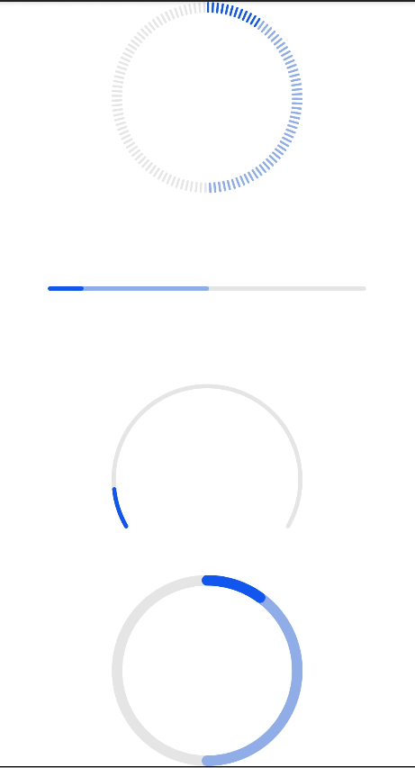

# progress


The **\<Progress>** component is used to provide a progress bar that displays the progress of content loading or an operation.

> **NOTE**
>
> The APIs of this module are supported since API version 8. Updates will be marked with a superscript to indicate their earliest API version.


## Child Components

Not supported


## Attributes

In addition to the [universal attributes](js-service-widget-common-attributes.md), the following attributes are supported.

| Name| Type| Default Value| Mandatory| Description|
| -------- | -------- | -------- | -------- | -------- |
| type | string | horizontal | No| Type of the progress bar, which cannot be changed dynamically. Available values are as follows:<br>- **horizontal**: linear progress bar.<br>- **circular**: loading progress bar.<br>- **ring**: ring progress bar.<br>- **scale-ring**: ring progress bar with a scale.<br>- **arc**: arc progress bar.<br>- **eclipse**: eclipse progress bar.|

Different types of progress bars support different attributes.

- When the type is **horizontal**, **ring**, or **scale-ring**, the following attributes are supported.
    | Name| Type| Default Value| Mandatory| Description|
  | -------- | -------- | -------- | -------- | -------- |
  | percent | number | 0 | No| Current progress. The value ranges from 0 to 100.|
  | secondarypercent(Rich) | number | 0 | No| Secondary progress. The value ranges from 0 to 100.|

- When the type is **ring** or **scale-ring**, the following attributes are supported.
    | Name| Type| Default Value| Mandatory| Description|
  | -------- | -------- | -------- | -------- | -------- |
  | clockwise | boolean | true | No| Whether the ring progress bar moves in a clockwise direction.|

- When the type is **arc**, the following attributes are supported.
    | Name| Type| Default Value| Mandatory| Description|
  | -------- | -------- | -------- | -------- | -------- |
  | percent | number | 0 | No| Current progress. The value ranges from 0 to 100.|


## Styles

In addition to the [universal styles](js-service-widget-common-styles.md), the following styles are supported.

When the type is **horizontal**, the following styles are supported.

| Name| Type| Default Value| Mandatory| Description|
| -------- | -------- | -------- | -------- | -------- |
| color | &lt;color&gt; | \#ff007dff | No| Color of the progress bar.|
| stroke-width | &lt;length&gt; | 4px | No| Stroke width of the progress bar.|
| background-color | &lt;color&gt; | - | No| Background color of the progress bar.|
| secondary-color | &lt;color&gt; | - | No| Color of the secondary progress bar.|

When the type is **circular**, the following styles are supported.

| Name| Type| Default Value| Mandatory| Description|
| -------- | -------- | -------- | -------- | -------- |
| color | &lt;color&gt; | - | No| Color of the dot on the loading progress bar.|

When the type is **ring** or **scale-ring**, the following styles are supported.

| Name| Type| Default Value| Mandatory| Description|
| -------- | -------- | -------- | -------- | -------- |
| color | &lt;color&gt;&nbsp;\|&nbsp;&lt;linear-gradient&gt; | - | No| Color of the ring progress bar. The **ring** type supports the linear gradient<br>defined by two colors, for example, **color&nbsp;=&nbsp;linear-gradient(\#ff0000,&nbsp;\#00ff00)**.|
| background-color | &lt;color&gt; | - | No| Background color of the ring progress bar.|
| secondary-color | &lt;color&gt; | - | No| Color of the secondary ring progress bar.|
| stroke-width | &lt;length&gt; | 10px | No| Width of the ring progress bar.|
| scale-width | &lt;length&gt; | - | No| Scale thickness of the ring progress bar with a scale. This style takes effect only when the type is **scale-ring**.|
| scale-number | number | 120 | No| Number of scales of the ring progress bar with a scale. This style takes effect only when the type is **scale-ring**.|

When the type is **arc**, the following styles are supported.

| Name| Type| Default Value| Mandatory| Description|
| -------- | -------- | -------- | -------- | -------- |
| color | &lt;color&gt; | - | No| Color of the arc progress bar.|
| background-color | &lt;color&gt; | - | No| Background color of the arc progress bar.|
| stroke-width | &lt;length&gt; | - | No| Stroke width of the arc progress bar.<br>A larger width value means that the progress bar is closer to the center of the circle. The width is always within the radius range.|
| start-angle | &lt;deg&gt; | 240 | No| Start angle of the arc progress bar, which starts from the direction of zero o'clock. The value ranges from 0 to 360 degrees (clockwise).|
| total-angle | &lt;deg&gt; | 240 | No| Total length of the arc progress bar. The value ranges from –360 to 360. A negative number indicates anticlockwise.|
| center-x | &lt;length&gt; | - | No| Center of the arc progress bar (with the upper left corner of this widget as the coordinate origin). This style must be used together with **center-y** and **radius**.|
| center-y | &lt;length&gt; | - | No| Center of the arc progress bar (with the upper left corner of this widget as the coordinate origin). This style must be used together with **center-x** and **radius**.|
| radius | &lt;length&gt; | - | No| Radius of the arc progress bar. This style must be used together with **center-x** and **center-y**.|


## Events

The [universal events](js-service-widget-common-events.md) are supported.


## Example


```html
<!--xxx.hml -->
<div class="container">
  <progress class="min-progress" type="scale-ring"  percent= "10" secondarypercent="50"></progress>
  <progress class="min-progress" type="horizontal" percent= "10" secondarypercent="50"></progress>
  <progress class="min-progress" type="arc" percent= "10"></progress>
  <progress class="min-progress" type="ring" percent= "10" secondarypercent="50"></progress>
</div>
```


```css
/* xxx.css */
.container {
  flex-direction: column;
  height: 100%;
  width: 100%;
  align-items: center;
}
.min-progress {
  width: 300px;
  height: 300px;
}
```
**4 x 4 widget**


