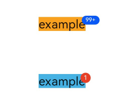

# badge


The **\<badge>** component is used to mark new events that require user attention in your application.

>  **NOTE**
>
> The APIs of this module are supported since API version 8. Updates will be marked with a superscript to indicate their earliest API version.


## Child Components

This component supports only one child component.


## attributes

In addition to the [universal attributes](js-service-widget-common-attributes.md), the following attributes are supported.

| Name| Type| Default Value| Mandatory| Description|
| -------- | -------- | -------- | -------- | -------- |
| placement | string | rightTop | No| Position of a number or dot badge. Available values are as follows:<br>**right**: on the right border of the component.<br>- **rightTop**: in the upper right corner of the component border.<br>- **left**: on the left border of the component.|
| count | number | 0 | No| Number of notifications displayed via the badge. The default value is **0**. If the number of notifications is greater than 0, the badge changes from a dot to the number. If this attribute is not set or the value is less than or equal to 0, the badge is a dot.<br>When the **count** value is greater than the **maxcount** value, *maxcount***+** is displayed. The largest integer value supported for **count** is **2147483647**.|
| visible | boolean | false | No| Whether to display the badge. The value **true** means that the badge shows up when a new notification is received. To use a number badge, set the **count** attribute.|
| maxcount | number | 99 | No| Maximum number of notifications. When the number of new notifications exceeds the value of this attribute, *maxcount***+** is displayed, for example, **99+**.<br>Note: The maximum integer value is 2147483647.|
| config | BadgeConfig | - | No| Configuration of the badge.|
| label | string | - | No| Text of the new notification displayed via the badge.<br>When this attribute is set, attributes **count** and **maxcount** do not take effect.|

### BadgeConfig

| Name| Type| Default Value| Mandatory| Description|
| -------- | -------- | -------- | -------- | -------- |
| badgeColor | &lt;color&gt; | 	#fa2a2d | No| Background color of the badge.|
| textColor | &lt;color&gt; | #ffffff | No| Text color of the number badge.|
| textSize | &lt;length&gt; | 10px | No| Text size of the number badge.|
| badgeSize | &lt;length&gt; | 6px | No| Size of the dot badge.|


## Styles

The [universal styles](js-service-widget-common-styles.md) are supported.


## Events

The [universal events](js-service-widget-common-events.md) are supported.


## Example

   ```html
    <!-- xxx.hml -->
    <div class="container">
      <badge class="badge" config="{{badgeconfig}}" visible="true" count="100" maxcount="99">
        <text class="text1">example</text>
      </badge>
      <badge class="badge" visible="true" count="1">
        <text class="text2">example</text>
      </badge>
    </div>
   ```

   ```css
    /* xxx.css */
    .container {
      flex-direction: column;
      width: 100%;
      align-items: center;
    }

    .badge {
      width: 80px;
      height: 60px;
      margin-top: 30px;
    }

    .text1 {
      background-color: #f9a01e;
      font-size: 19fp;
    }

    .text2 {
      background-color: #46b1e3;
      font-size: 19fp;
    }
   ```

   ```json
    {
      "data":{
        "badgeconfig":{
          "badgeColor":"#0a59f7",
          "textColor":"#ffffff",
          "textSize":"9px",
          "badgeSize": "14px"
        }
      }
    }
   ```


