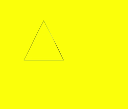
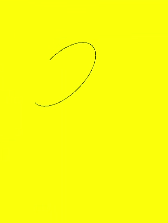

# Path2D

**Path2D** allows you to describe a path through an existing path. This path can be drawn through the **stroke** or **fill** API of **Canvas**.

>  **NOTE**
> 
> The APIs of this module are supported since API version 8. Updates will be marked with a superscript to indicate their earliest API version.


## addPath

addPath(path: path2D, transform?:Matrix2D): void

Adds a path to this path.

Since API version 9, this API is supported in ArkTS widgets.

**Parameters**

  | Name| Type| Mandatory| Default Value| Description| 
  | -------- | -------- | -------- | -------- | -------- |
  | path | path2D | Yes| - | Path to be added to this path.| 
  | transform | Matrix2D | No| null | Transformation matrix of the new path.| 
  

**Example**

  ```ts
  // xxx.ets
  @Entry
  @Component
  struct AddPath {
    private settings: RenderingContextSettings = new RenderingContextSettings(true)
    private context: CanvasRenderingContext2D = new CanvasRenderingContext2D(this.settings)
  
    private path2Da: Path2D = new Path2D("M250 150 L150 350 L350 350 Z")
    private path2Db: Path2D = new Path2D()
  
    build() {
      Flex({ direction: FlexDirection.Column, alignItems: ItemAlign.Center, justifyContent: FlexAlign.Center }) {
        Canvas(this.context)
          .width('100%')
          .height('100%')
          .backgroundColor('#ffff00')
          .onReady(() =>{
            this.path2Db.addPath(this.path2Da)
            this.context.stroke(this.path2Db)
          })
      }
      .width('100%')
      .height('100%')
    }
  }
  ```

  


## closePath

closePath(): void

Moves the current point of the path back to the start point of the path, and draws a straight line between the current point and the start point. If the shape has already been closed or has only one point, this method does nothing.

Since API version 9, this API is supported in ArkTS widgets.

**Example**

  ```ts
  // xxx.ets
  @Entry
  @Component
  struct ClosePath {
    private settings: RenderingContextSettings = new RenderingContextSettings(true)
    private context: CanvasRenderingContext2D = new CanvasRenderingContext2D(this.settings)
    private path2Db: Path2D = new Path2D()
  
    build() {
      Flex({ direction: FlexDirection.Column, alignItems: ItemAlign.Center, justifyContent: FlexAlign.Center }) {
        Canvas(this.context)
          .width('100%')
          .height('100%')
          .backgroundColor('#ffff00')
          .onReady(() =>{
            this.path2Db.moveTo(200, 100)
            this.path2Db.lineTo(300, 100)
            this.path2Db.lineTo(200, 200)
            this.path2Db.closePath()
            this.context.stroke(this.path2Db)
          })
      }
      .width('100%')
      .height('100%')
    }
  }
  ```

  


## moveTo

moveTo(x: number, y: number): void

Moves the current coordinate point of the path to the target point, without drawing a line during the movement.

Since API version 9, this API is supported in ArkTS widgets.

**Parameters**

  | Name| Type| Mandatory| Default Value| Description| 
  | -------- | -------- | -------- | -------- | -------- |
  | x | number | Yes| 0 | X-coordinate of the target point.| 
  | y | number | Yes| 0 | Y-coordinate of the target point.| 

**Example**

  ```ts
  // xxx.ets
  @Entry
  @Component
  struct MoveTo {
    private settings: RenderingContextSettings = new RenderingContextSettings(true)
    private context: CanvasRenderingContext2D = new CanvasRenderingContext2D(this.settings)
    private path2Db: Path2D = new Path2D()
  
    build() {
      Flex({ direction: FlexDirection.Column, alignItems: ItemAlign.Center, justifyContent: FlexAlign.Center }) {
        Canvas(this.context)
          .width('100%')
          .height('100%')
          .backgroundColor('#ffff00')
          .onReady(() =>{
            this.path2Db.moveTo(50, 100)
            this.path2Db.lineTo(250, 100)
            this.path2Db.lineTo(150, 200)
            this.path2Db.closePath()
            this.context.stroke(this.path2Db)
          })
      }
      .width('100%')
      .height('100%')
    }
  }
  ```

  


## lineTo

lineTo(x: number, y: number): void

Draws a straight line from the current point to the target point.

Since API version 9, this API is supported in ArkTS widgets.

**Parameters**

  | Name| Type| Mandatory| Default Value| Description| 
  | -------- | -------- | -------- | -------- | -------- |
  | x | number | Yes| 0 | X-coordinate of the target point.| 
  | y | number | Yes| 0 | Y-coordinate of the target point.| 

**Example**

  ```ts
  // xxx.ets
  @Entry
  @Component
  struct LineTo {
    private settings: RenderingContextSettings = new RenderingContextSettings(true)
    private context: CanvasRenderingContext2D = new CanvasRenderingContext2D(this.settings)
    private path2Db: Path2D = new Path2D()
  
    build() {
      Flex({ direction: FlexDirection.Column, alignItems: ItemAlign.Center, justifyContent: FlexAlign.Center }) {
        Canvas(this.context)
          .width('100%')
          .height('100%')
          .backgroundColor('#ffff00')
          .onReady(() =>{
            this.path2Db.moveTo(100, 100)
            this.path2Db.lineTo(100, 200)
            this.path2Db.lineTo(200, 200)
            this.path2Db.lineTo(200, 100)
            this.path2Db.closePath()
            this.context.stroke(this.path2Db)
          })
      }
      .width('100%')
      .height('100%')
    }
  }
  ```

  


## bezierCurveTo

bezierCurveTo(cp1x: number, cp1y: number, cp2x: number, cp2y: number, x: number, y: number): void

Draws a cubic bezier curve on the canvas.

Since API version 9, this API is supported in ArkTS widgets.

**Parameters**

  | Name| Type| Mandatory| Default Value| Description| 
  | -------- | -------- | -------- | -------- | -------- |
  | cp1x | number | Yes| 0 | X-coordinate of the first parameter of the bezier curve.| 
  | cp1y | number | Yes| 0 | Y-coordinate of the first parameter of the bezier curve.| 
  | cp2x | number | Yes| 0 | X-coordinate of the second parameter of the bezier curve.| 
  | cp2y | number | Yes| 0 | Y-coordinate of the second parameter of the bezier curve.| 
  | x | number | Yes| 0 | X-coordinate of the end point on the bezier curve.| 
  | y | number | Yes| 0 | Y-coordinate of the end point on the bezier curve.| 

**Example**

  ```ts
  // xxx.ets
  @Entry
  @Component
  struct BezierCurveTo {
    private settings: RenderingContextSettings = new RenderingContextSettings(true)
    private context: CanvasRenderingContext2D = new CanvasRenderingContext2D(this.settings)
    private path2Db: Path2D = new Path2D()
  
    build() {
      Flex({ direction: FlexDirection.Column, alignItems: ItemAlign.Center, justifyContent: FlexAlign.Center }) {
        Canvas(this.context)
          .width('100%')
          .height('100%')
          .backgroundColor('#ffff00')
          .onReady(() =>{
            this.path2Db.moveTo(10, 10)
            this.path2Db.bezierCurveTo(20, 100, 200, 100, 200, 20)
            this.context.stroke(this.path2Db)
          })
      }
      .width('100%')
      .height('100%')
    }
  }
  ```

  


## quadraticCurveTo

quadraticCurveTo(cpx: number, cpy: number, x: number ,y: number): void

Draws a quadratic curve on the canvas.

Since API version 9, this API is supported in ArkTS widgets.

**Parameters**

  | Name| Type| Mandatory| Default Value| Description| 
  | -------- | -------- | -------- | -------- | -------- |
  | cpx | number | Yes| 0 | X-coordinate of the bezier curve parameter.| 
  | cpy | number | Yes| 0 | Y-coordinate of the bezier curve parameter.| 
  | x | number | Yes| 0 | X-coordinate of the end point on the bezier curve.| 
  | y | number | Yes| 0 | Y-coordinate of the end point on the bezier curve.| 

**Example**

  ```ts
  // xxx.ets
  @Entry
  @Component
  struct QuadraticCurveTo {
    private settings: RenderingContextSettings = new RenderingContextSettings(true)
    private context: CanvasRenderingContext2D = new CanvasRenderingContext2D(this.settings)
    private path2Db: Path2D = new Path2D()
  
    build() {
      Flex({ direction: FlexDirection.Column, alignItems: ItemAlign.Center, justifyContent: FlexAlign.Center }) {
        Canvas(this.context)
          .width('100%')
          .height('100%')
          .backgroundColor('#ffff00')
          .onReady(() =>{
            this.path2Db.moveTo(10, 10)
            this.path2Db.quadraticCurveTo(100, 100, 200, 20)
            this.context.stroke(this.path2Db)
        })
      }
      .width('100%')
      .height('100%')
    }
  }
  ```

  


## arc

arc(x: number, y: number, radius: number, startAngle: number, endAngle: number, counterclockwise?: boolean): void

Draws an arc on the canvas.

Since API version 9, this API is supported in ArkTS widgets.

**Parameters**

  | Name| Type| Mandatory| Default Value| Description| 
  | -------- | -------- | -------- | -------- | -------- |
  | x | number | Yes| 0 | X-coordinate of the center point of the arc.| 
  | y | number | Yes| 0 | Y-coordinate of the center point of the arc.| 
  | radius | number | Yes| 0 | Radius of the arc.| 
  | startAngle | number | Yes| 0 | Start radian of the arc.| 
  | endAngle | number | Yes| 0 | End radian of the arc.| 
  | counterclockwise | boolean | No| false | Whether to draw the arc counterclockwise.| 

**Example**

  ```ts
  // xxx.ets
  @Entry
  @Component
  struct Arc {
    private settings: RenderingContextSettings = new RenderingContextSettings(true)
    private context: CanvasRenderingContext2D = new CanvasRenderingContext2D(this.settings)
    private path2Db: Path2D = new Path2D()
  
    build() {
      Flex({ direction: FlexDirection.Column, alignItems: ItemAlign.Center, justifyContent: FlexAlign.Center }) {
        Canvas(this.context)
          .width('100%')
          .height('100%')
          .backgroundColor('#ffff00')
          .onReady(() =>{
            this.path2Db.arc(100, 75, 50, 0, 6.28)
            this.context.stroke(this.path2Db)
          })
      }
      .width('100%')
      .height('100%')
    }
  }
  ```

  


## arcTo

arcTo(x1: number, y1: number, x2: number, y2: number, radius: number): void

Draws an arc based on the radius and points on the arc.

Since API version 9, this API is supported in ArkTS widgets.

**Parameters**

  | Name| Type| Mandatory| Default Value| Description| 
  | -------- | -------- | -------- | -------- | -------- |
  | x1 | number | Yes| 0 | X-coordinate of the first point on the arc.| 
  | y1 | number | Yes| 0 | Y-coordinate of the first point on the arc.| 
  | x2 | number | Yes| 0 | X-coordinate of the second point on the arc.| 
  | y2 | number | Yes| 0 | Y-coordinate of the second point on the arc.| 
  | radius | number | Yes| 0 | Radius of the arc.| 

**Example**

  ```ts
  // xxx.ets
  @Entry
  @Component
  struct ArcTo {
    private settings: RenderingContextSettings = new RenderingContextSettings(true)
    private context: CanvasRenderingContext2D = new CanvasRenderingContext2D(this.settings)
    private path2Db: Path2D = new Path2D()
  
    build() {
      Flex({ direction: FlexDirection.Column, alignItems: ItemAlign.Center, justifyContent: FlexAlign.Center }) {
        Canvas(this.context)
          .width('100%')
          .height('100%')
          .backgroundColor('#ffff00')
          .onReady(() =>{
            this.path2Db.arcTo(150, 20, 150, 70, 50)
            this.context.stroke(this.path2Db)
          })
      }
      .width('100%')
      .height('100%')
    }
  }
  ```

  


## ellipse

ellipse(x: number, y: number, radiusX: number, radiusY: number, rotation: number, startAngle: number, endAngle: number, counterclockwise?: boolean): void

Draws an ellipse in the specified rectangular region on the canvas.

Since API version 9, this API is supported in ArkTS widgets.

**Parameters**

  | Name| Type| Mandatory| Default Value| Description| 
  | -------- | -------- | -------- | -------- | -------- |
  | x | number | Yes| 0 | X-coordinate of the ellipse center.| 
  | y | number | Yes| 0 | Y-coordinate of the ellipse center.| 
  | radiusX | number | Yes| 0 | Ellipse radius on the x-axis.| 
  | radiusY | number | Yes| 0 | Ellipse radius on the y-axis.| 
  | rotation | number | Yes| 0 | Rotation angle of the ellipse. The unit is radian.| 
  | startAngle | number | Yes| 0 | Angle of the start point for drawing the ellipse. The unit is radian.| 
  | endAngle | number | Yes| 0 | Angle of the end point for drawing the ellipse. The unit is radian.| 
  | counterclockwise | boolean | No| false | Whether to draw the ellipse counterclockwise.<br>**true**: Draw the ellipse counterclockwise.<br>**false**: Draw the ellipse clockwise.| 

**Example**

  ```ts
  // xxx.ets
  @Entry
  @Component
  struct CanvasExample {
    private settings: RenderingContextSettings = new RenderingContextSettings(true)
    private context: CanvasRenderingContext2D = new CanvasRenderingContext2D(this.settings)
    private path2Db: Path2D = new Path2D()

    build() {
      Flex({ direction: FlexDirection.Column, alignItems: ItemAlign.Center, justifyContent: FlexAlign.Center }) {
        Canvas(this.context)
          .width('100%')
          .height('100%')
          .backgroundColor('#ffff00')
          .onReady(() =>{
            this.path2Db.ellipse(200, 200, 50, 100, 0, Math.PI * 1, Math.PI*2)
            this.context.stroke(this.path2Db)
          })
      }
      .width('100%')
      .height('100%')
    }
  }
  ```

  


## rect

rect(x: number, y: number, w: number, h: number): void

Creates a rectangle on the canvas.

Since API version 9, this API is supported in ArkTS widgets.

**Parameters**

  | Name| Type| Mandatory| Default Value| Description| 
  | -------- | -------- | -------- | -------- | -------- |
  | x | number | Yes| 0 | X-coordinate of the upper left corner of the rectangle.| 
  | y | number | Yes| 0 | Y-coordinate of the upper left corner of the rectangle.| 
  | w | number | Yes| 0 | Width of the rectangle.| 
  | h | number | Yes| 0 | Height of the rectangle.| 

**Example**

  ```ts
  // xxx.ets
  @Entry
  @Component
  struct CanvasExample {
    private settings: RenderingContextSettings = new RenderingContextSettings(true)
    private context: CanvasRenderingContext2D = new CanvasRenderingContext2D(this.settings)
    private path2Db: Path2D = new Path2D()
  
    build() {
      Flex({ direction: FlexDirection.Column, alignItems: ItemAlign.Center, justifyContent: FlexAlign.Center }) {
        Canvas(this.context)
          .width('100%')
          .height('100%')
          .backgroundColor('#ffff00')
          .onReady(() =>{
            this.path2Db.rect(20, 20, 100, 100);
            this.context.stroke(this.path2Db)
          })
      }
      .width('100%')
      .height('100%')
    }
  }
  ```

  
